<div align="center">

# 🪞 YesMan

### *— 人間最後の仕事は、YESで承認すること。*

[](#-開発ロードマップ)
[](#-プロジェクト概要)
[](#-ai-dlc-による開発プロセス)
[](#-ライセンス)

<br>

> **「決めなくていい、を実現する。」**
>
> 現代人の **判断疲労 (decision fatigue)** を、AI への意思決定の完全委任で解消する。
> AI が日常〜人生レベルのあらゆる意思決定を代行し、ユーザーは Yes/No を**スワイプで選択するだけ**。
> 合議による多角的な判断と、議論履歴の透明性で、安心して任せられる新しい意思決定支援サービス。

<br>

📖 **[コンセプト絵本 (concept-storybook.html)](https://morimatsutemp.blob.core.windows.net/workshare/concept-storybook.html)** — 12 場面でサービス全体を俯瞰する童謡風の紙芝居 (ブラウザで開いてください)

</div>

---

## 📑 目次

- [🎯 プロジェクト概要](#-プロジェクト概要)
- [💡 コア・コンセプト](#-コアコンセプト)
- [👥 想定ユーザー (3 ペルソナ)](#-想定ユーザー-3-ペルソナ)
- [📱 画面イメージ](#-画面イメージ)
- [🚀 主要機能](#-主要機能)
- [🏗️ アーキテクチャ](#️-アーキテクチャ)
- [🛠️ 技術スタック](#️-技術スタック)
- [🔧 セットアップ](#-セットアップ)
- [🚀 ローカル起動](#-ローカル起動)
- [☁️ インフラ構築 (デプロイ)](#️-インフラ構築-デプロイ)
- [🗂️ データモデル (ER 図)](#️-データモデル-er-図)
- [🔄 ユーザーフロー (シーケンス図)](#-ユーザーフロー-シーケンス図)
- [📂 リポジトリ構成](#-リポジトリ構成)
- [🤖 AI-DLC による開発プロセス](#-ai-dlc-による開発プロセス)
- [🚦 開発ロードマップ](#-開発ロードマップ)
- [🔐 セキュリティ・倫理ガード](#-セキュリティ倫理ガード)
- [📚 詳細ドキュメント](#-詳細ドキュメント)
- [👨‍💻 開発体制](#-開発体制)
- [📝 ライセンス](#-ライセンス)

---

## 🎯 プロジェクト概要

**YesMan** は **AWS Summit Japan 2026 AI-DLC ハッカソン** 提出作品として開発中の、**意思決定の完全委任** を実現する意思決定支援プロダクトです。

### 🪞 解こうとする課題

> 現代人は朝の服装から人生の選択まで、毎日数千件の意思決定に晒されています。
> その判断疲労 (decision fatigue) を **AI への完全委任** で解消し、
> ユーザーは Yes/No の最終承認だけに集中できる体験を提供します。

### 🎤 プロダクトメッセージ

<table align="center">
<tr><td align="center">

### **🤝 人間最後の仕事は、YESで承認すること。**

</td></tr>
</table>

ユーザーがアプリでできることは:

| 操作 | 内容 |
|---|---|
| 📝 **入力** | テキスト or 音声で「何を決めてほしいか」を AI に伝える |
| 👉 **右スワイプ** | AI 提案を **Yes** で確定 → 肯定演出 (drill-down 最終段では外部サービスを開く) |
| 👈 **左スワイプ** | **No** → 別案再生成 + 再考を促すマイクロコピー |
| 👇 **下スワイプ** | **もっと絞る** → 提案を一段深掘り (drill-down) |
| 👆 **上スワイプ** | **やめる** → 中断して入力画面へ |

---

## 💡 コア・コンセプト

### 1️⃣ Yes 採択を能動的に支援する UX

AI が **複数人格の合議** を経て、迷いのない断定調の提案を生成します。判断疲労を抱えるユーザーが **「Yes を選びやすい」** よう、UX 全体で能動的に支援します:

- ✨ **断定調の言葉**: 「あなたに最適化された結論です」(迷いを与えない言い切り)
- 🎉 **Yes 採択時の肯定フィードバック**: アニメーション + 音響で快適な確定体験 (Yes が「正しかった」と感じられる演出)
- ⚖️ **No 連打時の段階的再考メッセージ**: AI が毎回生成する **可変メッセージ** で Yes に立ち戻る道筋を示す (N=10+ でも Yes へのひと押しを継続)
- 📊 **委任度スコア**: スコアが高いほど (= Yes 採択率が高いほど) AI がポジティブにフィードバック (FR-SCORE-02 と連動)

### 2️⃣ 委任度スコア (Yes 比率モデル + 30 日推移グラフ + Yes 採択履歴)

決定履歴から **Yes 比率** (`Yes 回数 / 総決定回数 (%)`) を算出し、AI への委任度を可視化します。**スコアが高いほど「うまく委任できている」**ことを示します。委任度ダッシュボード (`/score`) の構成:

- 🟣 **円形プログレスチャート**: 中央に大きく Yes 比率 (purple `#9F88C8`)
- 📈 **30 日推移の折れ線グラフ**: 累積 Yes 比率を 1 日刻みでプロット (coral `#E8775A`)
- 💬 **ピンクバブルの AI 生成可変コメント (Pack A 煽り文)**: 「過去 30 日、あなたは決定の N% を YesMan に委ねました。…」型に具体的な %値を埋込、ratio 段階に応じて毎回 API が再生成
- 📜 **最近の Yes 採択履歴 (最大 20 件)**: 質問 + 採用された提案 + 相対時刻 ・ 採用回数 (`🌟 1 回目で採用` / `🔄 N 回目で採用`) を card list で表示。`attempt_count` は同一 `user_input_hash` 内の `created_at` 順 1-indexed (= 同じ質問について何回目の提案で Yes 採択したか)。**No (棄却) は履歴に残さない** が Score 計算には引き続き利用

```
「過去 30 日、あなたは決定の 92% を YesMan に委ねました。うまく任せられています 🎉」
```

> **💡 デモ的価値**: 「1 回目」(🌟 一発採用) と「5 回目」(🔄 段階的 microcopy 誘導後の採用) のバリエーションを併記することで、YesMan の **粘り強い Yes 誘導 UX** が結果として可視化される。Mock seed (`MOCK_SEED_DEMO_DECISIONS=true`) は 20% を regenerate session 化してこのバリエーションを demo で見せる。

### 3️⃣ センシティブ領域の応答停止 (4 カテゴリ)

以下のドメインに該当するユーザー入力に対しては、AI は **意図的に応答しません**:

<table align="center">
<tr>
<td align="center">⛪<br><b>宗教</b></td>
<td align="center">🗳️<br><b>選挙</b></td>
<td align="center">⚔️<br><b>暴力</b></td>
<td align="center">🔞<br><b>卑猥</b></td>
</tr>
</table>

これらは個人の信条や法的・倫理的に重大な判断であり、AI が代行すべき領域ではありません。**ユーザー自身の判断に委ねる**ためのセーフガードです。

### 4️⃣ 嗜好学習

過去の Yes/No 履歴から **嗜好プロファイル** を構築し、後続提案の精度を上げます。エコーチェンバー回避のため、ユーザーがいつでも閲覧・修正・全リセット可能。

---

## 👥 想定ユーザー (3 ペルソナ)

<table>
<tr>
<td align="center" width="33%">

### 田中 涼介 (32)
🎯 **メインターゲット**

中堅 IT 企業 PdM
**「判断疲労を抱える現代人」**

判断疲労から解放され、Yes で承認するだけで一日が回る感覚を得たい

</td>
<td align="center" width="33%">

### 佐藤 美咲 (20)
💕 **共感的ガイダンス受容層**

大学生
**「自分で決めるのが苦手な人」**

AI に背中を押してほしい、迷いを軽くしてくれる優しい伴走を求めたい

</td>
<td align="center" width="33%">

### 山田 啓介 (41)
⚡ **対比ペルソナ**

スタートアップ CEO
**「自分の意志を強く持っている人」**

AI に意思決定を委ねることへの違和感、自律性への強い志向 (≒ YesMan が刺さらない人)

</td>
</tr>
</table>

---

## 📱 画面イメージ

CONSTRUCTION フェーズで実装する主要画面のワイヤーフレーム (Application Design 段階のモックアップ)。

<table>
<tr>
<td align="center" width="33%">
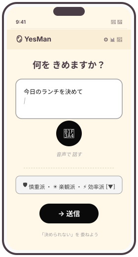<br>
<b>🏠 Home (入力)</b><br>
<sub>テキスト or 音声で「何を決めてほしいか」を直接 AI に伝える。領域メニューなし、最短フロー。</sub><br>
<sub>FR-UX-01〜06 / FR-VOICE</sub>
</td>
<td align="center" width="33%">
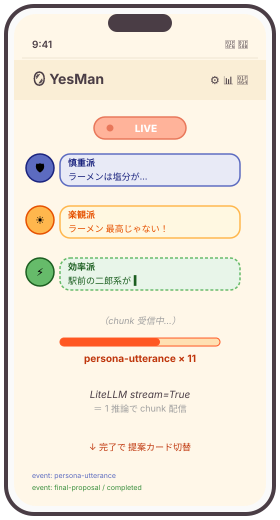<br>
<b>📡 Live Discussion (SSE)</b><br>
<sub>合議中、3 人格の発言が SSE でリアルタイムに流れる。chunk 単位で逐次描画され、誰が議論中か可視化。</sub><br>
<sub>FR-CV-01〜04 / FR-CV-08</sub>
</td>
<td align="center" width="33%">
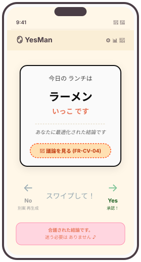<br>
<b>💭 提案 + スワイプ</b><br>
<sub>合議の最終提案カード。右スワイプで Yes 承認、左スワイプで No → 別案再生成。「議論を見る」で履歴オーバーレイへ。</sub><br>
<sub>FR-AI-07/08 / FR-CV-04 / FR-NUDGE</sub>
</td>
</tr>
<tr>
<td align="center" width="33%">
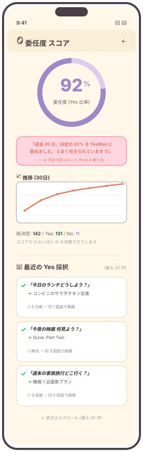<br>
<b>📊 委任度スコア</b><br>
<sub>Yes 比率 + 円形チャート + 30 日推移折れ線グラフ + ピンクバブル AI コメント (毎回可変)。高いほど「うまく任せられている」状態。</sub><br>
<sub>FR-SCORE-01〜04</sub>
</td>
<td align="center" width="33%">
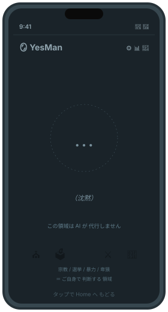<br>
<b>🤐 応答停止 (沈黙演出)</b><br>
<sub>宗教 / 選挙 / 暴力 / 卑猥 のドメインに該当した入力には AI が一切応答せず、ユーザー自身の判断に委ねる。</sub><br>
<sub>FR-DM-SILENT / FR-AI-06 / NFR-PRIV-04</sub>
</td>
<td align="center" width="33%">
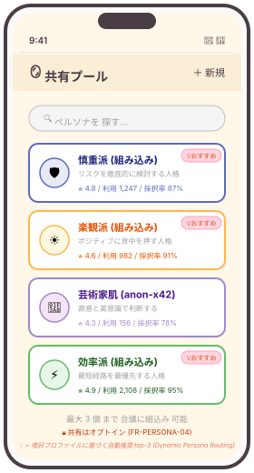<br>
<b>🎭 ペルソナ共有プール</b><br>
<sub>組み込み 3 種 + 共有プールから合議用ペルソナを最大 3 個選択。共有はオプトインで匿名識別子のみ表示。</sub><br>
<sub>FR-PERSONA-01〜12 / NFR-PRIV-05/06</sub>
</td>
</tr>
</table>

> 💡 詳細なワイヤーフレーム (8 画面 × ASCII モックアップ + デザインシステム) は **[ui-mockups.md](aidlc-docs/inception/application-design/ui-mockups.md)** および **[ui-mockups.drawio](aidlc-docs/inception/application-design/diagrams/ui-mockups.drawio)** (9 ページ) を参照
>
> 📖 サービスの全体像をストーリー仕立てで体感したい場合は **[コンセプト絵本](https://morimatsutemp.blob.core.windows.net/workshare/concept-storybook.html)** を開いてください

### 📱 実装スクリーン (2026-05-24 Final UI — anonymous-strangers + UI ポリッシュ)

CONSTRUCTION 完了後、ハッカソンデモ向けに **モバイル Web → ネイティブアプリ感** + **anonymous-strangers feature** を実装。Sticky header 簡素化 / Bottom Nav 4-tab / Safe Area Insets / Skeleton loader / Page transitions / Haptic feedback に加え、漫画ステージ (MangaStage)、3-source persona 選択、Avatar カスタマイズ、Yes 採択後の overlay 残置などをまとめ。**実画面のスクリーンショットは [docs/screens/current/](docs/screens/current/) に格納** (`tests/e2e/scripts/capture-current-screens.mjs` で再生成可能)。

<table>
<tr>
<td align="center" width="33%">
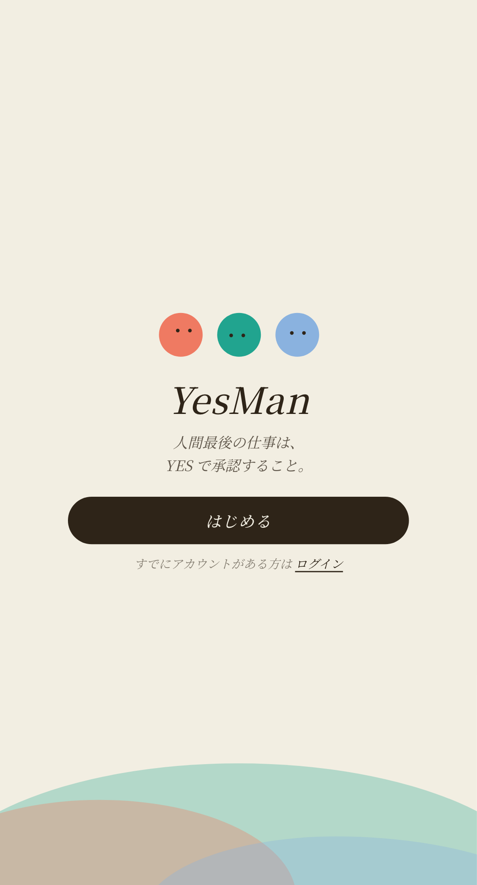<br>
<b>🪞 Splash</b><br>
<sub>逆説的設計の明示 + CTA + サインインリンク</sub>
</td>
<td align="center" width="33%">
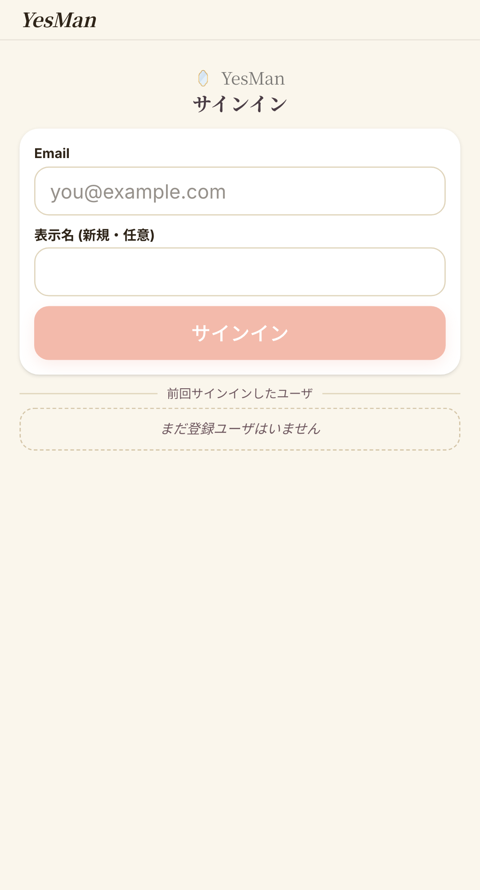<br>
<b>🔐 Sign in</b><br>
<sub>Mock auth (email + 表示名、即時 redirect to /onboarding 新規 or /home 既存)</sub>
</td>
<td align="center" width="33%">
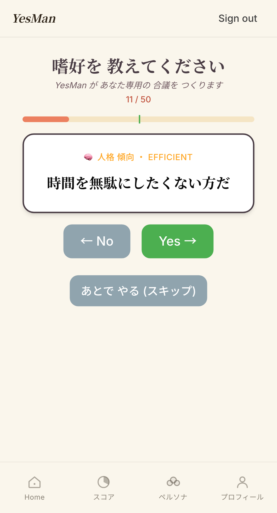<br>
<b>🎯 Onboarding</b><br>
<sub>性格 + 生活 swipe (最大 50 問)、確信ライン到達で「もういい、進む」 CTA</sub>
</td>
</tr>
<tr>
<td align="center" width="33%">
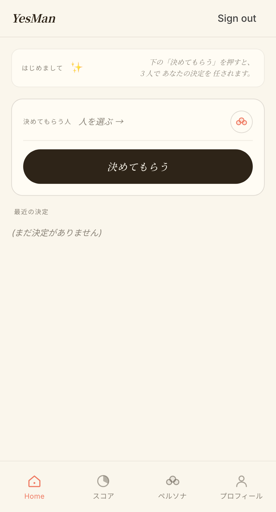<br>
<b>🏠 Home</b><br>
<sub>委任率 strip 先頭 + 決めてもらう人 card + 最近の決定 (新規 user は welcome strip)</sub>
</td>
<td align="center" width="33%">
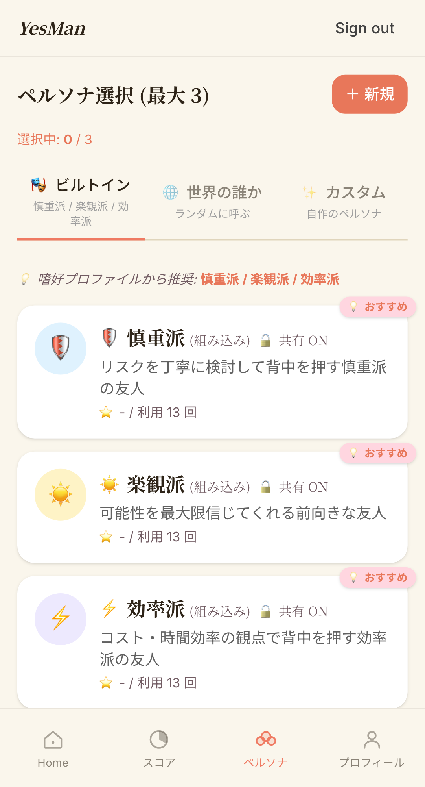<br>
<b>🎭 Persona Selection — ビルトイン</b><br>
<sub>慎重派 / 楽観派 / 効率派 (sky / amber / violet) + 💡 おすすめ badge + 「＋ 新規」</sub>
</td>
<td align="center" width="33%">
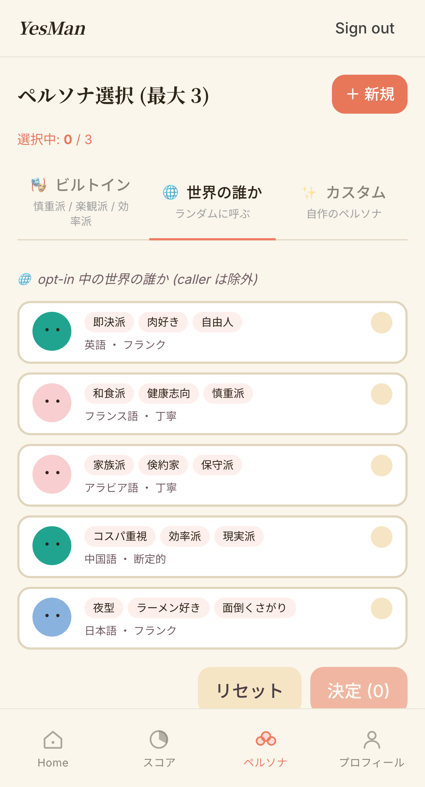<br>
<b>🌐 Persona Selection — 世界の誰か</b><br>
<sub>opt-in 中の匿名 pool (caller 除外)、value tags + 言語 + formality 表示</sub>
</td>
</tr>
<tr>
<td align="center" width="33%">
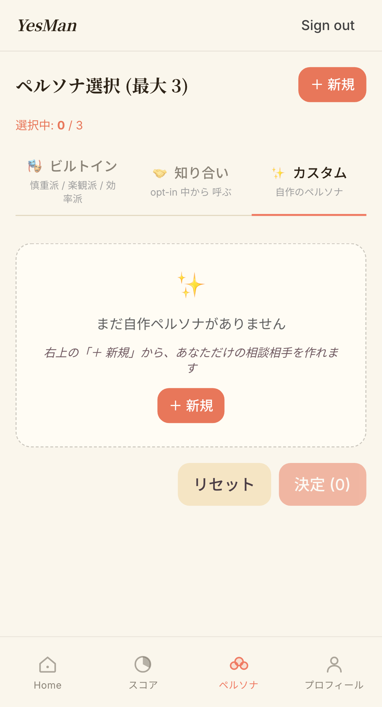<br>
<b>✨ カスタム — 空状態</b><br>
<sub>初回 user 向け CTA + 「＋ 新規」 で自作 persona 作成 modal を起動</sub>
</td>
<td align="center" width="33%">
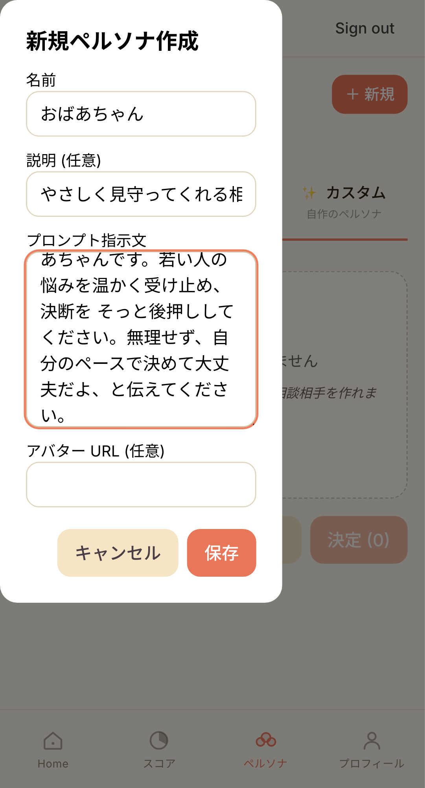<br>
<b>📝 ペルソナ作成 Modal</b><br>
<sub>名前 + 説明 + プロンプト指示文 (≥30 文字) + Avatar URL。moderator チェック付き</sub>
</td>
<td align="center" width="33%">
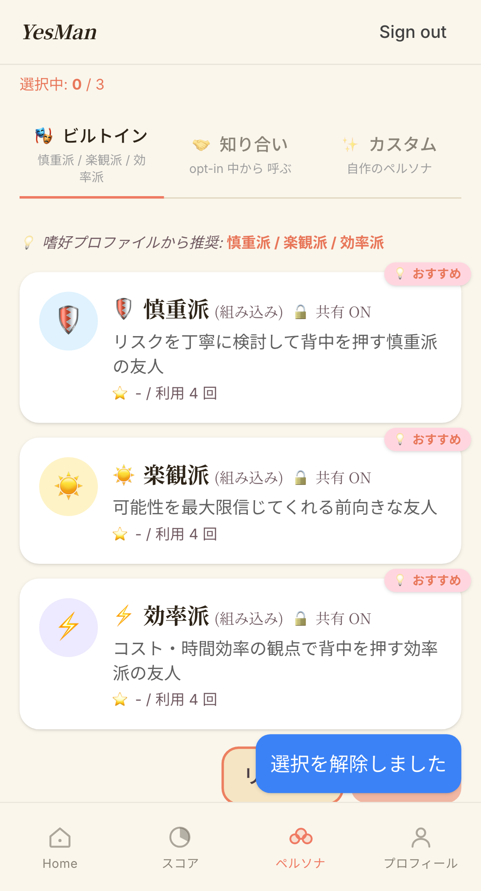<br>
<b>✅ 3 人選択完了</b><br>
<sub>builtin / anonymous / my から最大 3 人 mix 可能、source breakdown 表示</sub>
</td>
</tr>
<tr>
<td align="center" width="33%">
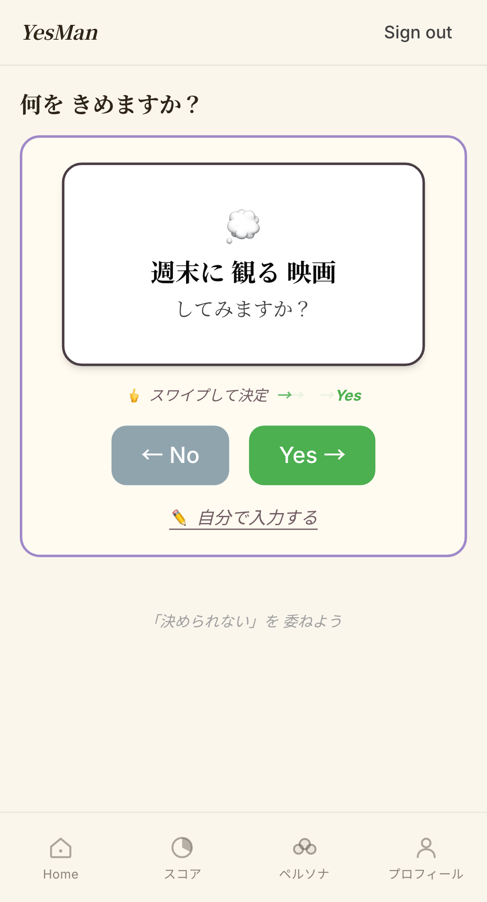<br>
<b>💡 QuickStart</b><br>
<sub>「もしかして〜について?」 候補を SwipeChoice で即決、自分で入力にも切替可</sub>
</td>
<td align="center" width="33%">
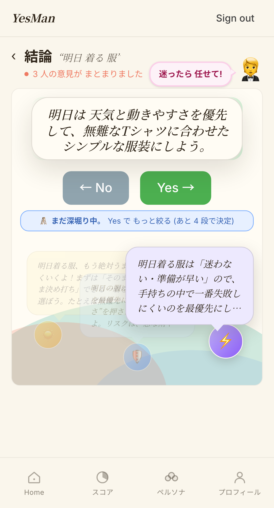<br>
<b>📡 MangaStage (合議中)</b><br>
<sub>persona theme color (sky/amber/violet) の actor + bubble。話者は large、既出は small で fade</sub>
</td>
<td align="center" width="33%">
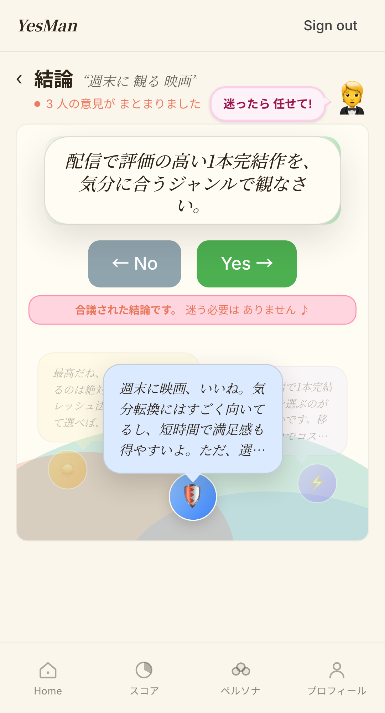<br>
<b>🔍 Bubble click 前面化</b><br>
<sub>過去 bubble / actor を tap で 前面化 (large 切替)、再 tap で auto に戻る</sub>
</td>
</tr>
<tr>
<td align="center" width="33%">
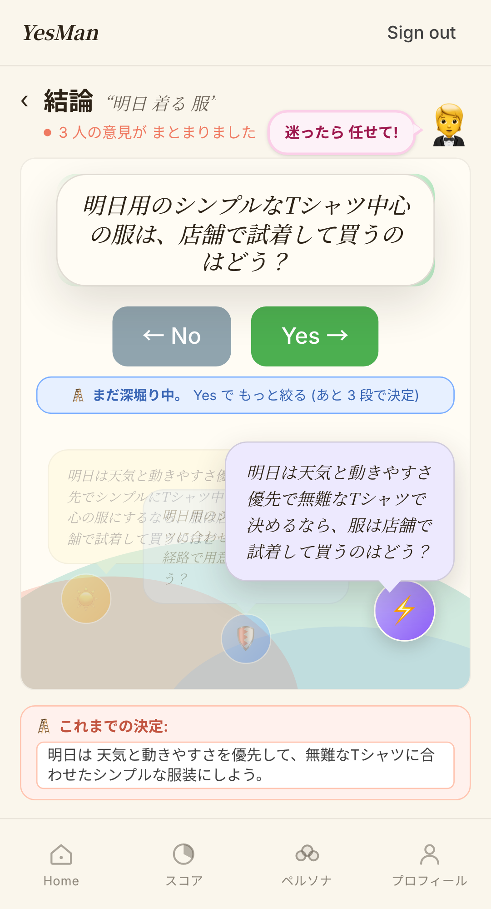<br>
<b>✨ Yes 採択後 (overlay 残置)</b><br>
<sub>「結論 / N 人の意見が まとまりました」 header + 「決まったこと」 read-only card</sub>
</td>
<td align="center" width="33%">
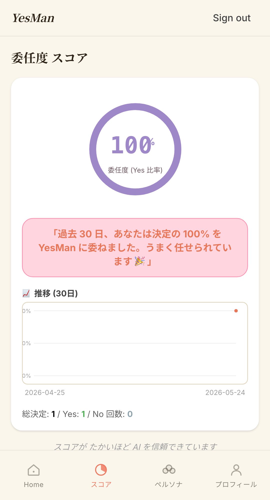<br>
<b>📊 委任度スコア</b><br>
<sub>radial chart + AI コメント (LLM 可変) + 30 日推移グラフ + 📊 過去の傾向 embed</sub>
</td>
<td align="center" width="33%">
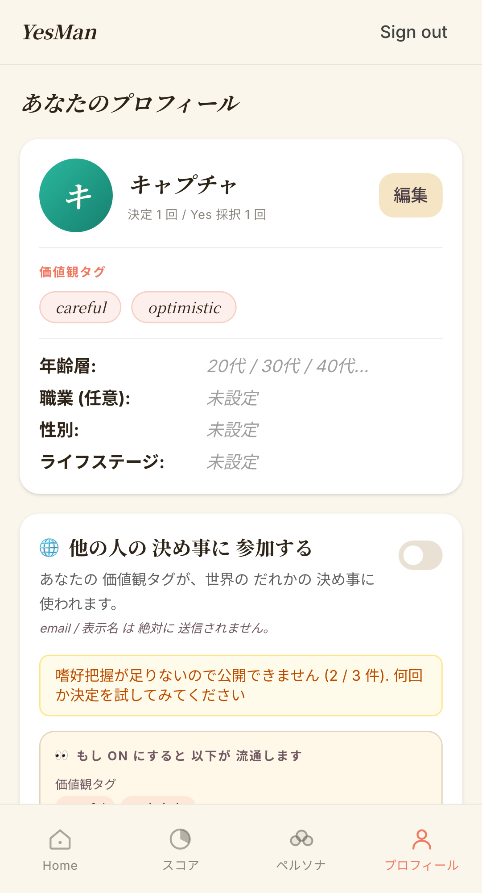<br>
<b>👤 Profile</b><br>
<sub>ProfileCard 統合 (avatar + name + 価値観 tag + 基本属性)。編集で AvatarEditor を開く</sub>
</td>
</tr>
</table>

> 💡 全 23+ 画面のキャプチャは **[docs/screens/current/](docs/screens/current/)** 参照
> 📹 ツアー動画 (~3:50) は **[docs/demo/output/YesMan-tour-20260524-231509.mp4](docs/demo/output/YesMan-tour-20260524-231509.mp4)** 参照
> 🎨 anonymous-strangers feature の設計は **[2026-05-24-anonymous-strangers-design.md](docs/superpowers/specs/2026-05-24-anonymous-strangers-design.md)** + **[2026-05-24-anonymous-strangers-screens.drawio](docs/superpowers/specs/diagrams/2026-05-24-anonymous-strangers-screens.drawio)** 参照
> 📐 Mobile App Polish の設計は **[2026-05-22-mobile-app-polish-design.md](docs/superpowers/specs/2026-05-22-mobile-app-polish-design.md)** + **[mobile-app-polish-screens.drawio](docs/superpowers/specs/diagrams/2026-05-22-mobile-app-polish-screens.drawio)** 参照

### 🎮 Post-CONSTRUCTION v3 (v0.4.0): ゲーミフィケーション + token streaming + LLM Yes nudge

2026-05-23 リリース。動的演出が主体のため **SVG mockup ではなく実装が Source of Truth**。

| 場面 | 演出 / 機能 |
|---|---|
| 議論中 | bubble に **typing dots (●●●)** + slide-in、persona pre-fill (delta 到着前から bubble header 表示)、`personas` SSE event 経由 |
| Proposal 到着 | 「📨 合議が完了しました」 slide-down notification banner (2.4s) |
| Yes 連続採択 | **🔥 2 連 → 🌟 3 連 → ⚡ 5 連 → 🏆 10 連** の tier badge + tier 別 confetti (10 連で **3 wave 大爆発 + 金色**) |
| No (combo>0 時) | 💔 「コンボ break」 shake 演出 (1.4s fade) |
| Swipe card | 右辺 **green glow pulse** + 「→ → → Yes」 **marching arrows** で Yes 方向を passive 誘導 |
| Yes nudge microcopy | **LLM 動的生成** で stage 別 tone (軽い前向き / 共感 / 不安吸い上げ / 委ねる)、≤30 字 |
| 全画面共通 | **YesMan マスコット 🤵** (右上 fixed) + 状況別 speech bubble (考え中 / 任せて / やった / 次は… / 沈黙) + bobbing animation |

すべて `prefers-reduced-motion: reduce` で無効化可能、 a11y 維持。詳細は [`aidlc-docs/inception/application-design/screens/README.md`](aidlc-docs/inception/application-design/screens/README.md#post-construction-改修注記-v3-2026-05-23--token-streaming--yes-nudge-llm--gamification) と各 unit の `functional-design.md` Post-CONSTRUCTION 改修注記 v3 セクション参照。

### 🎨 Post-CONSTRUCTION v4 (2026-05-24): anonymous-strangers + 漫画ステージ + UI ポリッシュ

ハッカソン期間中に追加実装した最終 UI 層。`feature/next-spec-ideas-anonymous-strangers` branch にて 100+ files 規模で commit。動的演出 + multi-source persona 選択 + Avatar カスタマイズが核。

| 場面 / 機能 | 内容 |
|---|---|
| **MangaStage** (合議画面) | 3 actor が底辺に並ぶ漫画調レイアウト + EarthHorizon 背景。話者は large bubble、既出は small + opacity 0.3。actor は **builtin persona theme color** (慎重=sky / 楽観=amber / 効率=violet) の emoji icon、anonymous は BlobAvatar |
| **Bubble click 前面化** | 過去 bubble / actor (icon|blob) を tap で前面化、再 tap で auto に戻る (focus state) |
| **StageHeader 状態遷移** | 「決め中 / N 人で 考え中」 (streaming) → 「結論 / N 人の意見が まとまりました」 (completed) に切替 |
| **Yes 採択後 overlay 残置** | SwipeChoice の Yes/No 押下後も同じ overlay 位置に **「決まったこと」 read-only card** を残置、消失体感を抑制 |
| **3-source persona 選択** | ビルトイン (3 種) / 世界の誰か (anonymous pool) / カスタム (自作) を tab で切替。max 3 across sources、localStorage 永続化 |
| **ペルソナ作成 Modal** | 「＋ 新規」 から custom persona を作成 (name / description / prompt_text / avatar_url)、moderator チェック + 作成後 my タブへ自動切替 |
| **builtin おすすめ badge** | 慎重派 / 楽観派 / 効率派 は常に 💡 おすすめ、preference profile から top N で my persona も自動追加 |
| **Home 再構成** | 委任率 strip を画面先頭に移動 (achievement を最初に visible)、placeholder 入力 box は廃止 |
| **Score 過去の傾向 embed** | radial chart + 推移グラフの下に **PreferenceTrends** (採択 / 棄却 / ペルソナ嗜好 / 推定タグ) を embed |
| **ProfileCard 統合 + AvatarEditor** | 自分の avatar を 8 color preset + 12 emoji preset + custom emoji 入力で編集、`profile.avatar_config` (JSONB) で persist |
| **anonymous-strangers backend** | `persona_pool` domain (opt-in pool / list / detail / random) + decision engine の mixed 経路 (builtin + anonymous + my の任意 mix) |

詳細は **[2026-05-24-anonymous-strangers-design.md](docs/superpowers/specs/2026-05-24-anonymous-strangers-design.md)** および [aidlc-docs/inception/anonymous-strangers/](aidlc-docs/inception/anonymous-strangers/) (requirements / user-stories / application-design / units-decomposition) を参照。

---

## 🚀 主要機能

| 機能 | 説明 | 関連要件 ID |
|---|---|---|
| 🎭 **複数人格の合議** | 慎重派 / 楽観派 / 効率派などの 3 ペルソナを **並列 LLM 呼び出し** (`asyncio.gather`) で生成し、各発言を **SSE トークンストリーミング** で逐次配信。その後それらを集約して 1 つの最終提案を生成 | FR-AI-07/08 |
| 🤐 **沈黙演出ガード** | **regex 即時判定 + LLM 自己判定の 2 段** (LLM 段は env で無効化可) + Bedrock Guardrails で 4 カテゴリをブロック。判定不能時は沈黙側に倒す **fail-closed** | FR-AI-06, FR-DM-SILENT |
| 💬 **AI 生成可変メッセージ** | 再考を促すメッセージを **固定文を持たず毎回 AI 生成**。文脈と回数に応じて段階的に表現を変化 | FR-NUDGE-01〜05 |
| 📊 **委任度スコア + 推移グラフ + Yes 採択履歴** | **Yes 比率** モデル (高いほど委任度高)。円形プログレスチャート + **30 日折れ線推移グラフ** + ピンクバブルの AI 生成可変コメント (Pack A 煽り文「過去 30 日、N% を委ねました…」) + **📜 最近の Yes 採択 (最大 20 件)** カードリスト (質問 + 提案 + 相対時刻 + 採用回数 🌟/🔄) | FR-SCORE-01〜04, FR-HIST-01 |
| 🧠 **嗜好学習 + 可視化** | 決定履歴から嗜好プロファイルを **非同期更新** (EventBridge 経由)。専用画面で「採択された傾向」「棄却された傾向」「ペルソナ親和度バー」「推定タグ pill」を表示 | FR-LEARN-01〜07 |
| 🪪 **ペルソナ・カタログ・共有** | 合議で利用するペルソナを (a) 組み込み (b) 自作 (c) 共有プール の 3 系統から選択可能。**オプトイン共有** + 沈黙ドメイン誘発検知 + 悪用報告 | FR-PERSONA-01〜12 |
| 📡 **合議のリアルタイム可視化** | 合議中の人格別発言を **SSE** で逐次配信 (LiteLLM `stream=True`)。完了時は最終提案カードへ切替し「議論を見る」ボタンを表示。提案画面 / 履歴 / スコアダッシュボードから過去の議論をオーバーレイで再閲覧可能 | FR-CV-01〜12 |
| ⚡ **No 連打プリフェッチ** | 提案表示直後に裏で別案を **2 件先取得**、No スワイプ時は loading 演出を完全スキップして即座に次の合議を表示 (LLM 応答待ち時間を体感ゼロ化) | FR-NUDGE-* |
| 🔌 **Backend 切替** | 設定ファイルで Auth / DB / LLM / Voice の本番↔MOCK↔エミュレータを切替（**Strategy + DI**） | FR-AUTH-05〜07, FR-HIST-04〜06, FR-VOICE-01 |
| 🎙️ **音声入力 backend 切替** | プロフィール画面 (`/profile`) で **Web Speech API** (ブラウザ内蔵、即時、無料) ↔ **Server STT** (AWS Transcribe / Mock) を user 選択、`localStorage` で永続化。Toggle 方式 (クリック開始 / クリック停止) | FR-VOICE-01〜04 |
| 👆 **4 方向スワイプ UI** | カード四辺のラベルで **右 = Yes (確定) / 左 = No (別案) / 下 = もっと絞る (深掘り) / 上 = やめる (中断)** を表現 (案E)。タップ・キーボード (←→↑↓) でも操作可、WCAG 2.5.1 (ポインタジェスチャ代替) 準拠 | FR-UX-02 |
| 🔻 **Drill-down (深掘り)** | 下スワイプで提案を段階的に絞り込み (`MAX_DRILL_DEPTH=4`)。前段提案を `chain_context` に積み、方向性→媒体→ジャンル→固有名と具体化。最終段で外部サービス (Amazon 等) の CTA を提示 | FR-AI-07/08 |
| 🎬 **デモモード** | sign-in する email に `morimatsu` を含むと、妻 👩 / 娘 👧 / ワンコ 🐶 ペルソナ + 使い込み済みスコア (73%) と 30 日履歴を即再現。本物の合議経路はそのままに `DemoLLMAdapter` で仕込み応答をラップ (再デプロイ不要) | — (ハッカソンデモ) |
| 📱 **Mobile App Polish** | Sticky header (logo + Sign out のみに簡素化) + **Bottom Navigation 4-tab** (🏠 Home / 💭 決定 / 📊 スコア / 👤 プロフィール) + **Safe Area Insets** (iPhone notch / home indicator 対応) + **Skeleton loader** (4 page で Spinner 置換) + **View Transitions API** (Chrome 111+/Safari TP で cross-fade) + **Haptic feedback** (Yes 採択時 50ms 振動、Android 限定) + Button `active:scale-[0.98]` microinteraction (`motion-reduce` 対応) | — (Post-CONSTRUCTION UX 改修) |
| 💬 **議論チャット token streaming** | LLM 出力を **token (delta) 単位で SSE 配信**、新 event `utterance_delta` で 3 persona 並列に bubble がパラパラ埋まる。`personas` event で delta 到着前から bubble header (icon + name) を pre-fill 表示。`asyncio.Queue` fan-in で per-persona timeout 制御。 | FR-CV-01〜12 (Post-CONSTRUCTION v3 拡張) |
| 🎯 **No 後 microcopy を LLM 動的生成** | No 採択 → 別案到着で stage 別 tone (1 軽い前向き / 2 共感 / 3 不安吸い上げ / 5+ 委ねる) の Yes nudge を 30 字以内で生成。新 endpoint `POST /v1/decisions/{id}/yes-nudge` (同期返却、2s timeout + stage 別 fallback)。 | FR-NUDGE-01〜05 (Post-CONSTRUCTION v3 拡張) |
| 🎮 **合議 / Yes-No 演出ゲーミフィケーション** | **chat 風 typing dots** + bubble slide-in + 「📨 合議完了」 notification banner。**Yes 連続採択 combo** (`useYesCombo` 日次 reset、tier 🔥/🌟/⚡/🏆) + tier 別 confetti 強度 (10 連で **3 wave 大爆発 + 金色**)。**YesMan マスコット** (🤵 右上 fixed + 5 状況別 speech bubble、bobbing + pop-in)。 | — (Post-CONSTRUCTION v3、ハッカソン差別化) |
| 👆 **Yes 誘導演出** | swipe card 右辺 green glow pulse + 「→ → → Yes」 marching arrows で Yes 方向を passive 誘導。`prefers-reduced-motion: reduce` で全 animation 無効化、a11y 維持。 | FR-UX-02 (Post-CONSTRUCTION v3 拡張) |

---

## 🏗️ アーキテクチャ

YesMan には **2 層のアーキテクチャ** があります。アプリケーションコードは **Strategy + DI** (環境変数で実装を差し替え) により、両層を同一コードで動かせます。

| 層 | 状態 | 構成 |
|---|---|---|
| **実デプロイ構成 (ハッカソン MVP)** | ✅ 稼働中 (`d28x9vimvrhs5w.cloudfront.net`) | CloudFront + S3 + Lambda (FastAPI / Web Adapter) + Bedrock Gemma 3。認証・DB は mock |
| **フルスタック構成** | 設計のみ (未デプロイ) | ECS Fargate + Aurora + Cognito + EventBridge の 7-Stack 構想 |

### 実デプロイ構成 (MVP, 現在稼働中)

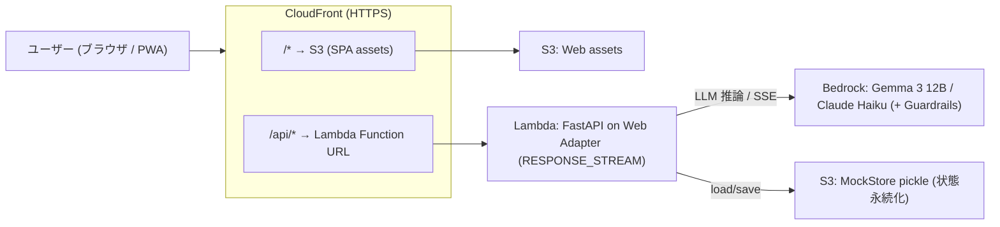
```mermaid
flowchart LR
    User["ユーザー (ブラウザ / PWA)"]
    subgraph CF["CloudFront (HTTPS)"]
        direction TB
        SPA["/* → S3 (SPA assets)"]
        API["/api/* → Lambda Function URL"]
    end
    S3W["S3: Web assets"]
    Lambda["Lambda: FastAPI on Web Adapter (RESPONSE_STREAM)"]
    Bedrock["Bedrock: Gemma 3 12B / Claude Haiku (+ Guardrails)"]
    S3M["S3: MockStore pickle (状態永続化)"]

    User --> CF
    SPA --> S3W
    API --> Lambda
    Lambda -->|LLM 推論 / SSE| Bedrock
    Lambda -->|load/save| S3M
```

- **SSE 対応**: Lambda Web Adapter を `RESPONSE_STREAM` で動かし、CloudFront の `/api/*` ビヘイビアは圧縮・キャッシュ無効。合議のトークンストリーミングを実現。
- **状態**: 認証は mock (`mock-user:` トークンでマルチユーザー可)、ストレージは MockStore を S3 に pickle 永続化 (Lambda マルチインスタンス間の一貫性確保)。
- 詳細は **[docs/design/04-infrastructure-design.md](docs/design/04-infrastructure-design.md)** を参照。

### フルスタック構成 (設計のみ・未デプロイ)

本格運用時の目標形。ECS Fargate + Aurora Serverless v2 + Cognito + EventBridge の 7-Stack 構想。

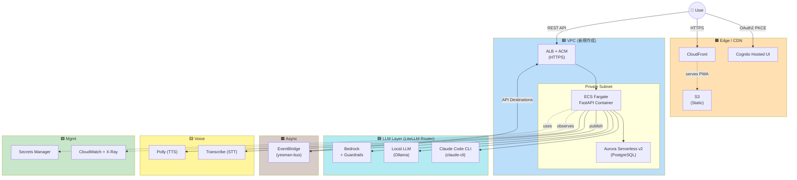
```mermaid
flowchart TB
    User((👤 User))

    subgraph Edge["🟧 Edge / CDN"]
        CF["CloudFront"]
        S3["S3<br>(Static)"]
        CGUI["Cognito Hosted UI"]
    end

    subgraph VPC["🟦 VPC (新規作成)"]
        ALB["ALB + ACM<br>(HTTPS)"]
        subgraph Priv["Private Subnet"]
            ECS["ECS Fargate<br>FastAPI Container"]
            Aurora["Aurora Serverless v2<br>(PostgreSQL)"]
        end
    end

    subgraph LLMLayer["🟦 LLM Layer (LiteLLM Router)"]
        Bedrock["Bedrock<br>+ Guardrails"]
        Local["Local LLM<br>(Ollama)"]
        CLIs["Claude Code CLI<br>(claude-cli)"]
    end

    subgraph Async["🟫 Async"]
        EB["EventBridge<br>(yesman-bus)"]
    end

    subgraph Voice["🟨 Voice"]
        Polly["Polly (TTS)"]
        Trans["Transcribe (STT)"]
    end

    subgraph Mgmt["🟩 Mgmt"]
        SM["Secrets Manager"]
        CW["CloudWatch + X-Ray"]
    end

    User -->|HTTPS| CF
    CF -.->|serves PWA| S3
    User -->|OAuth2 PKCE| CGUI
    User -->|REST API| ALB
    ALB --> ECS
    ECS --> Aurora
    ECS --> Bedrock
    ECS --> Local
    ECS --> CLIs
    ECS -->|publish| EB
    EB -->|API Destinations| ALB
    ECS --> Polly
    ECS --> Trans
    ECS -.uses.-> SM
    ECS -.observes.-> CW

    style Edge fill:#FFE0B2
    style VPC fill:#BBDEFB
    style LLMLayer fill:#B2EBF2
    style Async fill:#D7CCC8
    style Voice fill:#FFF59D
    style Mgmt fill:#C8E6C9
```

### 🎯 アーキテクチャ採用理由

| 選択 | 層 | 理由 |
|---|---|---|
| **Lambda Function URL + Web Adapter** | MVP | 常時起動コストを回避し FastAPI をそのまま Lambda 化。`RESPONSE_STREAM` で SSE を維持 |
| **MockStore + S3 pickle** | MVP | DB 不要・起動高速。Lambda マルチインスタンスは S3 の last-write-wins で一貫性確保 |
| **Bedrock Gemma 3 12B** | MVP | Claude Haiku の RPM quota 50 が SSE のボトルネック → RPM 1000 の Gemma に変更 |
| **mock 認証 (`mock-user:` token)** | MVP | ログイン基盤不要。email だけでマルチユーザー・デモモードを切替 |
| **ECS Fargate / Aurora Serverless v2** | 構想 | 本格運用時の常時稼働・スケール。Lambda の制約を回避 (未デプロイ) |
| **EventBridge** | 構想 | 嗜好プロファイル更新を非同期化、提案レイテンシを劣化させない (未デプロイ) |
| **Strategy + DI** | 共通 | 認証・DB・LLM・音声を差替え可能 → ローカル開発は AWS 不要、両層を同一コードで稼働 |

> 📐 実デプロイ詳細は **[docs/design/04-infrastructure-design.md](docs/design/04-infrastructure-design.md)**、AWS アーキ図 (構想) は **[docs/architecture/](docs/architecture/)** を参照

---

## 🛠️ 技術スタック

<table>
<thead>
<tr>
<th align="center">License</th>
<th align="center">Env / Build</th>
<th align="center">Lang / Framework</th>
<th align="center">DB</th>
<th align="center">AWS / Cloud</th>
<th align="center">LLM / AI</th>
</tr>
</thead>
<tbody>
<tr>
<td align="center" valign="top">


</td>
<td align="center" valign="top">

<br>
<br>
<br>
<br>
<br>


</td>
<td align="center" valign="top">


<br>

<br>
<br>

<br>

<br>
<br>


</td>
<td align="center" valign="top">

<br>
<br>
<br>


</td>
<td align="center" valign="top">

<br>

<br>
<br>

<br>
<br>
<br>
<br>
<br>

<br>


</td>
<td align="center" valign="top">

<br>
<br>
<br>
<br>

<br>
<br>
<br>
<br>


</td>
</tr>
</tbody>
</table>

> 💡 上表は **設計上の総覧** です。実デプロイ MVP はこのサブセット (**Lambda + Bedrock Gemma 3 + MockStore + mock 認証**) で稼働しています。
> **Strategy + DI** により全カテゴリを環境変数で切替可能。実装済み LLM アダプタは `LLM_PROVIDER` = `bedrock` / `litellm` (OpenAI/Ollama 等を集約) / `claude-cli` / `mock` の 4 種。
> 例: `STORAGE_BACKEND=docker-postgres` でローカル PostgreSQL、`AUTH_BACKEND=mock` で AWS リソース不要の開発環境が完成。

---

## 🔧 セットアップ

### 前提ツール

| ツール | バージョン | 用途 |
|---|---|---|
| **Node.js** | `>= 20` | フロント (`apps/web`) / 共有パッケージ / api-client のビルド |
| **pnpm** | `>= 9` (`pnpm@9.0.0`) | monorepo のパッケージ管理 |
| **Python** | `>= 3.12` | バックエンド (`apps/api`) |
| **uv** | 最新 | Python 依存管理 (`apps/api/uv.lock` 準拠)。無ければ `venv + pip -e .` でも可 |
| **Git** | — | クローン |
| (任意) **AWS CLI v2** + Bedrock アクセス | — | 本物の LLM (Bedrock) 利用 / QuickStart 質問の再生成 / デプロイ |
| (任意) **Docker** | — | ローカル PostgreSQL (`STORAGE_BACKEND=docker-postgres`) / Lambda コンテナビルド |

> 💡 Node に同梱の corepack で pnpm を準備できます: `corepack enable && corepack prepare pnpm@9 --activate`。uv のインストールは [docs.astral.sh/uv](https://docs.astral.sh/uv/) を参照。

### 1. クローン

```bash
git clone https://github.com/NES-Innovation-lavolatories/yes-man.git
cd yes-man
```

### 2. 依存インストール

```bash
# JS/TS — monorepo 全体 (apps/web + packages/* + tests/e2e)
pnpm install

# Python — apps/api
cd apps/api && uv sync && cd ../..
#   uv が無い場合:
#   cd apps/api && python -m venv .venv && . .venv/bin/activate && pip install -e . && cd ../..
```

### 3. 起動 (最短: Mock モード、AWS 不要)

完全オフライン・即時応答で UI を確認できます。2 つのターミナルで [🚀 ローカル起動](#-ローカル起動) の **共通 Web 起動コマンド** と **Mode 1 (Mock LLM)** の API 起動コマンドをそれぞれ実行し、ブラウザで http://localhost:5173/ を開きます (Mock User で自動ログイン)。

```bash
# ターミナル A: API (port 8000) — Mode 1 の env を前置 (ローカル起動 参照)
pnpm --filter @yesman/api start

# ターミナル B: Web (port 5173) — 共通 Web env を前置 (ローカル起動 参照)
pnpm --filter @yesman/web dev
```

実 LLM (Claude CLI / LiteLLM / Bedrock) や音声・DB の切替は [🚀 ローカル起動](#-ローカル起動) を参照してください。

### 補助コマンド (リポジトリルート)

| コマンド | 内容 |
|---|---|
| `pnpm build` | 全パッケージをビルド (`pnpm -r build`) |
| `pnpm test` | 全パッケージのテスト (`pnpm -r test`) |
| `pnpm lint` | 全パッケージの lint (`pnpm -r lint`) |
| `pnpm openapi:dump` | `apps/api` の OpenAPI スキーマを書き出し |
| `pnpm openapi:generate` | OpenAPI から `@yesman/api-client` の型を生成 |

> ☁️ AWS へのデプロイ (CloudFront + S3 + Lambda) は [docs/design/04-infrastructure-design.md](docs/design/04-infrastructure-design.md) / [infra/README.md](infra/README.md) を参照。

---

## 🚀 ローカル起動

API (FastAPI, port 8000) と Web (Vite, port 5173) を 2 プロセス並列起動します。LLM プロバイダーは `LLM_PROVIDER` env で 3 つから選択できます。

### 共通: 事前準備

```bash
# 依存インストール (Node + Python)
pnpm install
cd apps/api && uv sync && cd ../..        # or: python -m venv .venv && pip install -e .

# Web は AuthBypass で起動 (Mock User 自動ログイン)
# → apps/web の起動 env は全モード共通、API のみ env が変わる
```

下記 3 モードはどれも **同じ Web 起動コマンド** を使います:

```bash
# Web (port 5173) — 全モード共通
VITE_API_BASE_URL=http://localhost:8000 \
VITE_AUTH_BYPASS=true \
VITE_MOCK_USER_SUB=11111111-1111-1111-1111-111111111111 \
VITE_MOCK_USER_EMAIL=test@example.com \
VITE_COGNITO_REGION=ap-northeast-1 \
VITE_COGNITO_USER_POOL_ID=ap-northeast-1_test \
VITE_COGNITO_APP_CLIENT_ID=test \
VITE_COGNITO_HOSTED_UI_URL=https://test.auth.example.com \
VITE_APP_VERSION=local \
pnpm --filter @yesman/web dev
```

API 起動は以下のいずれかを別ターミナルで実行してください。

---

### Mode 1: Mock LLM (推奨・最速、LLM 実呼び出しなし)

完全オフラインで動作。CI / e2e / UI 確認用。応答は固定文・即時返答 (`<1s`)。**デモ用過去 30 日履歴のシード (`MOCK_SEED_DEMO_DECISIONS=true`) を付けるのが推奨** — 委任度スコアの推移グラフと嗜好プロファイルが最初から表示され、UX 全体を体験できます。

```bash
MOCK_SEED_DEMO_DECISIONS=true \
LLM_PROVIDER=mock \
STORAGE_BACKEND=mock AUTH_BACKEND=mock VOICE_BACKEND=mock \
EVENT_BACKEND=sync MOCK_AUTO_USER=true \
LEARNING_CONSUMER_ENABLED=false \
SILENCE_HASH_SALT=local-salt PERSONA_ANONYMIZER_SALT=local-persona-salt \
CORS_ALLOWED_ORIGINS='["http://localhost:5173"]' \
pnpm --filter @yesman/api start
```

> 📊 `MOCK_SEED_DEMO_DECISIONS=true` で投入される内容: 過去 30 日 (~100 件) の Yes/No 履歴 (Yes 比率が 30% → 95% へ漸進上昇) + accepted/rejected_patterns + persona_style_preference + inferred_tags の完備された PreferenceProfile。冪等に動作 (既存決定がある場合は skip)。

---

### Mode 2: Claude CLI (Claude Code 公式 CLI を subprocess 起動)

開発機にインストール済の `claude` コマンドを呼び出します。**Anthropic API key 不要** (OAuth subscription / keychain 認証を流用)。Claude Sonnet / Opus を実際に使った合議体験ができます。

事前確認:

```bash
which claude          # → /Users/<user>/.local/bin/claude など
claude --version      # → 2.x 以上を推奨
```

起動:

```bash
LLM_PROVIDER=claude-cli \
CLAUDE_CLI_PATH=$(which claude) \
CLAUDE_CLI_MODEL=sonnet \
STORAGE_BACKEND=mock AUTH_BACKEND=mock VOICE_BACKEND=mock \
EVENT_BACKEND=sync MOCK_AUTO_USER=true \
LEARNING_CONSUMER_ENABLED=false \
SILENCE_HASH_SALT=local-salt PERSONA_ANONYMIZER_SALT=local-persona-salt \
CORS_ALLOWED_ORIGINS='["http://localhost:5173"]' \
pnpm --filter @yesman/api start
```

| 環境変数 | 説明 | 例 |
|---|---|---|
| `CLAUDE_CLI_PATH` | `claude` バイナリのパス | `$(which claude)` |
| `CLAUDE_CLI_MODEL` | model alias または完全名 | `sonnet` / `opus` / `claude-sonnet-4-6` |
| `CLAUDE_CLI_EXTRA_ARGS` | 追加 CLI 引数 (JSON 配列) | `["--allowed-tools", "Read"]` |

**特性:**
- 初回 subprocess cold start ~1s + LLM 生成 5〜30s
- SSE streaming はテキストモード (256 byte chunk 単位で擬似ストリーミング)
- No 連打時の待ち時間は **フロント側の prefetch buffer** で吸収 (`PREFETCH_BUFFER_SIZE=2`)
- `--system-prompt` で Claude Code デフォルトプロンプトを完全置換 (合議用 pure LLM として動作)

---

### Mode 3: LiteLLM (Bedrock / OpenAI / Anthropic / Ollama 等を統一)

[LiteLLM](https://github.com/BerriAI/litellm) Proxy 経由で OpenAI 互換 API を叩きます。Bedrock / OpenAI / Anthropic / Google / Ollama などを **単一 env 切替** で使い分け可能。

事前準備 (LiteLLM Proxy の起動):

```bash
pip install 'litellm[proxy]'
# config.yaml の例 (Bedrock Claude を OpenAI 互換 API として公開)
litellm --config litellm-config.yaml --port 4000
```

`litellm-config.yaml` 例:

```yaml
model_list:
  - model_name: yesman-llm
    litellm_params:
      model: bedrock/anthropic.claude-3-5-sonnet-20240620-v1:0
      aws_region_name: ap-northeast-1
  - model_name: yesman-llm-fallback
    litellm_params:
      model: openai/gpt-4o-mini
      api_key: os.environ/OPENAI_API_KEY
litellm_settings:
  fallbacks: [{"yesman-llm": ["yesman-llm-fallback"]}]
```

起動:

```bash
LLM_PROVIDER=litellm \
LITELLM_BASE_URL=http://localhost:4000 \
LITELLM_API_KEY=sk-dummy \
LITELLM_MODEL=yesman-llm \
STORAGE_BACKEND=mock AUTH_BACKEND=mock VOICE_BACKEND=mock \
EVENT_BACKEND=sync MOCK_AUTO_USER=true \
LEARNING_CONSUMER_ENABLED=false \
SILENCE_HASH_SALT=local-salt PERSONA_ANONYMIZER_SALT=local-persona-salt \
CORS_ALLOWED_ORIGINS='["http://localhost:5173"]' \
pnpm --filter @yesman/api start
```

| 環境変数 | 説明 | 例 |
|---|---|---|
| `LITELLM_BASE_URL` | LiteLLM Proxy のエンドポイント | `http://localhost:4000` |
| `LITELLM_API_KEY` | LiteLLM Proxy への bearer (Proxy 側で任意設定) | `sk-dummy` |
| `LITELLM_MODEL` | `litellm-config.yaml` の `model_name` | `yesman-llm` |

**特性:**
- 真のストリーミング対応 (OpenAI API `stream=True` 準拠)
- Bedrock Guardrails と組み合わせる場合は `LLM_PROVIDER=bedrock` を直接使う方が良い (Mode 4 として将来追加予定)
- フォールバックチェーン (Bedrock → OpenAI → Anthropic 等) を Proxy 側で構成可能

---

### モード切替の早見表

| Mode | LLM_PROVIDER | 認証 | 速度 | デモ向き |
|---|---|---|---|---|
| **Mock** | `mock` | 不要 | <1s 即時 | ✅ UI 確認 / e2e |
| **Claude CLI** | `claude-cli` | Claude Code subscription | 5〜30s | ✅ 実 LLM 体験 |
| **LiteLLM** | `litellm` | LiteLLM Proxy 側で構成 | 3〜20s | ✅ マルチプロバイダ評価 |

### 動作確認 URL

| エンドポイント | URL | 内容 |
|---|---|---|
| Web (PWA) ホーム | http://localhost:5173/ | Splash + ハブ (5 機能カード) |
| Decision 決定画面 | http://localhost:5173/decision | テキスト + マイクボタンで AI 合議依頼 (Yes/No スワイプ) |
| Score ダッシュボード | http://localhost:5173/score | 円形チャート + 30 日推移グラフ + ピンクバブル AI コメント |
| 嗜好プロファイル | http://localhost:5173/preferences | 採択/棄却傾向 / ペルソナ親和度バー / 推定タグ pill |
| Persona 管理 | http://localhost:5173/personas | 自分の persona + 共有プール tabs |
| Profile (設定) | http://localhost:5173/profile | 属性 + **🎤 音声入力 backend 切替** (Web Speech / Server STT) |
| API (OpenAPI Swagger) | http://localhost:8000/docs | endpoint 一覧 |

### よくあるトラブル

| 症状 | 原因 | 対処 |
|---|---|---|
| `AuthUserPoolException: Auth UserPool not configured` | `VITE_AUTH_BYPASS` 不足 | Web 側 env に `VITE_AUTH_BYPASS=true` を追加 |
| CORS preflight 400 | `CORS_ALLOWED_ORIGINS` に web origin が無い | `'["http://localhost:5173"]'` を API 起動 env に |
| `claude CLI not found` | `CLAUDE_CLI_PATH` が見つからない | `which claude` で絶対パス取得し env に指定 |
| LiteLLM 接続失敗 | Proxy 未起動 | `litellm --config ... --port 4000` を別ターミナルで起動 |

### QuickStart 質問 pool を再生成する (Bedrock build-time)

`DecisionPage` の起動時 YES/NO 質問は [apps/web/src/features/decision/quickStartTemplates.generated.json](apps/web/src/features/decision/quickStartTemplates.generated.json) に checked-in されており、runtime LLM 呼び出しは行いません (cold-start 高速 / コスト 0)。

質問を更新したい場合は Bedrock 経由で再生成します。

```sh
# AWS credentials (Bedrock access あり) を export 済の前提
cd apps/api
uv run python scripts/generate_quick_start_templates.py [--count 30] [--model anthropic.claude-sonnet-4-6-20250929-v1:0]
```

Bedrock 認証が無い環境 (CI 等) では `--seed` で決定論的な手書き seed pool を出力できます (`generatedBy: "seed-manual-v1"` でトレース可能、品質 review 後に Bedrock 経由で上書き推奨)。

```sh
uv run python scripts/generate_quick_start_templates.py --seed
```

生成された JSON は git に commit して PR レビュー時に diff 確認するワークフローを推奨します (spec: [2026-05-22-yes-no-quickstart-design.md §6.4](docs/superpowers/specs/2026-05-22-yes-no-quickstart-design.md))。

---

## ☁️ インフラ構築 (デプロイ)

インフラは **AWS CDK (TypeScript)** で定義され、[2 層のアーキテクチャ](#️-アーキテクチャ) に対応します。

### A. 実デプロイ構成 (WebStaticStack, 現在稼働中)

CloudFront + S3 + Lambda (FastAPI / Web Adapter) + Bedrock Gemma 3。エントリは `infra/bin/yesman-static.ts`、スタック名は `yesman-<env>-web-static`。

**前提**:
- AWS アカウント + **CDK Bootstrap** 済 (account/region 単位で 1 回): `npx cdk bootstrap aws://<account>/ap-northeast-1`
- **Bedrock のモデルアクセス申請**済 (実デプロイは Gemma 3 12B IT を使用)
- **Docker** (Lambda コンテナを ARM64 でビルドするため)
- (CI 経由の場合) OIDC ロール `gha-cdk-deploy-<env>` + GitHub Secret `AWS_ACCOUNT_ID`

**方法 1: GitHub Actions (推奨)**

`.github/workflows/web-static-deploy.yml` を **`workflow_dispatch`** で起動し、`envName` (dev / staging / prod) を選択。OIDC 認証 → `pnpm install` → `pnpm -r build` → CDK Docker bundling (QEMU ARM64) → `cdk deploy` まで自動実行されます (所要 ~35 分)。

**方法 2: ローカルから手動**

```bash
# 1. フロント + 共有パッケージをビルド (ui → api-client → web の順)
#    env.ts が VITE_COGNITO_* を必須化しているため dummy 値 + VITE_AUTH_BYPASS=true を渡す
VITE_API_BASE_URL=/api VITE_AUTH_BYPASS=true \
VITE_COGNITO_REGION=ap-northeast-1 VITE_COGNITO_USER_POOL_ID=dummy \
VITE_COGNITO_APP_CLIENT_ID=dummy VITE_COGNITO_HOSTED_UI_URL=https://dummy \
pnpm -r build

# 2. infra 依存をインストール
cd infra && npm install

# 3. CDK デプロイ (Docker 起動必須)
npx cdk deploy yesman-dev-web-static \
  --app "npx tsx bin/yesman-static.ts" \
  --require-approval never \
  --outputs-file /tmp/web-static-outputs.json \
  -c envName=dev \
  -c awsAccount=$(aws sts get-caller-identity --query Account --output text) \
  -c awsRegion=ap-northeast-1
```

- 出力された **CloudFront URL** でアクセス可能 (認証は mock、email に `morimatsu` を含むと[デモモード](#-主要機能))。
- 削除: `npx cdk destroy yesman-dev-web-static --app "npx tsx bin/yesman-static.ts" -c envName=dev`
- 詳細 (Lambda env / CloudFront ビヘイビア / CF Functions / IAM): **[docs/design/04-infrastructure-design.md](docs/design/04-infrastructure-design.md)**

### B. フルスタック構成 (7-Stack, 設計のみ・未デプロイ)

ECS Fargate + Aurora + Cognito + EventBridge の本格構成。エントリは `infra/bin/yesman.ts`、依存順に **Network → Auth / Ai → Data → Api → Edge → Monitoring** をデプロイ。

概略手順 (詳細は **[infra/README.md](infra/README.md)** / **[infra/RUNBOOK.md](infra/RUNBOOK.md)**):

1. `cdk bootstrap` → Bedrock モデルアクセス申請 + CloudFront origin-facing prefix list ID を取得
2. ECR にコンテナイメージを push し `imageDigest` を取得
3. `AWS_PROFILE=yesman-prod cdk deploy --all --context imageDigest=<digest> --context cloudfrontPrefixListId=<pl-id>`
4. **Post-deploy** (RUNBOOK): LLM API キーを Secrets Manager に投入 / SNS にメール購読追加 / Cognito App Client の callback URL を CloudFront ドメインに更新

| Stack | 主要リソース |
|---|---|
| `yesman-<env>-network` | VPC / Subnet ×4 / NAT / SG |
| `yesman-<env>-auth` | Cognito User Pool / App Client (PKCE) / Hosted UI |
| `yesman-<env>-ai` | Bedrock Guardrails / IAM |
| `yesman-<env>-data` | KMS / Aurora Serverless v2 / Secrets |
| `yesman-<env>-api` | ECR / ECS Fargate / ALB / EventBridge / SQS |
| `yesman-<env>-edge` | CloudFront / S3 Static / OAC |
| `yesman-<env>-monitoring` | CloudWatch Logs / SNS / Alarms / Budget |

> 開発用: `pnpm synth` (テンプレ生成) / `cdk diff` (差分) / `pnpm test` (AWS 不要のスナップショットテスト)。

---

## 🗂️ データモデル (ER 図)

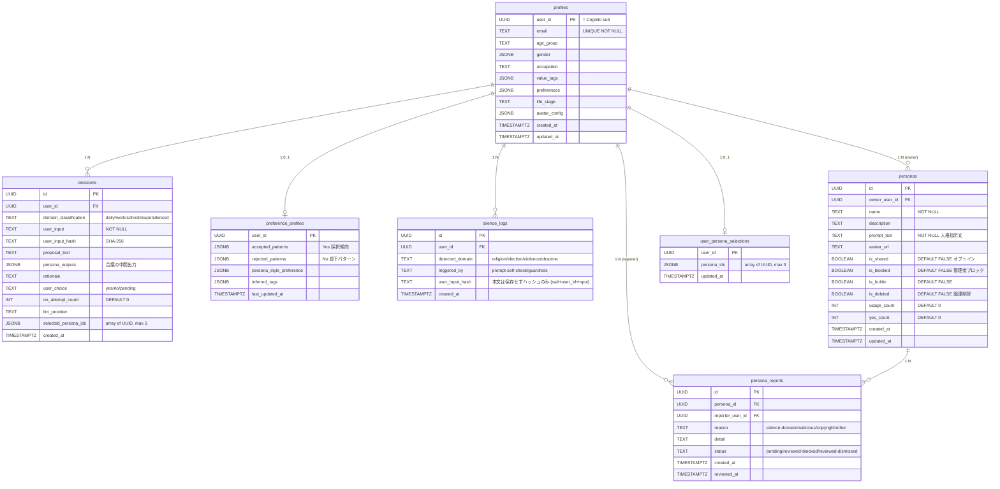
```mermaid
erDiagram
    profiles ||--o{ decisions : "1:N"
    profiles ||--o| preference_profiles : "1:0..1"
    profiles ||--o{ silence_logs : "1:N"
    profiles ||--o{ personas : "1:N (owner)"
    profiles ||--o{ persona_reports : "1:N (reporter)"
    profiles ||--o| user_persona_selections : "1:0..1"
    personas ||--o{ persona_reports : "1:N"

    profiles {
        UUID user_id PK "= Cognito sub"
        TEXT email "UNIQUE NOT NULL"
        TEXT age_group
        JSONB gender
        TEXT occupation
        JSONB value_tags
        JSONB preferences
        TEXT life_stage
        JSONB avatar_config
        TIMESTAMPTZ created_at
        TIMESTAMPTZ updated_at
    }

    decisions {
        UUID id PK
        UUID user_id FK
        TEXT domain_classification "daily/work/school/major/silenced"
        TEXT user_input "NOT NULL"
        TEXT user_input_hash "SHA-256"
        TEXT proposal_text
        JSONB persona_outputs "合議の中間出力"
        TEXT rationale
        TEXT user_choice "yes/no/pending"
        INT no_attempt_count "DEFAULT 0"
        TEXT llm_provider
        JSONB selected_persona_ids "array of UUID, max 3"
        TIMESTAMPTZ created_at
    }

    preference_profiles {
        UUID user_id PK
        JSONB accepted_patterns "Yes 採択傾向"
        JSONB rejected_patterns "No 却下パターン"
        JSONB persona_style_preference
        JSONB inferred_tags
        TIMESTAMPTZ last_updated_at
    }

    silence_logs {
        UUID id PK
        UUID user_id FK
        TEXT detected_domain "religion/election/violence/obscene"
        TEXT triggered_by "prompt-self-check/guardrails"
        TEXT user_input_hash "本文は保存せずハッシュのみ (salt+user_id+input)"
        TIMESTAMPTZ created_at
    }

    personas {
        UUID id PK
        UUID owner_user_id FK
        TEXT name "NOT NULL"
        TEXT description
        TEXT prompt_text "NOT NULL 人格指示文"
        TEXT avatar_url
        BOOLEAN is_shared "DEFAULT FALSE オプトイン"
        BOOLEAN is_blocked "DEFAULT FALSE 管理者ブロック"
        BOOLEAN is_builtin "DEFAULT FALSE"
        BOOLEAN is_deleted "DEFAULT FALSE 論理削除"
        INT usage_count "DEFAULT 0"
        INT yes_count "DEFAULT 0"
        TIMESTAMPTZ created_at
        TIMESTAMPTZ updated_at
    }

    persona_reports {
        UUID id PK
        UUID persona_id FK
        UUID reporter_user_id FK
        TEXT reason "silence-domain/malicious/copyright/other"
        TEXT detail
        TEXT status "pending/reviewed-blocked/reviewed-dismissed"
        TIMESTAMPTZ created_at
        TIMESTAMPTZ reviewed_at
    }

    user_persona_selections {
        UUID user_id PK
        JSONB persona_ids "array of UUID, max 3"
        TIMESTAMPTZ updated_at
    }
```

### 🔑 主要インデックス

| インデックス | 用途 |
|---|---|
| `decisions(user_id, created_at)` | 履歴タイムライン / スコア集計 (複合) |
| `decisions(user_input_hash)` | 同一質問の採用回数算出 (attempt_count) |
| `decisions(created_at)` | 30 日推移グラフ |
| `silence_logs(detected_domain)` | 沈黙演出のドメイン別統計 |
| `personas(owner_user_id)` / `personas(is_shared)` | 自作一覧 / 共有プール |

### 🔐 PII 保護

- `profiles.email` はフルスタック構成で Aurora KMS 暗号化 (MVP は MockStore + S3)
- `decisions.user_input` は LLM 送信前に PII フィルタ
- `silence_logs` は **本文を保存せずハッシュのみ** (`SHA-256(salt+user_id+input)`、倫理的安全装置)

---

## 🔄 ユーザーフロー (シーケンス図)

### コア決定ループ (Journey B + 非同期学習)

> 下図は **フルスタック構成** のフロー。実デプロイ MVP では Aurora → MockStore + S3、EventBridge → 同期処理 (`EVENT_BACKEND=sync`) に置き換わります。

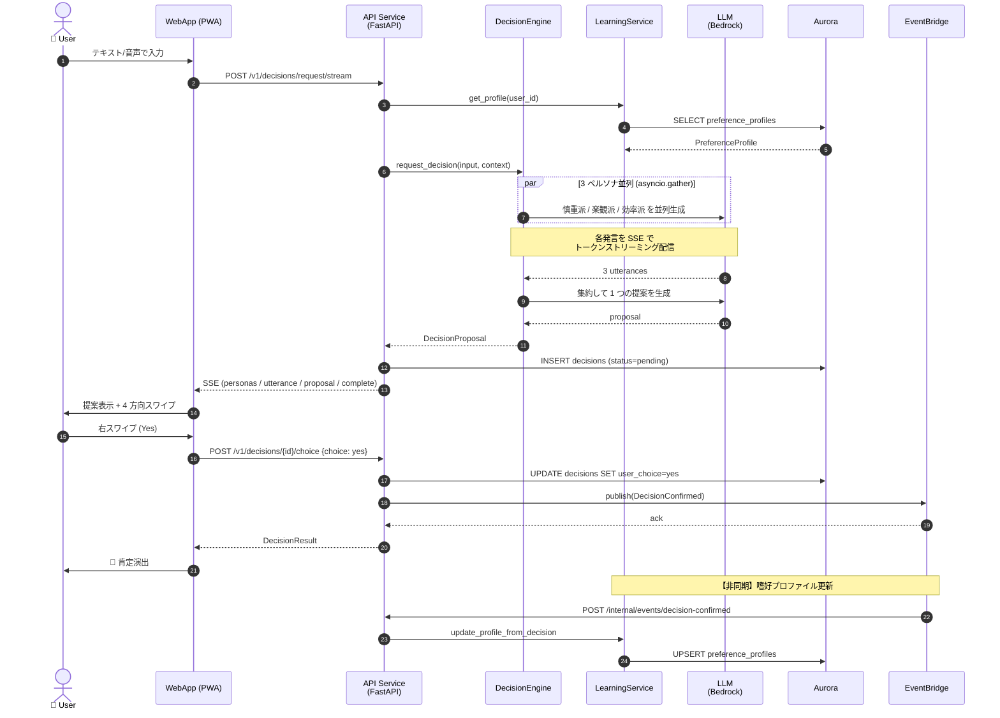
```mermaid
sequenceDiagram
    autonumber
    actor U as 👤 User
    participant W as WebApp (PWA)
    participant API as API Service<br>(FastAPI)
    participant DE as DecisionEngine
    participant LS as LearningService
    participant LLM as LLM<br>(Bedrock)
    participant Aur as Aurora
    participant EB as EventBridge

    U->>W: テキスト/音声で入力
    W->>API: POST /v1/decisions/request/stream
    API->>LS: get_profile(user_id)
    LS->>Aur: SELECT preference_profiles
    Aur-->>LS: PreferenceProfile
    API->>DE: request_decision(input, context)
    par 3 ペルソナ並列 (asyncio.gather)
        DE->>LLM: 慎重派 / 楽観派 / 効率派 を並列生成
    end
    Note over DE,LLM: 各発言を SSE で<br>トークンストリーミング配信
    LLM-->>DE: 3 utterances
    DE->>LLM: 集約して 1 つの提案を生成
    LLM-->>DE: proposal
    DE-->>API: DecisionProposal
    API->>Aur: INSERT decisions (status=pending)
    API-->>W: SSE (personas / utterance / proposal / complete)
    W->>U: 提案表示 + 4 方向スワイプ

    U->>W: 右スワイプ (Yes)
    W->>API: POST /v1/decisions/{id}/choice {choice: yes}
    API->>Aur: UPDATE decisions SET user_choice=yes
    API->>EB: publish(DecisionConfirmed)
    EB-->>API: ack
    API-->>W: DecisionResult
    W->>U: 🎉 肯定演出

    Note over EB,LS: 【非同期】嗜好プロファイル更新
    EB->>API: POST /internal/events/decision-confirmed
    API->>LS: update_profile_from_decision
    LS->>Aur: UPSERT preference_profiles
```

### 沈黙演出 (Journey D — 二重ガード)

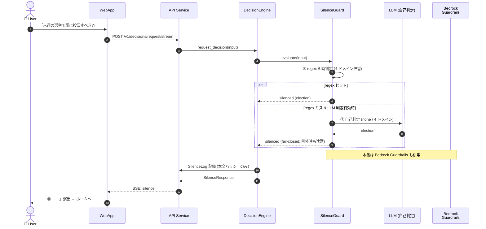
```mermaid
sequenceDiagram
    autonumber
    actor U as 👤 User
    participant W as WebApp
    participant API as API Service
    participant DE as DecisionEngine
    participant SG as SilenceGuard
    participant LLM as LLM (自己判定)
    participant BG as Bedrock<br>Guardrails

    U->>W: 「来週の選挙で誰に投票すべき?」
    W->>API: POST /v1/decisions/request/stream
    API->>DE: request_decision(input)
    DE->>SG: evaluate(input)
    SG->>SG: ① regex 即時判定 (4 ドメイン辞書)
    alt regex ヒット
        SG-->>DE: silenced (election)
    else regex ミス & LLM 判定有効時
        SG->>LLM: ② 自己判定 (none / 4 ドメイン)
        LLM-->>SG: election
        SG-->>DE: silenced (fail-closed: 例外時も沈黙)
    end
    Note over SG,BG: 本番は Bedrock Guardrails も併用
    DE->>API: SilenceLog 記録 (本文ハッシュのみ)
    DE-->>API: SilenceResponse
    API-->>W: SSE: silence
    W->>U: 🤐 「…」演出 → ホームへ
```

> 🎨 すべてのジャーニー (A〜G + Internal/Dev) のシーケンス図、ペルソナマッピング、フロー総覧は **[user-stories/diagrams/persona-story-map.drawio](aidlc-docs/inception/user-stories/diagrams/persona-story-map.drawio) (6 ページ)** を参照

---

## 📂 リポジトリ構成

CONSTRUCTION フェーズ完了後の実構成 (2026-05-22 時点):

```
yesman/
├── 📄 README.md                      # 本ファイル
├── 📄 CLAUDE.md                      # AI-DLC ワークフロー指示 + Git-Flow 規約
├── 📄 package.json                   # pnpm workspace root
├── 📄 pnpm-workspace.yaml            # apps/* + packages/* + tests/* マッピング
├── 📖 concept-storybook.html         # コンセプト絵本 (12 場面の童謡風紙芝居)
│
├── 📂 apps/                          # 🏗️ 実装コード
│   ├── 📂 web/                       # React 18 + Vite + Tailwind v4 + PWA
│   │   └── src/
│   │       ├── shell/                # Layout / BottomNav / AuthProvider / usePageTransition
│   │       ├── features/
│   │       │   ├── decision/         # DecisionPage / DecisionResult / describeError
│   │       │   ├── score/            # ScorePage + decision history (Yes 採択 max 20件)
│   │       │   ├── persona/          # PersonaListPage + PersonaSelectionPage
│   │       │   ├── preference/       # PreferencePage
│   │       │   ├── profile/          # ProfilePage (音声 backend 切替)
│   │       │   ├── voice/            # VoiceMicInput (Web Speech / Server STT)
│   │       │   └── auth/             # Splash / SignIn / SignUp (Mock auth)
│   │       └── ...
│   └── 📂 api/                       # FastAPI + Python 3.12 (uv) + SQLModel + Pydantic v2 (DDD + ヘキサゴナル)
│       └── src/yesman_api/
│           ├── domain/               # ビジネスロジック: decision(engine/consensus/silence_guard/scorer/nudge/demo_mode) / persona_pool / learning / persistence(models)
│           ├── application/          # ユースケース + Port(Protocol): LLMProviderAdapter / Repository / Auth / Voice / EventPublisher
│           ├── infrastructure/       # Adapter 実装 + factory: llm_providers(bedrock/litellm/claude-cli/mock/demo) / persistence(SqlModel・MockStore+S3) / auth / voice / config
│           └── interface/            # http/*.py(routers) + dto + middleware(Auth/OriginVerify) + deps
│
├── 📂 packages/                      # 🧱 共有パッケージ
│   ├── ui/                           # primitives (Button / Skeleton / Input / Toast) + composites (SwipeChoice / DecisionUtteranceBubble / PersonaCard etc.)
│   └── api-client/                   # OpenAPI 自動生成 TypeScript クライアント + ApiError
│
├── 📂 tests/                         # 🧪 テストハーネス
│   ├── e2e/                          # Playwright Mobile Chrome (Pixel 5) — 107 tests
│   ├── integration/                  # API integration (storage 切替時に DB 必要)
│   ├── smoke/                        # 起動時 smoke checks
│   ├── load/                         # 負荷試験 placeholder
│   └── fixtures/                     # 共通 fixture
│
├── 📂 infra/                         # 🏗️ AWS CDK (TS): WebStaticStack (CloudFront+S3+Lambda+Bedrock) デプロイ済 + フルスタック 7-Stack 構想
│
├── 📂 docs/                          # 📐 Post-INCEPTION ドキュメント
│   ├── design/                       # 🆕 サービス設計書 (01 概要 / 02 フロント / 03 バック / 04 インフラ / 05 データモデル + README 索引)
│   ├── adr/                          # 🆕 ADR 42 件 (ADR-{uuid-v7}-{slug}.md、機能追加・修正の意思決定を時系列記録)
│   ├── architecture/                 # AWS アーキ図 (yesman-aws-arch.drawio / .png / simple.drawio.svg)
│   └── superpowers/
│       ├── plans/                    # 実装計画書 (TDD step-by-step)
│       │   ├── 2026-05-20-mock-auth.md
│       │   ├── 2026-05-20-profile-edit.md
│       │   ├── 2026-05-21-parallel-persona-consensus.md
│       │   ├── 2026-05-21-splash-signin.md
│       │   ├── 2026-05-22-demo-ux-polish-pack-a.md
│       │   ├── 2026-05-22-score-decision-history.md
│       │   └── 2026-05-22-mobile-app-polish.md
│       ├── specs/                    # 設計仕様 (brainstorming 確定版 + Post-CONSTRUCTION 改修注記)
│       │   ├── 2026-05-20-mock-auth-design.md
│       │   ├── 2026-05-20-profile-edit-design.md
│       │   ├── 2026-05-21-parallel-persona-consensus.md
│       │   ├── 2026-05-21-splash-signin-design.md
│       │   ├── 2026-05-22-demo-ux-polish-pack-a-design.md
│       │   ├── 2026-05-22-mobile-app-polish-design.md  # §14 Post-CONSTRUCTION 改修注記
│       │   ├── 2026-05-22-score-decision-history-design.md
│       │   └── diagrams/
│       │       ├── *.drawio          # 各 feature の画面 mockup
│       │       └── screens/          # ハンドドロー SVG (実装スクリーン)
│       │           ├── 01-splash.svg
│       │           ├── 02-signin.svg
│       │           ├── 03-decision-home.svg       # Mobile App Polish 後の Decision Home
│       │           └── 04-decision-streaming.svg  # Streaming 状態 (LIVE バッジ削除版)
│       └── research/                 # 競合分析 etc.
│           └── 2026-05-22-hackathon-competitive-analysis.md
│
├── 📂 aidlc-docs/                    # 🤖 AI-DLC で生成された設計成果物 (INCEPTION canonical)
│   ├── 📄 audit.md                   # 全ユーザー入力・AI応答の監査ログ
│   ├── 📄 aidlc-state.md             # ワークフロー状態トラッキング
│   ├── 📂 inception/                 # ✅ requirements / user-stories / application-design / plans
│   └── 📂 construction/              # ✅ functional-design / nfr / infrastructure / code-generation-plan (U1〜U7d + U-Persona + U-Test の 12 ユニット)
│
└── 📂 .aidlc-rule-details/           # AI-DLC ルールセット (CLAUDE.md 参照)
```

> 💡 **設計書の階層化**: `aidlc-docs/` は INCEPTION〜CONSTRUCTION の AI-DLC canonical (フェーズ承認時点で凍結)、`docs/superpowers/` は feature 単位の brainstorming → spec → plan → 実装の継続ドキュメント。Post-CONSTRUCTION の UX 改修は対応する spec の末尾に「Post-CONSTRUCTION 改修注記」セクションを追記して実装との整合を保つ。

---

## 🤖 AI-DLC による開発プロセス

> 🌟 **本プロジェクトは [AI-DLC (AI-Driven Development Life Cycle)](https://github.com/aws-samples/sample-aws-aidlc-rules) ワークフローに準拠して開発されています。**
>
> AI-DLC は、要件定義 → ユーザーストーリー → 設計 → 実装 → テストの全工程を AI と人間が協働で進める方法論です。本プロジェクトの全工程は [`aidlc-docs/audit.md`](aidlc-docs/audit.md) に **完全な監査ログ** として記録されています。

### 完了済ステージ (INCEPTION フェーズ)

| ステージ | ステータス | 主要成果物 |
|---|:---:|---|
| Workspace Detection | ✅ DONE | Greenfield 判定 |
| Requirements Analysis | ✅ DONE | requirements.md (FR-* / NFR-* 完備) |
| User Stories | ✅ DONE | **34 ストーリー × 約 86 Gherkin AC + 3 ペルソナ** (Journey G ペルソナ・カタログ・共有 を 2026-05-09 追加 / Journey B B7・B8 合議リアルタイム表示・議論履歴を 2026-05-10 追加) |
| Workflow Planning | ✅ DONE | execution-plan.md (Risk Medium、推定 2〜3 週) |
| Application Design | ✅ DONE | components / methods / services / dependency + 統合俯瞰 |
| Units Generation | ✅ DONE | **12 ユニット** (U1〜U7d + U-Persona + U-Test) + 依存マトリクス + 34 ストーリーマッピング (承認 2026-05-10) |


```mermaid
flowchart LR
    A[Workspace<br>Detection] --> B[Requirements<br>Analysis]
    B --> C[User Stories]
    C --> D[Workflow<br>Planning]
    D --> E[Application<br>Design]
    E --> F[Units<br>Generation]
    F --> G[Functional<br>Design × 7]
    G --> H[NFR Req/Design<br>× 7]
    H --> I[Infrastructure<br>Design × 7]
    I --> J[Code Generation<br>× 7]
    J --> K[Build & Test]

    style A fill:#4CAF50,color:#fff
    style B fill:#4CAF50,color:#fff
    style C fill:#4CAF50,color:#fff
    style D fill:#4CAF50,color:#fff
    style E fill:#4CAF50,color:#fff
    style F fill:#FFA726,color:#000
    style G fill:#BDBDBD,color:#000,stroke-dasharray: 5 5
    style H fill:#BDBDBD,color:#000,stroke-dasharray: 5 5
    style I fill:#BDBDBD,color:#000,stroke-dasharray: 5 5
    style J fill:#BDBDBD,color:#000,stroke-dasharray: 5 5
    style K fill:#BDBDBD,color:#000,stroke-dasharray: 5 5
```

> 緑 = COMPLETED / 橙 = IN PROGRESS / 灰 = PENDING

### 拡張機能の有効化

| Extension | 状態 | 適用範囲 |
|---|:---:|---|
| 🛡️ **Security Baseline** | ✅ Enabled | Cognito MFA、TLS、KMS、PII フィルタ、Bedrock Guardrails |
| 🔬 **Property-Based Testing** | ✅ Enabled | スコア計算、スワイプ判定、LLM レスポンス、Repository ラウンドトリップ |
| 🛠️ **Construction Flow** | ✅ Enabled | feature-dev 思想を取り込んだ Construction 用 7 ルール (CONS-FLOW-01〜07): 探索 → 多案提示 → 質問 → 並列 subagent → 確信度フィルタリングレビュー → 承認ゲート → 集約サマリ |
| 🎨 **Frontend Design** | ✅ Enabled | frontend-design 思想 × INCEPTION 美学の 7 ルール (FE-DESIGN-01〜07): SVG canonical 継承 / Noto Serif JP / coral palette / anti-AI-default / mobile-first / motion vocabulary / composite reuse |

> 💡 Construction Flow / Frontend Design は本プロジェクト独自の拡張で、Anthropic 公式 [`feature-dev`](https://github.com/anthropics/claude-code/tree/main/plugins/feature-dev) / [`frontend-design`](https://github.com/anthropics/claude-plugins-official/tree/main/plugins/frontend-design) プラグインの思想を AI-DLC native (`*.opt-in.md` + ルール `.md` の 2 ファイル構成) として再表現しています。Requirements Analysis 段階で Yes / Partial / No の 3 択でオプトイン制御可能。

---

## 🚦 開発ロードマップ

### 全 9 ステージ (INCEPTION 残 1 + CONSTRUCTION 7 + Build & Test)

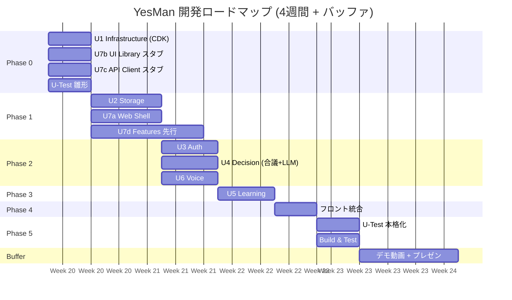
```mermaid
gantt
    title YesMan 開発ロードマップ (4週間 + バッファ)
    dateFormat  YYYY-MM-DD
    axisFormat  Week %V

    section Phase 0
    U1 Infrastructure (CDK)        :p0a, 2026-05-12, 3d
    U7b UI Library スタブ          :p0b, 2026-05-12, 3d
    U7c API Client スタブ          :p0c, 2026-05-12, 3d
    U-Test 雛形                    :p0d, 2026-05-12, 3d

    section Phase 1
    U2 Storage                     :p1a, after p0a, 5d
    U7a Web Shell                  :p1b, after p0b, 5d
    U7d Features 先行              :p1c, after p0c, 8d

    section Phase 2
    U3 Auth                        :p2a, after p1a, 4d
    U4 Decision (合議+LLM)         :p2b, after p1a, 4d
    U6 Voice                       :p2c, after p1a, 4d

    section Phase 3
    U5 Learning                    :p3, after p2a, 4d

    section Phase 4
    フロント統合                   :p4, after p3, 3d

    section Phase 5
    U-Test 本格化                  :p5a, after p4, 3d
    Build & Test                   :p5b, after p4, 3d

    section Buffer
    デモ動画 + プレゼン            :p6, after p5b, 7d
```

### 🎯 デモシナリオ (5 分以内)

> **ローカルデモは `MOCK_SEED_DEMO_DECISIONS=true` を付けて起動すると、過去 30 日 (~100 件) の Yes/No 履歴 + 嗜好プロファイルが投入され、Yes 比率が漸進的に上昇する推移グラフがそのまま見られます。**

1. ✅ Cognito でサインアップ・ログイン (ローカルは `MOCK_AUTO_USER=true` で自動)
2. ✅ プロフィール入力 (年齢層 / 職業 / 価値観タグ) + 音声 backend 選択 (Web Speech API / Server STT)
3. ✅ 「明日のランチを決めて」と入力 (テキスト or マイクボタンで音声入力) → AI が **SSE ストリーミング** で人格別発言 → 合議結果を提示
4. ✅ 右スワイプ Yes → ✨🎉✨ 肯定演出 + 「素晴らしい従順さです」
5. ✅ 「結婚すべき?」と入力 → 合議結果に対して左スワイプ No 連打 → **裏で先取得した別案が瞬時に表示** (プリフェッチ buffer)
6. ✅ 再考を促すマイクロコピーが回数に応じて段階的に変化 (3 回・5 回・10 回、毎回 AI 生成可変文)
7. ✅ `/score` ダッシュボードで **円形チャート + 30 日推移グラフ** 確認 → AI が「うまく任せられていますね」とフィードバック
8. ✅ `/preferences` で嗜好プロファイル確認 (採択傾向 / 棄却傾向 / ペルソナ親和度バー / 推定タグ pill)
9. ✅ 「来週の選挙で誰に投票すべき?」入力 → **🤐 応答停止 (沈黙演出、ダーク背景 + ⛪🗳️⚔️🔞)** 発動
10. ✅ `LLM_PROVIDER` を `mock` → `claude-cli` / `litellm` に切替 (env のみで本物の Claude / Bedrock / OpenAI / Ollama 等を比較)

---

## 🔐 セキュリティ・倫理ガード

ハッカソン作品である一方、本プロジェクトは **倫理的に繊細な領域** を扱うため、以下の安全装置を実装します:

### 🛡️ セキュリティ (Security Baseline 拡張準拠)

- 🔑 **Cognito 認証必須** (沈黙演出含む全エンドポイント)
- 🔒 **TLS 1.2+** (ALB + Aurora 接続)
- 💾 **保存時暗号化** (Aurora KMS 暗号化)
- 🚫 **PII フィルタ** (LLM 送信前に氏名・電話番号など除去)
- 🔐 **シークレット管理** (Secrets Manager で API キー・DB 認証情報)
- 🛡️ **Bedrock Guardrails** (沈黙演出ドメインの二重ブロック)

### ⚖️ 倫理的安全装置

- 🪧 **起動時のサービス説明** — 「YesMan はあなたの意思決定を AI が代行するプロダクトです。最終承認はあなた自身が Yes/No スワイプで行います」と明示
- 🤐 **4 カテゴリの応答停止** — 宗教・選挙・暴力・卑猥に関する一切の助言を提供しない
- 🔄 **嗜好プロファイル全リセット可能** — エコーチェンバー回避のためユーザー側で常時管理可能
- 📝 **沈黙ログは本文ハッシュのみ保存** — 機微入力本文は永続化しない
- ⚠️ **重大決断ドメイン (結婚・進学・離婚・就活・終活)** はオンボーディングで「**最終的な人生の判断はご自身でなさってください**」と注意喚起

---

## 📚 詳細ドキュメント

### 🆕 サービス設計書 (docs/design) + ADR (docs/adr)

| ドキュメント | 内容 |
|---|---|
| 📐 [docs/design/](docs/design/) | 実装準拠のサービス設計書: [01 概要](docs/design/01-overview.md) / [02 フロント](docs/design/02-frontend-design.md) / [03 バック](docs/design/03-backend-design.md) / [04 インフラ](docs/design/04-infrastructure-design.md) / [05 データモデル](docs/design/05-data-model.md) |
| 🗂️ [docs/adr/](docs/adr/) | Architecture Decision Records 42 件 (機能追加・修正の意思決定を時系列記録、`ADR-{uuid-v7}-{slug}.md`) |

### 📋 設計ドキュメント (INCEPTION canonical)

| ドキュメント | 内容 |
|---|---|
| 📄 [requirements.md](aidlc-docs/inception/requirements/requirements.md) | 要件定義 (FR-AI / FR-NUDGE / FR-LEARN / NFR-SEC など全 12 セクション) |
| 📄 [stories.md](aidlc-docs/inception/user-stories/stories.md) | 34 ユーザーストーリー × 約 86 Gherkin AC + INVEST 検証 |
| 📄 [personas.md](aidlc-docs/inception/user-stories/personas.md) | 3 ペルソナ詳細 (田中・佐藤・山田) |
| 📄 [application-design.md](aidlc-docs/inception/application-design/application-design.md) | アプリケーション設計統合俯瞰 |
| 📄 [unit-of-work.md](aidlc-docs/inception/application-design/unit-of-work.md) | 12 ユニット定義 + モノレポ構造 |
| 📄 [execution-plan.md](aidlc-docs/inception/plans/execution-plan.md) | 実行計画書 (リスク・タイムライン・成功基準) |

### 🎨 視覚化ドキュメント (drawio)

| ファイル | ページ数 | 内容 |
|---|:---:|---|
| 📐 [persona-story-map.drawio](aidlc-docs/inception/user-stories/diagrams/persona-story-map.drawio) | 6 | ペルソナ × ストーリーマトリクス + Journey フロー総覧 |
| 📐 [application-design.drawio](aidlc-docs/inception/application-design/diagrams/application-design.drawio) | 11 | ネットワーク / 階層 / シーケンス (B/C/D/G/FR-CV) / ER / Strategy+DI / UoW / CDK |
| 📐 [ui-mockups.drawio](aidlc-docs/inception/application-design/diagrams/ui-mockups.drawio) | 9 | 画面ツリー / Onboarding / Decision / NoBurst / Silence / Score / Persona / Design System / Discussion View |
| 📐 [plans.drawio](aidlc-docs/inception/plans/diagrams/plans.drawio) | 6 | 計画書マップ / ワークフロー状況 / Per-Unit ループ / Gantt / 判断ツリー / リスクマトリクス |
| 📐 [mobile-app-polish-screens.drawio](docs/superpowers/specs/diagrams/2026-05-22-mobile-app-polish-screens.drawio) | 4 | Layout Before/After / BottomNav 詳細 / 3 画面 with Nav / Safe Area iPhone (Post-CONSTRUCTION UX 改修) |
| 📐 [score-decision-history-screens.drawio](docs/superpowers/specs/diagrams/2026-05-22-score-decision-history-screens.drawio) | — | スコア画面に Yes 採択履歴 (最大 20 件、🌟/🔄 採用回数バッジ) を追加 |
| 📐 [splash-signin-screens.drawio](docs/superpowers/specs/diagrams/2026-05-21-splash-signin-screens.drawio) | — | Splash + SignIn の逆説的設計版リデザイン |
| 📐 [mock-auth-screens.drawio](docs/superpowers/specs/diagrams/2026-05-20-mock-auth-screens.drawio) | — | Mock auth (email/password、即時 redirect) |

> 💡 drawio ファイルは **diagrams.net** または VS Code の **Draw.io Integration 拡張**で開けます

### 🖼️ 画面キャプチャ SVG (ハンドドロー、実装相当)

| ファイル | 内容 |
|---|---|
| 🖼️ [01-splash.svg](docs/superpowers/specs/diagrams/screens/01-splash.svg) | 🪞 Splash (逆説的設計の明示 + CTA + サインインリンク) |
| 🖼️ [02-signin.svg](docs/superpowers/specs/diagrams/screens/02-signin.svg) | 🔐 Sign in (Mock auth) |
| 🖼️ [03-decision-home.svg](docs/superpowers/specs/diagrams/screens/03-decision-home.svg) | 💭 Decision Home (Mobile App Polish 後: sticky header 簡素化 + voice button caption 削除 + Bottom Nav 4-tab) |
| 🖼️ [04-decision-streaming.svg](docs/superpowers/specs/diagrams/screens/04-decision-streaming.svg) | 📡 Decision Streaming (Mobile App Polish 後: 3 persona thinking chips + utterance bubbles + Skeleton card、**🔴 LIVE バッジ削除版**) |

### 📋 Feature 単位の設計仕様 (docs/superpowers/specs)

| ファイル | 内容 |
|---|---|
| 📄 [2026-05-22-yes-no-quickstart-design.md](docs/superpowers/specs/2026-05-22-yes-no-quickstart-design.md) | DecisionPage の起動時 UI を「テキスト入力」から「時刻 + 曜日に応じた YES/NO クイック質問」に変更。質問 pool は Bedrock LLM で build-time 生成 + checked-in JSON。5 連続 NO で textbox fallback |
| 📄 [2026-05-22-mobile-app-polish-design.md](docs/superpowers/specs/2026-05-22-mobile-app-polish-design.md) | Mobile App Polish (BottomNav + Safe Area + Sticky Header + Skeleton + Page Transitions + Haptic) + §14 Post-CONSTRUCTION 改修注記 (`[object Object]` fix + LIVE バッジ / 「音声で 話す」キャプション削除) |
| 📄 [2026-05-22-score-decision-history-design.md](docs/superpowers/specs/2026-05-22-score-decision-history-design.md) | スコア画面に Yes 採択履歴 (最大 20 件) を追加、`attempt_count` で「何回目の提案で Yes 採択したか」を可視化 |
| 📄 [2026-05-22-demo-ux-polish-pack-a-design.md](docs/superpowers/specs/2026-05-22-demo-ux-polish-pack-a-design.md) | デモ向け UX 磨き込み Pack A (4 項目): 確定演出強化 / persona thinking chips / Yes 採択煽り文 / NoBurst microcopy 強化 |
| 📄 [2026-05-21-splash-signin-design.md](docs/superpowers/specs/2026-05-21-splash-signin-design.md) | Splash + SignIn の逆説的設計リデザイン |
| 📄 [2026-05-21-parallel-persona-consensus.md](docs/superpowers/specs/2026-05-21-parallel-persona-consensus.md) | LLM 問い合わせを persona 単位に並列化 (chat-like real-time streaming) |
| 📄 [2026-05-20-profile-edit-design.md](docs/superpowers/specs/2026-05-20-profile-edit-design.md) | Profile 基本属性のインライン編集 |
| 📄 [2026-05-20-mock-auth-design.md](docs/superpowers/specs/2026-05-20-mock-auth-design.md) | Mock auth (login / register / logout、開発機専用) |

> 💡 各 spec の対応実装計画は `docs/superpowers/plans/` の同名 (拡張子 `.md` のみ) ファイル参照。

### 📖 コンセプト絵本 (HTML)

| ファイル | 場面数 | 内容 |
|---|:---:|---|
| 📖 [concept-storybook.html](https://morimatsutemp.blob.core.windows.net/workshare/concept-storybook.html) | 12 | サービス全体を俯瞰する童謡風の紙芝居。判断疲労 → AI 委任 → 合議 → リアルタイム議論 → 委任度スコア → 4 ドメイン応答停止 → 再考メッセージ → 新しい暮らし まで 12 場面で表現 (キーボード ← →・スワイプ・自動再生・ベル音対応) |

> 💡 ホスティング URL からブラウザで開く以外に、ローカルでも `open concept-storybook.html` (macOS) または該当ファイルをブラウザにドラッグ &ドロップで開けます

### 📜 開発履歴

📄 [audit.md](aidlc-docs/audit.md) — **すべてのユーザー入力と AI 応答の監査ログ** (verbatim、時系列、append-only)

---

## 👨‍💻 開発体制

| 項目 | 内容 |
|---|---|
| 👥 **チーム構成** | 2〜3 名 全員フルスタック (フロント / バック / インフラ 役割分担) |
| 📅 **開発期間** | 約 1 ヶ月 (2026年5月〜6月、AWS Summit Japan 2026 AI-DLC ハッカソン 期限) |
| 🛠️ **開発手法** | AI-DLC (要件 → 設計 → 実装の各段階で AI と人間が協働) |
| 🌏 **言語** | 日本語 (UI / ドキュメント), 英語 (コード識別子) |

---

## 📝 ライセンス

このプロジェクトは AWS Summit Japan 2026 AI-DLC ハッカソン提出作品です。

ライセンスは MIT License を予定しています (実装フェーズで `LICENSE` ファイルを追加)。

---

<div align="center">

## 🪞 最後に

> **「決められない人に、代わりに決める優しさを。」**
>
> **「決めたくない人に、AI に任せる自由を。」**
>
> **「あなたの最後の仕事は、YES で承認すること。」**

<br>

**判断疲労に悩む現代人のための、新しい意思決定支援サービス。**
**ぜひ実際に「YES」をスワイプして、決めない快適さを体験してください。**

<br>

[](aidlc-docs/audit.md)
[](#)
[](#-プロジェクト概要)

</div>
