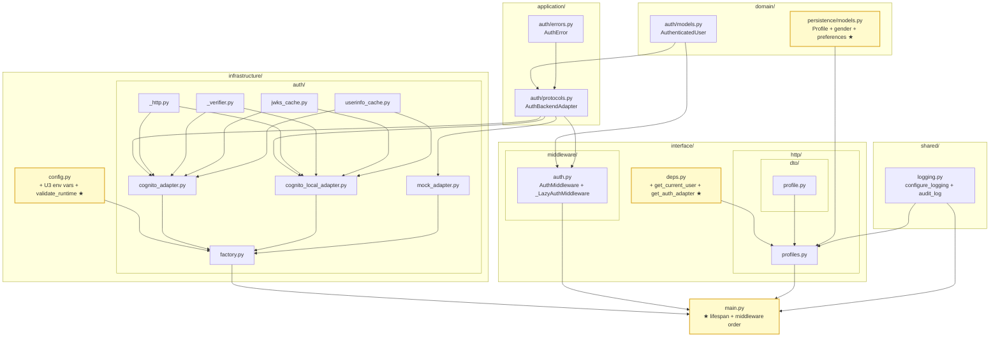

# U3 / auth — Infrastructure Design

**Unit**: U3 / auth
**Phase**: CONSTRUCTION — Infrastructure Design
**Created**: 2026-05-15
**Status**: 🟡 IN REVIEW (light review mode)
**Upstream**: FD (approved + C1 + Imp5 反映済) + NFR Req (approved 13 fixes + I5 反映済) + NFR Design (approved 10 fixes)

---

## 0. 位置付け

NFR Design §12 引き継ぎを基に、U3 が触る実ディレクトリ構造・新規ファイル / 変更ファイル一覧・U1 (CDK) と U2 (apps/api) への遡及修正計画を確定する。Code Generation Plan が直接参照する物理レイアウト仕様。

---

## 1. ディレクトリ構造 (`apps/api/src/yesman_api/`)

U2 で確立した DDD 4-layer (domain / application / infrastructure / interface) に **auth サブモジュール** + **shared** を追加。

```
apps/api/src/yesman_api/
├── domain/
│   ├── persistence/
│   │   └── models.py                          ← (変更) Profile に gender + preferences 追加
│   └── auth/                                   ← (新規) U3
│       ├── __init__.py
│       └── models.py                           ← AuthenticatedUser dataclass
├── application/
│   ├── persistence/
│   │   └── protocols.py                        ← (既存) U2
│   └── auth/                                   ← (新規) U3
│       ├── __init__.py
│       ├── protocols.py                        ← AuthBackendAdapter Protocol
│       └── errors.py                           ← AuthError + DuplicateProfileError
├── infrastructure/
│   ├── config.py                               ← (変更) U3 環境変数 + validate_runtime + app_env に stg 追加
│   ├── persistence/
│   │   ├── engine.py / factory.py / sqlmodel_repositories.py / mock_repositories.py
│   │   └── (既存) U2
│   └── auth/                                   ← (新規) U3
│       ├── __init__.py
│       ├── _http.py                            ← make_http_client + fetch_with_retry + fetch_with_retry_authed
│       ├── _verifier.py                        ← _JwtVerifier + JwtVerifyConfig
│       ├── jwks_cache.py                       ← JwksCache + JwksUnavailable + UnknownKid
│       ├── userinfo_cache.py                   ← UserInfoCache + UserInfo + UserInfoEmailMissing + _coerce_bool
│       ├── cognito_adapter.py                  ← CognitoAuthAdapter
│       ├── cognito_local_adapter.py            ← CognitoLocalAuthAdapter
│       ├── mock_adapter.py                     ← MockAuthAdapter (SPECIAL_TOKENS 3 種)
│       └── factory.py                          ← AuthBackendFactory
├── interface/
│   ├── deps.py                                 ← (変更) get_current_user + get_auth_adapter 追加
│   ├── middleware/                             ← (新規ディレクトリ) U3
│   │   ├── __init__.py
│   │   └── auth.py                             ← AuthMiddleware + _LazyAuthMiddleware
│   └── http/
│       ├── health.py                           ← (既存) U2
│       ├── profiles.py                         ← (新規) GET/PATCH/DELETE /v1/profiles/me
│       └── dto/                                ← (新規ディレクトリ)
│           ├── __init__.py
│           └── profile.py                      ← ProfileResponse + ProfileUpdateRequest + Enum
├── shared/                                     ← (新規ディレクトリ) U3 で新設、U4 以降が再利用
│   ├── __init__.py
│   └── logging.py                              ← configure_logging + get_logger + audit_log
├── main.py                                     ← (変更) lifespan + middleware order + profiles router include
└── alembic/
    └── versions/
        ├── 20260510_0000_0001_initial.py       ← (既存) U2
        ├── 20260510_0001_0002_builtin_personas.py  ← (既存) U2
        └── 20260515_0000_0003_profile_gender_preferences.py  ← (新規) U2 遡及修正
```

### 1.1 新規ディレクトリ (5 個)
- `domain/auth/`
- `application/auth/`
- `infrastructure/auth/`
- `interface/middleware/`
- `interface/http/dto/`
- `shared/`

### 1.2 集計 (ultrathink I2 反映 2026-05-15: ファイル数訂正)

| カテゴリ | 数 | 内訳 |
|---|---|---|
| **新規ファイル** | **21** | domain/auth 2 + application/auth 3 + infrastructure/auth 9 + interface/middleware 2 + interface/http/profiles 1 + interface/http/dto 2 + shared 2 |
| **変更ファイル** | **4** | `domain/persistence/models.py` / `infrastructure/config.py` / `interface/deps.py` / `main.py` |
| **新規 Alembic migration** | **1** | `20260515_0000_0003_profile_gender_preferences.py` |
| **テストファイル新規** | **8** | (後述 §6) — `tests/fixtures/jwt.py` は fixture (生産コード扱い) |
| **総 Python ファイル** | **34** | 本体 25 (新規 21 + 変更 4) + テスト 8 + Alembic 1 |

---

## 2. U2 遡及修正計画

### 2.1 `apps/api/src/yesman_api/domain/persistence/models.py` — Profile 拡張 (ultrathink C1 反映 2026-05-15: PK は user_id)

**Before** (U2 既存、L28-45):
```python
class Profile(SQLModel, table=True):
    __tablename__ = "profiles"

    user_id: UUID = Field(primary_key=True, description="= Cognito sub")
    email: str = Field(max_length=255, unique=True, index=True)
    age_group: str | None = Field(default=None, max_length=20)
    occupation: str | None = Field(default=None, max_length=100)
    value_tags: list[str] = Field(
        default_factory=list,
        sa_column=Column(JSONB, nullable=False, server_default="[]"),
    )
    life_stage: str | None = Field(default=None, max_length=50)
    created_at: datetime = Field(default_factory=_utcnow)
    updated_at: datetime = Field(default_factory=_utcnow)
```

**After** (U3 で 2 カラム追加、age_group / occupation の間と value_tags / life_stage の間に挿入):
```python
class Profile(SQLModel, table=True):
    __tablename__ = "profiles"

    user_id: UUID = Field(primary_key=True, description="= Cognito sub")
    email: str = Field(max_length=255, unique=True, index=True)
    age_group: str | None = Field(default=None, max_length=20)
    gender: list[str] = Field(                                  # U3 追加 (FR-AUTH-02: 性別、複数選択可)
        default_factory=list,
        sa_column=Column(JSONB, nullable=False, server_default="[]"),
    )
    occupation: str | None = Field(default=None, max_length=100)
    value_tags: list[str] = Field(
        default_factory=list,
        sa_column=Column(JSONB, nullable=False, server_default="[]"),
    )
    preferences: dict[str, str] = Field(                        # U3 追加 (FR-AUTH-02: 嗜好)
        default_factory=dict,
        sa_column=Column(JSONB, nullable=False, server_default="{}"),
    )
    life_stage: str | None = Field(default=None, max_length=50)
    created_at: datetime = Field(default_factory=_utcnow)
    updated_at: datetime = Field(default_factory=_utcnow)
```

### 2.2 `apps/api/alembic/versions/20260515_0000_0003_profile_gender_preferences.py` (新規)

```python
"""profile gender + preferences columns

Revision ID: 0003_profile_gender_preferences
Revises: 0002_builtin_personas
Create Date: 2026-05-15

Adds two JSONB columns required for FR-AUTH-02 (gender multi-select, preferences free-form).
Idempotent: ON CONFLICT no-op pattern not needed since columns are new.
"""
from __future__ import annotations

import sqlalchemy as sa
from alembic import op
from sqlalchemy.dialects.postgresql import JSONB

# revision identifiers
revision = "0003_profile_gender_preferences"
down_revision = "0002_builtin_personas"
branch_labels = None
depends_on = None


def upgrade() -> None:
    op.add_column(
        "profiles",
        sa.Column("gender", JSONB(), nullable=False, server_default=sa.text("'[]'::jsonb")),
    )
    op.add_column(
        "profiles",
        sa.Column("preferences", JSONB(), nullable=False, server_default=sa.text("'{}'::jsonb")),
    )


def downgrade() -> None:
    op.drop_column("profiles", "preferences")
    op.drop_column("profiles", "gender")
```

### 2.3 `apps/api/src/yesman_api/infrastructure/config.py` — AppConfig 拡張

NFR Design §9 通り。`app_env` に **`stg` を追加**、U3 環境変数 13 個追加、`validate_runtime()` メソッド追加。

#### 影響範囲
- `tests/conftest.py` の AppConfig fixture (mock_user_sub のデフォルトが変わる) → fixture を更新
- 既存テスト (U2) で `app_env` を hardcode していないか確認 → 確認結果: U2 では `app_env` を参照していないため影響なし
- `mock_user_sub` 旧デフォルト `00000000-...000001` を参照しているテストコードはなし (U2 段階では U3 が未着手)

### 2.4 Mock store 影響 (ultrathink Imp1 反映 2026-05-15: 表現精度化)

`apps/api/src/yesman_api/infrastructure/persistence/mock_repositories.py` の `MockStore` / `MockProfileRepository.upsert` は **`copy.deepcopy(profile)` で SQLModel オブジェクト全体を保存** している (L78)。SQLModel の `default_factory` により新規追加された `gender` / `preferences` フィールドはコンストラクタ呼び出し時に初期化されるため、Mock 実装の修正は不要。

ただし下記確認は必要:
- `tests/conftest.py` の `sample_profile` fixture が **Profile() を直接インスタンス化している場合**は、新フィールドを明示的に渡すか default_factory に任せるかの選択 — U2 段階でどう書かれているか §2.5 で再確認

### 2.5 既存テスト (U2) への追加変更

| ファイル | 変更内容 |
|---|---|
| `tests/property/test_jsonb_roundtrip.py` | Profile `gender` (`st.lists(st.text(max_size=10), max_size=5)`) + `preferences` (`st.dictionaries(st.text(max_size=20), st.text(max_size=100), max_size=10)`) の roundtrip ケース追加 |
| `tests/unit/persistence/test_mock_repositories.py` | sample profile fixture に gender + preferences を含めて 1 ケース追加 |
| `tests/integration/persistence/test_sqlmodel_repositories.py` | Profile create / update で gender + preferences を含む統合テストケース追加 |

---

## 3. U1 (CDK) 遡及修正計画 (ultrathink C3 反映 2026-05-15: 既存環境変数表と U3 差分を分離)

### 3.1 ApiStack 環境変数注入

#### 3.1.1 U1 既存実装 (`infra/lib/stacks/api-stack.ts:235-252` で既に注入済)

```typescript
environment: {
  APP_ENV: 'prod',                                  // ★ hardcoded — U3 で修正
  AUTH_BACKEND: 'cognito',                          // 既存
  STORAGE_BACKEND: 'aurora',                        // 既存
  VOICE_BACKEND: 'aws',                             // 既存
  LLM_PROVIDER: 'bedrock',                          // 既存
  EVENT_BACKEND: 'eventbridge',                     // 既存
  COGNITO_USER_POOL_ID: userPool.userPoolId,        // 既存 (Cross-Stack)
  COGNITO_APP_CLIENT_ID: appClient.userPoolClientId,// 既存 (Cross-Stack)
  COGNITO_REGION: ctx.awsRegion,                    // 既存
  BEDROCK_GUARDRAIL_ID: guardrailId,                // 既存
  BEDROCK_REGION: ctx.awsRegion,                    // 既存
  EVENT_BUS_NAME: this.eventBus.eventBusName,       // 既存
  DECISION_EVENTS_QUEUE_URL: this.decisionEventsQueue.queueUrl, // 既存
  AURORA_HOST: auroraCluster.clusterEndpoint.hostname, // 既存
  AURORA_PORT: cdk.Token.asString(auroraCluster.clusterEndpoint.port), // 既存
  AURORA_DBNAME: 'yesman',                          // 既存
},
```

#### 3.1.2 U3 で追加・修正する変数 (差分のみ)

```typescript
environment: {
  // ★ 修正: 既存 hardcode 'prod' を ctx.envName に置換 (stg / dev / ci 対応)
  APP_ENV: ctx.envName,

  // ★ 新規 (本ステージで追加)
  LOG_LEVEL: ctx.envName === 'prod' ? 'INFO' : 'DEBUG',
  COGNITO_HOSTED_UI_URL: `https://${userPoolDomain.domainName}.auth.${ctx.awsRegion}.amazoncognito.com`,
  JWKS_CACHE_TTL_SECONDS: '3600',
  JWKS_STALE_WHILE_ERROR_SECONDS: '300',
  USERINFO_CACHE_TTL_SECONDS: '300',
  // CORS_ALLOWED_ORIGINS は §3.2 で SSM 経由
  // AUTH_BYPASS_PATHS_EXTRA: 本番は空文字 (= bypass 拡張なし)、明示しない
},
```

#### 3.1.3 ApiStackProps への追加

```typescript
export interface ApiStackProps extends CommonStackProps {
  // 既存: userPool, appClient ...
  userPoolDomain: cognito.IUserPoolDomain;   // ★ U3 追加: COGNITO_HOSTED_UI_URL 生成用
}
```
→ `bin/yesman.ts` で AuthStack の `userPoolDomain` を ApiStack に渡すよう更新。

### 3.2 CORS_ALLOWED_ORIGINS — SSM Parameter Store 経由 (循環参照回避、ultrathink I1 反映)

CloudFront URL は EdgeStack で生成され、EdgeStack は ApiStack に依存 (Origin として ALB を参照)。**ApiStack が EdgeStack の出力を取ると循環参照** が発生するため、SSM Parameter Store を経由する。

#### Step 1 (ブートストラップ): 初回 deploy 前に空 Parameter を CLI で作成

```bash
# 各環境ごとに 1 回だけ実行 (placeholder 値を入れることで CFN deploy エラーを回避)
aws ssm put-parameter \
  --name /yesman/dev/cloudfront-url \
  --type String \
  --value 'https://placeholder.cloudfront.net' \
  --description 'CloudFront URL for CORS — overwritten by EdgeStack deploy'
```

#### Step 2: EdgeStack で CloudFront URL を SSM に上書き

`infra/lib/stacks/edge-stack.ts` に追加:
```typescript
import * as ssm from 'aws-cdk-lib/aws-ssm';

// 既存 distribution 作成後
new ssm.StringParameter(this, 'CloudFrontUrlParam', {
  parameterName: `/yesman/${ctx.envName}/cloudfront-url`,
  stringValue: `https://${this.distribution.distributionDomainName}`,
  description: 'CloudFront URL for CORS_ALLOWED_ORIGINS (used by ApiStack)',
});
```

#### Step 3: ApiStack で SSM Parameter を CDK lookup 経由で取得

`infra/lib/stacks/api-stack.ts`:
```typescript
import * as ssm from 'aws-cdk-lib/aws-ssm';

// ultrathink I1 反映 2026-05-15:
// valueFromLookup は CDK synth 時に SSM を呼んで値を取得し、cdk.context.json にキャッシュ。
// → ApiStack の CFN テンプレート内に固定値として埋め込まれる
//   (= ECS Task は起動時に SSM を読まない = IAM 権限不要)
const cloudfrontUrl = ssm.StringParameter.valueFromLookup(
  this, `/yesman/${ctx.envName}/cloudfront-url`
);

// 既存 environment に CORS_ALLOWED_ORIGINS を追加
environment: {
  ...,
  CORS_ALLOWED_ORIGINS: cloudfrontUrl,
}
```

#### デプロイ順序 (ローテーション含む)

| Step | コマンド | 効果 |
|---|---|---|
| 1 (一回のみ) | `aws ssm put-parameter ... --value placeholder` | 空 Parameter 作成 |
| 2 | `cdk deploy YesmanAuth YesmanData YesmanAi YesmanNetwork` | 基盤構築 |
| 3 | `cdk deploy YesmanApi` | placeholder URL で ECS Task 起動 (CORS は事実上 deny で本番非対応の placeholder) |
| 4 | `cdk deploy YesmanEdge` | CloudFront 作成 + SSM Parameter 上書き |
| 5 | `cdk deploy YesmanApi` (再) | `cdk.context.json` の SSM lookup を再評価して新 URL を ECS Task Definition に反映 |

**運用 RUNBOOK (CORS URL ローテーション時)**:
- SSM Parameter を変更 → ApiStack 再 deploy で反映 (= Step 5 を実行)
- ECS Task の自動再起動は CDK が Task Definition revision 更新により実行

### 3.3 IAM 権限 (ultrathink I3 反映 2026-05-15: 削除)

`valueFromLookup` は **CDK synth 時に値を解決** し CFN テンプレートに固定値として埋め込むため、**ECS Task 起動時に SSM を読まない** → SSM 読み取り IAM 権限は不要 (最小権限原則)。

`apiTaskRole` への SSM 権限追加は **行わない**。CORS URL のローテーションは RUNBOOK の手順で対応 (= ApiStack 再 deploy)。

---

## 4. 環境変数 完全一覧 (U3 完了後の `.env.example`)

`apps/api/.env.example` (新規 / 更新):

```dotenv
# === App ===
APP_ENV=dev
LOG_LEVEL=INFO
APP_VERSION=0.1.0

# === Backend swap (FR-AUTH-05 / FR-HIST-04 / FR-VOICE-01 / FR-AI-01..03) ===
STORAGE_BACKEND=mock              # aurora | docker-postgres | mock
AUTH_BACKEND=mock                 # cognito | cognito-local | mock
LLM_PROVIDER=mock
VOICE_BACKEND=mock
EVENT_BACKEND=sync

# === Database (storage_backend=aurora の場合は parts を、docker-postgres の場合は DATABASE_URL を) ===
DATABASE_URL=sqlite+aiosqlite:///:memory:
# AURORA_HOST=...
# AURORA_PORT=5432
# AURORA_DBNAME=yesman
# DATABASE_USERNAME=yesman
# DATABASE_PASSWORD=...

# === Origin verify (U1) ===
ORIGIN_VERIFY_SECRET=

# === Cognito (auth_backend=cognito 必須) ===
# COGNITO_REGION=ap-northeast-1
# COGNITO_USER_POOL_ID=ap-northeast-1_XXXXXXXXX
# COGNITO_APP_CLIENT_ID=
# COGNITO_HOSTED_UI_URL=https://yesman-prod.auth.ap-northeast-1.amazoncognito.com

# === cognito-local (auth_backend=cognito-local 必須) ===
# COGNITO_LOCAL_ISSUER_URL=http://localhost:9229/local_xxx
# COGNITO_LOCAL_USERINFO_URL=                  # 任意、未設定で ID Token only mode

# === Mock (auth_backend=mock、dev/ci 限定) ===
MOCK_USER_SUB=11111111-1111-1111-1111-111111111111
MOCK_USER_EMAIL=test@yesman.local
MOCK_AUTO_USER=false

# === CORS / Bypass ===
CORS_ALLOWED_ORIGINS=                          # 本番必須、カンマ区切り
AUTH_BYPASS_PATHS_EXTRA=                       # 任意、カンマ区切り

# === JWKS / userInfo cache ===
JWKS_CACHE_TTL_SECONDS=3600
JWKS_STALE_WHILE_ERROR_SECONDS=300
USERINFO_CACHE_TTL_SECONDS=300
```

合計 24 環境変数 (U2 既存 11 + U3 新規 13)。

---

## 5. `pyproject.toml` 依存追加 (U2 ベースから)

`apps/api/pyproject.toml` の `[project.dependencies]` を以下に更新:

```toml
[project]
name = "yesman-api"
version = "0.1.0"
requires-python = ">=3.12"
dependencies = [
    # U2 既存
    "fastapi>=0.115,<0.116",
    "uvicorn[standard]>=0.32,<0.33",
    "sqlmodel>=0.0.22,<0.1",
    "sqlalchemy[asyncio]>=2.0,<2.1",
    "asyncpg>=0.30,<0.31",
    "alembic>=1.14,<1.15",
    "pydantic-settings>=2.6,<2.7",
    "aws-xray-sdk>=2.14,<2.15",
    "boto3>=1.35,<1.36",
    # U3 新規
    "pyjwt[crypto]>=2.9,<3.0",
    "httpx>=0.27,<0.28",
    "structlog>=24.4,<25.0",
    "email-validator>=2.2,<3.0",
    "starlette>=0.40,<0.42",        # _LazyAuthMiddleware の scope["app"] 依存
]

[project.optional-dependencies]
dev = [
    # U2 既存
    "pytest>=8,<9",
    "pytest-asyncio>=0.24,<0.25",
    "pytest-cov>=5,<6",
    "hypothesis>=6,<7",
    "ruff>=0.7,<0.8",
    "mypy>=1.13,<1.14",
    # U3 新規追加なし (ultrathink Imp2 反映 2026-05-15)
    # — JWT モックは本体 pyjwt の RSAAlgorithm.from_jwk + RS256 署名で完結
    # — HTTP モックは本体 httpx の MockTransport で完結 (respx を導入する必要なし)
]
```

---

## 6. テストファイル新規追加 (8 個)

| ファイル | 種別 | 対象 |
|---|---|---|
| `apps/api/tests/fixtures/jwt.py` | fixture | RSA 鍵ペア + JWS 発行ヘルパー + JWKS endpoint MockTransport |
| `apps/api/tests/unit/auth/test_mock_adapter.py` | unit | MockAuthAdapter 特殊トークン 3 種 + 通常パス |
| `apps/api/tests/unit/auth/test_jwt_verifier.py` | unit | `_JwtVerifier` — id/access path + 9 種エラー reason |
| `apps/api/tests/unit/auth/test_jwks_cache.py` | unit | JwksCache — cache hit/miss/TTL/stale-while-error/force_refetch/empty_jwks |
| `apps/api/tests/unit/auth/test_userinfo_cache.py` | unit | UserInfoCache — TTL / per-sub lock / email_verified |
| `apps/api/tests/unit/auth/test_auth_middleware.py` | unit | AuthMiddleware — bypass / 401 + Cache-Control / state.user セット |
| `apps/api/tests/integration/auth/test_profile_lifecycle.py` | integration | Mock JWT + Mock Repo で GET → PATCH → GET → DELETE → GET 404 |
| `apps/api/tests/contract/test_auth_protocol.py` | contract | `@runtime_checkable` + `isinstance()` で 3 Adapter の Protocol 適合検証 |
| `apps/api/tests/property/test_jwt_robustness.py` | PBT | Hypothesis で任意バイト列 → 必ず AuthError (TEST-U3-02) |

合計 9 ファイル (fixture 1 + tests 8)。

### 6.1 `tests/conftest.py` 拡張 (ultrathink I5 反映 2026-05-15: fixture 責務分担を明示)

U2 既存 fixture (`mock_store` / `mock_bundle` / `sample_*` / `pg_factory` / `pg_bundle`) に加えて U3 用:
- `app_config_mock` — `auth_backend="mock"`, `mock_user_sub=UUID("11111111-...")` の AppConfig
- `auth_factory_mock` — AuthBackendFactory(app_config_mock)
- `mock_user` — AuthenticatedUser fixture (sub / email / backend)
- `client_with_mock_auth` — TestClient で AuthMiddleware + MockAuthAdapter を統合 (= middleware まで実体経由)
- `attach_auth_adapter` — **純粋 ASGI test 用の low-level helper** (`scope["app"].state.auth_adapter` を直接セットし、middleware が adapter を解決できない構成を補う、NFR Design I4 由来)

### 6.2 fixture 責務分担 (jwt.py vs attach_auth_adapter)

| fixture / file | 用途 | 想定テスト対象 |
|---|---|---|
| `tests/fixtures/jwt.py` | **本物の JWT を発行** + **JWKS endpoint MockTransport で公開鍵配信** | `test_jwt_verifier.py` / `test_jwks_cache.py` / `test_userinfo_cache.py` (= CognitoAuthAdapter 系で JWT 検証経路を本物相当に通すテスト) |
| `attach_auth_adapter` (conftest) | adapter 実体を `app.state` に直接挿し込み、**JWT 検証を完全 bypass** | `test_auth_middleware.py` / `test_profile_lifecycle.py` (= middleware / handler 単体テストで MockAuthAdapter を使い、Cognito 経路に依存しないテスト) |
| `client_with_mock_auth` (conftest) | TestClient 全体を MockAuthAdapter で稼働させる integration 用 | `test_profile_lifecycle.py` の HTTP レベル統合テスト |

→ 「実 JWT を流すか / Adapter を挿し込むか / TestClient を起動するか」の 3 階層で使い分け。

---

## 7. OpenAPI → TypeScript クライアント生成 (U7c 接続点)

### 7.1 OpenAPI 仕様の保証

`profiles.py` router を `main.py` で include した時点で `/openapi.json` に **3 エンドポイント** (GET/PATCH/DELETE `/v1/profiles/me`) が反映される。U7c が後で OpenAPI から TS 型を生成する想定:

```bash
# U7c 側 (将来) で実行する想定
pnpm dlx openapi-typescript http://localhost:8000/openapi.json -o packages/api-client/src/types.ts
```

### 7.2 U3 段階での確認方法

```bash
cd apps/api
uvicorn yesman_api.main:app --reload --port 8000
# 別ターミナル
curl http://localhost:8000/openapi.json | jq '.paths | keys'
# 期待出力: ["/health", "/v1/profiles/me"]
```

→ Code Generation Phase 完了時の **動作確認手順** として RUNBOOK.md に追記。

---

## 8. ファイル依存グラフ (新規・変更ファイル)



★ = 既存ファイル変更

**凡例** (ultrathink Imp3 反映 2026-05-15):
- グラフのノードは **ファイル単位** で表示。複数クラスを持つファイルは集約表示
- `MID` (`interface/middleware/auth.py`) は **`AuthMiddleware` + `_LazyAuthMiddleware` の 2 クラス** を含む 1 ファイル
- `FAC` (`infrastructure/auth/factory.py`) は **`AuthBackendFactory` + adapter dispatch ロジック** を含む

---

## 9. ローカル開発フロー (U3 完成後)

### 9.1 Mock backend (デフォルト) — ultrathink Imp4 反映: MOCK_AUTO_USER=true 例追加

```bash
cd apps/api
cp .env.example .env
# .env はデフォルトで AUTH_BACKEND=mock, MOCK_AUTO_USER=false
uv pip install -e ".[dev]"        # or pip install
alembic upgrade head              # 0003 まで適用
uvicorn yesman_api.main:app --reload

# 別ターミナル — パターン 1: Authorization ヘッダ明示
curl -H "Authorization: Bearer anything" http://localhost:8000/v1/profiles/me
# → 200 + 空 Profile 自動作成 (user_id=11111111-..., email=test@yesman.local)

# パターン 2: MOCK_AUTO_USER=true で header 省略可
echo 'MOCK_AUTO_USER=true' >> .env
# uvicorn 再起動後
curl http://localhost:8000/v1/profiles/me   # Authorization ヘッダなしでも 200
# → 200 + 同じ mock user で profile 返却

# パターン 3: 特殊トークンで 401 検証
curl -H "Authorization: Bearer mock-expired" http://localhost:8000/v1/profiles/me
# → 401 + {"detail": "authentication required", "reason": "expired"}
```

### 9.2 cognito-local backend

```bash
docker run -p 9229:9229 jagregory/cognito-local
# Cognito-local の REST API で User Pool + User を作成
# .env で AUTH_BACKEND=cognito-local, COGNITO_LOCAL_ISSUER_URL=http://localhost:9229/local_xxx を設定
uvicorn yesman_api.main:app --reload
```

### 9.3 本番 Cognito (デプロイ後)

ECS Task が U1 ApiStack 経由で自動的に COGNITO_* 環境変数を受け取る。手動操作不要。

---

## 10. 引き継ぎ (Code Generation Plan)

Code Generation Phase で確定する事項:

- **Phase 分割**: 想定 Phase A〜I 構成 (ultrathink I4 反映 2026-05-15: main.py は Phase G で完成版を一気に書く)
  - Phase A: shared/logging + 既存ファイル変更 (config.py + models.py + Alembic 0003)。**main.py は U2 の既存のまま** に保持し、ここでは触らない
  - Phase B: domain/auth + application/auth (Protocol + AuthError)
  - Phase C: infrastructure/auth — _http + _verifier + jwks_cache + userinfo_cache
  - Phase D: infrastructure/auth — cognito_adapter + cognito_local_adapter + mock_adapter + factory
  - Phase E: interface/middleware/auth + interface/deps 拡張
  - Phase F: interface/http/dto/profile + interface/http/profiles
  - Phase G: **main.py 完成 (middleware order + lifespan + auth_factory + router include) を 1 コミットで実施** — 中途半端なアプリ起動状態を避ける
  - Phase H: tests (fixtures + unit + integration + contract + property)
  - Phase I: RUNBOOK.md U3 章追記 + .env.example 更新 + pyproject.toml 更新
- **U1 CDK 修正 + U2 遡及修正 + U3 新規実装をすべて 1 PR に集約** (ultrathink Imp5 反映 2026-05-15)。ハッカソンスコープで PR 分離の意義が低く、変更内容の関連性が高い (Profile スキーマ + AppConfig + CDK 環境変数注入は密結合) ため
- **U2 既存テストの修正範囲**: §2.5 通り 3 テストファイル更新
- **動作確認手順**: §9 のローカル開発フロー + §7.2 OpenAPI 確認手順を RUNBOOK に明文化
- **Code Gen Part 1 ファイル**: `aidlc-docs/construction/U3-auth/code/code-generation-plan.md` (Phase A〜I チェックボックス + 詳細ステップ)

---

## 11. 承認チェックリスト

- [x] ディレクトリ構造 (apps/api/src/yesman_api/{domain,application,infrastructure,interface,shared}/auth/) 6 新規ディレクトリ + 既存 4 階層維持
- [x] 新規 21 ファイル + 変更 4 ファイル + 新規 Alembic 1 migration + テスト 8 ファイル (合計 34) — **集計訂正済**
- [x] U2 遡及修正計画 (**Profile PK は user_id (Cognito sub)** + gender + preferences SQLModel + 0003 migration + Mock upsert 自動追従 + 既存 3 テスト更新)
- [x] U2 AppConfig 拡張計画 (stg 追加 + 13 環境変数 + validate_runtime)
- [x] U1 ApiStack 遡及修正計画 (**既存 Cognito 環境変数表 + U3 差分追加表** + APP_ENV hardcoded 修正 + COGNITO_HOSTED_UI_URL/LOG_LEVEL/JWKS_*/USERINFO_* 追加 + SSM `valueFromLookup` 経由 CORS 注入 + **IAM 権限削除** + ブートストラップ手順)
- [x] .env.example 完全版 (24 環境変数)
- [x] pyproject.toml 依存追加 (5 個、**respx 不採用根拠明示**)
- [x] OpenAPI → U7c 接続点
- [x] ファイル依存グラフ (Mermaid) + **凡例**
- [x] ローカル開発フロー 3 パターン (mock + **MOCK_AUTO_USER=true 例 + 特殊トークン 401 例** / cognito-local / 本番)
- [x] Code Generation Plan への引き継ぎ事項 (Phase A〜I、**main.py は Phase G で完成版を一気に書く**、U1+U2+U3 を 1 PR に集約)

### ultrathink レビュー (2026-05-15) 反映済 12 件
- **Critical 3 (U3 上流まで遡及)**:
  - C1: Profile PK は `user_id` (Cognito sub) — FD §5/§6 + Infra §1/§2 で `id` を `user_id` に全置換
  - C2: ProfileRepository は `upsert()` で create/update を兼ねる — FD §5.1/§8.4 + NFR Design §10.2 を `repo.upsert(...)` に書き換え
  - C3: U1 ApiStack に既に Cognito 環境変数注入済 — §3.1 を「U1 既存表 + U3 差分表」に分割 + `APP_ENV: 'prod'` hardcoded → `ctx.envName` 修正 + ApiStackProps に userPoolDomain 追加
- **Important 5**:
  - I1: SSM `valueFromLookup` + ブートストラップ手順明記
  - I2: ファイル集計 19→21 訂正
  - I3: IAM 権限削除 (最小権限原則、`valueFromLookup` は synth 時解決)
  - I4: Phase 分割で main.py を Phase A から外し Phase G に集約
  - I5: テスト fixture 責務分担表 (jwt.py vs attach_auth_adapter vs client_with_mock_auth)
- **Improvements 4**:
  - Imp1: Mock store の `copy.deepcopy` + `default_factory` 動作を正確に記述
  - Imp2: respx 不採用根拠 (本体 httpx の MockTransport + pyjwt で完結)
  - Imp3: Mermaid 凡例で `MID = AuthMiddleware + _LazyAuthMiddleware` の 2 クラス所在を明示
  - Imp4: §9.1 Mock backend に MOCK_AUTO_USER=true + 特殊トークン 401 のローカル動作例追加
