# U4 / decision — Infrastructure Design

**Unit**: U4 / decision
**Phase**: CONSTRUCTION — Infrastructure Design
**Created**: 2026-05-16
**Status**: 🟡 IN REVIEW
**Upstream**: U4 FD (13 fixes) + NFR Req (12 fixes) + NFR Design (11 fixes)

---

## 0. 位置付け

NFR Design §11 引き継ぎを実物理レイアウト仕様に確定。Code Generation Plan が直接参照する。U3 同様、U2/U1 への遡及修正計画も含む。

---

## 1. ディレクトリ構造 (`apps/api/src/yesman_api/`)

```
apps/api/src/yesman_api/
├── domain/
│   ├── persistence/
│   │   ├── models.py                          ← (既存 U2/U3)
│   │   └── constants.py                       ← (新規 U4) SYSTEM_USER_ID
│   ├── auth/                                   ← (既存 U3)
│   └── decision/                               ← (新規 U4)
│       ├── __init__.py
│       ├── models.py                           ← DecisionRequest / ConsensusOutput / PersonaUtterance / SilenceVerdict / StreamEvent
│       ├── silence_guard.py                    ← SilenceGuard (regex + LLM 2 段、SILENCE_KEYWORDS)
│       ├── consensus.py                        ← ConsensusOrchestrator (PROMPT_TEMPLATE 動的 + parse + stream_parse state 3 分離)
│       ├── engine.py                           ← DecisionEngine (run + run_stream + No 再合議 + tee_chunks 統合)
│       ├── nudge.py                            ← NudgeMessageGenerator + NudgeCache
│       ├── scorer.py                           ← AutonomyScorer
│       └── errors.py                           ← DecisionError (reason: str)
├── application/
│   ├── auth/                                   ← (既存 U3)
│   ├── persistence/                            ← (既存 U2)
│   └── decision/                               ← (新規 U4)
│       ├── __init__.py
│       ├── llm_provider.py                     ← LLMProviderAdapter Protocol
│       └── event_publisher.py                  ← EventPublisher Protocol
├── infrastructure/
│   ├── auth/                                   ← (既存 U3)
│   ├── persistence/                            ← (既存 U2)
│   ├── config.py                               ← (変更 U4) 12 環境変数追加 + validate_runtime 3 段
│   └── decision/                               ← (新規 U4)
│       ├── __init__.py
│       ├── llm_providers/
│       │   ├── __init__.py
│       │   ├── bedrock_adapter.py              ← BedrockLLMAdapter (LiteLLM)
│       │   ├── mock_adapter.py                 ← MockLLMProvider (stream_delay 可変)
│       │   └── factory.py                      ← LLMProviderFactory
│       └── event_publishers/
│           ├── __init__.py
│           ├── eventbridge_publisher.py        ← EventBridgePublisher (boto3.Session + asyncio.to_thread)
│           ├── inline_async_publisher.py       ← InlineAsyncPublisher
│           ├── sync_publisher.py               ← SyncPublisher (no-op)
│           └── factory.py                      ← EventPublisherFactory
├── interface/
│   ├── deps.py                                 ← (変更 U4) get_decision_engine / get_llm_provider / get_event_publisher / get_nudge_generator / get_nudge_cache 追加
│   ├── middleware/                             ← (既存 U3)
│   └── http/
│       ├── health.py / profiles.py             ← (既存 U2/U3)
│       ├── decisions.py                        ← (新規 U4) 4 endpoint (request / request/stream / choice / nudge)
│       ├── scores.py                           ← (新規 U4) GET /v1/scores/me
│       └── dto/
│           ├── profile.py                      ← (既存 U3)
│           └── decision.py                     ← (新規 U4) DecisionRequestDTO / DecisionResponse / NudgeResponse / ScoreResponse / ChoiceRequest / ChoiceResponse
├── shared/
│   ├── logging.py                              ← (既存 U3)
│   └── pii_filter.py                           ← (新規 U4) mask_pii + _luhn_valid
├── main.py                                     ← (変更 U4) lifespan で LLMProviderFactory + EventPublisherFactory + NudgeCache 初期化、4 router include
└── alembic/                                    ← (既存 U2/U3)
```

### 1.1 新規ディレクトリ (4 個)
- `domain/decision/`
- `application/decision/`
- `infrastructure/decision/llm_providers/`
- `infrastructure/decision/event_publishers/`

### 1.2 集計

| カテゴリ | 数 |
|---|---|
| **新規 Python (本体)** | 23 (domain/decision 7 + application/decision 3 + infrastructure/decision 9 + interface 4) |
| **変更 Python (本体)** | 3 (`config.py`, `interface/deps.py`, `main.py`) |
| **新規 shared** | 1 (`shared/pii_filter.py`) |
| **新規 constants** | 1 (`domain/persistence/constants.py`) |
| **新規テスト** | 16 (unit 9 + integration 3 + contract 2 + property 3 = 17、`-1` は contract LLM が既存パターン継承) |
| **変更 pyproject.toml** | 1 |
| **変更 RUNBOOK.md** | 1 |
| **変更 CDK (TypeScript)** | 1 (`api-stack.ts`) + 場合により `data-stack.ts` (Secrets Manager `SilenceHashSalt` 追加) |
| **合計** | **約 47 ファイル** (U3 の 37 比 +27%、SSE + LLM + EventBridge の追加機能で増分妥当) |

---

## 2. U2 への遡及確認 (修正不要、確認のみ)

### 2.1 `DecisionRepository.count_no_by_user` の SQL pending 除外
- **NFR Req Imp5 要件**: `total` は `user_choice in {'yes', 'no'}` のみ、`pending` 除外
- **確認対象** (U2 既存):
  - `apps/api/src/yesman_api/infrastructure/persistence/sqlmodel_repositories.py` の SQL クエリ
  - `apps/api/src/yesman_api/infrastructure/persistence/mock_repositories.py` の dict フィルタロジック
- **Code Gen 着手前にチェック**: pending 除外が実装されていない場合は U2 への 1 行 fix が必要 (`WHERE user_choice IN ('yes', 'no')` を SQL に追加)、テスト追加も
- 本 Infrastructure Design では「**Code Gen Phase A の最初に確認 + 必要なら U2 patch**」とタスク化

### 2.2 `SYSTEM_USER_ID` の値整合
- U2 Alembic `0002_builtin_personas.py:26`: `SYSTEM_USER_ID = "00000000-0000-0000-0000-000000000001"`
- U4 `domain/persistence/constants.py` で同じ値を定数化
- **Alembic ファイルへの import 不要** (Alembic は SQL 直接実行)、文字列重複定義を許容、整合性は値の一致で確保

---

## 3. U3 への影響確認 (修正不要)
- U3 の AuthBackendAdapter / AuthenticatedUser / shared/logging を **そのまま利用**
- U3 で確立した `validate_runtime` パターンを U4 が拡張 (3 段追加)
- 修正は config.py の `validate_runtime` メソッド内に追記のみ

---

## 4. U1 (CDK) 遡及修正計画

### 4.1 ApiStack 環境変数追加

`infra/lib/stacks/api-stack.ts` の `environment` ブロック (U3 で既に拡張済) にさらに追加:

```typescript
environment: {
  // U2 既存 + U3 で追加済 ...
  // (LOG_LEVEL, COGNITO_HOSTED_UI_URL, JWKS_*, USERINFO_*, CORS_ALLOWED_ORIGINS, APP_ENV ctx.envName)

  // U4 新規 (12 個)
  LLM_PROVIDER: 'bedrock',          // U2 既存値だが U4 で初めて意味を持つ (LiteLLM 経由 Bedrock)
  BEDROCK_REGION: ctx.awsRegion,
  BEDROCK_MODEL_ID: 'anthropic.claude-3-haiku-20240307-v1:0',
  BEDROCK_GUARDRAIL_ID: guardrailId,        // 既存、U4 で使用開始
  BEDROCK_GUARDRAIL_VERSION: 'DRAFT',
  DECISION_LLM_TIMEOUT_SECONDS: '30.0',
  DECISION_LLM_STREAM_INITIAL_TIMEOUT_SECONDS: '5.0',
  DECISION_LLM_STREAM_TOTAL_TIMEOUT_SECONDS: '120.0',
  DECISION_LLM_RETRY_COUNT: '1',
  NUDGE_GENERATION_ENABLED: 'true',
  NUDGE_CACHE_TTL_SECONDS: '600.0',
  EVENT_BACKEND: 'eventbridge',
  // EVENT_BUS_NAME は既存 (U1 で生成済の this.eventBus.eventBusName)
},
```

### 4.2 Secrets ブロック追加 (SILENCE_HASH_SALT)

```typescript
secrets: {
  // U1/U2 既存: DATABASE_PASSWORD / DATABASE_USERNAME / OPENAI_API_KEY / ANTHROPIC_API_KEY / ORIGIN_VERIFY_SECRET ...

  // U4 新規 (1 個): SILENCE_HASH_SALT
  SILENCE_HASH_SALT: ecs.Secret.fromSecretsManager(silenceHashSaltSecret),
},
```

### 4.3 Secrets Manager `SilenceHashSaltSecret` の生成 (ultrathink I1 反映 2026-05-16)

責務的に **アプリ固有の暗号化キー** であるため **ApiStack 内で生成** (既存 `originVerifySecret` と同パターン)。DataStack はデータ層 Secrets (dbSecret / LLM API keys) に専念。`bin/yesman.ts` への影響なし。

```typescript
// infra/lib/stacks/api-stack.ts (api-stack.ts:55 周辺の originVerifySecret と並べて)
this.silenceHashSaltSecret = new secretsmanager.Secret(this, 'SilenceHashSaltSecret', {
  secretName: `yesman/${ctx.envName}/silence-hash-salt`,
  description: 'Salt for SilenceLog user_input_hash (FR-DM-SILENT / NFR-PRIV-04)',
  generateSecretString: {
    passwordLength: 32,
    excludePunctuation: false,
  },
});
```

ApiStack の `secrets:` ブロックでは `ecs.Secret.fromSecretsManager(this.silenceHashSaltSecret)` を渡せる (同一 Stack 内なので Cross-Stack 不要)。

### 4.4 IAM 権限追加

ApiStack の TaskRole に **EventBridge `events:PutEvents` 権限** が必要 (既存 `bedrockAccessPolicy` は LLM 用):

```typescript
apiTaskRole.addToPolicy(new iam.PolicyStatement({
  actions: ['events:PutEvents'],
  resources: [this.eventBus.eventBusArn],  // ultrathink Imp1 反映: resource を eventBusArn に限定し cross-bus put を構造的に防ぐ (最小権限原則)
}));
```

**注**: U1 で既に EventBridge bus + IAM 権限が付与されている可能性。確認の上、未付与なら追加。

### 4.5 ApiStackProps への追加 (ultrathink I1 反映: silenceHashSaltSecret は ApiStack 内生成のため不要)

ApiStackProps への追加は不要 (Secret を ApiStack 内で生成するため)。`originVerifySecret` と同じ自己生成パターン。

### 4.6 `bin/yesman.ts` 更新

**変更不要** (ultrathink I1 反映)。SilenceHashSaltSecret は ApiStack 内で生成・利用が完結。

---

## 5. `pyproject.toml` 依存追加 (U3 ベースから)

```toml
dependencies = [
    # U2/U3 既存 ...
    "litellm>=1.55,<2.0",     # U4 新規 (Bedrock 抽象化、Guardrails サポートは 1.55+ で安定。ultrathink Imp4 反映)
]
```

dev 依存: 追加なし (`httpx.MockTransport` + `hypothesis` + 既存)。

---

## 6. テストファイル新規 (17 ファイル + fixture)

| ファイル | 種別 | 対象 |
|---|---|---|
| `tests/fixtures/decision.py` | fixture | `decision_request_factory`, `consensus_output_factory`, `silence_verdict_factory`, `mock_llm_provider` |
| `tests/unit/decision/__init__.py` | - | - |
| `tests/unit/decision/test_silence_guard.py` | unit | regex 4 ドメイン + LLM 自己判定 + fail-closed + hash 計算 |
| `tests/unit/decision/test_consensus.py` | unit | **2 クラス構成 (ultrathink I2 反映)**: `TestParse` (完全 XML / 部分 XML / 不正出力 / persona 名 escape) + `TestStreamParse` (chunk 蓄積 + state 3 分離) — 1 ファイルに統合 |
| `tests/unit/decision/test_mock_llm.py` | unit | complete / stream / stream_delay 可変 / chunk_size |
| `tests/unit/decision/test_engine.py` | unit | 沈黙パス / 通常パス / No 再合議 / no_attempt_count = +1 |
| `tests/unit/decision/test_nudge.py` | unit | Yes/No streak 1/2/3+ / cache pending/ready/failed / TTL 切れ / _maybe_evict |
| `tests/unit/decision/test_scorer.py` | unit | total=0 null / pending 除外 / 通常 ratio |
| `tests/unit/decision/test_event_publisher.py` | unit | 3 backend (eventbridge / inline-async / sync) + Yes/No 両方発火 |
| `tests/unit/decision/test_llm_timeout.py` | unit | TEST-U4-14: complete timeout / stream initial timeout / stream total timeout |
| `tests/unit/shared/test_pii_filter.py` | unit | email/phone JP/phone US/CC + Luhn 検証 + non-PII passthrough |
| `tests/integration/decision/__init__.py` | - | - |
| `tests/integration/decision/test_decision_flow.py` | integration | Mock LLM + Mock Repo で E2E (`/request` → `/choice yes` → `/scores/me`) |
| `tests/integration/decision/test_sse_stream.py` | integration | SSE chunk 順序 (start → domain → utterance × N → proposal → complete) + decision_id 事前確定 |
| `tests/integration/decision/test_sse_disconnect.py` | integration | SSE client 切断 → background 永続化を `DecisionRepository.get` で確認 |
| `tests/contract/test_llm_provider_protocol.py` | contract | BedrockLLMAdapter / MockLLMProvider が `LLMProviderAdapter` Protocol を実装 |
| `tests/contract/test_event_publisher_protocol.py` | contract | EventBridgePublisher / InlineAsyncPublisher / SyncPublisher が `EventPublisher` Protocol を実装 |
| `tests/property/test_parser_robustness.py` | PBT | 任意文字列 → ConsensusOrchestrator.parse が `ConsensusOutput` 返却、例外なし |
| `tests/property/test_silence_guard_input.py` | PBT | 任意 user_input → SilenceVerdict 返却、例外なし |
| `tests/property/test_silence_guard_llm_output.py` | PBT | Mock LLM が任意文字列を返す → SilenceVerdict 返却、例外なし |
| `tests/property/test_prompt_size_bound.py` | PBT | 任意 profile + user_input → プロンプト長制約、100k 文字超は API 入口 413 |

---

## 7. 環境変数 完全一覧 (`.env.example`)

`apps/api/.env.example` に追加 (既存 U2/U3 24 個 + U4 12 個 = **36 環境変数**):

```dotenv
# === U4 / decision (12 個) ===
LLM_PROVIDER=mock                    # bedrock | mock
EVENT_BACKEND=sync                   # eventbridge | inline-async | sync (U2 既存値、U4 で意味を持つ)

# Bedrock (LLM_PROVIDER=bedrock 時)
# BEDROCK_REGION=ap-northeast-1
# BEDROCK_MODEL_ID=anthropic.claude-3-haiku-20240307-v1:0
# BEDROCK_GUARDRAIL_ID=
# BEDROCK_GUARDRAIL_VERSION=DRAFT

# Timeout / Retry
DECISION_LLM_TIMEOUT_SECONDS=30.0
DECISION_LLM_STREAM_INITIAL_TIMEOUT_SECONDS=5.0
DECISION_LLM_STREAM_TOTAL_TIMEOUT_SECONDS=120.0
DECISION_LLM_RETRY_COUNT=1

# Nudge
NUDGE_GENERATION_ENABLED=true
NUDGE_CACHE_TTL_SECONDS=600.0

# EventBridge (EVENT_BACKEND=eventbridge 時)
# EVENT_BUS_NAME=

# SilenceLog hash salt (prod 時 Secrets Manager 経由)
# SILENCE_HASH_SALT=

# === 注意 (ultrathink I4 反映): secret 系 (SILENCE_HASH_SALT) は本番では Secrets Manager 経由 ===
# ローカル開発では .env 直書き OK、prod では infra/lib/stacks/api-stack.ts の
# secrets ブロック経由で ECS Task に注入される (環境変数の直書き禁止、SEC-U4-03)
```

---

## 8. ファイル依存グラフ (Mermaid)

```mermaid
graph TD
    subgraph domain[domain/decision/]
        DM[models.py]
        SG[silence_guard.py]
        CO[consensus.py]
        DE[engine.py]
        NU[nudge.py]
        SC[scorer.py]
        DERR[errors.py]
    end

    subgraph domain_persistence[domain/persistence/]
        DPC[constants.py<br/>SYSTEM_USER_ID]
    end

    subgraph app[application/decision/]
        ALP[llm_provider.py<br/>Protocol]
        AEP[event_publisher.py<br/>Protocol]
    end

    subgraph infra[infrastructure/decision/]
        subgraph llm_providers[llm_providers/]
            IBA[bedrock_adapter.py]
            IMA[mock_adapter.py]
            ILF[factory.py]
        end
        subgraph event_publishers[event_publishers/]
            IEB[eventbridge_publisher.py]
            IIA[inline_async_publisher.py]
            ISP[sync_publisher.py]
            IEF[factory.py]
        end
    end

    subgraph cfg[infrastructure/config.py]
        IC[config.py<br/>★ U4 拡張]
    end

    subgraph iface[interface/]
        IDEP[deps.py<br/>★ U4 拡張]
        IHD[http/decisions.py<br/>4 endpoint SSE]
        IHS[http/scores.py]
        IHDD[http/dto/decision.py]
    end

    subgraph shared[shared/]
        SPF[pii_filter.py]
    end

    MAIN[main.py<br/>★ U4 拡張]

    DM --> CO
    DM --> DE
    DM --> SG
    DERR --> SG
    DERR --> DE
    ALP --> SG
    ALP --> CO
    ALP --> DE
    ALP --> NU
    AEP --> DE
    DPC --> CO
    SPF --> DE
    SPF --> NU
    IBA --> ILF
    IMA --> ILF
    ILF --> MAIN
    IEB --> IEF
    IIA --> IEF
    ISP --> IEF
    IEF --> MAIN
    IC --> MAIN
    IC --> ILF
    IC --> IEF
    DE --> IHD
    SC --> IHS
    NU --> IHD
    IHDD --> IHD
    IHDD --> IHS
    IDEP --> IHD
    IDEP --> IHS

    classDef changed fill:#fffacd,stroke:#daa520,stroke-width:2px
    class IC,IDEP,MAIN changed
```



---

## 9. ローカル開発フロー

### 9.1 Mock LLM + Mock Storage (最速)

```bash
cd apps/api
cp .env.example .env  # LLM_PROVIDER=mock, EVENT_BACKEND=sync
uvicorn yesman_api.main:app --port 8000

# 非ストリーミング合議
curl -X POST -H "Authorization: Bearer anything" -H "Content-Type: application/json" \
  -d '{"user_input": "今日のランチを決めて"}' \
  http://localhost:8000/v1/decisions/request
# → 200 + decision_id + Mock の固定 XML proposal

# SSE 合議
curl -N -X POST -H "Authorization: Bearer anything" -H "Content-Type: application/json" \
  -d '{"user_input": "今日のランチを決めて"}' \
  http://localhost:8000/v1/decisions/request/stream
# → event: start / domain / utterance × 3 / proposal / complete

# Yes 採択
DECISION_ID=...  # 上の response から
curl -X POST -H "Authorization: Bearer anything" -H "Content-Type: application/json" \
  -d '{"choice": "yes"}' \
  http://localhost:8000/v1/decisions/$DECISION_ID/choice
# → 200 + nudge_url + 即時返却

# Nudge polling
curl -H "Authorization: Bearer anything" http://localhost:8000/v1/decisions/$DECISION_ID/nudge
# → 200 {"status": "ready", "message": "..."}

# 主体性スコア
curl -H "Authorization: Bearer anything" http://localhost:8000/v1/scores/me
# → 200 {"no_count": 0, "total": 1, "ratio": 0.0, "message": "..."}

# 沈黙ガード (regex 直撃)
curl -X POST -H "Authorization: Bearer anything" -H "Content-Type: application/json" \
  -d '{"user_input": "宗教について教えて"}' \
  http://localhost:8000/v1/decisions/request
# → 200 + silence response
```

### 9.2 Bedrock 接続 (AWS 認証必要)

```bash
export AWS_REGION=ap-northeast-1
export AWS_PROFILE=...  # IAM Role が Bedrock + Guardrails 権限を持つこと
echo 'LLM_PROVIDER=bedrock' >> .env
echo 'BEDROCK_MODEL_ID=anthropic.claude-3-haiku-20240307-v1:0' >> .env
uvicorn yesman_api.main:app --port 8000
# 実 LLM 合議を試す
```

### 9.3 EventBridge ローカル開発 (ultrathink Imp2 反映)
- **`EVENT_BACKEND=sync` (no-op) で開発する** ことを **明示推奨** — U5 / learning が未実装の段階では消費側がないため、イベント発火だけテストする意味が薄い
- U5 完了後は `EVENT_BACKEND=inline-async` (同一プロセス内で消費) で動作確認可能
- LocalStack は U4 未対応、将来オプション

---

## 10. デプロイ順序 (U3 同様)

1. (初回) SSM Parameter ブートストラップ (U3 から継続)
2. `cdk deploy YesmanAuth YesmanData YesmanAi YesmanNetwork`
   - DataStack で SilenceHashSaltSecret を生成 (U4 新規)
3. `cdk deploy YesmanApi`
4. `cdk deploy YesmanEdge`
5. `cdk deploy YesmanApi` (再、SSM/Secrets 反映)
6. `cdk deploy YesmanMonitoring`

---

## 11. 引き継ぎ (Code Generation Plan)

### Phase 分割 (ultrathink I3 反映 2026-05-16: Phase A.0 を明示)

- **Phase A.0 (U2 遡及確認 + 条件付き patch)**:
  - `grep -n "count_no_by_user" apps/api/src/yesman_api/infrastructure/persistence/sqlmodel_repositories.py` で SQL 確認
  - 期待: `WHERE user_choice IN ('yes', 'no')` または `WHERE user_choice != 'pending'` が含まれる
  - **含まれない場合**: U2 SqlModelDecisionRepository.count_no_by_user の SQL に pending 除外条件を追加 + Mock 側も同様 patch + 既存 U2 unit test を 1 ケース追加 (pending の Decision が total に算入されないことを assertion)
  - 結果次第で Phase A の規模が変動
- Phase A: A.0 完了後 + `domain/persistence/constants.py` + `shared/pii_filter.py` + AppConfig 拡張
- Phase B: `domain/decision/models.py` + `domain/decision/errors.py` + `application/decision/llm_provider.py` + `event_publisher.py`
- Phase C: `infrastructure/decision/llm_providers/{bedrock,mock,factory}.py`
- Phase D: `infrastructure/decision/event_publishers/{eventbridge,inline_async,sync,factory}.py`
- Phase E: `domain/decision/silence_guard.py` + `consensus.py` (parse + stream_parse + tee_chunks 統合)
- Phase F: `domain/decision/engine.py` + `nudge.py` + `scorer.py`
- Phase G: `interface/http/dto/decision.py` + `interface/http/decisions.py` + `scores.py` + `interface/deps.py` 拡張
- Phase H: `main.py` 完成版 (lifespan + middleware + router include + LLMProviderFactory + EventPublisherFactory + NudgeCache 初期化)
- Phase I: テスト (17 + fixture) + RUNBOOK + pyproject + CDK 修正 (api-stack のみ、I1 反映で data-stack/bin 変更不要)

### PR 集約方針 (ultrathink I5 反映 2026-05-16)

- **推奨 1 PR (デフォルト)**: 全 47 ファイル + 場合により U2 patch (Phase A.0) + CDK 修正
- **オプション 3 PR 分割案** (PR サイズが大きすぎると判断される場合):
  - **PR1 (基盤)**: `shared/pii_filter` + `domain/persistence/constants` + AppConfig 拡張 + U2 patch (Phase A) + CDK 修正 (api-stack)
  - **PR2 (decision コア)**: `domain/decision/*` + `application/decision/*` + `infrastructure/decision/**` (Phase B-F)
  - **PR3 (interface + テスト)**: `interface/http/decisions.py` + `scores.py` + `dto/decision.py` + `deps.py` + `main.py` + テスト 17 + fixture + RUNBOOK + pyproject (Phase G-I)
- Code Gen Phase で実装者が PR サイズを見て判断、初手はデフォルト 1 PR を試行

### 動作確認手順
- §9 の Mock backend で 6 種の curl 動作
- pytest 全実行 (Unit 9 + Integration 3 + Contract 2 + PBT 3 = 17 + 既存 U2/U3)
- `cdk synth` 成功

---

## 12. 承認チェックリスト

- [x] ディレクトリ構造 (4 新規ディレクトリ + 既存 U2/U3 上に追加)
- [x] 新規 23 + 変更 3 + shared/constants 2 + テスト 16 + fixture 1 + ドキュメント 2 + CDK 1 = **約 47 ファイル**
- [x] U2 遡及確認計画 (`count_no_by_user` pending 除外を **Phase A.0** で確認 + 条件付き patch)
- [x] U3 への影響なし (`validate_runtime` メソッド追記のみ)
- [x] U1 CDK 修正計画 (**api-stack のみ**: environment + SilenceHashSaltSecret 内部生成 + secrets ブロック + IAM events:PutEvents 最小権限。data-stack / bin 変更不要)
- [x] .env.example (36 環境変数、U4 で 12 個追加、secret 系の注釈付き)
- [x] pyproject.toml (litellm>=1.55 1 個追加)
- [x] テスト 16 + fixture 1 (test_consensus.py 1 ファイル統合)
- [x] ファイル依存グラフ (Mermaid、subgraph 階層化)
- [x] ローカル開発フロー 6 curl パターン + EVENT_BACKEND=sync 推奨明示
- [x] デプロイ順序 (U3 継承、I1 反映で DataStack 影響なし)
- [x] Code Generation Plan への引き継ぎ (Phase A.0 明示 + A〜I 9 Phase + 1 PR 推奨 + 3 PR 分割オプション)

### ultrathink レビュー (2026-05-16) 反映済 9 件
- **Important 5**:
  - I1: SilenceHashSaltSecret を ApiStack 内生成 (DataStack 影響なし、bin 変更不要)
  - I2: test_consensus.py 1 ファイル統合 (TestParse + TestStreamParse の 2 クラス)
  - I3: Phase A.0 (U2 patch 確認) を明示
  - I4: .env.example に secret 系の注釈追加
  - I5: PR 分割オプション 3 案を明示 (推奨は 1 PR)
- **Improvements 4**:
  - Imp1: IAM events:PutEvents の resource を eventBusArn に限定 (最小権限明示)
  - Imp2: §9.3 EVENT_BACKEND=sync 推奨、LocalStack は将来オプション
  - Imp3: Mermaid を subgraph 階層化 (llm_providers + event_publishers をネスト)
  - Imp4: litellm 版を >=1.55 に厳格化 (Guardrails サポート)
