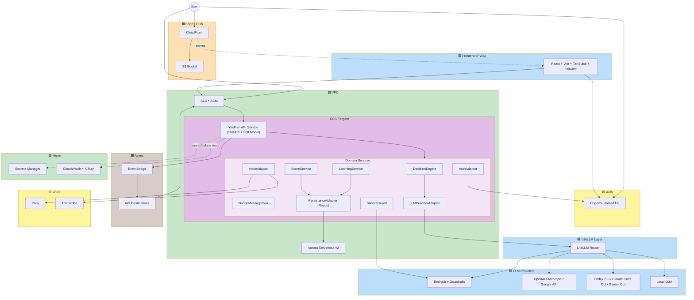

# Application Design - YesMan 統合俯瞰

**プロジェクト**: YesMan
**作成日**: 2026-05-09
**Phase**: Application Design (Consolidated)

本書は Application Design 段階で生成された 5 ドキュメントを統合した俯瞰ビュー。詳細は各専門ドキュメントを参照。

- [components.md](components.md) — コンポーネント定義と責務
- [component-methods.md](component-methods.md) — メソッドシグネチャと入出力
- [services.md](services.md) — サービス層・オーケストレーション
- [component-dependency.md](component-dependency.md) — 依存マトリクスとデータフロー
- [ui-mockups.md](ui-mockups.md) — **UI ローファイ・ワイヤフレーム + デザインシステム方向性** (2026-05-09 追加)

---

## 1. 設計方針サマリ

### 1.1 確定した技術選択（Application Design Plan + Clarification より）

| 領域 | 採用 |
|---|---|
| バックエンド | **Python 3.12 + FastAPI**（コンテナ） |
| 実行環境 | **ECS Fargate** + ALB + ACM (HTTPS) |
| フロントエンド | **React + Vite + TanStack Router + Tailwind**（PWA） |
| 配信 | **CloudFront + S3** |
| API 様式 | **REST + OpenAPI** (FastAPI 自動生成) |
| データベース (本番) | **Aurora Serverless v2 (PostgreSQL)** |
| データベース (ローカル) | **Docker Compose の PostgreSQL** |
| ORM | **SQLModel** (SQLAlchemy + Pydantic) |
| マイグレーション | **Alembic** |
| 認証 | **Amazon Cognito (Hosted UI)** |
| LLM 抽象化 | **DecisionEngine + Strategy パターン** (LiteLLM 経由) |
| LLM プロバイダー | Bedrock / OpenAI / Anthropic / Google / **ローカル LLM / Codex CLI / Claude Code CLI / Gemini CLI** |
| 沈黙ガード | **プロンプト自己判定 + Bedrock Guardrails** (本番のみ二重化) |
| 非同期 | **EventBridge → API Destinations → ECS HTTP** (`/internal/events/decision-confirmed`) |
| 観測性 | **CloudWatch Logs / Metrics + X-Ray** |
| ネットワーク | **新規 VPC** (Public/Private + NAT Gateway) |
| モノレポ | **pnpm + Turborepo**（フロント / バック / IaC） |
| 切替パターン | **Strategy + DI** (FastAPI 起動時に環境変数で実装を選択して注入) |
| IaC | **AWS CDK (TypeScript)** |

### 1.2 重要な設計原則

1. **Single-Prompt 合議** (FR-AI-08): 複数人格は 1 プロンプト内で振る舞わせる。Lambda オーケストレーションは行わない。
2. **AI 生成可変メッセージ** (FR-NUDGE-01〜03): すべての再考メッセージ・段階的マイクロコピーは固定文を持たず、毎回 AI 生成。
3. **Strategy + DI** で全バックエンドを切替可能 (FR-AUTH-05 / FR-HIST-04 / FR-VOICE-01)。
4. **沈黙演出ガード二重化** (FR-AI-06): プロンプト自己判定 + Bedrock Guardrails（本番のみ）。
5. **嗜好プロファイル更新は非同期** (FR-LEARN-07): 提案レイテンシに影響を与えない。
6. **Repository パターン** で Aurora/MOCK/Docker PostgreSQL を同一インターフェースで切替可能。
7. **Fat Service / Thin Route**: FastAPI ルートは検証・呼び出しのみ、ロジックは Service 層。
8. **SSE ストリーミング + バックエンド完了保証** (FR-CV-08, 09, 12): 合議は LiteLLM `stream=True` で chunk 配信、SSE 切断と独立に `decisions.persona_outputs` への永続化を完了させる。CLI 系プロバイダーは完了後一括にフォールバック。

---

## 2. システム全体俯瞰図

---

## 3. 主要ユーザーフローの統合（参考）

### Journey B: コア決定ループ

1. ユーザーが PWA で入力（テキスト or 音声）
2. WebApp → ALB → API Service (`POST /v1/decisions/request`)
3. **AuthService.verify_token** → **LearningService.get_profile**（嗜好プロファイル取得）
4. **DecisionEngine.request_decision** → **ConsensusOrchestrator.build_consensus_prompt**
5. **LLMProviderAdapter.complete** → LiteLLM → 選択中プロバイダー（Bedrock / OpenAI / CLI / ローカル）
6. **SilenceGuard.is_silent_domain_via_prompt** → 必要に応じて **Bedrock Guardrails**
7. **DecisionRepository.insert** (Aurora、status=pending)
8. WebApp に **DecisionProposal** を返却 → UI でスワイプ Yes/No 表示

→ Yes 確定後、**EventBridge 発火** → 非同期で **LearningService.update_profile_from_decision** が嗜好プロファイル更新

詳細は [services.md](services.md#21-コア決定ループ-journey-b) と [component-dependency.md](component-dependency.md#22-コア決定ループ--yes-確定-journey-b--journey-e-非同期) を参照。

### Journey D: 沈黙演出

1. 沈黙ドメイン入力 → DecisionEngine
2. プロンプト内自己判定 (silence: true) → SilenceGuard
3. 本番では Bedrock Guardrails でも遮断
4. SilenceResponse 返却 → WebApp で「…」演出

### Journey F: 設定切替

- FastAPI 起動時に環境変数 (`AUTH_BACKEND` / `STORAGE_BACKEND` / `LLM_PROVIDER` / `VOICE_BACKEND`) を読み、`make_*_adapter(env)` で実装を選択して DI 注入
- 開発時は `STORAGE_BACKEND=docker-postgres` + `AUTH_BACKEND=mock` + `LLM_PROVIDER=local-llm` で AWS リソースなしに完全動作

---

## 4. 拡張機能との整合

### 4.1 Security Baseline (Enabled)
- TLS 1.2+ (ALB、Aurora 接続、外部 API)
- Cognito 認証必須（沈黙演出ドメイン含むすべての公開エンドポイント）
- Aurora は Private Subnet、Secrets Manager で認証情報管理
- LLM 送信前 PII フィルタ (NFR-SEC-05)
- Bedrock Guardrails 二重化
- 入力バリデーション (FastAPI/Pydantic)
- レート制限 (ALB or API Service ミドルウェア)

### 4.2 Property-Based Testing (Enabled)
- スワイプジェスチャー判定（FR-UX-02）
- 主体性スコア計算（FR-SCORE-01: 0 ≤ no_count ≤ total）
- LLM レスポンスのパース (ConsensusOrchestrator.parse_consensus_response)
- 嗜好プロファイル更新ロジック（マージ・冪等性）
- DB Repository のシリアライズ・デシリアライズ往復

---

## 5. 要件カバレッジ

| 要件 | 対応コンポーネント |
|---|---|
| FR-DM-SILENT (沈黙演出 4 ドメイン) | SilenceGuard + Bedrock Guardrails |
| FR-AI-01〜08 (合議 / 切替 / 沈黙応答) | DecisionEngine + ConsensusOrchestrator + LLMProviderAdapter |
| FR-CV-01〜12 (合議の透明性・リアルタイム表示・議論履歴) | DiscussionStreamer + DiscussionService + LiveDiscussionView + DiscussionHistoryView + ConsensusOrchestrator (parse_streaming_chunk) + LLMProviderAdapter (complete_stream) |
| FR-PERSONA-01〜12 (ペルソナ・カタログ・共有) | PersonaCatalogService + PersonaModerator + PersonaRepository + PersonaReportRepository |
| FR-UX-01〜06 (PWA / スワイプ / 直接入力) | WebApp |
| FR-NUDGE-01〜05 (AI 生成可変メッセージ) | NudgeMessageGenerator |
| FR-NO-01〜03 (No 連打体験) | DecisionService.handle_no |
| FR-SCORE-01〜04 (主体性スコア / 委任度の可視化) | AutonomyScorer + NudgeMessageGenerator |
| FR-AUTH-01〜07 (Cognito + 切替) | AuthAdapter + Cognito User Pool |
| FR-HIST-01〜06 (永続化 + 切替) | DecisionRepository + PreferenceProfileRepository |
| FR-LEARN-01〜07 (嗜好学習) | LearningService + PreferenceProfileBuilder + EventBridge |
| FR-VOICE-01〜04 (音声切替) | VoiceAdapter (BE) + Web Speech API (FE) |
| NFR-SEC | Cognito + Secrets Manager + TLS + PII filter + Guardrails |
| NFR-PRIV-01〜04 (倫理免責 + 沈黙ドメイン) | WebApp 起動演出 + SilenceGuard |
| NFR-AVAIL-03 (LLM フォールバック) | LiteLLM Router |
| NFR-EXT-01〜05 (拡張性) | Strategy + DI + Repository パターン |
| NFR-PERF-02 (提案 < 5s) | Single-Prompt 合議で LLM 呼び出し最小化 |

---

## 6. Construction Phase への引き継ぎ事項

Construction Phase は Units Generation で **12 ユニット** (U1〜U7d + U-Persona + U-Test) に分解後、各ユニットで Functional Design / NFR Requirements / NFR Design / Infrastructure Design / Code Generation を per-unit で実行。U-Persona は 2026-05-09 の FR-PERSONA 追加で新設。

本 Application Design で**未確定**の事項（次フェーズで決定）:

- 各 Repository 内の **SQL クエリ構造**（インデックス・JSONB 利用方針含む）
- **Pydantic モデル**の正確なフィールド型・バリデーション
- **PromptTemplate** の最終文面と人格定義
- **嗜好プロファイル更新ロジック**の重み付け・マージアルゴリズム
- **AlembicマイグレーションスクリプトSQL**
- **CDK Stack 構成**（リソース命名、IAM ポリシー詳細、コスト最適化）
- **エラー境界・リトライポリシー**の具体値（タイムアウト・バックオフ）
- **API Destinations の認証方式**（Bearer Token シークレット運用）
- **VPC Endpoints** の利用判断（コスト次第で Bedrock/S3 用 Endpoint）

これらは Functional Design / NFR Design / Infrastructure Design で per-unit に詰めていく。

---

## 7. 既存ドキュメントへの反映予定（Application Design 完了後）

本設計の決定により、以下のドキュメントに不整合がある。Application Design 承認後に **次の修正タスク**として整合させる:

### `requirements.md`
- **Section 5 (AWS サービス構成表)**: Lambda + DynamoDB → ECS Fargate + Aurora Serverless v2 に置換
- **FR-HIST-04**: DynamoDB / MOCK / DynamoDB Local → Aurora Serverless v2 / MOCK / Docker PostgreSQL に置換
- **FR-AUTH-07 / FR-HIST-06**: 設定ファイル例の追記更新（`AUTH_BACKEND`, `STORAGE_BACKEND` 等の環境変数）
- **受け入れ基準 #10**: 永続化バックエンドの記述を Aurora ベースに更新
- **Section 9 (スコープ外)**: 「マルチリージョン」記述はそのまま OK

### `execution-plan.md`
- **Section 1.2 Change Impact Assessment**: DynamoDB 表記 → Aurora に更新
- **Section 1.4**: 技術的論点を更新（コンテナ・Aurora 化を反映）
- **Section 5 (AWS 構成)**: 推奨サービスを ECS Fargate + Aurora に更新
- **Section 4 (推奨ユニット表)**: U1 (Infrastructure)、U2 (Storage & History) の説明を Aurora 前提に更新
