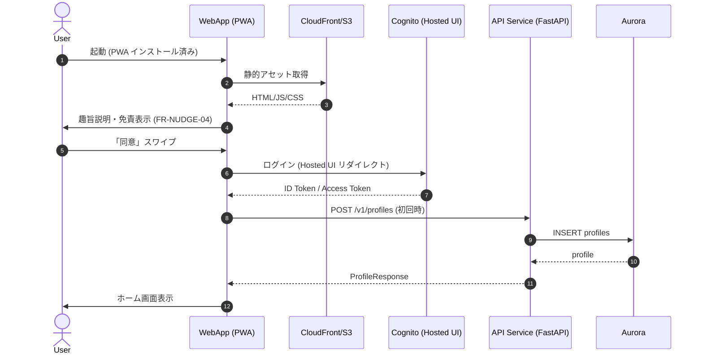
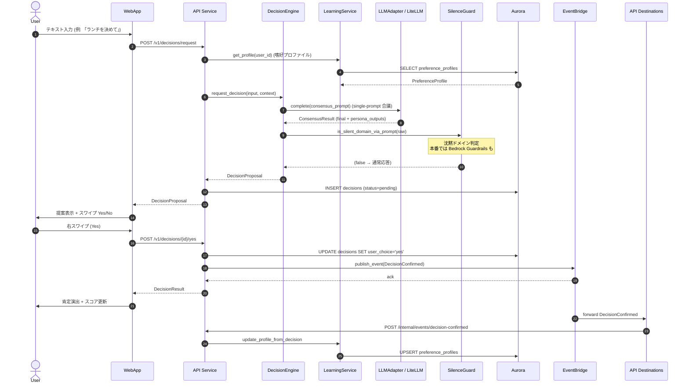
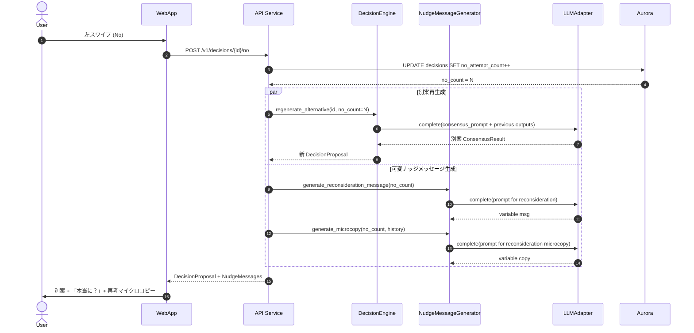
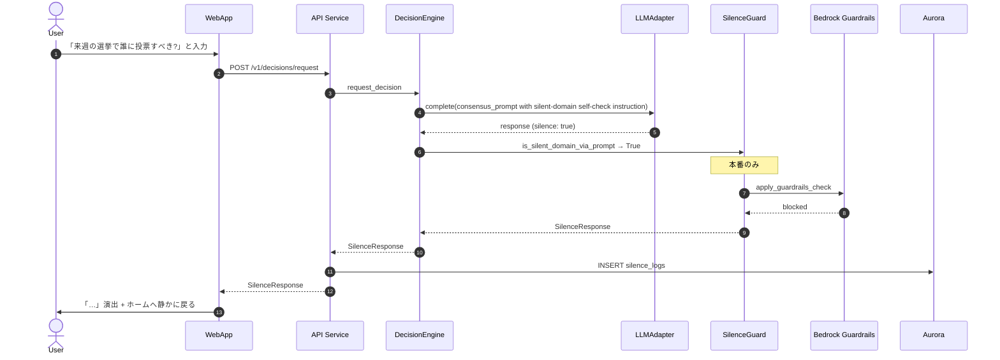
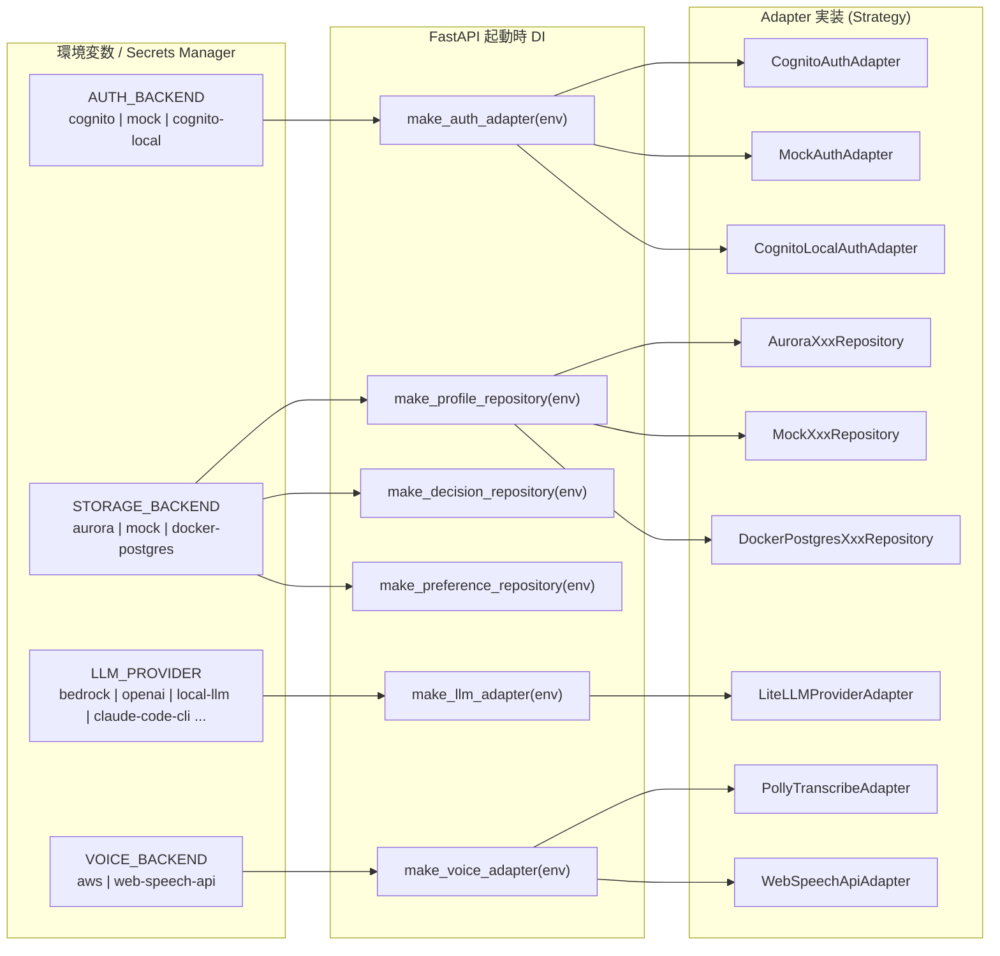
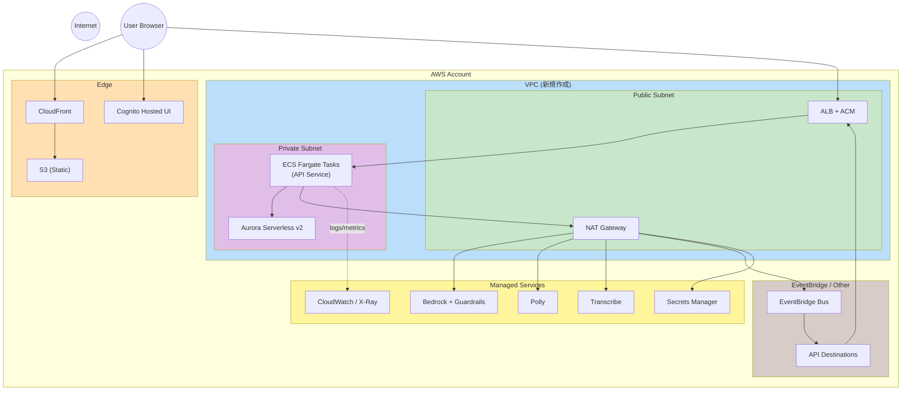

# Component Dependency - YesMan アプリケーション設計

**プロジェクト**: YesMan
**作成日**: 2026-05-09

依存マトリクス、通信パターン、データフロー図を示す。コンポーネントは [components.md](components.md)、サービスオーケストレーションは [services.md](services.md) を参照。

---

## 1. 依存マトリクス

行 = 呼び出し元、列 = 呼び出し先。`→` は同期呼び出し、`⇢` は非同期、`⊨` は DI 依存。

|  | WebApp | Cognito | ALB | API Service | DecisionEngine | LearningSvc | ScoreSvc | VoiceAdapter | LLMAdapter | LiteLLM | Bedrock | Polly/Trans | Aurora | EventBridge | SecretsMgr | CloudWatch |
|---|:---:|:---:|:---:|:---:|:---:|:---:|:---:|:---:|:---:|:---:|:---:|:---:|:---:|:---:|:---:|:---:|
| **WebApp** | — | → | → | (via ALB) | | | | (FE: Web Speech) | | | | | | | | |
| **ALB** | | | — | → | | | | | | | | | | | | |
| **API Service** | | (verify token) | | — | ⊨ | ⊨ | ⊨ | ⊨ | ⊨ | | | | (via Repo) | → (publish) | → (read) | ⇢ (logs/metrics/traces) |
| **DecisionEngine** | | | | | — | (read profile) | | | → | | | | (via Repo) | | | |
| **LearningService** | | | | | | — | | | | | | | (via Repo) | | | |
| **ScoreService** | | | | | | | — | | | | | | (via Repo) | | | |
| **VoiceAdapter (BE)** | | | | | | | | — | | | | → | | | | |
| **LLMAdapter** | | | | | | | | | — | → | | | | | (read API key) | |
| **LiteLLM** | | | | | | | | | | — | → | | | | | |
| **EventBridge** | | | → (API Destinations) | | | | | | | | | | | — | | |
| **API Destinations** | | | → (POST /internal/events/*) | | | | | | | | | | | | | |

---

## 2. データフロー図 (Mermaid)

### 2.1 起動 → 認証 → ホーム到達 (Journey A)

### 2.2 コア決定ループ + Yes 確定 (Journey B + Journey E 非同期)

### 2.3 No 連打体験 (Journey C)

### 2.4 沈黙演出 (Journey D)

### 2.5 設定切替 (Journey F / DI 起動時)

---

## 3. 通信パターン一覧

| 経路 | プロトコル | 認証 |
|---|---|---|
| WebApp ↔ Cognito | HTTPS (OAuth2 PKCE) | — |
| WebApp ↔ ALB ↔ API Service | HTTPS (REST + OpenAPI) | Cognito Bearer Token |
| API Service ↔ Aurora | TCP/TLS (libpq) | IAM 認証 or Secrets Manager DB credentials |
| API Service ↔ LiteLLM ↔ Bedrock | HTTPS (AWS SigV4) | IAM Role for Task |
| API Service ↔ LiteLLM ↔ OpenAI/Anthropic/Google | HTTPS | API Key (Secrets Manager) |
| API Service ↔ LiteLLM ↔ Codex CLI / Claude Code CLI / Gemini CLI | サブプロセス起動 | (CLI 内部認証) |
| API Service ↔ LiteLLM ↔ ローカル LLM | HTTP (Ollama 等) | (ローカル) |
| API Service ↔ Polly / Transcribe | HTTPS (AWS SigV4) | IAM Role for Task |
| API Service → EventBridge | HTTPS (AWS SigV4) | IAM Role for Task |
| EventBridge → API Destinations → ALB → API Service | HTTPS (Event 配信) | API Destination 認証 (Secrets Manager) |

---

## 4. ネットワーク・セキュリティ境界

セキュリティ要点:
- **Aurora は Private Subnet 内**、外部から直接アクセス不可
- **ECS Tasks は Private Subnet**、外部 (Bedrock/Polly等) アクセスは NAT Gateway 経由
- **ALB のみ Public Subnet** で HTTPS 受け
- **API Destinations** は Public な HTTPS エンドポイント (ALB) 経由で API Service の `/internal/events/*` にイベント配送（Secrets Manager で発行する Bearer Token で認証）
- **Cognito Hosted UI** は別ドメインで運用 (CloudFront 経由でカスタムドメインに統合可能)

---

## 5. 起動順序の依存

| 順 | コンポーネント | 依存 |
|---|---|---|
| 1 | VPC + サブネット + NAT | — |
| 2 | Aurora Cluster | VPC |
| 3 | ECS Cluster + Task Definition | VPC + ECR |
| 4 | ALB + ACM 証明書 | VPC |
| 5 | ECS Service (API Service コンテナ起動) | Aurora migrate 完了 + Secrets Manager + Cognito User Pool |
| 6 | EventBridge + API Destinations | API Service が起動済み |
| 7 | CloudFront + S3 (フロント配信) | (独立、並列可能) |
| 8 | Cognito User Pool | (独立、並列可能) |

CDK は依存順を自動解決するため、上記は手動オペレーションではなく `cdk deploy` 内の依存ツリーが反映する。
