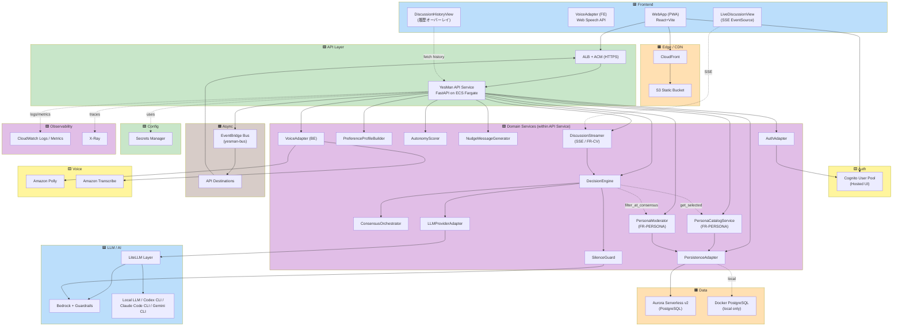

# Components - YesMan アプリケーション設計

**プロジェクト**: YesMan
**作成日**: 2026-05-09
**Phase**: Application Design - Part 2

主要コンポーネントの責務と境界を定義する。詳細なメソッドは [component-methods.md](component-methods.md)、サービスオーケストレーションは [services.md](services.md)、依存関係は [component-dependency.md](component-dependency.md) を参照。

---

## 1. コンポーネント分類

### 🟦 フロントエンド層
| Component | 種別 | 採用技術 |
|---|---|---|
| **WebApp (PWA)** | クライアント | React + Vite + TanStack Router + Tailwind |
| **VoiceAdapter (FE)** | クライアント | Web Speech API ラッパ |
| **LiveDiscussionView** | UI コンポーネント | React + EventSource (SSE クライアント) — 合議中の人格発言をリアルタイム描画 (FR-CV-01〜04) |
| **DiscussionHistoryView** | UI コンポーネント | React オーバーレイ — 過去の `decisions.persona_outputs` から議論を時系列復元 (FR-CV-05〜07) |

### 🟧 配信・エッジ層
| Component | 種別 | 採用技術 |
|---|---|---|
| **CloudFront Distribution** | CDN | AWS CloudFront |
| **S3 Static Bucket** | ストレージ | AWS S3 |

### 🟨 認証層
| Component | 種別 | 採用技術 |
|---|---|---|
| **Cognito User Pool** | IDP | Amazon Cognito (Hosted UI) |

### 🟩 API 層
| Component | 種別 | 採用技術 |
|---|---|---|
| **ALB (HTTPS)** | ロードバランサ | Application Load Balancer + ACM |
| **YesMan API Service** | サーバー (コンテナ) | Python 3.12 + FastAPI on ECS Fargate |

### 🟪 ドメインサービス層 (API Service 内モジュール)
| Component | 責務 |
|---|---|
| **DecisionEngine** | 合議プロンプト構築・LLM 呼び出し・沈黙ガード判定 / SSE ストリーミング配信 (FR-CV-08, FR-CV-12 のフォールバック) |
| **ConsensusOrchestrator** | 単一プロンプト内の複数人格を含むテンプレ管理 / 人格別発言タグ付け (FR-CV-03 でのアバター紐付けに利用) |
| **DiscussionStreamer** | SSE エンドポイント実装 (`POST /v1/decisions/request/stream`) / LiteLLM `stream=True` を chunk 単位で配信 / 完了時に `decisions.persona_outputs` へ永続化 (FR-CV-01, 02, 06, 09) |
| **SilenceGuard** | 沈黙演出ドメインの自己判定（プロンプト戦略） |
| **PreferenceProfileBuilder** | Yes/No 履歴から嗜好プロファイル構築・更新 |
| **AutonomyScorer** | 主体性スコア計算（No 比率） |
| **NudgeMessageGenerator** | AI 生成可変メッセージ（再考メッセージ・段階的マイクロコピー） |
| **PersonaCatalogService** | ペルソナの CRUD、共有プールへの公開・解除、共有プール閲覧（FR-PERSONA-01〜07, 09） |
| **PersonaModerator** | ペルソナのプロンプト検査（沈黙ドメイン誘発検知、FR-PERSONA-11）、悪用報告の受付・集計（FR-PERSONA-08） |
| **AuthAdapter** | Cognito / MOCK / cognito-local の Strategy 切替 |
| **PersistenceAdapter** | Aurora / MOCK / Docker PostgreSQL の Strategy 切替 |
| **VoiceAdapter (BE)** | Polly+Transcribe / Web Speech API の Strategy 切替（BE 用） |
| **LLMProviderAdapter** | LiteLLM 経由の各プロバイダー切替（Bedrock / OpenAI / Anthropic / Google / Codex CLI / Claude Code CLI / Gemini CLI / ローカル LLM） |

### 🟦 LLM / AI 層
| Component | 種別 | 採用技術 |
|---|---|---|
| **LiteLLM Layer** | LLM 抽象化 | Python 内 SDK |
| **Bedrock Guardrails** | コンテンツガード | Amazon Bedrock Guardrails (本番のみ) |

### 🟫 非同期処理層
| Component | 種別 | 採用技術 |
|---|---|---|
| **EventBridge Bus** | イベントバス | Amazon EventBridge (`yesman-bus`) |
| **API Destinations** | HTTPS 配信先 | EventBridge API Destinations → ALB エンドポイント |

### 🟧 データ層
| Component | 種別 | 採用技術 |
|---|---|---|
| **Aurora PostgreSQL Cluster** | RDB | Aurora Serverless v2 |
| **Docker PostgreSQL** | RDB (ローカル) | postgres:16 image |

### 🟨 音声層
| Component | 種別 | 採用技術 |
|---|---|---|
| **Polly Service** | TTS | Amazon Polly |
| **Transcribe Service** | STT | Amazon Transcribe |
| **Web Speech API** | TTS+STT (FE側) | ブラウザ標準 |

### 🟩 シークレット・設定層
| Component | 種別 | 採用技術 |
|---|---|---|
| **Secrets Manager** | シークレット | AWS Secrets Manager (LLM API キー、DB 認証情報) |
| **Parameter Store** | 設定 | AWS Systems Manager Parameter Store (任意) |

### 🟪 観測性層
| Component | 種別 | 採用技術 |
|---|---|---|
| **CloudWatch Logs** | ログ | CloudWatch Logs (FastAPI からの構造化 JSON) |
| **CloudWatch Metrics** | メトリクス | CloudWatch Metrics |
| **X-Ray** | トレース | AWS X-Ray (FastAPI ミドルウェア + AWS SDK 統合) |

---

## 2. インフラ・運用層

| Component | 種別 | 採用技術 |
|---|---|---|
| **VPC** | ネットワーク | 新規作成（Public/Private サブネット、NAT Gateway） |
| **CDK Stack** | IaC | AWS CDK (TypeScript) |
| **ECR Repository** | コンテナレジストリ | Amazon ECR |
| **ECS Cluster** | コンテナオーケストレータ | ECS Fargate |
| **ECS Service** | サービス | YesMan API Service |
| **Application Load Balancer** | LB | ALB + ACM 証明書 |

---

## 3. コンポーネント責務マトリクス（要約）

| Component | 主な責務 | 主な要件 ID |
|---|---|---|
| WebApp (PWA) | スワイプ UX、起動時免責、入力 (テキスト/音声)、スコアダッシュボード | FR-UX-01〜06, FR-NUDGE-04, NFR-UX |
| LiveDiscussionView | 合議の発言を SSE 受信して人格別に逐次描画 / 完了で最終提案カードへ切替 | FR-CV-01〜04, FR-CV-08 |
| DiscussionHistoryView | 過去決定の `decisions.persona_outputs` から議論をオーバーレイ復元 / エクスポート連携 | FR-CV-05〜07, FR-CV-10〜11 |
| Cognito User Pool | ユーザー認証、Hosted UI | FR-AUTH-01, NFR-SEC-02 |
| YesMan API Service | API エンドポイント受け、ドメインサービス統合 | FR-AI, FR-LEARN, FR-HIST など全般 |
| DecisionEngine | 合議による意思決定生成 | FR-AI-07, FR-AI-08 |
| DiscussionStreamer | SSE 配信 / LiteLLM `stream=True` / 切断時も `decisions` 完了保存 / CLI 系は完了後一括 | FR-CV-01, 02, 06, 09, 12 |
| SilenceGuard | 沈黙ドメインの判定・拒否 | FR-DM-SILENT, FR-AI-06, NFR-PRIV-04 |
| PreferenceProfileBuilder | 嗜好プロファイル蓄積・更新 | FR-LEARN-01, FR-LEARN-03, FR-LEARN-07 |
| AutonomyScorer | 主体性スコア計算 | FR-SCORE-01〜04 |
| NudgeMessageGenerator | AI 生成可変メッセージ | FR-NUDGE-01〜03, FR-NUDGE-05 |
| PersonaCatalogService | ペルソナ CRUD / 共有公開・解除 / 共有プール閲覧・選択 | FR-PERSONA-01〜07, 09, 10 |
| PersonaModerator | プロンプト検査 (沈黙ドメイン誘発検知) / 悪用報告受付 | FR-PERSONA-08, 11, NFR-PRIV-08 |
| AuthAdapter | 認証バックエンド切替 | FR-AUTH-05〜07, NFR-EXT-04 |
| PersistenceAdapter | DB 切替 | FR-HIST-04〜06, NFR-EXT-05 |
| VoiceAdapter | 音声バックエンド切替 | FR-VOICE-01〜04, NFR-EXT-03 |
| LLMProviderAdapter | LLM プロバイダー切替 | FR-AI-01〜03, NFR-EXT-02, NFR-AVAIL-03 |
| Aurora Serverless v2 | プロフィール / 決定履歴 / 嗜好プロファイル永続化 | FR-AUTH-03, FR-HIST-01, FR-LEARN-06, NFR-SEC-04 |
| EventBridge Bus | 非同期イベント配信 (`DecisionConfirmed`) | FR-LEARN-07 |
| Bedrock Guardrails | コンテンツフィルタ | FR-AI-06, NFR-PRIV-04 |
| Secrets Manager | API キー / DB 認証情報の保管 | NFR-SEC-06 |

---

## 4. コンポーネント分類図 (Mermaid)

