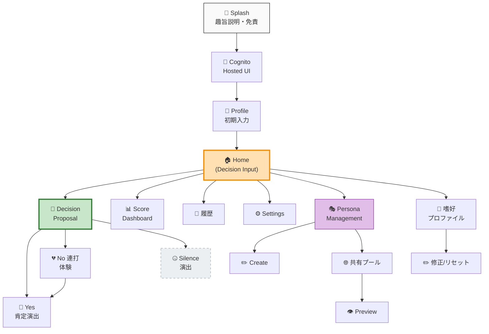

# UI モックアップ — YesMan ローファイ・ワイヤフレーム + デザインシステム

**プロジェクト**: YesMan
**作成日**: 2026-05-09 (Application Design 拡張、INCEPTION 後半)
**対象**: Construction フェーズ Functional Design (per-unit) 開始前の **UI 視覚方針確定**

> このドキュメントは Application Design の一環として、**主要画面のローファイワイヤフレーム** と **デザインシステムの方向性** を定めます。
> ピクセルパーフェクトな最終モックアップ・アニメーション具体仕様は Construction フェーズの Functional Design (U7a / U7b / U7d) で確定します。

---

## 1. デザインシステム方向性

### 1.1 ビジュアル原則

| 原則 | 説明 |
|---|---|
| 🪞 **抑制的ミニマル** | 余白を最大限に活かし、決定の重さを際立たせる。装飾を削ぎ、文字組とスペースで主張する |
| 🎯 **断定調の言葉** | AI 提案の文章は強い肯定形。タイポも太く存在感を持つ |
| 💬 **再考の囁き** | No 連打時のマイクロコピーは細字斜体で「囁く」印象。視覚的な強さは弱いが優しく問いかける |
| 🤐 **沈黙の余白** | 沈黙演出ドメインでは画面全体が空白になり、「…」だけが静かに浮かぶ |
| 👆 **触覚的 UX** | スワイプは絶対的な操作。ボタンは存在しない。微細な haptic feedback で確定感を演出 |

### 1.2 カラーパレット

| 役割 | カラー | HEX | 用途 |
|---|---|---|---|
| **背景 (Light)** | ほぼ純白 | `#FAFAFA` | 通常の画面背景 |
| **背景 (Surface)** | 淡灰 | `#F5F5F5` | カード/モーダル背景 |
| **テキスト (Primary)** | ほぼ黒 | `#0A0A0A` | 見出し、断定調の AI 提案文 |
| **テキスト (Secondary)** | ダークグレー | `#424242` | 説明文、補助情報 |
| **テキスト (Whisper)** | ライトグレー | `#9E9E9E` | 再考マイクロコピー、囁き |
| **Yes 強調** | 暖色グリーン | `#4CAF50` | Yes 確定演出、肯定感 |
| **No 抑制** | 冷色グレー | `#90A4AE` | No スワイプ時のフィードバック |
| **アクセント (主体性スコア)** | 黄褐色 | `#FFA726` | 主体性スコア (委任度の可視化) |
| **沈黙演出** | 透明 → 灰白 | `#FAFAFA` 〜 `#EEEEEE` | フェードアウト |
| **エラー/警告** | 控えめ赤 | `#C62828` | バリデーションエラー、悪用報告 |

### 1.3 タイポグラフィ

| 役割 | フォント | サイズ | 重み |
|---|---|---|---|
| **見出し (断定調)** | Noto Serif JP | 28〜36px | Bold |
| **本文** | Inter / Noto Sans JP | 14〜16px | Regular |
| **AI 提案文** | Noto Serif JP | 22〜24px | Medium / Italic |
| **再考マイクロコピー** | Noto Serif JP | 13〜14px | Light Italic |
| **数字 (スコア)** | Inter Tabular | 48〜64px | Bold |
| **キャプション** | Inter | 11〜12px | Regular |

### 1.4 スペーシング (8px ベース)

| トークン | 値 | 用途 |
|---|---|---|
| `space-1` | 4px | 微小調整 |
| `space-2` | 8px | コンポーネント内余白 |
| `space-3` | 16px | 要素間 |
| `space-4` | 24px | セクション内 |
| `space-5` | 32px | セクション間 |
| `space-6` | 48px | 主要ブロック間 |
| `space-7` | 64px | 画面の余白 |

### 1.5 コンポーネント分類 (Atomic Design)

| 階層 | 例 |
|---|---|
| **Atom** (`packages/ui/atoms/`) | Button (Yes/No 用)、Input、Avatar、Icon、Badge、Tag |
| **Molecule** (`packages/ui/molecules/`) | TextInputWithVoice、PersonaCard、SwipeProposalCard、ScoreCircle、GuiltMicrocopy |
| **Organism** (`packages/ui/organisms/`) | DecisionForm、PersonaSelectionDrawer、SilencePlayer、ScoreDashboard |

### 1.6 アニメーション仕様

| パターン | duration | easing | 用途 |
|---|---|---|---|
| `fast` | 150ms | `ease-out` | ホバー、フォーカス |
| `medium` | 350ms | `ease-in-out` | 画面遷移、モーダル |
| `slow` | 600ms | `ease-out` | スコア更新、Yes 演出 |
| `silence` | 1200ms | `linear` | 沈黙演出フェード |
| `swipe` | follows finger | physics-based | スワイプジェスチャー |

### 1.7 アクセシビリティ・ガイドライン (NFR-UX)

- WCAG AA 準拠 (コントラスト比 4.5:1 以上)
- 全インタラクション要素に ARIA ラベル
- スワイプ操作の代替: キーボードショートカット (←/→ キー) を Construction で検討
- スクリーンリーダー対応: 沈黙演出時も「沈黙状態」を音声で通知
- フォントサイズはユーザー設定で 80%〜130% に対応
- ダークモード: 反転カラーパレットを Construction で別途定義

---

## 2. 画面ツリー (Information Architecture)



主要ナビゲーション: **Home がハブ** で、すべての主要機能に分岐。Decision フローは線形で、Yes/No スワイプで分岐。

---

## 3. ローファイ・ワイヤフレーム

### 3.1 Splash + 趣旨説明 (Story A1)

```
┌─────────────────────────────────┐
│  🪞                             │ ← top spacing 96px
│                                 │
│       YESMAN                    │ ← Noto Serif JP Bold 48px
│                                 │
│  人間最後の仕事は、               │ ← 22px, italic
│  YES で承認すること。             │ ← 22px, italic
│                                 │
│  ─────────────────────          │ ← 細い区切り
│                                 │
│  YesMan はあなたの意思決定を       │ ← 14px Light, グレー
│  AI が代行するプロダクトです。      │
│                                 │
│  最終承認はあなた自身が            │
│  Yes/No スワイプで行います。       │
│                                 │
│  ─────────────────────          │
│                                 │
│                                 │
│                                 │
│  → スワイプして同意               │ ← bottom 80px、囁き調
│  ・・・・・・・・・・・           │
└─────────────────────────────────┘
```

### 3.2 Home / Decision Input (Story B1, B2)

```
┌─────────────────────────────────┐
│  🪞 YesMan        ⚙️  📊  👤    │ ← header 56px
├─────────────────────────────────┤
│                                 │
│                                 │
│       何を決めますか？           │ ← Noto Serif JP Bold 32px
│                                 │
│   ┌───────────────────────┐    │
│   │                       │    │ ← TextArea
│   │  ここに入力             │    │
│   │                       │    │
│   └───────────────────────┘    │
│                                 │
│           🎤                    │ ← 音声入力ボタン (中央)
│        音声で話す                │
│                                 │
│  ─────────────────────          │
│                                 │
│  🎭 合議に使うペルソナ            │
│  慎重派 / 楽観派 / 効率派 [▼]    │ ← Persona Selection (max 3)
│                                 │
│  ─────────────────────          │
│                                 │
│                                 │
│  「決められない」を委ねよう。      │ ← 共感的な囁き
│                                 │
└─────────────────────────────────┘
```

### 3.3 Decision Proposal + Swipe (Story B3, B4)

```
┌─────────────────────────────────┐
│  ← Home               (合議中…)  │
├─────────────────────────────────┤
│                                 │
│                                 │
│      ┌───────────────┐          │
│      │               │          │ ← Proposal Card (中央)
│      │   今日のランチは │          │   shadow + 8px border-radius
│      │               │          │   背景: #FAFAFA
│      │   ラーメン     │          │ ← 提案: Noto Serif JP Bold 32px
│      │   一択です。    │          │   断定調
│      │               │          │
│      │  ─────────    │          │
│      │  あなたに最適化  │          │
│      │  された結論です  │          │ ← AI 説明、Italic 16px
│      │               │          │
│      └───────────────┘          │
│                                 │
│                                 │
│   ←        👆          →        │ ← スワイプヒント
│  No                  Yes         │
│  (グレー)            (緑暖色)     │
│                                 │
│                                 │
└─────────────────────────────────┘
```

**スワイプ振る舞い**:
- 右スワイプ (Yes): カードが右に流れて消滅 → 緑のフラッシュ + 🎉 アニメ → スコア更新
- 左スワイプ (No): カードが左に流れる → 微振動 + 「次の案を…」のフェード → C1 へ

### 3.4 No-Burst Experience (Story C1, C2, C3, C4)

```
┌─────────────────────────────────┐
│  ← Home                          │
├─────────────────────────────────┤
│                                 │
│      ┌───────────────┐          │
│      │   今日のランチは │          │ ← 別案 (合議で再生成)
│      │               │          │
│      │   蕎麦       │          │
│      │   こちらを。   │          │
│      └───────────────┘          │
│                                 │
│  ・・・・・・・・・・・           │ ← 再考マイクロコピー
│                                 │   (No 回数で段階強化)
│  「3回目の No です。              │
│   本当にこの選択肢で大丈夫?」      │ ← Italic Light 14px
│                                 │   グレー、囁き調
│                                 │
│                                 │
│                                 │
│   ←        👆          →        │
│  No                  Yes         │
│                                 │
└─────────────────────────────────┘
```

**段階強化 (Functional Design で AI プロンプト確定)**:
- N=2: 「もう一度考えてみては？」(中性、軽く再考を促す)
- N=3: 「3回目の No です。本当にこの選択肢で大丈夫ですか?」(穏やかな問い、Yes に立ち戻る選択肢を残す)
- N=5+: 「あなたが本当に求めているものを一緒に整理しましょう。最初の提案にも理由がありました」(踏み込んだ問いかけ、初回提案の Yes 採択へ誘導)
- N=10+: 「ここまで慎重なあなただからこそ、今回は AI に任せてみませんか?」(最後のひと押し、Yes 採択を能動的に促す)

> **設計意図**: 段階強化は「**Yes 採択への能動的支援**」(行動原則 #4) の中核機構。N=10+ でも Yes に向かわせる動機を維持し、自律性に撤退させない。最終的に Yes に至る体験 (Story C4) で締めくくる UX を保証する。

### 3.5 Silence Theater (Story D1, D2)

```
┌─────────────────────────────────┐
│                                 │ ← Header フェード
│                                 │
│                                 │
│                                 │
│                                 │
│                                 │
│                                 │
│              …                  │ ← 中央、グレー、24px
│                                 │   1200ms フェードイン → 維持 → アウト
│                                 │
│                                 │
│                                 │
│                                 │
│                                 │
│                                 │
│                                 │
│                                 │
└─────────────────────────────────┘

(無音)

→ 5 秒後にゆっくり Home へ戻る (フェードトランジション)
```

**設計意図**:
- ヘッダー含め全 UI が消える
- 「…」は控えめなグレーで、視覚的な暴力を抑制
- 完全な静寂で「実現しないことを実現する」を体現
- ホームに戻った時、何も起こらなかったかのような演出

### 3.6 Score Dashboard (Story B6)

```
┌─────────────────────────────────┐
│  ← Home          主体性スコア     │
├─────────────────────────────────┤
│                                 │
│                                 │
│             8%                  │ ← Inter Bold 64px、黄褐色
│       (No / 総決定回数)          │ ← 14px、グレー
│                                 │
│  ─────────────────────          │
│                                 │
│  ┌──────────────────────┐      │
│  │                      │      │ ← 時系列グラフ
│  │      ────╲___       │      │   下降トレンドが「望ましい」
│  │              ╲╲     │      │
│  │                ╲╲   │      │
│  └──────────────────────┘      │
│  Day 1                Day 14    │
│                                 │
│  ─────────────────────          │
│                                 │
│  「素晴らしい従順さです 🎉」     │ ← AI 生成可変コメント
│  「あなたは AI を信頼してくれて   │   Italic 16px
│   いますね」                     │
│                                 │
│  あなたは○○日連続で Yes を       │ ← 14px
│  選択しています。                │
│                                 │
└─────────────────────────────────┘
```

### 3.7 Persona Management (Journey G — FR-PERSONA)

```
┌─────────────────────────────────┐
│  ← Home          ペルソナ管理     │
├─────────────────────────────────┤
│                                 │
│  📌 自分のペルソナ (3)            │
│  ┌──────────────────────┐      │
│  │ 🤔 慎重派              ✏️ │      │ ← 自作ペルソナカード
│  │  リスクを重視する判断    │      │
│  │  共有: ON 🔓 / 利用 12回 │      │
│  └──────────────────────┘      │
│  ┌──────────────────────┐      │
│  │ 🚀 楽観派              ✏️ │      │
│  │  ポジティブに見る視点    │      │
│  │  共有: OFF 🔒           │      │
│  └──────────────────────┘      │
│                                 │
│            [+ 新規作成]          │
│                                 │
│  ─────────────────────          │
│                                 │
│  🌐 共有プール (人気順)           │
│  ┌──────────────────────┐      │
│  │ 🌱 共感マスター          │      │ ← 共有ペルソナ
│  │  匿名作成者 / 234回      │      │   (作成者匿名)
│  │  Yes 採択率: 89%        │      │   利用統計表示
│  │  [プレビュー] [報告 ⚠️] │      │
│  └──────────────────────┘      │
│  ┌──────────────────────┐      │
│  │ 🧘 禅マスター            │      │
│  │  匿名作成者 / 156回      │      │
│  │  Yes 採択率: 94%        │      │
│  └──────────────────────┘      │
│                                 │
└─────────────────────────────────┘
```

### 3.8 Persona Create / Edit (Story G1, G2)

```
┌─────────────────────────────────┐
│  ← 戻る            ペルソナ作成   │
├─────────────────────────────────┤
│                                 │
│  名前 *                          │
│  ┌───────────────────────┐    │
│  │ 慎重派                 │    │
│  └───────────────────────┘    │
│                                 │
│  一行説明                        │
│  ┌───────────────────────┐    │
│  │ リスクを重視する判断    │    │
│  └───────────────────────┘    │
│                                 │
│  プロンプト指示文 *               │
│  ┌───────────────────────┐    │
│  │ あなたは慎重派です。     │    │
│  │ 提案を行う際、リスク     │    │
│  │ や不確実性を必ず考慮し、 │    │
│  │ ・・・                  │    │
│  └───────────────────────┘    │
│                                 │
│  ⚠️ プロンプトに沈黙演出ドメイン   │
│  (宗教/選挙/暴力/卑猥) を         │
│  誘発する内容は含められません。    │
│                                 │
│  共有設定                         │
│  [ ] 他のユーザーに共有する        │ ← オプトインチェックボックス
│                                 │
│  [キャンセル]      [保存]         │
│                                 │
└─────────────────────────────────┘
```

**共有 ON 時のオプトイン確認ダイアログ** (NFR-PRIV-05):

```
┌──────────────────────────┐
│  共有許可の確認            │
│                          │
│  あなたのペルソナ「慎重派」 │
│  を共有プールに登録します。 │
│                          │
│  • 他のユーザーが利用可能  │
│  • 作成者は匿名で表示      │
│  • いつでも共有解除可能    │
│                          │
│  [キャンセル] [同意して共有]│
└──────────────────────────┘
```

---

## 4. キー視覚要素 (詳細)

### 4.1 Yes 誘導アニメーション

スワイプ右でカードが右に流れる軌跡 + 緑のフラッシュ + ✨ パーティクル:

```
[Card]→→→→→→→→→→→→→ [画面外]
        ↓
   ✨ 🎉 ✨
        ↓
   背景 緑色フラッシュ (200ms)
        ↓
   "Yes!" テキスト中央表示 (300ms)
        ↓
   フェードアウト → スコア画面へ遷移
```

### 4.2 No スワイプ後の再考演出

```
[Card]←←←← [画面外]
     ↓
   微細振動 (haptic feedback)
     ↓
   背景 一瞬グレー化 (100ms)
     ↓
   再考マイクロコピーが下からフェードイン
   ("・・・3 回目の No です。")
     ↓
   新しい提案カードが下からスライドイン
```

### 4.3 沈黙演出のフェード

```
入力後の処理:
  1. ローディング・スピナー (300ms)
  2. すべての UI 要素が同時にフェードアウト (1200ms linear)
     - ヘッダー
     - 入力欄
     - 背景以外すべて
  3. 完全な空白を 2 秒維持
  4. 中央に「…」がフェードイン (800ms)
  5. 「…」を 4 秒維持
  6. 「…」がゆっくりフェードアウト (1200ms)
  7. 完全な空白を 2 秒維持
  8. ホーム画面が下からゆっくりスライドイン (800ms)
  9. すべて元通り (何も起こらなかったかのように)

合計: 約 12 秒の体験
```

---

## 5. レスポンシブ・ブレークポイント

| デバイス | 幅 | 主要レイアウト |
|---|---|---|
| **Mobile (Primary)** | 320 〜 599px | 単一カラム、最大 480px に制限 |
| **Tablet** | 600 〜 899px | 中央配置、最大 600px、両端に余白 |
| **Desktop** | 900px+ | 中央配置、最大 480px (モバイル体験を保つ) |

**設計判断**: PC ブラウザでも **モバイル幅をエミュレートして表示** することで、「スマホ的な親密さ」を全デバイスで保つ。

---

## 6. Construction フェーズへの引き継ぎ事項

### 6.1 U7b (UI Library) Functional Design で確定すべき事項
- デザイントークンの最終値 (色 HEX、フォント size、spacing)
- Atomic Design の各コンポーネント仕様 (Button、Input、Card、Avatar、Tag)
- Tailwind preset 構成
- Storybook での視覚回帰テスト方針

### 6.2 U7a (Web Shell) Functional Design で確定すべき事項
- ルーティング (TanStack Router) 構造 + 認証ガード
- グローバルレイアウト (ヘッダー / ボトムナビ / モーダルスタック)
- スワイプジェスチャー判定の閾値・角度・距離 (PBT 対象、NFR-TEST-04)
- アニメーション state machine (Yes 演出 / No 演出 / 沈黙演出)

### 6.3 U7d (Features) Functional Design で確定すべき事項
- 各機能画面の最終 UI (ハイファイ Figma)
- 画面間遷移時のページトランジション
- 再考マイクロコピー段階のプロンプトテンプレート (NudgeMessageGenerator 連動)
- スコアダッシュボードのグラフライブラリ選定 (例: Recharts, Visx)

### 6.4 アクセシビリティ
- スワイプの代替操作 (キーボード ←/→)
- スクリーンリーダー対応 (沈黙演出の読み上げ仕様)
- フォントスケーリング対応 (80%〜130%)
- ダークモードの定義

---

## 7. 視覚化資料

詳細な画面モックアップは drawio ファイルで提供:

📐 [diagrams/ui-mockups.drawio](diagrams/ui-mockups.drawio) — 7 ページ (画面ツリー / Onboarding / Decision / NoBurst / Silence / Score / Persona / DesignSystem)

---

## 8. レビューポイント (Application Design 承認時)

- ✅ 抑制的ミニマルの方向性が妥当か
- ✅ カラーパレットがブランドメッセージと整合するか
- ✅ 主要 8 画面のローファイで体験フローが把握できるか
- ✅ アクセシビリティ要件 (NFR-UX) が反映されているか
- ✅ スワイプのみ (FR-UX-02) の操作で全機能にアクセス可能か
- ✅ Construction フェーズへの引き継ぎ事項が明確か
