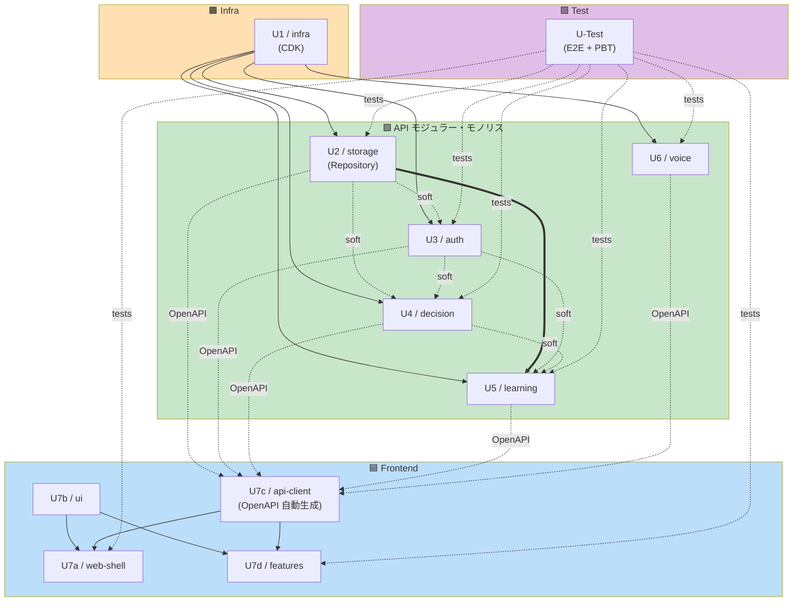

# Unit of Work Dependency - YesMan ユニット依存

**プロジェクト**: YesMan
**作成日**: 2026-05-09

ユニット間の依存関係マトリクスと並列実行可能性を示す。ユニット定義は [unit-of-work.md](unit-of-work.md)、ストーリーマッピングは [unit-of-work-story-map.md](unit-of-work-story-map.md) を参照。

---

## 1. 依存マトリクス

行 = 依存元（このユニットを動かすために必要）、列 = 依存先。`✅` = 必須、`⚪` = ソフト依存（モックで代替可）、空欄 = なし。

| Unit \ Depends on | U1 infra | U2 storage | U3 auth | U4 decision | U5 learning | U6 voice | U7b ui | U7c api-client | U-Test |
|---|:---:|:---:|:---:|:---:|:---:|:---:|:---:|:---:|:---:|
| **U1 / infra** | — | | | | | | | | |
| **U2 / storage** | ✅ | — | | | | | | | |
| **U3 / auth** | ✅ | ⚪ (Profile Repo を借用) | — | | | | | | |
| **U4 / decision** | ✅ | ⚪ (Decision Repo を借用) | ⚪ (User context) | — | | | | | |
| **U5 / learning** | ✅ | ✅ (PreferenceProfile Repo) | ⚪ (User context) | ⚪ (Decision を文脈) | — | | | | |
| **U6 / voice** | ✅ | | | | | — | | | |
| **U-Persona / persona** | ✅ | ✅ (PersonaRepo) | ⚪ | ⚪ (Decision 連動) | | | | | |
| **U7a / web-shell** | | | | | | | ✅ | ✅ | |
| **U7b / ui** | | | | | | | — | | |
| **U7c / api-client** | | (OpenAPI スキーマ提供) | (OpenAPI) | (OpenAPI) | (OpenAPI) | (OpenAPI) | | — | |
| **U7d / features** | | | | | | | ✅ | ✅ | |
| **U-Test** | ✅ (E2E は本番デプロイに対しても可) | ✅ | ✅ | ✅ | ✅ | ✅ | ⚪ | ✅ | — |

凡例:
- ✅ 必須依存（このユニットがないと開発・実行不可）
- ⚪ ソフト依存（モック / スタブで代替可能）
- 空欄 = 依存なし

---

## 2. 依存グラフ (Mermaid)



---

## 3. クリティカルパス

クリティカルパスは **U1 → U2 → U5** または **U1 → U2 → U4** （長さ 3）

```
Day 0:  U1 (インフラ立ち上げ) | 並列で U7b (UI Lib), U7c スタブ着手可
Day 1:  U1 進捗で Aurora 立ち上がり次第 U2 着手
Day 2:  U2 進捗で U3, U4, U6 を並列着手 (U5 は U2 + U4 完了待ち)
Day 3+: U7a, U7d は U7c (OpenAPI) のスタブで先行開発
        U-Test は API/UI が動き次第 E2E スクリプト作成
```

---

## 4. 並列実行可否マトリクス

| Phase | 並列実行可能なユニット |
|---|---|
| **Phase 0 (Day 0)** | U1, U7b, U7c (スタブ), U-Test の Playwright 雛形 |
| **Phase 1 (Day 1)** | U2 (U1 部分完了後), U7a (U7b/U7c スタブ完成後), U7d (U7c スタブ完成後) |
| **Phase 2 (Day 2-3)** | U3, U4, U6 (U2 完了後並列着手可能) |
| **Phase 3 (Day 4+)** | U5 (U2/U3/U4 完了後), U-Test 本番化 |
| **Phase 4 (Day 5+)** | 全ユニット並列 + 統合 + リファクタ |

---

## 5. 依存リスクと緩和策

| リスク | 影響ユニット | 緩和策 |
|---|---|---|
| OpenAPI スキーマの頻繁な変更がフロントを壊す | U7c, U7a, U7d | スキーマ変更時に CI で型生成と差分通知。バック側で v1 固定のうえ追加変更は v2 へ |
| Aurora 接続失敗で全 API が壊れる | U2 + 依存全モジュール | DI で MOCK 切替可能、開発時は Docker PostgreSQL 利用 |
| Cognito 設定遅延で認証が動かない | U3 + 全フロント機能 | DI で MOCK 認証に切替、cognito-local で開発 |
| LLM API 障害で Decision が動かない | U4 | LiteLLM フォールバック (NFR-AVAIL-03)、ローカル LLM へ切替 |
| EventBridge 設定遅延で非同期学習が走らない | U5 | best-effort 設計、API Service 内で同期 fallback 可能 |
| 並列開発でモジュール間 API が破綻 | U2-U6 間 | 共有 `domain/` ディレクトリで Entity を集約、CI で型整合性チェック |

---

## 6. デプロイ順序

CDK は依存自動解決するため、`cdk deploy --all` で以下の順序で構築:

```
1. NetworkStack (VPC, Subnet, NAT, SG)
2. AuthStack (Cognito) | DataStack (Aurora) | ObservabilityStack (CloudWatch, X-Ray) [並列]
3. ComputeStack (ECR, ECS Cluster, Task, Service, ALB) [Aurora 認証情報を Secrets Manager 経由で参照]
4. AsyncStack (EventBridge, API Destinations) [ALB のエンドポイントが必要]
5. AIStack (Bedrock Guardrails, Polly/Transcribe IAM)
6. FrontendStack (CloudFront, S3, OAC)
```

API コンテナ起動時は Alembic マイグレーションを Init Container として実行し、スキーマを最新化する。

---

## Post-CONSTRUCTION 改修注記 (2026-05-19)

本ドキュメント本体は 2026-05-10 承認時の Snapshot (12 ユニットの依存マトリクス) を保持。

### Post-CONSTRUCTION での依存追加
| from → to | 依存内容 | commit |
|---|---|---|
| U4 (decision) → U5 (learning) | `PreferenceProfileRepository` 読み取り依存 (Dynamic Persona Routing 用) | `07c1c78` |

その他の unit 間依存 (U7d → U7c / U7b / U7a、U-Persona → U2、U6 → U2 等) は不変。

→ Unit Dependency 表は基本構成を維持、1 新規 read-only edge のみ追加。
