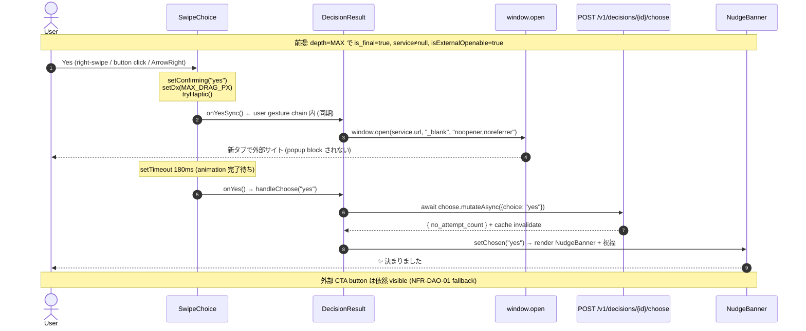

# drill-down-auto-open — Application Design (Minimal depth)

**Feature ID**: drill-down-auto-open
**Phase**: AI-DLC INCEPTION / Application Design
**Depth**: Minimal (CLAUDE.md "Changes within existing component boundaries" 寄り、ただし `packages/ui` composite の **public API** 拡張のため interface design を documented)
**Created**: 2026-05-26
**Status**: 承認待ち
**Based on**: [requirements.md v2](./requirements.md), [workflow-plan.md](./workflow-plan.md)

## 1. Scope (改めて確認)

新規 component / service / DB / 外部依存は **なし**. 4 components の **non-breaking enhancement**:

| Component | 種別 | 変更の性質 |
|---|---|---|
| `packages/ui` SwipeChoice | composite (UI primitive 寄せ) | **public API 拡張** (新 optional props 2 個) |
| `apps/web` DecisionResult | feature container | handler 内 1 分岐追加 + new props 渡し |
| `apps/api` engine.py | domain service (prompt builder) | 3 path の prompt 分岐 condition 修正 + final guide 文言 |
| `apps/api` mock_adapter.py | infrastructure (LLM provider impl) | DRILL_DOWN_PROPOSALS[4] 文言修正 |

`packages/ui` の SwipeChoice は他 feature (anonymous-strangers, quick-start 等) でも再利用される **shared composite** のため、interface design を明示することで FE-DESIGN-07 (Component Reuse) + non-breaking 保証.

## 2. Component Interface Changes

### 2.1 `SwipeChoice` (packages/ui/src/composites/SwipeChoice.tsx)

#### New Props (optional, non-breaking)

```typescript
export interface SwipeChoiceProps {
  // existing props (unchanged): proposalText, onYes, onNo, disabled, threshold, children, showSwipeHint

  /**
   * 2026-05-26 (FR-DAO-09): Yes confirm 直後、`onYes` の `setTimeout(180ms)` の **前** に
   * 同期実行される callback. user gesture chain 内での副作用 (例: `window.open`) に使用.
   * 3 Yes path (right-swipe / fallback button / ArrowRight) すべてで発火.
   *
   * **重要**: ここで例外を投げると onYes も呼ばれずに UI が止まるため、
   * 例外を握り潰すか副作用のみに留めること.
   */
  onYesSync?: () => void;

  /**
   * 2026-05-26 (NFR-DAO-10): Yes button の aria-label を override.
   * 未指定なら default "Yes、提案を採択".
   * isFinal 時に "Yes、提案を採択 (新しいタブで外部サイトを開きます)" 等を渡し、
   * スクリーンリーダー利用者へ事前通知.
   */
  yesAriaLabelOverride?: string;
}
```

#### Behavior (Right-swipe path 例 — onSwipedRight ハンドラ)

| Step | 既存挙動 | 変更後挙動 |
|---|---|---|
| 1 | `setConfirming("yes")` | (同) |
| 2 | `setDx(MAX_DRAG_PX)` | (同) |
| 3 | `tryHaptic()` | (同) |
| **4** | (なし) | **`onYesSync?.()` を同期 invoke** (新 step、try-catch で例外抑制) |
| 5 | `setTimeout(() => onYes(), 180)` | (同) |

同様の挿入を **fallback button click** (現状 setTimeout 無しで onYes 即時) と **ArrowRight keyboard** (setTimeout(180ms) 経由) にも適用. button click path では onYesSync → onYes が即座連続するが順序は保証.

#### aria-label の動的切替 (Yes button)

```typescript
<Button
  // ...
  aria-label={yesAriaLabelOverride ?? "Yes、提案を採択"}
>
  Yes →
</Button>
```

#### Non-breaking 保証

- 2 props は optional、既存 caller 全部 (anonymous-strangers / quick-start / decision その他) は behavior 不変
- 既存 unit test の `proposalText / onYes / onNo` だけを props として渡す pattern は維持

### 2.2 `DecisionResult` (apps/web/src/features/decision/DecisionResult.tsx)

#### handleChoose 拡張 (擬似コード)

```typescript
const handleChoose = async (choice: "yes" | "no") => {
  if (!decisionId) return;

  // 既存: 中間段 (isFinal=false) の Yes は drill-down 経路
  if (choice === "yes" && !isFinal && onDrillDown) {
    onChoiceMade?.("yes");
    onDrillDown();
    return;
  }

  // 既存: choose API 呼出
  try {
    const result = await choose.mutateAsync({ id: decisionId, choice });
    // ... Yes/No 別の state 更新 (combo / nudge / confetti)
  } catch (err) {
    // ... toast 通知
  }
};
```

→ **window.open は handleChoose 内ではなく SwipeChoice の `onYesSync` callback で発火** することで、`await choose.mutateAsync` を挟まない user gesture chain 内同期実行を保証 (FR-DAO-03 / FR-DAO-09 の実装的根拠).

#### SwipeChoice props 渡し (DecisionResult 内、isFinal=true 時のみ意味あり)

```tsx
const isExternalOpenable = isFinal && service !== null;

<SwipeChoice
  key={decisionId ?? "no-decision"}
  proposalText={proposal}
  onYes={() => handleChoose("yes")}
  onNo={() => handleChoose("no")}
  disabled={choose.isPending}
  showSwipeHint={!proposalCardPortal}
  // 2026-05-26 drill-down-auto-open
  onYesSync={
    isExternalOpenable
      ? () => {
          try {
            window.open(service!.url, "_blank", "noopener,noreferrer");
          } catch {
            // popup block 等は CTA fallback (NFR-DAO-01) で復帰
          }
        }
      : undefined
  }
  yesAriaLabelOverride={
    isExternalOpenable
      ? `Yes、提案を採択 (新しいタブで ${service!.name} を開きます)`
      : undefined
  }
>
  {/* existing children: proposal card */}
</SwipeChoice>
```

| 状態 | onYesSync | yesAriaLabelOverride |
|---|---|---|
| isFinal=true && service≠null | window.open 発火 | "Yes、提案を採択 (新しいタブで XXX を開きます)" |
| isFinal=true && service=null | undefined (NFR-DAO-06) | undefined (default "Yes、提案を採択") |
| isFinal=false (drill-down 中) | undefined | undefined |

### 2.3 `engine.py` (apps/api/src/yesman_api/domain/decision/engine.py)

#### Prompt 分岐 condition の厳密化 (3 path 共通の改修)

**Before** (builtin path L266 付近 等):
```python
remaining = MAX_DRILL_DEPTH - depth
if remaining <= 1:
    guide = "**最終段** です. ... 固有名 を含む断定 1 文..."
else:
    guide = "...中間段 一段だけ具体化..."
```

**After** (3 path):
```python
remaining = MAX_DRILL_DEPTH - depth
if depth == MAX_DRILL_DEPTH:
    # final stage 専用: 疑問形 "XXX で 開きますか?" 1 文を要求
    guide = (
        "**最終段** です. 上の絞り込みを受けて、Amazon で実際に開ける "
        "**固有名** (作品名 / 商品名 / ストア名 / 著者名 / アーティスト名 等) "
        "を含む **疑問形 1 文** で出してください. "
        "**必ず末尾を「開きますか?」で締める** こと. "
        "例: 『「パターソン」を Amazon Prime Video で 開きますか?』 / "
        "『「AMAZON Basic T シャツ 5 枚セット」を Amazon Fashion で 開きますか?』 / "
        "『「君たちはどう生きるか」を Kindle で 開きますか?』. "
        "Yes で外部サイトが新しいタブで開きます."
    )
else:
    # 中間段 (depth < MAX): 既存の "一段だけ具体化" guide を維持
    guide = (
        f"絞り込み chain 残 {remaining} 段. 一段だけ具体化 ..."
    )
```

#### 影響

- depth=0..3 は中間段 guide → 断定形 + service routing / subtype 絞り込み (既存挙動維持)
- depth=4 のみ final guide → 疑問形「XXX で 開きますか?」(新挙動)
- `is_final = depth >= MAX_DRILL_DEPTH` 判定 (既存 3 箇所) と **境界が完全一致**

### 2.4 `mock_adapter.py` (DRILL_DOWN_PROPOSALS)

#### Before
```python
DRILL_DOWN_PROPOSALS: dict[int, str] = {
    1: "ホラー映画は どうですか?",
    2: "ジャパニーズホラーが 気分転換に おすすめです。",
    3: "Amazon Prime Video で 観ましょう。",
    4: "『貞子 on the Movie』を Amazon Prime Video で 観ましょう。",
}
```

#### After (FR-DAO-08 + M1)
```python
DRILL_DOWN_PROPOSALS: dict[int, str] = {
    1: "ホラー映画は どうですか?",            # 中間段、既存維持
    2: "ジャパニーズホラーが 気分転換に おすすめです。",  # 中間段、既存維持
    3: "Amazon Prime Video で 観ましょう。",  # 中間段、既存維持
    4: "『貞子 on the Movie』を Amazon Prime Video で 開きますか?",  # final 段のみ疑問形に変更
}
```

mock の chain_len 検出は `[これまでの絞り込み: A → B → C → D]` の "→" 区切り数 + 1 = 4 で final proposal を返す既存ロジック (line 75-89) を維持.

## 3. Sequence Detail (Mermaid, popup block 回避の同期 chain 強調版)



**Critical point**: Step 3-4 (`onYesSync` → `window.open`) は user gesture chain 内同期、step 6 (`setTimeout(180ms)` 後の onYes) → step 7 (`await mutateAsync`) は非同期だが popup 発火は既に完了済.

## 4. Test Strategy

### 4.1 packages/ui (SwipeChoice unit, vitest)
- 新 spec: `tests/composites/SwipeChoice.test.tsx`
  - `onYesSync` が **3 path (swipe / button / ArrowRight) すべてで onYes より先に同期呼び出し** される (`vi.fn()` の call order 検証)
  - `onYesSync` 内で例外を投げても `onYes` が呼ばれる (try-catch 保証)
  - `yesAriaLabelOverride` 渡し時に Yes button の aria-label が更新される
  - 既存 props だけの caller では 2 新 props が undefined で挙動不変 (regression なし)

### 4.2 apps/web (DecisionResult unit, vitest)
- 既存 [DecisionResult.test.tsx](apps/web/tests/features/decision/DecisionResult.test.tsx) 拡張
  - `isFinal=true && service≠null` 時 `onYesSync` が `window.open` を `(url, "_blank", "noopener,noreferrer")` で呼ぶ (`vi.spyOn(window, "open")`)
  - `isFinal=false` 時 `onYesSync` は SwipeChoice に渡されない (undefined)
  - `isFinal=true && service=null` 時 `onYesSync` は undefined (NFR-DAO-06)

### 4.3 apps/api (mock_adapter unit, pytest)
- 既存 [test_mock_llm.py](apps/api/tests/unit/decision/test_mock_llm.py) 拡張
  - chain_len=4 の messages で `_pick_proposal` が「開きますか?」を末尾に含む文字列を返す
  - chain_len=1,2,3 は既存 (断定形) を維持

### 4.4 e2e (Playwright, drill-down-decision.spec.ts)
- 既存 2 spec + 新 spec 1 件追加:
  - 既存 "Yes 5 連打で final → NudgeBanner + CTA" を **疑問形 proposal 検出 + popup 発火 assertion** に拡張:
    ```typescript
    const [popup] = await Promise.all([
      page.waitForEvent("popup"),
      page.getByRole("button", { name: /Yes/ }).first().click(),
    ]);
    expect(popup.url()).toContain("amazon.co.jp");
    await popup.close();
    ```
  - 新 spec: "isFinal=true 時 Yes button aria-label に「新しいタブで」が含まれる" (NFR-DAO-10 verify)

### 4.5 real-LLM (任意、`RUN_REAL_LLM_E2E=1`)
- 既存 multi spec で final proposal text が `/開きますか[??]/` regex に match することを assert 追加
- Amazon 系到達率 ≥ 90% は既存指標維持

## 5. Visual Supplements (VIS-SUPP-03 再評価 — Compliant に変更)

requirements.md §9 では VIS-SUPP-03 を「text 変更のみで N/A」と判定したが、**Application Design 段で再評価** したところ、本 feature は次の 3 つの UX 変化を含むため visual supplement が **有意義**:

1. **proposal text の semantic 変化** (断定 → 疑問形): user の認知を変える
2. **Yes button aria-label の動的切替** (NFR-DAO-10): accessibility 上の変化
3. **Yes 採択時の挙動変化** (CTA 手動 click → 自動 window.open): interaction model 変化

→ VIS-SUPP-03 を **Compliant (HTML mockup added)** に格上げし、INCEPTION canonical を継承しつつ before/after を可視化した HTML mockup を作成.

### Visual Supplement (HTML mockup)

> **Visual supplement (HTML)**: [proposal-final-before-after.html](./mockups/proposal-final-before-after.html) — Pixel 5 viewport (393 × 851) 想定の single-file HTML mockup. INCEPTION palette (`#FFF7E8` cream / `#FFFCF4` card / `#E8775A` coral / `#FFD6E0` pink / 緑 CTA gradient) + Crimson Pro / Noto Serif JP italic を継承 (FE-DESIGN-01, 02, 03). before (現状: 断定形「観ましょう。」 + 手動 CTA click) と after (新仕様: 疑問形「開きますか?」 + 自動 window.open + NudgeBanner) を side-by-side で比較.

| 要素 | mockup 内の表現 |
|---|---|
| proposal text | Before: 普通の italic. After: 末尾「**開きますか?**」を coral 強調 |
| Yes button | Before: aria-label="Yes、提案を採択". After: aria-label="Yes、提案を採択 (新しいタブで Amazon Prime Video を開きます)" |
| 緑 CTA button | Before: primary entry point. After: 末尾に「（fallback）」 ラベル付き、popup block 救済 |
| NudgeBanner (採択後) | After のみに「↑ 新タブで外部サイト後、元タブに残る祝福 banner」 注記付き |
| 差分凡例 table | After mockup 下部に 8 項目の Before → After 対比表 + 根拠 FR/NFR ID |

レビュー手順: ブラウザで `proposal-final-before-after.html` を開く (網接続不要、依存外部リソースは Google Fonts のみ — オフラインなら system serif にフォールバック)。

## 6. Compliance Re-check (extension rules)

requirements.md §10 の Compliance Matrix からの差分:

| Rule | 旧 Status | 新 Status | Δ |
|---|---|---|---|
| FE-DESIGN-07 (Component Reuse) | Compliant (extended) | **Compliant (extended, AD で interface 明示)** | 本 AD §2 で SwipeChoice 新 props 仕様を documented |
| VIS-SUPP-01 (Flow) | Compliant (req §9 Mermaid) | **Compliant + Refined** | 本 AD §3 の popup-block 強調版 sequence で補完 |
| **VIS-SUPP-03 (UI mockup)** | N/A | **Compliant (HTML mockup added)** | mockup 追加 ([proposal-final-before-after.html](./mockups/proposal-final-before-after.html)) |
| **VIS-SUPP-04 (Storage)** | N/A | **Compliant** | `aidlc-docs/inception/drill-down-auto-open/mockups/` 配下に保存、kebab-case、self-contained single-file |
| **VIS-SUPP-05 (Cross-reference)** | Compliant (Mermaid only) | **Compliant + Refined** | 本 AD §5 から HTML mockup へ相対 link |
| CONS-FLOW-01 / 03 / 05 | Deferred to Code Gen | **Pending Code Gen Plan** | 次の phase で実施 |

新規 blocking finding: **なし**.

## 7. Open Questions (Application Design 段で fix すべき)

なし. 本件は既存 component の non-breaking 拡張 + prompt 文言修正のみで、設計上のあいまいさは requirements.md v2 で解消済.

## 8. 完了条件

- AD doc の SwipeChoice 新 props 仕様が `packages/ui` の既存 TypeScript style と整合
- handleChoose pseudocode が既存 [DecisionResult.tsx:165-191](apps/web/src/features/decision/DecisionResult.tsx#L165) と非破壊的に整合
- engine.py prompt 改修案が既存 3 path (builtin / anonymous / mixed) すべてに対応する形で書かれている
- 新規 blocking finding なし (extension compliance 維持)

---

## 承認のお願い (CONS-FLOW-04 advisory: Approval Gate 1.7 / 補助)

> Application Design 承認は CONS-FLOW 規定の必須 gate ではありませんが、Code Generation Plan の前に interface design を fix するため確認させてください.

この Application Design (Minimal) で進めて良ければ「**OK**」「**承認**」「**proceed**」のいずれかをお願いします. 修正点があれば箇条書きで指摘してください. 承認後、**Code Generation Plan (CONS-FLOW-01 Exploration + CONS-FLOW-03 Multi-approach)** に進みます — そこで **Gate 2 (architecture / multi-approach)** が公式 advisory として作動します.
