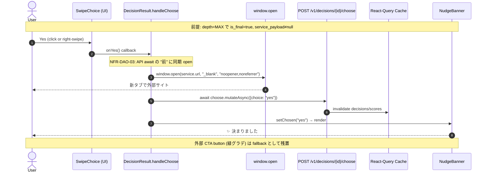

# drill-down-auto-open — Requirements

**Feature ID**: drill-down-auto-open
**Phase**: AI-DLC INCEPTION / Requirements Analysis
**Depth**: Standard
**Created**: 2026-05-26
**Updated**: 2026-05-26 (ultrathink review 反映 v2: C1-C3 + M1-M5)
**Status**: Awaiting user approval (v2)

## Extension Configuration (本 feature 適用)

| Extension | Enforcement | 本 feature への影響 |
|---|---|---|
| **Visual Supplements** | Full | flow / UI 補助図の閾値評価必須。本件は閾値未満 → Mermaid sequence + 既存 SVG 継承で sufficient (詳細は §9) |
| **Frontend Design** | Full | proposal-card / SwipeChoice の typography / palette / motion / composite reuse を継承。新規 component なし |
| **Security Baseline** | Full | SECURITY-15 (fail-safe defaults) が直接適用 → window.open `noopener,noreferrer` 必須。他はほぼ N/A |
| **Property-Based Testing** | Skip | feature-specific override (理由: 単純な条件分岐、pure function なし) |
| **Construction Flow** | Partial (01/03/05) | Code Generation Plan に Exploration Findings + Multi-approach + Confidence-filtered review を必須 |

## 1. Intent (背景)

drill-down decision の最終段 (depth = MAX_DRILL_DEPTH = 4) で、user の Yes 採択が「合議完了 + NudgeBanner 表示」 で止まり、その先の **外部サービスへの遷移は別途 CTA button の click が必要** だった。結果として user が外部 service に到達せずセッションが終わるケースが多発 (手動検証で複数回確認)。

最終段の体験を「**Yes = 外部サービスに即遷移**」に再設計し、合議結果を即時に行動 (action) に転換する.

## 2. Scope

### In Scope
- backend (`apps/api`): final 段の proposal LLM prompt を疑問形 (「XXX で 開きますか?」) に変更
- frontend (`apps/web` / `packages/ui`): final 段の Yes click handler で `window.open(service.url, "_blank")` を **`choose` API await 前に同期発火** (popup block 回避)
- frontend: 既存の CTA button (`external-service-cta`) は **fallback として継続表示**
- mock LLM (`mock_adapter.py`): DRILL_DOWN_PROPOSALS[4] を疑問形に更新
- E2E + unit test: 新挙動を verify

### Out of Scope
- 中間段 (depth < MAX) の挙動変更 — 現状の drill-down chain 進行を維持
- 外部 service が無い (service_payload = null) ケースの新規挙動 — 現状の NudgeBanner のみ表示を維持
- 外部 service URL の deeplink 化 / 商品検索 query 付与 等の URL カスタム加工
- popup block の deep workaround (Q5=A の同期発火で十分カバーできる範囲のみ対応)

## 3. Functional Requirements (FR)

| ID | 要件 | source |
|---|---|---|
| FR-DAO-01 | **depth == MAX_DRILL_DEPTH の proposal のみ** LLM に「XXX で 開きますか?」の疑問形 1 文を生成させる. backend [engine.py](apps/api/src/yesman_api/domain/decision/engine.py) の prompt 分岐 condition を **`remaining <= 1` から `depth == MAX_DRILL_DEPTH` に厳密化** し、prompt と `is_final` の境界 (depth=MAX) を一致させる (3 path: builtin / anonymous / mixed すべて) | Q1=A + ultrathink C1 |
| FR-DAO-02 | final 段の Yes 採択時、`service_payload` が non-null なら `window.open(service.url, "_blank", "noopener,noreferrer")` を新タブで発火する | Q2=A, Q4=A |
| FR-DAO-03 | `window.open` は `choose` API の `await` **前** に Yes click handler 内で同期実行する (popup block 回避) | Q5=A |
| FR-DAO-04 | Yes 採択後の UI 状態は現行と同じ: NudgeBanner (祝福) + 「決まったこと」 card 残置 + 外部 CTA button 残置 | Q2=A, Q3=A |
| FR-DAO-05 | 中間段 (depth < MAX) の Yes は drill-down 進行のまま (window.open 呼ばれない、choose API 呼ばれない) — 現状維持 | Gherkin Scenario 2 |
| FR-DAO-06 | `service_payload` が null の場合 (該当 service カテゴリ無し) は window.open スキップ、NudgeBanner のみ表示 — 現状維持 | out-of-scope の補足 |
| FR-DAO-07 | 全 service (Amazon Prime Video / Amazon Music / Amazon Fashion / Kindle / 出前館 / ユニクロ / Steam / じゃらん 等) で同一挙動 | Q4=A |
| FR-DAO-08 | mock LLM (`MockLLMProvider`) の **`DRILL_DOWN_PROPOSALS[4]` (= MAX 段) のみ** 疑問形「XXX で 開きますか?」 に更新. `[1]..[3]` (中間段) は断定形のまま維持 (FR-DAO-01 と整合). e2e test を新挙動で安定動作させる | implementation 必須 + ultrathink M1 |
| **FR-DAO-09** | **SwipeChoice の 3 Yes path (right-swipe / fallback button / ArrowRight) すべてで `onYes` を user gesture chain 内 (synchronous) に呼び出す**. 現状 swipe / keyboard path は `setTimeout(onYes, 180)` で 180ms 遅延しており、iOS Safari / Firefox strict mode で popup block 多発リスクあり. 対策: SwipeChoice に `onYesSync?: () => void` callback prop を追加し、setTimeout 前に同期呼び出す (animation UX 維持 + popup block 回避). button click path は既に同期なので不変 | ultrathink C2 |

## 4. Non-Functional Requirements (NFR)

| ID | 要件 |
|---|---|
| NFR-DAO-01 | popup block 発生時は CTA button fallback で user が手動操作できる (Q3=A) |
| NFR-DAO-02 | 新タブで開いた後も元タブの React state は維持され、user が戻れば NudgeBanner + 「もう一度」 button が引き続き使える |
| NFR-DAO-03 | 既存テスト (api unit 80 / web vitest 118 / mock e2e drill-down) は回帰なく PASS する |
| NFR-DAO-04 | 既存の Amazon 優先 service_catalog policy と整合 (proposal で「Amazon Prime Video で 開きますか?」 等の文言を維持) |
| NFR-DAO-05 | popup blocker UX: ブロック検出時にトースト等で user に CTA button 経由を促す等は **scope 外** (将来検討) |
| NFR-DAO-06 | **SECURITY-15 / SECURITY-13 適用**: `window.open(url, "_blank", "noopener,noreferrer")` で必ず `noopener,noreferrer` を指定する (タブ napping 攻撃 + Referer 漏洩防止). 既存 CTA `<a target="_blank" rel="noopener noreferrer">` と同等のセキュリティ水準を維持. window.open 失敗時 (popup block) は CTA button が fallback として動作 = fail-safe defaults |
| NFR-DAO-07 | **SECURITY-15 (exception handling) 適用**: `window.open` の戻り値が null (popup block) でも choose API は実行を継続する (fail closed ではなく fail open が UX 妥当 — user は CTA 経由でリカバリ可能) |
| NFR-DAO-08 | **FE-DESIGN-07 適用**: 新規 component を作らず、既存 SwipeChoice / DecisionResult / Button / NudgeBanner / external-service-cta `<a>` を継承する (DecisionResult.tsx の handleChoose 内に open 呼び出しを 1-3 行追加するのみ) |
| NFR-DAO-09 | **FE-DESIGN-01 適用**: proposal-card は既存 SVG canonical [`screens/03-proposal-card.svg`](aidlc-docs/inception/application-design/screens/03-proposal-card.svg) を継承 (新規 SVG 不要、変更は text content のみ — LLM 出力依存). 既存 SVG は「合議された結論です」表現だが、本 feature では proposal text のみが LLM prompt 経由で疑問形に変わる |
| **NFR-DAO-10** | **Accessibility (WCAG 適合)**: `isFinal=true` 時、Yes button の `aria-label` を「Yes、提案を採択 (新しいタブで外部サイトを開きます)」相当に動的切替 (SwipeChoice に `yesAriaLabelOverride?: string` prop 追加、または DecisionResult 側で SwipeChoice を `key={isFinal}` で remount). スクリーンリーダー利用者にも「Yes 押下 = 外部遷移」が事前に伝わる. 中間段の Yes (drill-down 進行) は現状の aria-label を維持 | ultrathink M3 |

## 5. 受け入れ基準 (Gherkin)

Q6=A で fix。

> **注記 (ultrathink C3)**: depth=0 root proposal は最初の card として表示される. user が見える card は計 5 枚 (depth 0,1,2,3,4) で、Yes click は **計 5 回** 必要 (drill-down 4 回 + final 採択 1 回). Gherkin は `Yes click 回数` を明示する.

```gherkin
Feature: drill-down 最終段 Yes 採択で外部 service を新タブ自動 open

  Background:
    Given user は authenticated 状態で /decision を開いている

  Scenario: 映画見たい → 4 段 drill-down → 自動 open
    Given user が「映画見たい」で合議を開始 (depth=0 root proposal が表示)
    And user が Yes を 4 回 click して depth=4 (final) の proposal card が表示される
    And final proposal が疑問形「『パターソン』を Amazon Prime Video で 開きますか?」と表示される
    And service: { name: "Amazon Prime Video", url: "https://www.amazon.co.jp/Amazon-Video", emoji: "📺" }
    When user が 5 回目の Yes (click / 右 swipe / ArrowRight いずれか) を押す
    Then 新タブ (target="_blank", noopener,noreferrer) で service.url が open される
    And 元タブには NudgeBanner (祝福) が表示される
    And choose API は yes として記録される
    And 外部 CTA button は fallback として依然 visible

  Scenario: 中間段 (depth < MAX) の Yes は drill-down 継続
    Given depth=2 で proposal "配信で 観ますか?" が表示
    When user が Yes
    Then 次段 stream (depth=3) が開始される
    And window.open は呼ばれない
    And choose API は呼ばれない

  Scenario: 全 service カテゴリで同一挙動
    Given user が「夜食」で drill-down を進め depth=4 final に到達 (service = 出前館)
    When user が 5 回目の Yes を押す
    Then 新タブで 出前館 の URL (https://demae-can.com/) が open される

  Scenario: service_payload null (該当 category 無し) は現状維持
    Given final 段 (depth=4) で service_payload = null (category 判定失敗)
    When user が 5 回目の Yes を押す
    Then window.open は呼ばれない
    And NudgeBanner のみ表示される

  Scenario: SwipeChoice 全 Yes path で popup block されない (FR-DAO-09)
    Given user が depth=4 final proposal カードを表示
    When user が 5 回目の Yes を a) 右 swipe / b) fallback button click / c) ArrowRight keyboard のいずれかで押す
    Then どの path でも window.open は user gesture chain 内で同期発火する
    And popup block されない (modern browser strict mode 含む)
```

## 6. 影響範囲

### Backend
- [apps/api/src/yesman_api/domain/decision/engine.py](apps/api/src/yesman_api/domain/decision/engine.py) — 3 path (builtin L266-291 / anonymous persona prompt L740-755 / mixed) の prompt 分岐 condition を **`remaining <= 1` → `depth == MAX_DRILL_DEPTH`** に厳密化 (FR-DAO-01 / ultrathink C1). final 段 guide を「疑問形 1 文「XXX で 開きますか?」」要求に変更
- [apps/api/src/yesman_api/infrastructure/decision/llm_providers/mock_adapter.py](apps/api/src/yesman_api/infrastructure/decision/llm_providers/mock_adapter.py) — `DRILL_DOWN_PROPOSALS[4]` のみ疑問形化、`[1]..[3]` は断定形維持 (FR-DAO-08 / ultrathink M1)

### Frontend
- [apps/web/src/features/decision/DecisionResult.tsx](apps/web/src/features/decision/DecisionResult.tsx) — `handleChoose("yes")` 内で `isFinal && service` の場合に `await choose.mutateAsync` の **前に** `window.open(service.url, "_blank", "noopener,noreferrer")` を同期発火 (FR-DAO-02 / FR-DAO-03 / NFR-DAO-06). isFinal=true 時 SwipeChoice に `yesAriaLabelOverride` / `onYesSync` を渡す (NFR-DAO-10 / FR-DAO-09)
- [packages/ui/src/composites/SwipeChoice.tsx](packages/ui/src/composites/SwipeChoice.tsx) — 3 Yes path (right-swipe L92-101 / button click L238-242 / ArrowRight L169-173) に対し新 `onYesSync?: () => void` prop を追加し、`setTimeout(onYes, 180)` の **前に** 同期呼出 (FR-DAO-09 / ultrathink C2). 既存 onYes は animation 完了後 (180ms) のまま. `yesAriaLabelOverride?: string` prop も追加 (NFR-DAO-10)

### Test
- [tests/e2e/tests/drill-down-decision.spec.ts](tests/e2e/tests/drill-down-decision.spec.ts) — final proposal が疑問形になることを assert、**Playwright `page.waitForEvent("popup")` で popup 発火 + URL contains 検証 + close で副作用回避** (§8 の pattern 参照 / ultrathink M2)
- [tests/e2e/fixtures/drill-down.ts](tests/e2e/fixtures/drill-down.ts) — `clickYesUntilNudgeBanner` helper の comment を「Yes 5 回 click で final 採択 + popup 発火」に更新
- [apps/web/tests/features/decision/](apps/web/tests/features/decision/) — DecisionResult の vitest に `window.open` spy + 3 SwipeChoice path 別の onYesSync verify を追加 (FR-DAO-09)

## 7. 依存・制約

- backend の `MAX_DRILL_DEPTH = 4` は維持 (前回 spec)。
- `service_catalog` policy (Amazon 優先 + substring 誤マッチ修正済) は維持。
- popup blocker は user / browser の policy 次第。NFR-DAO-01 の fallback でカバー。

## 8. 検証指標

| 指標 | 目標 | 補足 |
|---|---|---|
| 単体テスト (api / web / ui) | 全 PASS、回帰なし | api 80 / web 118 / ui 既存 baseline |
| drill-down mock e2e (5 click → NudgeBanner + CTA + popup) | PASS | 下記 **popup 検証パターン** 参照 |
| 実 LLM stats spec (映画/洋服/本/音楽/ゲーム × 3 試行) | Amazon 系到達率 **≥ 90%** | 前回 catalog fix 後 17/17 = 100% 達成済 (margin 確保) |
| 手動確認 (Chrome デスクトップ + Pixel 5 Chrome) | 「Yes 押下 = 新タブで Amazon サイト等が開く」が 100% 体感できる | drill-down-decision.spec.ts と同 viewport |
| **手動確認 (iOS Safari)** | popup block されず新タブで開く / されても CTA fallback で復帰可能 | ultrathink M4: iOS Safari popup policy 厳格のため **手動** verify (自動化は scope 外、将来検討) |

### Popup 検証パターン (ultrathink M2)

drill-down-decision.spec.ts に以下の pattern を追加し、Playwright で popup 発火を網羅:

```typescript
const [popup] = await Promise.all([
  page.waitForEvent("popup"),  // popup fire を待機
  page.getByRole("button", { name: /Yes/ }).click(),  // 5 回目の Yes
]);
expect(popup.url()).toContain("amazon.co.jp");  // service.url の正当性
await popup.close();  // network 副作用 (実 URL ロード) 回避
```

### 未カバー service category の明示 (ultrathink N5)

実 LLM 検証は SERVICE_CATALOG の 11 category のうち **5 category** (movie / fashion / books / music / games) で実施済. 残り 6 (travel / food_restaurant / food_delivery / exercise / study / shopping) は本 feature リリースで scope 外、必要に応じ手動 spot-check 推奨.

## 9. Visual Supplements 評価 (VIS-SUPP)

VIS-SUPP は Full enforcement だが、本 feature の規模が小さいため各ルールの閾値評価を documented:

| Rule | 評価 | 結論 |
|---|---|---|
| **VIS-SUPP-01** (Flow) | flow nodes: 5 (Yes click → window.open → choose API call → SSE / cache update → NudgeBanner). swim-lanes: 2 (user / system). 並列 branch なし | **Mermaid sufficient** — 下記 sequence で代替、drawio 不要 |
| **VIS-SUPP-02** (Architecture) | new component: 0. 既存 DecisionResult.tsx に 1-3 行追加のみ. topology 変化なし | **N/A** — アーキ変化なし |
| **VIS-SUPP-03** (UI mockup) | 既存 proposal-card SVG canonical (`screens/03-proposal-card.svg`) に対する text 変更のみ. 構造変化なし. FE-DESIGN-01 inheritance で sufficient | **N/A** — small text tweak は Appendix A "When NOT to Produce" 条件に該当 |
| **VIS-SUPP-04** (Storage convention) | 該当 artifact なし | **N/A** |
| **VIS-SUPP-05** (Cross-reference) | 下記 Mermaid を本 doc 内に inline 配置 | **Compliant** |

### Visual Supplement: Flow (Mermaid sequence)



### Visual Supplement: UI mockup (既存 SVG canonical 継承)

> **Visual supplement (inheritance only)**: [03-proposal-card.svg](../application-design/screens/03-proposal-card.svg) — 既存 INCEPTION canonical を継承. 本 feature で SVG 自体の変更なし (text content だけ LLM prompt 経由で変わる). FE-DESIGN-01 準拠.

## 10. Compliance Matrix (Extension Rules)

| Rule ID | Status | Notes |
|---|---|---|
| VIS-SUPP-01 (Flow) | Compliant | Mermaid sequence (§9) で sufficient (5 nodes / 2 lanes / no parallel) |
| VIS-SUPP-02 (Architecture) | N/A | 新規 component / topology 変化なし |
| VIS-SUPP-03 (UI mockup) | **Compliant (HTML mockup added)** | Application Design §5 で再評価し、proposal text semantic / aria-label / 採択時挙動の 3 変化を視覚化する HTML mockup を追加: [`mockups/proposal-final-before-after.html`](aidlc-docs/inception/drill-down-auto-open/mockups/proposal-final-before-after.html). before/after side-by-side + 差分凡例 |
| VIS-SUPP-04 (Storage) | **Compliant** | `aidlc-docs/inception/drill-down-auto-open/mockups/` 配下、kebab-case、self-contained single-file (外部依存 Google Fonts のみ、オフライン時 system serif fallback) |
| VIS-SUPP-05 (Cross-reference) | Compliant | Mermaid inline (§9) + SVG canonical 参照 + HTML mockup から application-design.md / requirements.md への双方向 link |
| FE-DESIGN-01 (SVG inheritance) | Compliant | NFR-DAO-09: `screens/03-proposal-card.svg` 継承 |
| FE-DESIGN-02 (Typography) | Compliant | proposal text は font-serif (Noto Serif JP italic) 既存維持 |
| FE-DESIGN-03 (Palette) | Compliant | 新規 color なし |
| FE-DESIGN-04 (Anti-default) | Compliant | 既存 component 継承、generic AI default 追加なし |
| FE-DESIGN-05 (Mobile-first) | Compliant | Pixel 5 viewport で e2e 検証 (drill-down-decision.spec.ts) |
| FE-DESIGN-06 (Motion) | N/A | 新規 motion なし |
| FE-DESIGN-07 (Component reuse) | Compliant (extended) | NFR-DAO-08: 既存 SwipeChoice / DecisionResult / Button / a 継承. SwipeChoice には `onYesSync?` + `yesAriaLabelOverride?` の 2 prop を非破壊的に追加 (FR-DAO-09 / NFR-DAO-10) — composite 再利用方針と矛盾せず、`packages/ui` enhancement として propose |
| SECURITY-01 (Encryption) | N/A | 新規 storage なし |
| SECURITY-02 (Network access logging) | N/A | 新規 network 要素なし |
| SECURITY-03 (App logging) | N/A | 既存 audit logging 維持 |
| SECURITY-04 (HTTP headers) | N/A | 既存 backend response 維持 |
| SECURITY-05 (Input validation) | N/A | 既存 endpoint 維持、新規 input なし |
| SECURITY-06 (Least privilege) | N/A | 新規 IAM なし |
| SECURITY-07 (Network) | N/A | 新規 network なし |
| SECURITY-08 (App access control) | N/A | 既存 authenticated 経路維持 |
| SECURITY-09 (Hardening) | N/A | 新規 deployment なし |
| SECURITY-10 (Supply chain) | N/A | 新規 dependency なし |
| SECURITY-11 (Secure design) | Compliant | window.open + choose API の concerns 分離、CTA fallback で defense-in-depth |
| SECURITY-12 (Auth/credentials) | N/A | 既存 Cognito 維持 |
| SECURITY-13 (Integrity) | Compliant | NFR-DAO-06: noopener,noreferrer で tab napping / Referer 漏洩防止 |
| SECURITY-14 (Alerting) | N/A | 新規 metric なし |
| SECURITY-15 (Exception handling / fail-safe) | Compliant | NFR-DAO-06,07: popup block 時 CTA button fallback、try-catch は既存 mutation に内包 |
| CONS-FLOW-01 (Codebase exploration) | **Deferred to Code Generation Plan** | Plan stage で Exploration Findings 必須 (FR-DAO 該当箇所 + adjacent components) |
| CONS-FLOW-03 (Multi-approach) | **Deferred to Code Generation Plan** | Minimal-change vs Clean vs Pragmatic の少なくとも 2 案提示 |
| CONS-FLOW-05 (Confidence-filtered review) | **Deferred to Code Generation Review** | review 段で confidence ≥ 80% のみ blocking |
| CONS-FLOW-02,04,06,07 | N/A (Partial mode で advisory) | 必要に応じて適用 |

---

## 承認のお願い (CONS-FLOW-04 advisory: Approval Gate 1 / 3)

> **CONS-FLOW-04 Note (ultrathink M5)**: Construction Flow extension は本 feature で **Partial mode** (CONS-FLOW-01/03/05 のみ blocking) のため、CONS-FLOW-04 (Approval Gating) は advisory. ただし本 requirements.md の user 承認をもって、**Construction Flow 7-phase workflow の Approval Gate 1 (after Exploration → equivalent of "Findings look correct?" gate) を結果的に充足** と扱う. 承認結果は [aidlc-docs/audit.md](aidlc-docs/audit.md) に CONS-FLOW-04 rule ID 付で記録する.

この **v2 要件 (ultrathink review C1-C3 + M1-M5 反映済)** で進めて良ければ「**OK**」「**承認**」「**proceed**」のいずれかをお願いします。修正点があれば箇条書きで指摘してください。承認後、Workflow Planning (実行 stage 選定) に進みます.

### v2 で追加された主な変更点 (差分サマリ)
- **FR-DAO-01 厳密化**: backend prompt 分岐を `depth == MAX_DRILL_DEPTH` に統一 (C1)
- **新 FR-DAO-09**: SwipeChoice の 3 Yes path 全てで onYesSync 同期発火 (C2)
- **FR-DAO-08 明確化**: mock 更新範囲を `[4]` のみと限定 (M1)
- **Gherkin 文言修正**: Yes click 回数 (4 回 drill + 1 回 final = 計 5 click) + popup 検証 scenario 追加 (C3)
- **新 NFR-DAO-10**: Accessibility (`yesAriaLabelOverride` + 「外部サイトを開きます」 semantic) (M3)
- **§8 検証指標更新**: Playwright `page.waitForEvent("popup")` pattern + iOS Safari 手動確認 + 未カバー category 明示 (M2 / M4 / N5)
- **§6 影響範囲拡張**: SwipeChoice.tsx を frontend 改修対象に追加
