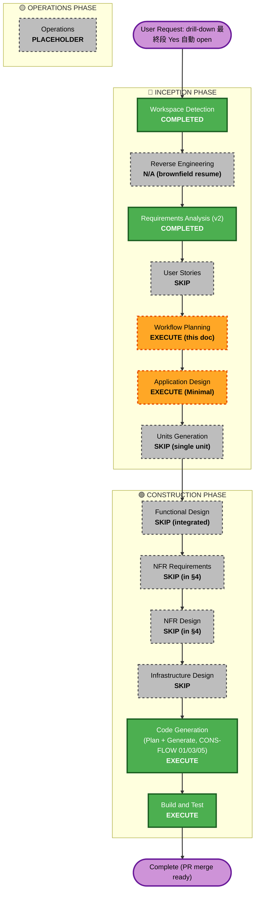

# drill-down-auto-open — Workflow Plan

**Feature ID**: drill-down-auto-open
**Phase**: AI-DLC INCEPTION / Workflow Planning
**Created**: 2026-05-26
**Status**: 承認待ち
**Based on**: [requirements.md v2](./requirements.md) + [extensions-opt-in-questions.md](./extensions-opt-in-questions.md)

## 1. Detailed Scope and Impact Analysis

### Transformation Scope (Brownfield)

| 項目 | 内容 |
|---|---|
| Transformation Type | **Single component change (frontend / backend prompt)** |
| Primary Changes | LLM prompt 1 分岐の condition 変更 + frontend handler に同期 `window.open` + SwipeChoice composite に 2 prop 追加 |
| Related Components | DecisionResult / SwipeChoice / mock_adapter / drill-down e2e |

### Change Impact Assessment

| 影響領域 | 該当 | 詳細 |
|---|---|---|
| User-facing | **Yes** | final 段の文言 (疑問形) + Yes 採択時の自動 open UX |
| Structural (architecture) | No | 新規 component / service / DB なし |
| Data model | No | スキーマ変更なし |
| API contract | No | SSE event payload は既存と同一 (`is_final`, `service` 既存) |
| NFR | **Yes** | NFR-DAO-06 (noopener), NFR-DAO-10 (a11y), NFR-DAO-07 (fail-safe) |

### Component Relationships

```
[user gesture]
       │
       ▼
[packages/ui/SwipeChoice] ── onYesSync? (new prop) ──┐
       │                                              │
       │ onYes (existing, 180ms delay)                │
       ▼                                              ▼
[apps/web/features/decision/DecisionResult.handleChoose]
       │
       ├─ isFinal && service → window.open(url, "_blank", "noopener,noreferrer")
       │                       (called via onYesSync, BEFORE await mutateAsync)
       │
       └─ await choose.mutateAsync ─→ [apps/api POST /v1/decisions/{id}/choose]
                                              │
                                              ▼
                                       [audit logging existing]

[apps/api/engine.py] ── depth==MAX で疑問形 prompt 要求 ──→ [LLM / mock_adapter]
                                                                    │
                                                                    ▼
                                                       [SSE proposal event]
                                                       { is_final: true,
                                                         proposal_text: "XXX で開きますか?",
                                                         service: { ... } }
```

| Component | Change Type | Reason | Priority |
|---|---|---|---|
| `engine.py` | Minor (prompt condition + final guide text) | FR-DAO-01 (C1) | Critical |
| `mock_adapter.py` | Minor (DRILL_DOWN_PROPOSALS[4] のみ) | FR-DAO-08 (M1) | Important |
| `SwipeChoice.tsx` | Minor (新 prop 2 個追加、既存 path 不変) | FR-DAO-09 (C2) + NFR-DAO-10 (M3) | Critical |
| `DecisionResult.tsx` | Minor (handleChoose 拡張 + prop 渡し) | FR-DAO-02, 03, 04, NFR-DAO-06 | Critical |
| `tests/e2e/drill-down-decision.spec.ts` | Minor (popup assertion 追加) | M2 verification | Important |
| `apps/web/tests/.../DecisionResult.test.tsx` | New (window.open spy 追加) | FR-DAO-09 verify | Important |

### Risk Assessment

| 項目 | 評価 |
|---|---|
| Risk Level | **Low** |
| Rollback Complexity | **Easy** (各 path で revert 可能、SwipeChoice の新 prop は optional で後方互換) |
| Testing Complexity | **Simple** — 既存 e2e + unit test の延長 + popup pattern 追加 |
| 影響 user base | 全 user (drill-down 最終段に到達したケース) |

## 2. Phase Determination

### 3.1 User Stories — **SKIP**
**理由**: requirements.md §5 で Gherkin scenarios 5 件 (映画 / 中間段 / 全 service / null / popup block) 既に網羅. personas は既存 anonymous-strangers feature で確定済、本 feature では既存 user persona に対する UX 改修のみ. multiple personas / 新規 stakeholder なし.

### 3.2 Application Design — **EXECUTE (Minimal depth)**
**理由**: SwipeChoice composite に **public API (props)** を追加するため、composite interface design が必要. ただし新規 service / 新規 component / 新規 abstraction はなく、既存 component の **non-breaking enhancement** のみ. 簡易な design doc で十分.

**Scope**:
- SwipeChoice の new props (`onYesSync`, `yesAriaLabelOverride`) の interface 仕様
- DecisionResult.handleChoose の擬似コード (window.open / await choose の順序)
- backend engine.py の prompt 分岐改修 diff sketch
- VIS-SUPP-01 評価: handleChoose 内のシーケンス更新 (Mermaid を requirements.md §9 で配置済 — 設計段で simulator step 詳細化)

### 3.3 Units Generation — **SKIP**
**理由**: 単一 unit (drill-down-auto-open) で完結. 既存の Post-CONSTRUCTION feature 群と同様 single unit 扱い. ユニット分割不要.

### 3.4 NFR Requirements / NFR Design — **SKIP (integrated)**
**理由**: NFR-DAO-06 (SECURITY-13), NFR-DAO-07 (SECURITY-15), NFR-DAO-10 (Accessibility) は requirements.md §4 に既に明示化済. 設計上の追加検討は Application Design 段で吸収. 新規 performance / scalability 要件なし.

### 3.5 Infrastructure Design — **SKIP**
**理由**: 新規 infrastructure なし. 既存 Lambda + Cognito + CloudFront 維持.

### 3.6 Functional Design (Construction per unit) — **SKIP (integrated to Application Design)**
**理由**: 業務ロジック追加なし. window.open / prompt condition 変更は Application Design で網羅可能.

### 3.7 Code Generation (Construction) — **EXECUTE (ALWAYS, CONS-FLOW Partial)**
**Plan stage**:
- **CONS-FLOW-01** (blocking): Exploration Findings — 3+ `path:line` 引用 + INCEPTION SVG ref (`screens/03-proposal-card.svg`)
- **CONS-FLOW-03** (blocking): Multi-approach — **Minimal-change** (SwipeChoice 触らず DecisionResult 内だけで対応) vs **Clean** (SwipeChoice に prop 追加で popup block 完全回避) の 2 案以上を提示し推奨を justify
- **CONS-FLOW-05** (blocking): Confidence-filtered review — confidence ≥ 80% のみ blocking、ad-hoc ID 可

**Generate stage**: 上記推奨案で実装、`packages/ui` / `apps/web` / `apps/api` の 4 ファイル + 2 test ファイルを更新

### 3.8 Build and Test — **EXECUTE (ALWAYS)**
- api unit (`pytest tests/unit/decision/`) — 既存 80 件回帰なし
- web vitest (`pnpm vitest run tests/features/decision/`) — 既存 118 件 + 新 window.open spy 件
- ui vitest (`pnpm vitest run packages/ui`) — 新 SwipeChoice onYesSync test
- e2e drill-down (`pnpm playwright test drill-down-decision`) — 既存 2 件 + popup assertion 追加
- 実 LLM 検証 (option, `RUN_REAL_LLM_E2E=1`) — 5 category × 3 試行で Amazon 到達率 ≥ 90%
- 手動: Chrome (Desktop / Pixel 5 emulation) + iOS Safari (NFR-DAO-04 M4 scope)

## 3. Workflow Visualization



## 4. Stage 別実行計画

### 🔵 INCEPTION PHASE

| Stage | Status | Output Artifact | 備考 |
|---|---|---|---|
| Workspace Detection | ✅ COMPLETED | `aidlc-state.md` resume | brownfield resume |
| Reverse Engineering | ⏭️ N/A | (skip) | 既存 spec / unit 完備 |
| Requirements Analysis (v2) | ✅ COMPLETED | [requirements.md v2](./requirements.md) | ultrathink review 反映済、user 承認 (Approval Gate 1 / CONS-FLOW-04 advisory) |
| Extensions Opt-In | ✅ COMPLETED | [extensions-opt-in-questions.md](./extensions-opt-in-questions.md) + aidlc-state.md | 5 ext 設定済 |
| User Stories | ⏭️ SKIP | — | Gherkin で網羅、新規 persona なし |
| Workflow Planning | 🟧 EXECUTE | **this doc** | 承認待ち |
| Application Design | 🟧 EXECUTE (Minimal) | `application-design.md` | SwipeChoice prop interface + handleChoose sketch |
| Units Generation | ⏭️ SKIP | — | 単一 unit で完結 |

### 🟢 CONSTRUCTION PHASE

| Stage | Status | Output Artifact | 備考 |
|---|---|---|---|
| Functional Design | ⏭️ SKIP | — | Application Design に統合 |
| NFR Requirements | ⏭️ SKIP | — | requirements §4 で網羅 |
| NFR Design | ⏭️ SKIP | — | requirements §4 で網羅 |
| Infrastructure Design | ⏭️ SKIP | — | 新規 infra なし |
| Code Generation (Plan) | ✅ EXECUTE | `construction/code/code-generation-plan.md` | **CONS-FLOW-01 + 03**: Exploration + Multi-approach + 承認待ち |
| Code Generation (Generate) | ✅ EXECUTE | source 改修 (4 file + 2 test) | 推奨案で実装 |
| Code Review | ✅ EXECUTE | `construction/code/review-findings.md` | **CONS-FLOW-05**: confidence ≥ 80% only blocking |
| Build and Test | ✅ EXECUTE | test results + Compliance Matrix 最終版 | regression なし確認 |

### 🟡 OPERATIONS PHASE

| Stage | Status | 備考 |
|---|---|---|
| Operations | 🟫 PLACEHOLDER | 既存 deploy pipeline 維持、本 feature 専用 op なし |

## 5. Approval Gates (CONS-FLOW-04 advisory under Partial mode)

3 gate のうち、advisory 適用方針:

| Gate | Trigger Point | Status | 記録先 |
|---|---|---|---|
| Gate 1 (after Exploration ≈ Requirements) | requirements.md v2 user 承認 | ✅ **PASSED** (2026-05-26 13:42 "OK") | audit.md |
| Gate 2 (after Architecture Design) | Code Generation Plan の Multi-approach 承認 | ⏳ Pending | audit.md (予定) |
| Gate 3 (after Quality Review) | Review findings 確認 + 修正方針承認 | ⏳ Pending | audit.md (予定) |

## 6. 検証 / 完了条件

- すべての FR-DAO-01..09 が test で verify 済
- すべての NFR-DAO-01..10 が doc / code で実証
- Compliance Matrix (requirements §10) の Compliant / N/A 区分が actual に一致
- regression なし (api 80 / web 118+ / ui baseline / e2e 既存 PASS)
- 実 LLM stats (option): Amazon 到達率 ≥ 90%
- 手動: Chrome + Pixel 5 emulation で「Yes 5 回 click → 新タブで Amazon サイト open」体感 100%

---

## 承認のお願い (CONS-FLOW-04 advisory: Approval Gate 1.5 / 補助)

> Workflow Plan 承認は CONS-FLOW 規定の必須 gate ではありませんが、Application Design / Code Generation に進む前に方針を fix するため確認させてください.

この workflow plan で進めて良ければ「**OK**」「**承認**」「**proceed**」のいずれかをお願いします. 修正点があれば箇条書きで指摘してください. 承認後、**Application Design (Minimal depth)** に進みます.
