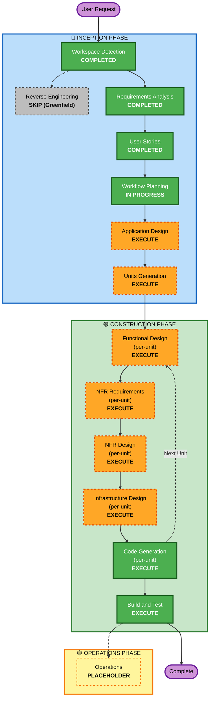

# 実行計画書 / Execution Plan

**プロジェクト**: YesMan
**作成日**: 2026-05-09
**プロジェクトタイプ**: Greenfield

---

## 1. 詳細スコープ・影響度分析

### 1.1 Transformation Scope (Greenfield のため適用なし)

新規開発のため、既存コンポーネントへの変更影響はなし。すべて新規作成。

### 1.2 Change Impact Assessment

| 影響領域 | 該当 | 内容 |
|---|:---:|---|
| **User-facing 変更** | ✅ Yes | PWA フロントエンド全体（スワイプ UX、断定調の提案演出、再考マイクロコピー、主体性スコアダッシュボード） |
| **構造的変更** | ✅ Yes | Greenfield: CloudFront+S3 + ALB + ECS Fargate (FastAPI) + Cognito + Aurora Serverless v2 + Bedrock + Polly/Transcribe + EventBridge + 新規 VPC の構成全体 |
| **データモデル変更** | ✅ Yes | Aurora Serverless v2 (PostgreSQL) スキーマ設計（profiles / decisions / preference_profiles / silence_logs）、JSONB で各人格の中間出力を格納 |
| **API 変更** | ✅ Yes | 全エンドポイント新規（決定依頼 / Yes-No 確定 / プロフィール / 履歴 / スコア / 嗜好閲覧・修正） |
| **NFR 影響** | ✅ Yes | Security Baseline + PBT 拡張強制、パフォーマンス（提案 < 5s）、可用性（≥ 99%）、PII フィルタ、Bedrock Guardrails |

### 1.3 Risk Assessment

| 項目 | レベル | 説明 |
|---|---|---|
| **Risk Level** | **Medium** | 技術的挑戦（複数 LLM 抽象化、合議プロンプト、嗜好学習、沈黙ガード）と倫理的繊細性が主要因。ハッカソン期限 (約 1 ヶ月) と LLM 課金 (LiteLLM 経由でローカル LLM / 各種 CLI 主体) はリスクから除外 |
| **Rollback Complexity** | N/A | 新規開発のためロールバック対象なし |
| **Testing Complexity** | **Complex** | PBT 対象あり（スコア / スワイプ / シリアライズ）、複数バックエンド切替テスト、Bedrock Guardrails 検証、E2E でのデモシナリオ通し |

### 1.4 主要な技術的論点

- **LLM 合議の単一プロンプト化** (FR-AI-08): コンテナ・Lambda 等のオーケストレーションを使わず、プロンプトのみで完結
- **AI 生成可変メッセージ** (FR-NUDGE-01〜03): 固定文ではなく毎回生成、レイテンシ最適化必須
- **3 系統のバックエンド抽象化** (FR-AUTH/HIST/VOICE): Strategy + DI で設定ファイル切替可能（認証: Cognito / MOCK / cognito-local、永続化: Aurora / MOCK / Docker PostgreSQL、音声: Polly+Transcribe / Web Speech API）
- **沈黙演出ガードの二重化** (Story D1 AC2): プロンプト判定 + Bedrock Guardrails
- **嗜好プロファイル非同期更新** (FR-LEARN-07): 提案レイテンシに影響を与えない

---

## 2. ワークフロー可視化



---

## 3. 実行ステージ判断

### 🔵 INCEPTION PHASE

| ステージ | 判断 | 根拠 |
|---|---|---|
| **Workspace Detection** | ✅ COMPLETED | 2026-05-09 完了 |
| **Reverse Engineering** | ⏭ SKIP | Greenfield のため対象なし |
| **Requirements Analysis** | ✅ COMPLETED | requirements.md 承認済 (2026-05-09) |
| **User Stories** | ✅ COMPLETED | personas.md / stories.md 承認済 (2026-05-09)、**34 ストーリー × 約 86 Gherkin AC** (2026-05-09 FR-PERSONA 追加で Journey G 7 ストーリー増 / 2026-05-10 FR-CV 追加で Journey B B7・B8 2 ストーリー増) |
| **Workflow Planning** | 🟡 IN PROGRESS | 本書 |
| **Application Design** | 🟠 **EXECUTE** | **新規コンポーネント多数**（PWA / ALB / ECS Fargate (FastAPI) / Cognito / Aurora / Bedrock 統合 / LiteLLM ラッパ / 嗜好プロファイラ / 音声抽象化 / EventBridge）。Component methods・business rules（合議プロンプト構造、嗜好更新、沈黙ガード）・Service layer・依存関係の整理が必要 |
| **Units Generation** | ✅ COMPLETED | unit-of-work.md / unit-of-work-dependency.md / unit-of-work-story-map.md 承認済 (2026-05-10T03:50Z)、**12 ユニット** (U1〜U7d + U-Persona + U-Test) に分解、依存マトリクス + 34 ストーリーマッピング完備 (FR-CV B7・B8 反映済) |

### 🟢 CONSTRUCTION PHASE (per-unit ループ)

| ステージ | 判断 | 根拠 |
|---|---|---|
| **Functional Design** | 🟠 **EXECUTE** | 合議プロンプト設計、嗜好プロファイル更新ロジック、主体性スコア計算 (PBT 対象)、沈黙演出判定、ナッジマイクロコピー生成プロンプト、スワイプジェスチャー判定 (PBT 対象) など、複雑なビジネスロジックが多数 |
| **NFR Requirements** | 🟠 **EXECUTE** | Security Baseline 強制、PBT 強制、パフォーマンス (NFR-PERF)、可用性 (NFR-AVAIL)、拡張性 (NFR-EXT)、国際化 (NFR-I18N) の要件あり |
| **NFR Design** | 🟠 **EXECUTE** | NFR Requirements を実行するため、対応するパターン設計（暗号化、PII フィルタ、Guardrails、サーキットブレーカー、フォールバック等）が必須 |
| **Infrastructure Design** | 🟠 **EXECUTE** | AWS サービス選択（Cognito / Aurora Serverless v2 / ECS Fargate / ALB / ECR / Bedrock / Polly / Transcribe / EventBridge / Secrets Manager / CloudWatch / X-Ray）、新規 VPC 構造（Public/Private + NAT）、CDK スタック構造、IAM ポリシーを設計する必要あり |
| **Code Generation** | 🟢 **EXECUTE** | 必須ステージ |
| **Build and Test** | 🟢 **EXECUTE** | 必須ステージ |

### 🟡 OPERATIONS PHASE

| ステージ | 判断 | 根拠 |
|---|---|---|
| **Operations** | ⏸ PLACEHOLDER | 現時点では将来の拡張用プレースホルダ |

---

## 4. 推奨ユニット分割（Units Generation の前提）

Units Generation で正式決定するが、現時点での推奨ユニット案を提示する。

| Unit | 名称 | 主要 Story | 並列化 | 担当ロール候補 |
|---|---|---|---|---|
| **U1** | Infrastructure (CDK 基盤) | F1〜F4 (基盤側) | 直列・最初 | 全員協力で短期完了 |
| **U2** | Storage & History Service | B5, F2, E1, E3, E4 | U1 完了後並列可 | フルスタック A |
| **U3** | Auth & Profile Service | A2, A3, F1 | U1 完了後並列可 | フルスタック A or B |
| **U4** | Decision Service (合議 + LLM + 沈黙ガード) | B3, B1, B2, C1, C2, C3, C4, D1, D2, F3 | U1 完了後並列可 | フルスタック B |
| **U5** | Learning Service (嗜好プロファイル) | E1, E2, E3, E4, E5 | U2 完了後 | フルスタック A or B |
| **U6** | Voice Service | B2 (音声側), F4 | 独立並列可 | フルスタック C |
| **U7** | Frontend PWA | A1, A4, B4, B6, D2, E3, E4, ナッジ演出全般 | U3〜U6 と並列、モック使用 | フルスタック C |

**順序とクリティカルパス**:
- U1 (Infrastructure) → クリティカルパス起点
- U2/U3/U4/U6 並列実行可能
- U5 は U2/U4 に依存
- U7 は U3〜U6 と並列実行（モック前提）→ 最後に統合

---

## 5. ステージ実行順序（Per-Unit Loop）

各ユニットで Construction Phase の per-unit ループ（Functional Design → NFR Requirements → NFR Design → Infrastructure Design → Code Generation）を実行。すべてのユニット完了後に Build and Test を実行。

```
For each Unit (U1 → U7):
  Functional Design (per-unit)
  → NFR Requirements (per-unit)
  → NFR Design (per-unit)
  → Infrastructure Design (per-unit)
  → Code Generation (per-unit)

After all units:
  Build and Test (integrated)
```

---

## 6. 推定タイムライン

| 項目 | 見積もり |
|---|---|
| **総ステージ数** | INCEPTION 残 2 (Application Design / Units Generation) + CONSTRUCTION per-unit × 12 ユニット + Build and Test = 約 9 メジャーステージ (per-unit ループはユニット数増加だが Build and Test は 1 回のみ) |
| **総ストーリー数** | 34 (元 25 + Journey G 7 + Journey B B7・B8 2) |
| **ハッカソン期限** | 約 1 ヶ月 (余裕あり) |
| **推定開発期間** | 2〜3 週間 (チーム 2〜3 名フルスタック・余裕を持って実装) |
| **インフラ立ち上げ** | 1〜2 日 (U1) |
| **コアサービス並列実装** | 1〜1.5 週間 (U2〜U6) |
| **フロントエンド統合** | 4〜5 日 (U7 + 統合) |
| **Build and Test 含む仕上げ** | 2〜3 日 |
| **バッファ** | 約 1 週間 (デモ動画作成・プレゼン資料作成・予備) |

---

## 7. 成功基準

### 主要ゴール
- AWS ハッカソンで提出可能な状態（公開デプロイ URL + プレゼン資料 + デモ動画）

### 主要成果物
- PWA フロントエンド（モバイル Web 動作）
- AWS インフラ一式（CDK 定義 + デプロイ済み）
- 認証・決定・学習・音声・永続化を統合した FastAPI コンテナ（ECS Fargate デプロイ）
- 34 ストーリーすべてが受け入れ基準（Gherkin）を満たす (FR-PERSONA で Journey G 7 / FR-CV で Journey B B7・B8 2 を追加)
- Security Baseline 違反 0、PBT 全テスト緑

### 品質ゲート
- すべての受け入れ基準（**19 項目** + Gherkin AC 約 86）の通過 (FR-PERSONA で #14〜16 / FR-CV で #17〜19 を追加)
- Security Baseline 拡張ルール準拠
- PBT 適用箇所のテスト通過
- 沈黙演出ガードが 4 ドメインすべてで二重に動作（プロンプト判定 + Bedrock Guardrails）
- 設定切替（認証 / 永続化 / LLM / 音声）が動作
- デモシナリオを 5 分以内で通せる

---

## 8. リスクと緩和

| リスク | 緩和策 |
|---|---|
| LLM 合議のレイテンシ過大 | 単一プロンプト化（FR-AI-08）+ 人格数を 2〜3 に抑える + キャッシュ |
| 沈黙演出ドメインのすり抜け | プロンプト判定 + Bedrock Guardrails の二重化 |
| 嗜好学習の偏狭化 | プロンプト多様性指示 + ユーザーリセット機能 (FR-LEARN-04) |
| 倫理的批判 | 起動時 onboarding 免責 + 沈黙演出ドメインで重大領域回避 |

**リスクから除外した項目** (ユーザー判断 2026-05-09):
- *ハッカソン期限超過*: ハッカソン期限が約 1 ヶ月確保されているため、現時点でのリスクとしては扱わない
- *Bedrock 課金の予期せぬ増加*: LiteLLM 経由で **ローカル LLM / Codex CLI / Claude Code CLI / Gemini CLI** を主要バックエンドとして使う方針のため、Bedrock 課金リスクは限定的

---

## 9. 拡張機能適用状況

| Extension | 適用 | 適用範囲 |
|---|:---:|---|
| Security Baseline | ✅ Yes | 全ステージで強制（特に Application Design / NFR / Code Generation） |
| Property-Based Testing | ✅ Yes | Functional Design / Code Generation / Build and Test で強制 |

---

## 10. 次のステップ

本計画の承認後、以下の順序で進めます：

1. **Application Design** — 新規コンポーネントの定義、Service Layer 設計、Component 関係図
2. **Units Generation** — システムを **12 ユニット** (U1〜U7d + U-Persona + U-Test) に正式分解、依存関係明確化 (FR-PERSONA 追加で U-Persona 1 ユニット増)
3. **Per-Unit Construction** — 各ユニットで Functional Design → NFR Req → NFR Design → Infrastructure Design → Code Generation を実行
4. **Build and Test** — 全ユニット統合・テスト・デモシナリオ通し

---

## Post-CONSTRUCTION 改修注記 (2026-05-19)

本 plan 本体は INCEPTION フェーズ開始時 (2026-05-09) の workflow 実行計画 Snapshot を保持。

### 実行結果サマリ
- 🔵 **INCEPTION フェーズ全完了** (2026-05-09 〜 2026-05-10): Requirements / User Stories / Workflow Planning / Application Design / Units Generation 全 5 stage 承認済
- 🟢 **CONSTRUCTION フェーズ全完了** (2026-05-10 〜 2026-05-16): 11 unit + Build and Test ALWAYS EXECUTE 全完了、約 313 ファイル / 10,000+ LOC、ultrathink 累計 ~265 件
- 🔁 **Post-CONSTRUCTION 改修フェーズ** (2026-05-17 〜 2026-05-19): Hackathon Pragmatism 緩和ルール下で `main` 直接 commit 運用、11 commit (詳細は `aidlc-docs/aidlc-state.md` 「Post-CONSTRUCTION 改修ログ」参照)
- 🟡 **OPERATIONS フェーズ** (placeholder): `cdk deploy --all` + AWS Hackathon 提出物作成を残す

### Workflow から外れた変更経路
本 plan が想定していた「Per-Unit Loop (FD → NFR Req → NFR Design → Infra → Code Gen Part 1+2) → 承認」のフルワークフローは CONSTRUCTION で完了。Post-CONSTRUCTION 改修は CLAUDE.md `Git-Flow Branching Model` 「Hackathon Pragmatism」緩和ルール (single developer、PR レビュー省略、release branch 省略、ただし mandatory test skip 不可) を採用し、各 commit で個別に E2E 全件再実行で regression 検証。

→ Post-CONSTRUCTION 段階では本 execution-plan が想定する承認 gate を経由せず、各 unit の `functional-design.md` / NFR / Infra / Code Gen Plan には末尾に「## Post-CONSTRUCTION 改修注記」セクションを追記する形で記録。
