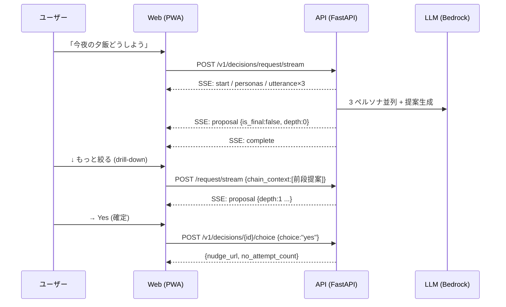
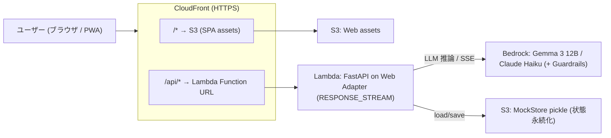

# 01. 概要設計

## 1.1 サービスコンセプト

**YesMan** は、現代人の**判断疲労 (decision fatigue)** を、AI への意思決定の委任で解消する意思決定支援サービスです。

- **タグライン**: 「人間最後の仕事は、YES で承認すること。」
- **コアバリュー**: ユーザーは「何を決めてほしいか」を伝えるだけ。AI が複数人格の合議で提案を生成し、ユーザーは **Yes / No スワイプによる最終承認のみ**に集中する。
- **思想**: 自分で全部決める負担から解放し、「決めなくていい」を心地よく実現する。倫理的に踏み込むべきでない領域 (宗教・選挙・暴力・卑猥) は AI が沈黙する。

### ターゲットユーザー (対比ペルソナ)

| ペルソナ | 属性 | 位置づけ |
|---|---|---|
| 田中 涼介 | 32歳 PdM | メインターゲット。判断疲労を抱える現代人 |
| 佐藤 美咲 | 20歳 大学生 | 共感的ガイダンス受容層。自分で決めるのが苦手 |
| 山田 啓介 | 41歳 CEO | **対比ペルソナ**。強い意志を持ち YesMan が刺さらない人 (=救わない層を明示) |

## 1.2 主要機能 (ユーザー視点)

| 機能 | 概要 | 実装の要点 |
|---|---|---|
| **好み学習オンボーディング** | 性格×生活の Yes/No 質問をスワイプ、嗜好プロファイルを構築 | `OnboardingPage` → `PreferenceProfile` 初期化 (ColdStart 推定) |
| **3 ペルソナ合議** | 慎重派 / 楽観派 / 効率派などが議論し最終提案を生成 | `asyncio.gather` で 3 並列 LLM、SSE で逐次可視化 |
| **Yes/No スワイプ + 4 方向** | 右=決定 / 左=別案 / 上=中断 / 下=もっと絞る | `SwipeChoice` (四辺ボタン + キーボード, WCAG 2.5.1) |
| **Drill-down (深掘り)** | 「もっと絞る」で決定領域を段階的に絞り込み、最終段で外部サービスへ | `MAX_DRILL_DEPTH=4`, `chain_context`, `service_catalog` |
| **委任度スコア** | Yes 比率を円グラフ + 30日推移で可視化 | `AutonomyScorer` (累積 yes_ratio) |
| **ペルソナ管理 (3 系統)** | プリセット / 知り合い (匿名共有プール) / カスタムから最大 3 人 | `selected_personas` (source 混在), 共有プール + 通報 |
| **沈黙ドメイン (倫理ガードレール)** | 4 ドメインは応答停止 | regex + LLM 自己判定の 2 段 + Bedrock Guardrails, fail-closed |
| **音声入出力** | Web Speech API ↔ Server STT/TTS を切替 | `VOICE_BACKEND` (web-speech-api / aws / mock) |
| **デモモード** | email に `morimatsu` を含むと妻/娘/ワンコ + 使い込み履歴を即再現 | `DemoLLMAdapter` ラップ (本物経路は不変) |

機能の内部仕様は [02. フロントエンド設計](./02-frontend-design.md) / [03. バックエンド設計](./03-backend-design.md) を参照。

## 1.3 主要ユースケースの流れ



## 1.4 モノレポ構成

pnpm workspace によるモノレポ (`pnpm-workspace.yaml`)。

```
yesman/
├── apps/
│   ├── web/              # フロントエンド (React 18 + Vite + Tailwind / PWA)
│   └── api/              # バックエンド (FastAPI + Python 3.12)
├── packages/
│   ├── ui/               # 共通 UI コンポーネント (SwipeChoice, PersonaCard, MangaStage 等)
│   └── api-client/       # 型付き API クライアント (OpenAPI → openapi-typescript 自動生成)
├── infra/                # AWS CDK v2 (TypeScript)
├── docs/                 # ユーザー/デモ向けドキュメント (本設計書を含む)
└── aidlc-docs/           # AI-DLC の Inception/Construction 思考トレース
```

| パッケージ | 役割 | 主要技術 |
|---|---|---|
| `@yesman/web` | PWA フロントエンド | React 18 / Vite / React Router / TanStack Query / Tailwind 4 |
| `@yesman/api` | FastAPI バックエンド | FastAPI / Python 3.12 / SQLModel / Pydantic / LiteLLM / Bedrock |
| `@yesman/ui` | 共通 UI | React 18 / Tailwind 4 / CVA / react-swipeable |
| `@yesman/api-client` | API ラッパー (pure fetch, 依存なし) | TypeScript / openapi-typescript |
| `infra` | IaC | AWS CDK 2.x |

## 1.5 技術スタック総覧

| カテゴリ | 技術 |
|---|---|
| フロント | React 18 / Vite 5 / TypeScript 5.4 / React Router 6 / TanStack Query 5 / Tailwind 4 / PWA |
| バック | FastAPI / Python 3.12 / SQLModel / Pydantic / Alembic |
| LLM | Bedrock (Gemma 3 12B IT / Claude Haiku) / LiteLLM / Claude Code CLI / Mock — `LLM_PROVIDER` で切替 |
| DB | Aurora Serverless v2 (PostgreSQL) / MockStore (in-memory + S3 pickle 永続化) — `STORAGE_BACKEND` で切替 |
| 認証 | AWS Cognito / Mock Auth — `AUTH_BACKEND` で切替 |
| 音声 | AWS Polly (TTS) / Transcribe (STT) / Web Speech API / Mock — `VOICE_BACKEND` で切替 |
| インフラ | CloudFront / S3 / Lambda (Web Adapter) / Bedrock / (ECS / Aurora / Cognito / EventBridge) / CDK |
| CI/CD | GitHub Actions / Docker / OIDC |
| テスト | Vitest / Playwright / Hypothesis (PBT) |

## 1.6 全体アーキテクチャ (実デプロイ構成)



- **SSE 対応**: Lambda Web Adapter を `RESPONSE_STREAM` モードで動かし、CloudFront の API ビヘイビアは圧縮無効・キャッシュ無効。合議の逐次配信 (Server-Sent Events) を実現。
- **状態**: 認証は mock (固定 demo user)、ストレージは MockStore を S3 に pickle 永続化することで Lambda マルチインスタンス間の一貫性を確保。

詳細は [04. インフラ設計](./04-infrastructure-design.md) を参照。

## 1.7 設計思想: 差し替え可能性 (Strategy + DI)

YesMan の最大の設計特徴は、**外部依存をすべて Protocol で抽象化し、環境変数で実装を切り替えられる**ことです。

| 環境変数 | 切替対象 | 値 |
|---|---|---|
| `LLM_PROVIDER` | LLM | `bedrock` / `litellm` / `claude-cli` / `mock` |
| `STORAGE_BACKEND` | 永続化 | `aurora` / `docker-postgres` / `mock` |
| `AUTH_BACKEND` | 認証 | `cognito` / `cognito-local` / `mock` |
| `VOICE_BACKEND` | 音声 | `aws` / `web-speech-api` / `mock` |
| `EVENT_BACKEND` | イベント | `eventbridge` / `inline-async` / `sync` |

これにより、(a) ローカル開発を AWS 不要で完結、(b) テストを mock で高速・決定論的に実行、(c) 本番を AWS サービスで稼働、を同一コードで実現します。各 Adapter は `application/` 層の Protocol を実装し、`infrastructure/*/factory.py` が起動時に 1 度だけ生成します ([03](./03-backend-design.md) §3.1)。

## 1.8 非機能要件 (抜粋)

| 区分 | 要件 | 実現手段 |
|---|---|---|
| 性能 | 合議は SSE で逐次表示し体感待ちを最小化 | 3 ペルソナ並列 + トークンストリーミング。per-persona 30s / stream 全体 120s timeout |
| 可用性 | LLM 失敗時も全滅させない | ペルソナ単位 timeout、全滅時のみ `all_personas_failed` (502) |
| プライバシー | 沈黙ログに本文を残さない | `SilenceLog` は `SHA-256(salt+user_id+input)` のみ保存 (NFR-PRIV-04) |
| 安全性 | 倫理領域で確実に沈黙 | regex + LLM の 2 段 + Bedrock Guardrails、**fail-closed** |
| アクセシビリティ | スワイプ以外の代替操作 | 四辺ボタン + キーボード (←→↑↓)、brand AA 5.5:1 |
| コスト | 常時起動コストを避ける | Lambda Function URL + MockStore (ハッカソン MVP) |

## 1.9 開発プロセス (AI-DLC)

- **AI-DLC** (AWS AI-powered Development Lifecycle): Inception → Construction → Operations。14 Units に分解 (U1 infra / U2-U6 backend / U7a-d frontend / U-Persona / U-Test)。思考トレースは `aidlc-docs/` に蓄積。

| フェーズ | 主な成果物 |
|---|---|
| Inception | 要件・ユーザーストーリー・アプリ設計・Unit 分解 (`aidlc-docs/inception/`) |
| Construction | Unit ごとの機能設計・NFR・インフラ設計・コード生成 (`aidlc-docs/construction/`) |
| Operations | デプロイ・監視 (placeholder) |

- **Git-Flow** (`CLAUDE.md` 準拠): `main` / `develop` / `feature/*` / `bugfix/*`。Conventional Commits + `Co-Authored-By` trailer。develop へは PR 経由・`--no-ff` マージ。

---

→ 詳細は [02. フロントエンド設計](./02-frontend-design.md) / [03. バックエンド設計](./03-backend-design.md) / [04. インフラ設計](./04-infrastructure-design.md) / [05. データモデル設計](./05-data-model.md) へ。
