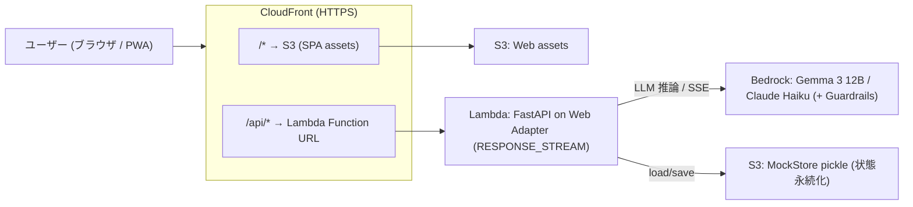

# 01. 概要設計

## 1.1 サービスコンセプト

**YesMan** は、現代人の**判断疲労 (decision fatigue)** を、AI への意思決定の委任で解消する意思決定支援サービスです。

- **タグライン**: 「人間最後の仕事は、YES で承認すること。」
- **コアバリュー**: ユーザーは「何を決めてほしいか」を伝えるだけ。AI が複数人格の合議で提案を生成し、ユーザーは **Yes / No スワイプによる最終承認のみ**に集中する。
- **思想**: 自分で全部決める負担から解放し、「決めなくていい」を心地よく実現する。倫理的に踏み込むべきでない領域 (宗教・選挙・暴力・卑猥) は AI が沈黙する。

### ターゲットユーザー (対比ペルソナ)

| ペルソナ | 属性 | 位置づけ |
|---|---|---|
| 田中 涼介 | 32歳 PdM | メインターゲット。判断疲労を抱える現代人 |
| 佐藤 美咲 | 20歳 大学生 | 共感的ガイダンス受容層。自分で決めるのが苦手 |
| 山田 啓介 | 41歳 CEO | **対比ペルソナ**。強い意志を持ち YesMan が刺さらない人 (=救わない層を明示) |

## 1.2 主要機能 (ユーザー視点)

| 機能 | 概要 |
|---|---|
| **好み学習オンボーディング** | 性格×生活の Yes/No 質問をスワイプ、嗜好プロファイルを構築 |
| **3 ペルソナ合議** | 慎重派 / 楽観派 / 効率派 などが議論し、最終提案を生成 (SSE でリアルタイム可視化) |
| **Yes/No スワイプ + 4 方向** | 右=決定 / 左=別案 / 上=中断 / 下=もっと絞る。マーチング矢印で誘導 |
| **Drill-down (深掘り)** | 「もっと絞る」で決定領域を段階的に絞り込み、最終段で外部サービス (Amazon 等) へ |
| **委任度スコア** | Yes 比率を円グラフ + 30日推移で可視化。「人生の N% を AI に委ねています」 |
| **ペルソナ管理 (3 系統)** | プリセット / 知り合い (匿名共有プール) / カスタム から最大 3 人を選択 |
| **沈黙ドメイン (倫理ガードレール)** | 4 ドメインは応答停止 (regex + LLM 自己判定の 2 段 + Bedrock Guardrails) |
| **音声入出力** | Web Speech API (ブラウザ内蔵) ↔ Server STT/TTS (AWS Transcribe/Polly) を切替 |
| **デモモード** | email に `morimatsu` を含むと、妻/娘/ワンコ ペルソナ + 使い込み履歴を即再現 |

## 1.3 モノレポ構成

pnpm workspace によるモノレポ (`pnpm-workspace.yaml`)。

```
yesman/
├── apps/
│   ├── web/              # フロントエンド (React 18 + Vite + Tailwind / PWA)
│   └── api/              # バックエンド (FastAPI + Python 3.12)
├── packages/
│   ├── ui/               # 共通 UI コンポーネント (SwipeChoice, PersonaCard, MangaStage 等)
│   └── api-client/       # 型付き API クライアント (OpenAPI → openapi-typescript 自動生成)
├── infra/                # AWS CDK v2 (TypeScript)
├── docs/                 # ユーザー/デモ向けドキュメント (本設計書を含む)
└── aidlc-docs/           # AI-DLC の Inception/Construction 思考トレース
```

| パッケージ | 役割 | 主要技術 |
|---|---|---|
| `@yesman/web` | PWA フロントエンド | React 18 / Vite / React Router / TanStack Query / Tailwind 4 |
| `@yesman/api` | FastAPI バックエンド | FastAPI / Python 3.12 / SQLModel / Pydantic / LiteLLM / Bedrock |
| `@yesman/ui` | 共通 UI | React 18 / Tailwind 4 / CVA / react-swipeable |
| `@yesman/api-client` | API ラッパー (pure fetch, 依存なし) | TypeScript / openapi-typescript |
| `infra` | IaC | AWS CDK 2.x |

## 1.4 技術スタック総覧

| カテゴリ | 技術 |
|---|---|
| フロント | React 18 / Vite 5 / TypeScript 5.4 / React Router 6 / TanStack Query 5 / Tailwind 4 / PWA |
| バック | FastAPI / Python 3.12 / SQLModel / Pydantic / Alembic |
| LLM | Bedrock (Gemma 3 12B IT / Claude Haiku) / LiteLLM / Claude Code CLI / Mock — `LLM_PROVIDER` で切替 |
| DB | Aurora Serverless v2 (PostgreSQL) / MockStore (in-memory + S3 pickle 永続化) — `STORAGE_BACKEND` で切替 |
| 認証 | AWS Cognito / Mock Auth — `AUTH_BACKEND` で切替 |
| 音声 | AWS Polly (TTS) / Transcribe (STT) / Web Speech API / Mock — `VOICE_BACKEND` で切替 |
| インフラ | CloudFront / S3 / Lambda (Web Adapter) / Bedrock / (ECS / Aurora / Cognito / EventBridge) / CDK |
| CI/CD | GitHub Actions / Docker / OIDC |
| テスト | Vitest / Playwright / Hypothesis (PBT) |

## 1.5 全体アーキテクチャ (実デプロイ構成)



- **SSE 対応**: Lambda Web Adapter を `RESPONSE_STREAM` モードで動かし、CloudFront の API ビヘイビアは圧縮無効・キャッシュ無効。合議の逐次配信 (Server-Sent Events) を実現。
- **状態**: 認証は mock (固定 demo user)、ストレージは MockStore を S3 に pickle 永続化することで Lambda マルチインスタンス間の一貫性を確保。

## 1.6 設計思想: 差し替え可能性 (Strategy + DI)

YesMan の最大の設計特徴は、**外部依存をすべて Protocol で抽象化し、環境変数で実装を切り替えられる**ことです。

| 環境変数 | 切替対象 | 値 |
|---|---|---|
| `LLM_PROVIDER` | LLM | `bedrock` / `litellm` / `claude-cli` / `mock` |
| `STORAGE_BACKEND` | 永続化 | `aurora` / `docker-postgres` / `mock` |
| `AUTH_BACKEND` | 認証 | `cognito` / `cognito-local` / `mock` |
| `VOICE_BACKEND` | 音声 | `aws` / `web-speech-api` / `mock` |
| `EVENT_BACKEND` | イベント | `eventbridge` / `inline-async` / `sync` |

これにより、(a) ローカル開発を AWS 不要で完結、(b) テストを mock で高速・決定論的に実行、(c) 本番を AWS サービスで稼働、を同一コードで実現します。

## 1.7 開発プロセス

- **AI-DLC** (AWS AI-powered Development Lifecycle): Inception → Construction → Operations。14 Units に分解 (U1 infra / U2-U6 backend / U7a-d frontend / U-Persona / U-Test)。思考トレースは `aidlc-docs/` に蓄積。
- **Git-Flow** (`CLAUDE.md` 準拠): `main` / `develop` / `feature/*` / `bugfix/*`。Conventional Commits + `Co-Authored-By` trailer。develop へは PR 経由・`--no-ff` マージ。

---

→ 詳細は [02. フロントエンド設計](./02-frontend-design.md) / [03. バックエンド設計](./03-backend-design.md) / [04. インフラ設計](./04-infrastructure-design.md) へ。
