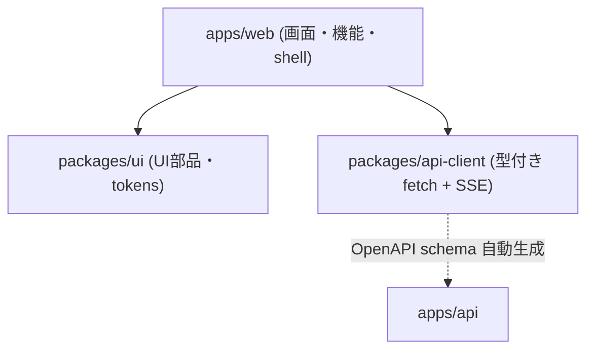
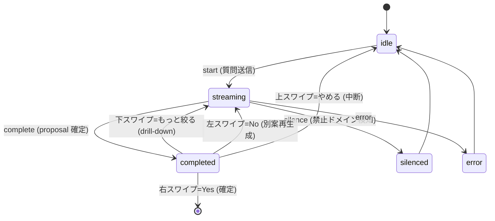

# 02. フロントエンド設計

対象: `apps/web` + `packages/ui` + `packages/api-client`

## 2.1 技術スタックと方針

| 項目 | 採用 | 備考 |
|---|---|---|
| UI | React 18 + TypeScript 5.4 | |
| ビルド | Vite 5 | chunk 分割 (react-vendor / tanstack-query / aws-amplify) |
| ルーティング | React Router 6 | `createBrowserRouter` + lazy import |
| サーバ状態 | TanStack Query 5 | `useQuery` / `useMutation` (Redux 不使用) |
| ローカル状態 | `useReducer` / `useState` | 合議画面は reducer で state machine |
| スタイル | Tailwind CSS 4 | `@yesman/ui` の preset を共有 |
| 認証 | aws-amplify 6 (Cognito) + bypass mock | |
| PWA | vite-plugin-pwa | autoUpdate / skipWaiting |
| テスト | Vitest + jsdom | coverage 75% lines |

**状態管理の原則**: サーバ由来データは TanStack Query (キャッシュ + 再取得)、画面内の一時状態は `useReducer`。グローバルストア (Redux 等) は持たない。

## 2.2 パッケージ責務

- **`packages/api-client`** — 純粋な fetch ラッパー (依存なし、size-limit 5KB)。`client.ts` が 8 モジュール (profiles/decisions/scores/preferences/personas/persona-selections/voice/persona-pool) を統合。`sse.ts` が SSE (`DecisionStream`, ReadableStream ベースの AsyncGenerator)。型は `generated/schema.ts` (openapi-typescript)。
- **`packages/ui`** — composites (PersonaCard, SwipeChoice, MangaBubble, DecisionUtteranceBubble, BlobAvatar 等) + primitives (Button, Input, Modal, Toast 等) + tokens (brand `#ea580c`, Inter/Noto Sans JP)。
- **`apps/web`** — `shell/` (Provider 群・ルーティング・認証) + `features/` (機能モジュール)。

## 2.3 ルーティングと画面

`apps/web/src/shell/routes.tsx`

| Route | Component | 認証 | 責務 |
|---|---|---|---|
| `/auth/splash` | SplashPage | 不要 | ロゴ + 起動画面 |
| `/auth/signin` | SignInPage | 不要 | email サインイン / Cognito リダイレクト |
| `/auth/callback` | CallbackPage | - | Cognito OAuth コールバック |
| `/` | HomePage | 要 | ダッシュボード + QuickStart 質問 |
| `/decision` | DecisionPage | 要 | **メイン**: 質問 → SSE 合議 → Yes/No スワイプ |
| `/personas` | PersonaListPage | 要 | 自作ペルソナ一覧 + 作成 |
| `/personas/selection` | PersonaSelectionPage | 要 | プリセット/知り合い/カスタムから最大 3 人選択 |
| `/score` | ScorePage | 要 | 委任度スコア (円グラフ + 推移) + Yes 採択履歴 |
| `/preferences` | PreferencePage | 要 | 嗜好傾向の可視化 |
| `/profile` | ProfilePage | 要 | アバター編集 + 匿名プール opt-in |
| `/onboarding` | OnboardingPage | 要 | 新規ユーザーの嗜好シグナル収集 |

`RequireAuth` で未認証は `/auth/signin` へリダイレクト。

## 2.4 機能モジュール (`apps/web/src/features/`)

| feature | 主要ファイル | 責務 |
|---|---|---|
| `decision` | DecisionPage, reducer.ts, useDecisionStream, DecisionResult, MangaStage, useQuickStart, usePrefetchedDecisions, useYesNudge | 合議のメインフロー |
| `persona` | usePersona, PersonaSelectionPage, useUnifiedSelection, PersonaCreateModal, SelectedPersonaAvatars | ペルソナ管理・選択 |
| `score` | ScorePage, useScore, useDecisionHistory | 委任度スコア・履歴 |
| `profile` | ProfilePage, AvatarEditor, useProfile | プロフィール・アバター |
| `preference` | PreferencePage, usePreference | 嗜好傾向 |
| `voice` | useVoiceInput, useWebSpeechRecognition, VoiceMicInput | 音声入力 (2 backend 切替) |
| `auth` | SignInPage, SplashPage, CallbackPage | 認証画面 |

## 2.5 合議画面の状態管理 (核心)

`features/decision/reducer.ts` の `decisionReducer` が discriminated union の state machine を管理します。

- **`useDecisionStream`** — `packages/api-client` の `DecisionStream` を消費し、SSE イベント種別ごとに reducer へ dispatch。`AbortController` で中断対応。
- **SSE イベントフロー**: `start`(decision_id) → `personas`(3人事前表示) → `utterance_delta`(トークン逐次) → `utterance`(発言確定) → `proposal`(提案 + is_final + depth + service) → `complete` / `silence`。
- **StageMode**: `chat` (builtin、トークンストリーミング) / `manga` (匿名プール、MangaStage で漫画調レイアウト)。
- **補助 hook**: `useQuickStart` (ホームの Yes/No 候補、24h dedupe)、`usePrefetchedDecisions` (No 連打時に別案を先読み)、`useYesNudge` (No 後の Yes 後押し microcopy を LLM 生成)。

### スワイプ UI (SwipeChoice)

`packages/ui/src/composites/SwipeChoice.tsx` (react-swipeable)。カード四辺のラベル風ボタン (塗りなし・タップ可) で 4 方向を表現:

| 方向 | アクション | 表示 |
|---|---|---|
| → 右 | Yes (確定) | 緑 `→ → →` マーチング |
| ← 左 | No (別案再生成) | グレー `← ← ←` マーチング |
| ↑ 上 | やめる (中断 → 入力画面へ) | `↑ やめる` (有効時のみ) |
| ↓ 下 | もっと絞る (深掘り) | `↓ もっと絞る` (非final 時のみ) |

タップ = 即時 callback、スワイプ/キーボード(←→↑↓) = 180ms アニメ後。WCAG 2.5.1 (ポインタジェスチャ代替) を四辺ボタンとキーボードで担保。

## 2.6 API クライアント (`packages/api-client`)

- `YesmanApiClient.request()`: ヘッダーマージ → `TokenProvider.getToken()` で Bearer 付与 → 401 時 `refresh()` で 1 回リトライ。`ApiError` に正規化 (`validation_error` / `unauthorized` / `network_error` 等)。
- SSE は `DecisionStream` (fetch の ReadableStream をパースして AsyncGenerator 化、`AbortSignal` 対応)。
- 主要メソッド例: `decisions.streamRequest(payload)` / `decisions.choose(id, "yes"|"no")` / `personas.listMy()` / `scores.get()` / `voice.tts(text, voiceId)`。

## 2.7 認証フロー

`shell/AuthProvider.tsx` + `shell/auth.ts` + `shell/ApiProvider.tsx`

- **本番 (Cognito)**: Amplify `fetchAuthSession()` → idToken。`CognitoTokenProvider.getToken()` が idToken を返す。
- **bypass mode** (`VITE_AUTH_BYPASS=true`): `mockAuthStorage` (localStorage) に email/sub を保持し、Bearer を `mock-user:${base64url({sub, email})}` 形式で送信。バックエンドの Mock 認証がこれをデコードして `AuthenticatedUser` を生成 → マルチユーザーをローカルで実現。
- デモモード判定もここ: email に `morimatsu` を含むと、`unifiedSelectionStorage` が既定選択を 妻/娘/ワンコ にする。

## 2.8 UI コンポーネントライブラリ (`packages/ui`)

- **composites**: `SwipeChoice` (4方向スワイプ)、`PersonaCard` (avatar emoji を `yesman-avatar:` base64 から decode 表示)、`MangaStage`/`MangaBubble` (漫画調合議)、`DecisionUtteranceBubble` (トークンストリーミング)、`BlobAvatar` (匿名ペルソナ)。
- **tokens**: brand `#ea580c` (オレンジ, AA 5.5:1)、Inter + Noto Sans JP。
- **アバター符号化**: emoji + 色を `yesman-avatar:<base64(JSON{mode,color,emoji})>` として `avatar_url` に格納。PersonaCard / SelectedPersonaAvatars / MangaStage が共通の `decodeAvatarConfig` で復号して表示 (選択画面・ホーム・議論画面で統一)。

## 2.9 ビルド・テスト

- **ビルド**: Vite (PWA / chunk 分割 / sourcemap)。`VITE_API_BASE_URL=/api`、`VITE_AUTH_BYPASS=true` で本番ビルド (mock 認証構成)。
- **テスト**: Vitest + jsdom。`tests/shell/` (Provider・ルーティング)、`tests/features/` (各機能)、`tests/property/` (reducer の property-based)。

---

→ [03. バックエンド設計](./03-backend-design.md) / [04. インフラ設計](./04-infrastructure-design.md)
