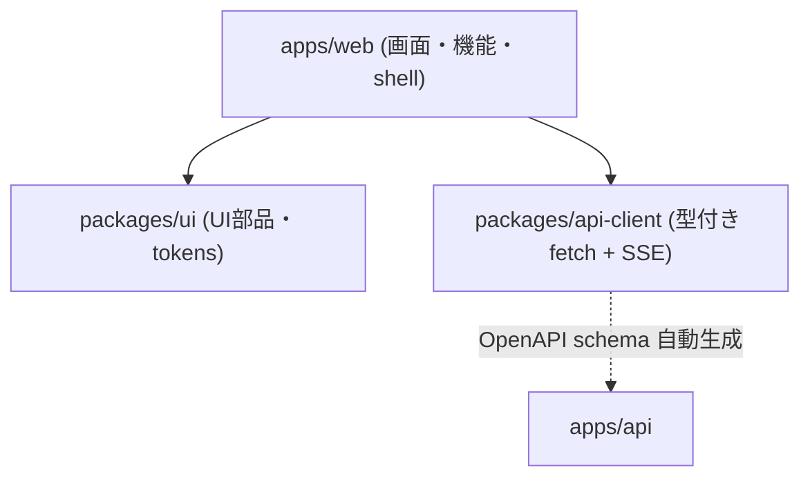
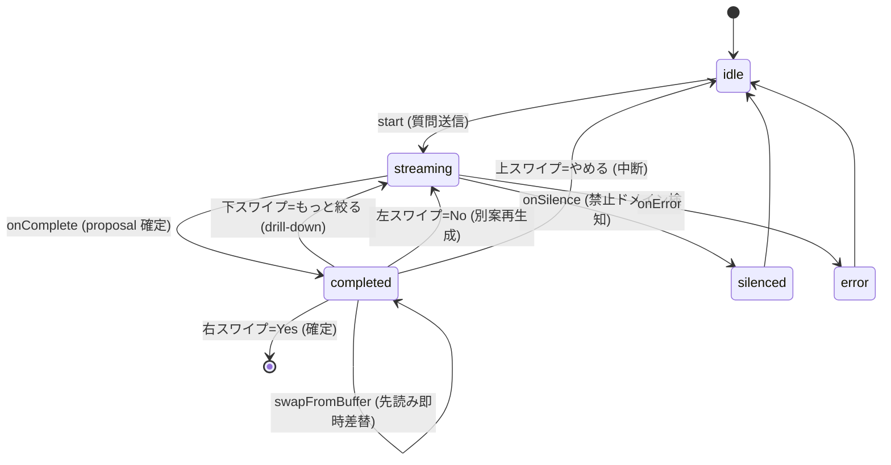

# 02. フロントエンド設計

対象: `apps/web` + `packages/ui` + `packages/api-client`

## 2.1 技術スタックと方針

| 項目 | 採用 | 備考 |
|---|---|---|
| UI | React 18 + TypeScript 5.4 | 関数コンポーネント + Hooks |
| ビルド | Vite 5 (target `es2022`) | chunk 分割 (react-vendor / tanstack-query / aws-amplify)、sourcemap、visualizer |
| ルーティング | React Router 6 | `createBrowserRouter` + lazy import |
| サーバ状態 | TanStack Query 5 | `useQuery` / `useMutation` (Redux 不使用) |
| ローカル状態 | `useReducer` / `useState` | 合議画面は reducer の state machine |
| スタイル | Tailwind CSS 4 | `@yesman/ui` の preset を共有、brand `#ea580c` |
| 認証 | aws-amplify 6 (Cognito) + bypass mock | `VITE_AUTH_BYPASS` で切替 |
| PWA | vite-plugin-pwa | `autoUpdate` / `skipWaiting` / `clientsClaim` |
| テスト | Vitest + jsdom | coverage 閾値 lines 75% / branches 65% |

**状態管理の原則**: サーバ由来データは TanStack Query (キャッシュ + 再取得)、画面内の一時状態は `useReducer` / `useState`。グローバルストア (Redux 等) は持たない。

## 2.2 パッケージ責務

- **`packages/api-client`** — 純粋な fetch ラッパー (依存なし、size-limit 5KB)。`client.ts` が 8 モジュール (profiles / decisions / scores / preferences / personas / persona-selections / voice / persona-pool) を統合。`sse.ts` が `DecisionStream` (ReadableStream → AsyncGenerator)。型は `generated/schema.ts` (openapi-typescript)。
- **`packages/ui`** — composites (PersonaCard, SwipeChoice, MangaBubble, DecisionUtteranceBubble, BlobAvatar 等) + primitives (Button, Input, Modal, Toast 等) + tokens (brand `#ea580c`, Inter / Noto Sans JP)。
- **`apps/web`** — `shell/` (Provider 群・ルーティング・認証) + `features/` (機能モジュール)。

## 2.3 ルーティングと画面 (`shell/routes.tsx`)

全ルート lazy import。`RequireAuth` で未認証は `/auth/signin` へリダイレクト。認証時のみ `Layout` (BottomNav + safe-area inset) でラップ。

| Route | Component | 認証 | 責務 |
|---|---|---|---|
| `/auth/splash` | SplashPage | 不要 | ロゴ + 起動画面 (Layout 外) |
| `/auth/signin` | SignInPage | 不要 | email サインイン / Cognito リダイレクト |
| `/auth/callback` | CallbackPage | 不要 | Cognito OAuth コールバック |
| `/` | HomePage | 要 | ダッシュボード + QuickStart 質問 |
| `/decision` | DecisionPage | 要 | **メイン**: 質問 → SSE 合議 → Yes/No スワイプ |
| `/personas` | PersonaListPage | 要 | 自作ペルソナ一覧 + 作成 |
| `/personas/selection` | PersonaSelectionPage | 要 | プリセット/知り合い/カスタムから最大 3 人選択 |
| `/score` | ScorePage | 要 | 委任度スコア (円グラフ + 30日推移) + Yes 履歴 |
| `/preferences` | PreferencePage | 要 | 嗜好傾向の可視化 |
| `/profile` | ProfilePage | 要 | アバター編集 + 匿名プール opt-in |
| `/onboarding` | OnboardingPage | 要 | 新規ユーザーの嗜好シグナル収集 |
| `*` | `<Navigate to="/" />` | — | 404 fallback |

**BottomNav** (`shell/BottomNav.tsx`): ホーム `/` / スコア `/score` / ペルソナ `/personas/selection` / プロフィール `/profile`。fixed bottom、active は brand-orange + bold。`Layout` は header を持たず、`env(safe-area-inset-*)` で iPhone のノッチ/ホームインジケータを回避。

## 2.4 機能モジュール (`apps/web/src/features/`)

| feature | 主要ファイル | 責務 |
|---|---|---|
| `decision` | DecisionPage, reducer.ts, useDecisionStream, useQuickStart, usePrefetchedDecisions, useYesNudge, MangaStage | 合議のメインフロー |
| `persona` | usePersona, useUnifiedSelection, usePersonaSource, PersonaSelectionPage, PersonaCreateModal | ペルソナ管理・選択 |
| `score` | ScorePage, useScore, useDecisionHistory | 委任度スコア・履歴 |
| `profile` | ProfilePage, AvatarEditor, useProfile | プロフィール・アバター |
| `preference` | PreferencePage, usePreference | 嗜好傾向 |
| `voice` | useVoiceInput, useWebSpeechRecognition, VoiceMicInput | 音声入力 (2 backend 切替) |
| `auth` | SignInPage, SplashPage, CallbackPage | 認証画面 |

## 2.5 合議画面の状態管理 (核心)

`features/decision/reducer.ts` の `decisionReducer` が discriminated union の state machine を管理します。

### State (status ごとの保持フィールド)

| status | 保持フィールド |
|---|---|
| `idle` | `input` |
| `streaming` | `input`, `decisionId\|null`, `utterances[]`, `proposal\|null`, `isFinal`, `depth`, `service\|null`, `lastSpeakerId` |
| `completed` | `decisionId`, `input`, `utterances[]`, `proposal`, `isFinal`, `depth`, `service`, `lastSpeakerId` |
| `silenced` | `input`, `message` |
| `error` | `input`, `error` |

`Utterance = { persona_id, persona_name, text, done, primary_language?, formality? }`。`done=false` は delta 累積中、`true` は確定。

### Action 一覧

| Action | payload | 効果 |
|---|---|---|
| `setInput` | `input` | 入力更新 (同値はスキップして re-render 抑制) |
| `start` | — | → streaming (decisionId/utterances/proposal を初期化) |
| `onStart` | `decisionId` | ID セット |
| `onPersonasResolved` | `personas[]` | 未存在ペルソナを空 text で pre-fill (吹き出し枠先行表示) |
| `onUtteranceDelta` | `personaId, personaName, chunk` | append (or 新規 insert)、`lastSpeakerId` 更新 |
| `onUtterance` | `utterance` | 該当ペルソナを `done=true` で確定 |
| `onProposal` | `proposal, isFinal?, depth?, service?` | 提案/最終フラグ/深度/サービスをセット |
| `onComplete` | — | → completed |
| `onSilence` | `message` | → silenced |
| `onError` | `error` | → error |
| `reset` | — | → idle |
| `swapFromBuffer` | `decisionId, utterances, proposal` | 先読みバッファから即時差替 (No 連打高速化) |

### SSE 消費 (`useDecisionStream`)

`{ startStream(payload), abort() }` を返す。`packages/api-client` の `DecisionStream` を消費し、イベント種別ごとに reducer へ dispatch。新 stream 開始時に前回を自動 abort (`AbortController` を `useRef` で保持)、unmount 時も cleanup。`ApiError.is("request_aborted")` で中断を判別。

| SSE event | コールバック |
|---|---|
| `start` | `onStart(decisionId)` |
| `personas` | `onPersonasResolved(personas)` |
| `utterance_delta` | `onUtteranceDelta(delta)` |
| `utterance` | `onUtterance(utterance)` (done=true) |
| `proposal` | `onProposal({proposal, isFinal, depth, service})` |
| `complete` | `onComplete()` |
| `silence` | `onSilence(text)` |
| `error` | `onError(reason)` |

### StageMode と補助 hook

- **StageMode**: `chat` (builtin、トークンストリーミング吹き出し) / `manga` (匿名プール、MangaStage で漫画調レイアウト、言語/口調メタ表示)。
- **`useQuickStart`**: ホームの Yes/No 候補。`accept()` は title を返して advance、`reject()` で `noCount++` (5 連続 No で text モードへ)。`VITE_QUICKSTART_DEDUPE=off` で recent-yes 除外を無効化 (デモ)。
- **`usePrefetchedDecisions`**: No 連打時に別案を先読み (default bufferSize 2)。`prefetchOne` / `pop` / `clear`。error/silence は silent fail。
- **`useYesNudge`**: No 後の Yes 後押し microcopy を LLM 生成 (`fetchOne(decisionId, stage)`)。`seqRef` で重複 fetch 防止、失敗時は null (banner 側で fallback)。

### スワイプ UI (SwipeChoice)

`packages/ui/src/composites/SwipeChoice.tsx` (react-swipeable)。カード四辺のラベル風ボタン (塗りなし・タップ可) で 4 方向を表現:

| 方向 | アクション | 表示 |
|---|---|---|
| → 右 | Yes (確定) | 緑 `→ → →` マーチング |
| ← 左 | No (別案再生成) | グレー `← ← ←` マーチング |
| ↑ 上 | やめる (中断 → 入力画面へ) | `↑ やめる` (`onUp` 指定時のみ) |
| ↓ 下 | もっと絞る (深掘り) | `↓ もっと絞る` (`onDown` 指定・非 final 時のみ) |

主要 props: `proposalText`, `onYes`, `onNo`, `onUp?`/`upLabel?`, `onDown?`/`downLabel?`, `threshold=100`, `showSwipeHint=true`, `disabled?`, `onYesSync?` (Yes 直後同期実行)、`yesAriaLabelOverride?`。

挙動: ドラッグ中はカードが指に追従 (最大 200px)、threshold 未満は元位置に戻る。タップは `immediate=true` で同期 callback (ポップアップ連鎖維持)、スワイプ/キーボード (←→↑↓) は 180ms アニメ後。`navigator.vibrate(20)` の触覚フィードバック (非対応は silent)。WCAG 2.5.1 (ポインタジェスチャ代替) を四辺ボタンとキーボードで担保。

## 2.6 API クライアント (`packages/api-client`)

`YesmanApiClient.request<T>()`: ヘッダーマージ → `TokenProvider.getToken()` で Bearer 付与 → 401 時 `refresh()` 成功なら 1 回リトライ (`retryOn401` で無限ループ防止)。FormData 送信時は Content-Type を削除しブラウザの boundary 付与に委ねる。`ApiError` に正規化。

### 主要メソッド (モジュール別)

| モジュール | メソッド |
|---|---|
| `decisions` | `request(payload)` / `streamRequest(payload)→DecisionStream` / `choose(id, "yes"\|"no")` / `getNudge(id)` / `generateYesNudge(id, {stage})` / `history({limit?, choice?})` |
| `personas` | `listMy()` / `listBuiltin()` / `listShared({page?, page_size?, sort?})` / `create(p)` / `update(id, p)` / `delete(id)` / `setShare(id, bool)` / `report(id, p)` |
| `personaSelections` | `getMe()` / `setMe(personas)` |
| `profiles` | `getMe()` / `updateMe(p)` / `deleteMe()` |
| `preferences` | `getMe()` / `updateMe(p)` / `resetMe()` |
| `scores` | `getMe()` |
| `voice` | `getConfig()` / `tts(p)` / `stt(audio, contentType, lang?)` |

### `ApiError.reason` の代表値 (`errors.ts`)

`network_error` / `request_aborted` / `validation_error` / `unauthorized` / `forbidden` / `internal_error` / `decision_not_found` / `no_personas_available` / `silenced_domain` / `rejected_by_moderator` / `invalid_selection_size` / `duplicate_personas` / `persona_not_accessible` / `builtin_immutable` / `blocked_immutable` / `tts_throttled` / `tts_silenced_domain` / `stt_timeout` / `audio_too_large` / `unsupported_audio_format` …

### SSE (`sse.ts`)

`DecisionStream.events(signal?)` は `AsyncGenerator<DecisionStreamEvent>`。fetch の ReadableStream を `TextDecoder` で逐次読み、`\n\n` 区切りで `event:` + `data:`(JSON) をパース。型は `start`/`personas`/`utterance_delta`/`utterance`/`proposal`/`complete`/`silence`/`error` の union ([03](./03-backend-design.md) §3.3 と対応)。

## 2.7 認証フロー

`shell/AuthProvider.tsx` + `shell/auth.ts` + `shell/ApiProvider.tsx`。`AuthState = { status: "loading"\|"authenticated"\|"unauthenticated", sub, email, display_name, refresh() }`。

- **本番 (Cognito)**: `VITE_AUTH_BYPASS=false`。mount 時 `fetchAuthSession()` → idToken。`CognitoTokenProvider.getToken()` が idToken を返す。
- **bypass mode** (`VITE_AUTH_BYPASS=true`): `mockAuthStorage` (localStorage) に email/sub を保持し、Bearer を `mock-user:${base64url({sub, email})}` で送信。バックエンドの Mock 認証がデコードして `AuthenticatedUser` を生成 → マルチユーザーをローカルで実現。
- **デモモード判定**: email に `morimatsu` を含むと、`unifiedSelectionStorage` の既定選択を 妻/娘/ワンコ にする。

### localStorage キー

| キー | 内容 |
|---|---|
| `yesman:mock-auth:users` | 登録済 mock ユーザー一覧 (`{email, display_name?, sub, created_at}[]`) |
| `yesman:mock-auth:current-email` | 現在ユーザー |
| `yesman:unified-selection-v1` | 選択中ペルソナ (`{source, id}[]`、最大 3)。未作成時はデモ判定で既定値 |
| `yesman:persona-source` | 後方互換のソース選択 (`builtin`/`anonymous`/`my`) |

`mockAuthStorage` / `unifiedSelectionStorage` は QuotaExceeded / privacy mode 時に例外を投げず null/既定を返す safe read/write。

## 2.8 UI コンポーネントライブラリ (`packages/ui`)

- **composites**: `SwipeChoice` (4方向スワイプ)、`PersonaCard` (avatar emoji を `yesman-avatar:` base64 から decode 表示)、`MangaStage`/`MangaBubble` (漫画調合議)、`DecisionUtteranceBubble` (トークンストリーミング)、`BlobAvatar` (匿名ペルソナ)。
- **tokens**: brand `#ea580c` (オレンジ, AA 5.5:1)、Inter + Noto Sans JP。
- **アバター符号化**: emoji + 色を `yesman-avatar:<base64(JSON{mode,color,emoji})>` として `avatar_url` に格納。PersonaCard / SelectedPersonaAvatars / MangaStage / Home チップ / 入力ピル が共通の `decodeAvatarConfig` で復号して表示 (選択画面・ホーム・議論画面で統一)。

## 2.9 ビルド・テスト・PWA

### ビルド (`vite.config.ts`)

- `manualChunks`: `react-vendor` (react/react-dom/react-router-dom) / `tanstack-query` / `aws-amplify`。
- 本番ビルドは `VITE_API_BASE_URL=/api`、`VITE_AUTH_BYPASS=true` (mock 認証構成)。
- `visualizer` で `dist/stats.html` に bundle 解析を出力。

### PWA (vite-plugin-pwa / Workbox)

- `registerType: autoUpdate`、`skipWaiting` + `clientsClaim` で新 SW を即時反映。
- `cleanupOutdatedCaches: true` でデプロイ後の古い precache を自動削除。
- `navigateFallbackDenylist: [/^\/api\//]` — `/api/*` は SPA fallback させず API へ直送 (SSE 保護)。
- 画像は `CacheFirst` (`yesman-images`, 30 日)。

### 環境変数 (`shell/env.ts`)

| 変数 | 必須 | 用途 |
|---|---|---|
| `VITE_API_BASE_URL` | ✓ | API ベース URL (`/` は origin 補完) |
| `VITE_COGNITO_REGION` / `_USER_POOL_ID` / `_APP_CLIENT_ID` / `_HOSTED_UI_URL` | ✓ | Cognito 設定 |
| `VITE_AUTH_BYPASS` | 任意 | mock 認証有効化 (test/demo) |
| `VITE_MOCK_USER_SUB` / `VITE_MOCK_USER_EMAIL` | 任意 | bypass 時の既定ユーザー |
| `VITE_QUICKSTART_DEDUPE` | 任意 | QuickStart の dedupe (`on`/`off`) |
| `VITE_APP_VERSION` | 任意 | バージョン表示 (`dev`) |

必須変数が欠落すると `main.tsx` で early throw。

### テスト

Vitest + jsdom。`tests/shell/` (Provider・ルーティング・認証)、`tests/features/` (各機能)、`tests/property/` (reducer の property-based)。coverage 閾値 lines 75% / branches 65%。

---

← [README (索引)](./README.md) ・ [01. 概要設計](./01-overview.md) → [03. バックエンド設計](./03-backend-design.md) ・ [04. インフラ設計](./04-infrastructure-design.md)
