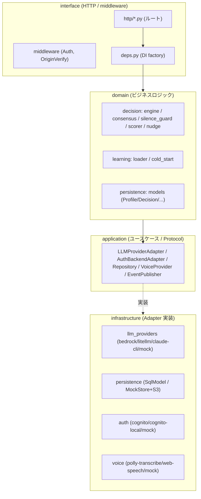
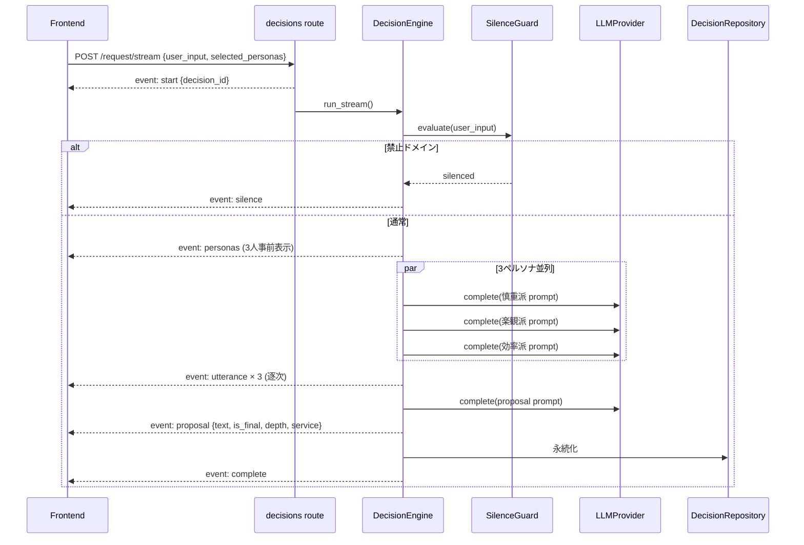
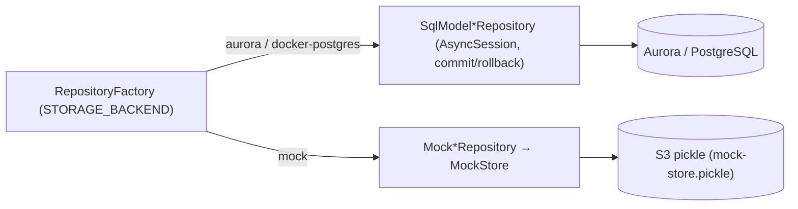

# 03. バックエンド設計

対象: `apps/api` (FastAPI + Python 3.12)

## 3.1 アーキテクチャ: DDD + ヘキサゴナル (Ports & Adapters)

`apps/api/src/yesman_api/` は 4 レイヤで構成され、外側依存はすべて Protocol (Port) で抽象化されます。



| レイヤ | 責務 | 例 |
|---|---|---|
| `domain/` | 純粋なビジネスロジック (外部依存なし) | DecisionEngine, SilenceGuard, AutonomyScorer, ドメインモデル |
| `application/` | ユースケース + Port (Protocol 定義) | LLMProviderAdapter, Repository protocols |
| `infrastructure/` | Adapter 実装 (外部サービス) + factory | Bedrock/Mock LLM, SqlModel/MockStore, Cognito/Mock auth |
| `interface/` | HTTP ルート, ミドルウェア, DI | FastAPI routers, AuthMiddleware, deps.py |

## 3.2 API エンドポイント一覧

| グループ | エンドポイント | 概要 |
|---|---|---|
| **decisions** `/v1/decisions` | `POST /request` | 非ストリーミング合議 |
| | `POST /request/stream` | **SSE ストリーミング合議** (decision_id 事前通知) |
| | `POST /{id}/choice` | Yes/No 採択 + 非同期 nudge 生成 |
| | `POST /{id}/yes-nudge` | No→新提案後の Yes 後押し microcopy |
| | `GET /{id}/nudge` | Nudge polling (TTL 切れ 410) |
| | `GET /` | 決定履歴一覧 (attempt_count 付き) |
| **personas** `/v1/personas` | `GET /me` `/builtin` `/shared` | ペルソナ一覧 (自作/プリセット/共有) |
| | `POST /me` `PATCH /{id}` `DELETE /{id}` | CRUD |
| | `PATCH /{id}/share` `POST /{id}/report` | 共有設定 / 悪用報告 (自動ブロック閾値) |
| **persona-selections** `/v1/persona-selections` | `GET /me` `PUT /me` `DELETE /me` | 合議に使う 3 人選択 (max 3) |
| **profiles** `/v1/profiles` | `GET /me` (get-or-create) `PATCH` `DELETE` | プロフィール |
| **preferences** `/v1/preferences` | `GET /me` `PATCH` `DELETE` | 嗜好プロファイル (clip [-1,1], 50 key 上限) |
| **scores** `/v1/scores` | `GET /me` | 委任度スコア (Yes 比率 + 30日推移) |
| **voice** `/v1/voice` | `GET /config` `POST /tts` `POST /stt` | 音声設定 / TTS / STT |
| **persona-pool** `/v1/persona-pool` | `GET /me` `POST /opt-in` `DELETE /opt-in` `GET /list` 他 | 匿名共有プール (opt-in / 引用カウント) |
| **health** `/health` | `GET` | DB ping + version (503 on down) |

## 3.3 合議エンジン (核心)

`domain/decision/engine.py` の `DecisionEngine`。

### 合議フロー (SSE ストリーミング)



- **3 ペルソナ並列**: 各ペルソナの発言を `asyncio.gather` で並列 LLM 呼び出し (per-persona timeout 30s)。
- **proposal 生成**: 3 つの意見を集約し、30〜100 字・1 文・1 句点の提案を生成 (`ConsensusOrchestrator.build_proposal_prompt`)。命令形・投げ返し・根拠説明を禁止する厳格なプロンプト制約。
- **Drill-down chain**: `MAX_DRILL_DEPTH = 4`。深掘りのたびに `chain_context` を積み、段階別ガイド (方向性→具体化→サービス指定→固有名) で絞り込む。最終段は末尾「〜開きますか?」(外部) / 「〜決まり!」(自宅完結) の signal で確定。
- **service 紐付け**: `service_catalog.pick_service(proposal_text)` がカテゴリ判定 (fashion/movie/food 等) し、Amazon 系を優先した外部サービス CTA を proposal に同梱。
- **ペルソナソース分岐**: `selected_personas` (3 source mix) → `_run_stream_mixed` / `persona_source="anonymous"` → `_run_stream_anonymous` (匿名プール、fixture+LLM)。

### 補助ドメインサービス

| サービス | ファイル | 役割 |
|---|---|---|
| `ConsensusOrchestrator` | consensus.py | ペルソナ/提案プロンプト生成、出力クレンジング |
| `SilenceGuard` | silence_guard.py | 禁止ドメイン (宗教/選挙/暴力/卑猥) 検知。**regex 即判定 + LLM 自己判定の 2 段**、fail-closed |
| `AutonomyScorer` | scorer.py | 委任度 (Yes 比率) + 30 日推移を算出 |
| `NudgeMessageGenerator` / `NudgeCache` | nudge.py | No 後の Yes 後押し microcopy (≤30字, 2s timeout, TTL キャッシュ) |

## 3.4 LLM プロバイダ抽象化

`application/decision/llm_provider.py` の Protocol:

```python
@runtime_checkable
class LLMProviderAdapter:
    provider_name: str
    async def complete(system, messages, temperature=0.7) -> str
    async def stream(system, messages, temperature=0.7) -> AsyncIterator[str]
    async def aclose() -> None
```

`infrastructure/decision/llm_providers/factory.py` が `LLM_PROVIDER` に応じて singleton を生成:

| 値 | Adapter | 用途 |
|---|---|---|
| `bedrock` | BedrockLLMAdapter | 本番 (Gemma 3 12B IT / Claude Haiku、Guardrails 連携) |
| `litellm` | LiteLLMAdapter | OpenAI 互換 proxy |
| `claude-cli` | ClaudeCLIAdapter | `claude` CLI を subprocess 呼び出し |
| `mock` | MockLLMProvider | テスト/CI/オフライン (canned 応答 + per-persona delay) |

**デモモード**: `is_demo_user(email)` が真のとき `DemoLLMAdapter` が本物 adapter をラップし、特定入力 (外出着 / 最近の俺) には scripted 応答、それ以外は本物 LLM に委譲。

## 3.5 永続化 (2 系統)

### ドメインモデル (`domain/persistence/models.py`)

| モデル | 主キー | 主なフィールド |
|---|---|---|
| `Profile` | user_id | email(unique), age_group, gender, occupation, value_tags, preferences, avatar_config |
| `Decision` | id | user_id, domain_classification, user_input, user_input_hash, proposal_text, persona_outputs, user_choice, no_attempt_count, llm_provider, selected_persona_ids |
| `PreferenceProfile` | user_id | accepted_patterns, rejected_patterns, persona_style_preference (clip[-1,1]), inferred_tags |
| `Persona` | id | owner_user_id, name, description, prompt_text, avatar_url, is_shared, is_builtin, is_blocked, usage_count, yes_count |
| `UserPersonaSelection` | user_id | persona_ids (max 3) |
| `SilenceLog` | id | user_id, detected_domain, user_input_hash (本文は保存せずハッシュのみ — プライバシー) |
| `PersonaReport` | id | persona_id, reporter_user_id, reason, status (UNIQUE 制約で重複報告 409) |

### Repository 切替 (`infrastructure/persistence/factory.py`)



- **Aurora 系**: SQLModel + AsyncSession (リクエストスコープでトランザクション管理)。
- **Mock 系**: in-memory `MockStore`。`mock_store_s3_bucket` 設定時、リクエスト開始で S3 から pickle ロード、終了で保存 → **Lambda マルチインスタンス間の状態一貫性**を確保 (last-write-wins)。起動時にビルトインペルソナを seed。

## 3.6 認証

- **`AuthenticatedUser`** (frozen dataclass): `sub`(UUID), `email`, `email_verified`, `backend` 等。
- **`AuthBackendFactory`** (`AUTH_BACKEND`): `cognito` (JWKS + userinfo キャッシュ) / `cognito-local` (ローカル issuer) / `mock` (固定 user or `mock-user:` トークンをデコード)。
- **`AuthMiddleware`** (ASGI): `Authorization: Bearer` のみ受理 (Cookie/Query 拒否)。`/health` `/docs` 等は bypass。`MOCK_AUTO_USER=true` のとき mock backend で全リクエストを固定 demo user として処理。

## 3.7 学習 (Learning)

- **`PreferenceProfileLoader`** (`domain/learning/loader.py`): 嗜好プロファイルを get-or-create。無ければ `ColdStartEstimator` が Profile 属性から初期推定。`load_for_prompt()` で合議プロンプトへ注入する <2KB の YAML を生成。
- **非同期更新**: `DecisionConfirmedConsumer` + `ConsumerSupervisor` (`infrastructure/learning/`) が SQS long-poll で確定イベントを受け、嗜好を更新 (指数バックオフ)。`EVENT_BACKEND` で `eventbridge` / `inline-async` / `sync` を切替。

## 3.8 音声 (Voice)

`VoiceProviderFactory` (`VOICE_BACKEND`):

| 値 | Adapter | 備考 |
|---|---|---|
| `aws` | PollyTranscribeAdapter | TTS=Polly Neural (Takumi), STT=Transcribe |
| `web-speech-api` | WebSpeechApiAdapter | クライアント側実行 (サーバは 409) |
| `mock` | MockVoiceAdapter | テスト用 |

TTS は SilenceGuard を regex のみで通し (レイテンシ予算)、スロットル時 `Retry-After: 2`。

## 3.9 設定 (`infrastructure/config.py`)

`AppConfig` (pydantic-settings) が環境変数を集約。バックエンド切替 (`STORAGE_BACKEND` / `AUTH_BACKEND` / `LLM_PROVIDER` / `VOICE_BACKEND` / `EVENT_BACKEND`)、Bedrock 設定、Cognito 設定、Mock 設定 (`MOCK_USER_*` / `MOCK_AUTO_USER` / `MOCK_SEED_DEMO_DECISIONS` / `MOCK_STORE_S3_*`)、各種タイムアウトを定義。

## 3.10 テスト構成 (`apps/api/tests/`)

| 種別 | 内容 |
|---|---|
| `unit/` | ドメイン/インフラの単体 (silence_guard, scorer, mock adapter, demo_mode 等) |
| `integration/` | FastAPI TestClient によるルート + エンジンの結合 (合議 e2e 含む) |
| `contract/` | Protocol の `runtime_checkable` 検証 (LLM/Auth/Repository/EventPublisher) |
| `property/` | Hypothesis による不変条件 (プロンプトサイズ上限、スコア整合、JWT 堅牢性 等) |

---

→ [04. インフラ設計](./04-infrastructure-design.md)
