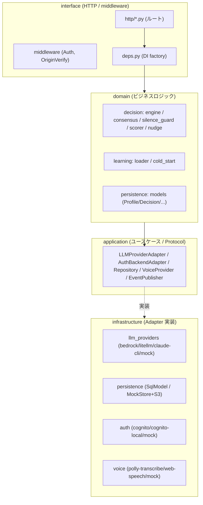
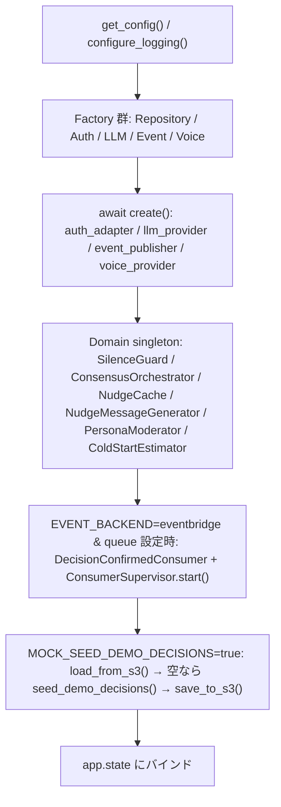
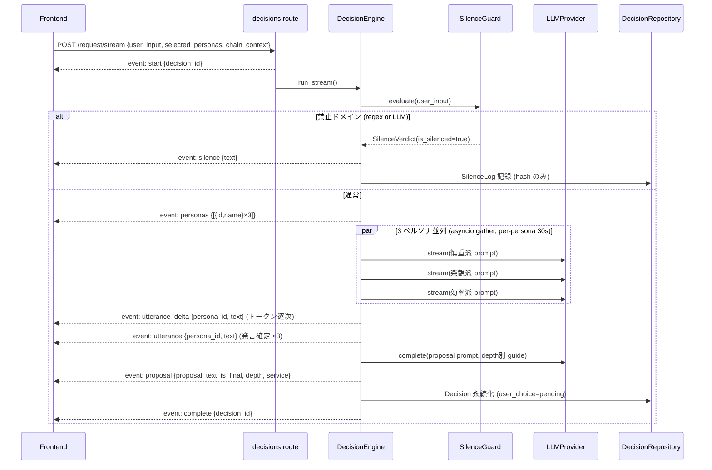
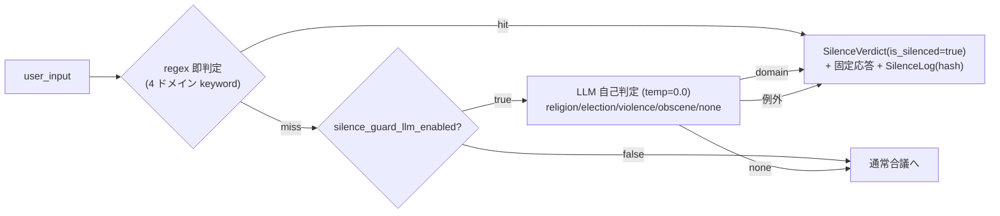
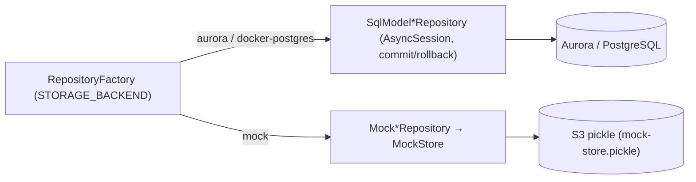

# 03. バックエンド設計

対象: `apps/api` (FastAPI + Python 3.12)

## 3.1 アーキテクチャ: DDD + ヘキサゴナル (Ports & Adapters)

`apps/api/src/yesman_api/` は 4 レイヤで構成され、外側依存はすべて Protocol (Port) で抽象化されます。依存方向は常に「外 → 内」(interface → application → domain) で、domain は外部ライブラリに一切依存しません。



| レイヤ | 責務 | 例 | 依存可能な相手 |
|---|---|---|---|
| `domain/` | 純粋なビジネスロジック | DecisionEngine, SilenceGuard, AutonomyScorer, ドメインモデル | (なし — 標準ライブラリのみ) |
| `application/` | ユースケース + Port (Protocol) | LLMProviderAdapter, Repository protocols | domain |
| `infrastructure/` | Adapter 実装 + factory | Bedrock/Mock LLM, SqlModel/MockStore, Cognito/Mock auth | application, domain |
| `interface/` | HTTP ルート, ミドルウェア, DI | FastAPI routers, AuthMiddleware, deps.py | 全レイヤ (組み立て役) |

### 起動シーケンス (`main.py` lifespan)

アプリ起動時に依存を 1 度だけ組み立て、`app.state` に束ねます (リクエストごとに再生成しない)。



shutdown では逆順に `ConsumerSupervisor.stop()` → 各 factory の `dispose()` を呼びます。

## 3.2 API エンドポイント一覧

すべて `/v1` 配下 (CloudFront 経由では `/api/v1/...`)。認証は `AuthMiddleware` で全エンドポイント必須 (`/health` `/docs` `/openapi.json` は bypass)。

| グループ | メソッド・パス | 概要 |
|---|---|---|
| **decisions** | `POST /v1/decisions/request` | 非ストリーミング合議 |
| | `POST /v1/decisions/request/stream` | **SSE ストリーミング合議** (`text/event-stream`) |
| | `POST /v1/decisions/{id}/choice` | Yes/No 採択 + 非同期 nudge 生成 |
| | `POST /v1/decisions/{id}/yes-nudge` | No→新提案後の Yes 後押し microcopy |
| | `GET /v1/decisions/{id}/nudge` | Nudge polling (`pending`/`ready`/`failed`、TTL 切れ 410) |
| | `GET /v1/decisions` | 決定履歴 (`limit`, `choice=yes/no/all`) |
| **personas** | `GET /v1/personas/me` `/builtin` `/shared` | 一覧 (自作/プリセット/共有ランキング) |
| | `POST /v1/personas/me` `PATCH /{id}` `DELETE /{id}` | CRUD |
| | `PUT /v1/personas/{id}/share` `POST /{id}/report` | 共有設定 / 悪用報告 |
| **persona-selections** | `GET /v1/persona-selections/me` `PUT /me` `DELETE /me` | 合議に使う 3 人選択 |
| **profiles** | `GET /v1/profiles/me` (get-or-create) `PATCH` `DELETE` | プロフィール |
| **preferences** | `GET /v1/preferences/me` `PATCH` `DELETE` | 嗜好プロファイル |
| **scores** | `GET /v1/scores/me` | 委任度スコア (Yes 比率 + 30 日推移) |
| **voice** | `GET /v1/voice/config` `POST /tts` `POST /stt` | 音声設定 / TTS / STT |
| **persona-pool** | `GET /v1/persona-pool/...` `POST /opt-in` 他 | 匿名共有プール |
| **health** | `GET /health` | DB ping + version (503 on down) |

### 主要 Request / Response スキーマ

#### `POST /v1/decisions/request(/stream)` — `DecisionRequestDTO`

```jsonc
// Request
{
  "user_input": "今夜の夕飯どうしよう",          // str, 1–100000
  "selected_personas": [                          // list, 最大 3 (v4)
    { "source": "builtin", "id": "<uuid>" },      // source: builtin/anonymous/my
    { "source": "my", "id": "<uuid>" }
  ],
  "selected_persona_ids": ["<uuid>"],             // 後方互換 (任意)
  "chain_context": ["前段の提案文", "..."],        // drill-down 連鎖, 最大 10
  "persona_source": "builtin"                      // 後方互換: builtin/anonymous
}
// Response (非ストリーミング)
{
  "decision_id": "<uuid>",
  "domain": "daily",
  "utterances": [ { "persona_id": "<uuid>", "persona_name": "慎重派", "text": "..." } ],
  "proposal_text": "今夜は温かい一品を作ろう。",
  "nudge_url": "/v1/decisions/<uuid>/nudge",
  "no_attempt_count": 0
}
```

#### その他の代表 DTO

| エンドポイント | Request | Response (主フィールド) |
|---|---|---|
| `POST /{id}/choice` | `{ "choice": "yes"\|"no" }` | `{ decision_id, nudge_url, no_attempt_count }` |
| `POST /{id}/yes-nudge` | `{ "stage": <1-100> }` (= no_attempt_count) | `{ "message": "<≤60字>" }` |
| `GET /{id}/nudge` | — | `{ "status": "pending"\|"ready"\|"failed", "message": str\|null }` |
| `GET /v1/scores/me` | — | `{ no_count, total, ratio, message, history[], breakdown? }` |
| `POST /v1/personas/me` | `{ name(1-50), description(≤200), prompt_text(10-2000), avatar_url(≤500) }` | `PersonaResponse` |
| `GET /v1/personas/shared` | query: `page`, `page_size(≤100)`, `sort=popularity\|newest\|acceptance` | `SharedPersonaSummaryResponse[]` (`yes_acceptance_rate`, `creator_anonymous_id`) |
| `PUT /v1/persona-selections/me` | `{ persona_ids: [<uuid>...] }` (1–3) | `{ persona_ids: [...] }` |
| `PATCH /v1/preferences/me` | `accepted_patterns(≤100)`, `rejected_patterns(≤100)`, `persona_style_preference([-1,1], ≤50key)`, `inferred_tags(≤50)` | `PreferenceProfileResponse` |
| `POST /v1/voice/tts` | `{ text(1-3000), voice_id?, language_code="ja-JP" }` | `{ audio_url, backend, duration_seconds? }` |
| `POST /v1/voice/stt` | multipart: `audio` (File), `language_code` | `{ text, confidence, backend }` |

`ScoreResponse.breakdown` はデモモード時のみ非 null (内訳円グラフ用)。`ScoreHistoryPointResponse` は `{ date, yes_ratio, total }`。

## 3.3 合議エンジン (核心)

`domain/decision/engine.py` の `DecisionEngine`。`run()` (非ストリーミング) と `run_stream()` (SSE) を持ちます。

### SSE ストリーミングフロー



### SSE イベント data 構造

| イベント | data キー | 説明 |
|---|---|---|
| `start` | `decision_id` | 採択前に ID を先行通知 (UI が choice API を準備) |
| `personas` | `personas: [{id, name}]` | 3 人を吹き出し枠として事前描画 |
| `utterance_delta` | `persona_id`, `persona_name`, `text` | トークン断片 (累積描画) |
| `utterance` | `persona_id`, `persona_name`, `text` | 確定発言 (≤200字, クレンジング済) |
| `proposal` | `proposal_text`, `is_final`, `depth`, `service` | 提案 + drill-down 状態 + 外部サービス CTA |
| `silence` | `text` | 沈黙時の固定応答 |
| `complete` | `decision_id` | 正常終了 |
| `error` | `reason`, `detail` | 失敗 (例: `all_personas_failed`) |

`proposal.service` は `{ name, url, emoji, category } | null`。

### Drill-down (深掘り) の depth 設計

`MAX_DRILL_DEPTH = 4`。下スワイプ (「もっと絞る」) のたびに前段の `proposal_text` を `chain_context` に積み、depth を 1 つ進めます。depth が深いほどプロンプトの絞り込み指示が具体化します。

| depth | 段階 | proposal の方針 | is_final |
|---|---|---|---|
| 0 (root) | 方向性 | 大まかな action のみ。サービス名・複数候補を出さない。継続 signal (「〜しよう」) で締める | 常に false |
| 1 | 媒体/チャネル | 1 案・1 文。媒体を絞る。Amazon 系サービスはまだ出さない | LLM が決定 signal を出せば true |
| 2–3 | サブタイプ | ジャンル/価格帯など 1 軸で絞る。前段を継承し pivot 禁止 | 同上 |
| 4 (MAX) | 固有名/CTA | case A (外部購入): 「〜を XX で開きますか?」/ case B (自宅完結): 「〜決まり!」 | 到達で強制 true |

`service_catalog.pick_service(proposal_text)` がカテゴリ判定 (fashion/movie/food_delivery 等) し、Amazon 系を優先した外部サービスを proposal に同梱します ([§3.6](#36-service-catalog))。

### ペルソナソース分岐

| 経路 | 条件 | エンジン内部 | UI 表示 |
|---|---|---|---|
| 混在選択 (v4) | `selected_personas` が指定 | `_run_stream_mixed` (builtin/my/anonymous を解決して合議) | chat |
| 匿名プール | `persona_source="anonymous"` | `_run_stream_anonymous` (fixture + LLM, 言語/口調メタ付き) | manga |
| プリセット | 既定 | builtin 3 人 | chat |

## 3.4 合議プロンプト設計 (`consensus.py`)

`ConsensusOrchestrator` がプロンプトを組み立て、LLM 出力をクレンジングします。YesMan の「投げ返さず 1 つに決める」思想はここで強制されます。

### ペルソナ発言プロンプト (`PERSONA_PROMPT_TEMPLATE`)

- 出力は **200 字以内・1 段落**。
- 「{persona_name}の意見:」等の接頭ラベルを禁止 (`_PERSONA_LABEL_RE` で除去)。
- 具体候補は **1 つだけ** 挙げる。食材/商品/経路/ジャンルを `+`・`、`・`と` で並べない。
- ユーザーへ決定を投げ返す表現 (「〜から選んで」) は控える。
- `clean_utterance_output()` で正規化し 200 字で truncate。

### 最終提案プロンプト (`PROPOSAL_PROMPT_TEMPLATE`)

3 ペルソナの意見を 1 つに集約して出す **やさしい 1 つの助言**。制約 (抜粋):

| # | 制約 | NG 例 |
|---|---|---|
| 0 | 意見を 1 つの方向に集約。列挙・候補名・`+`/`、` 連結を引き継がない | 「色々あるよ」 |
| 1 | 肯定的・寄り添う提案調 | — (OK: 「〜しよう」「〜が良いよ」「〜どう?」) |
| 2 | 命令形禁止 | 「〜しろ」「今すぐ〜」「迷わず〜」 |
| 3 | 1 つの具体 action に絞る | `or` `/` `+` `&` 「〜か〜」「〜と〜」 |
| 4 | **決定を投げ返す表現を禁止** (最重要) | 「〜決めてみよう」「〜から選ぼう」 |
| 5 | 根拠・期待効果・説明の付加を禁止 | 「〜と満足度が上がるよ」「まずは〜」 |
| 6 | action 動詞 + 大まかな対象で構成 | OK: 「今夜は温かい一品を作ろう」 |
| 7 | 接頭ラベル不要、本文のみ | 「最終助言:」「proposal:」 |

- 出力は **30–100 字・1 文・句点 1 つ**。`clean_proposal_output()` で正規化し 100 字 truncate。
- 末尾の決定 signal を `_FINAL_SIGNAL_RE` (「開きますか」「決めますか」「決まり」「決定」等) で検出し、early-final 判定に利用。
- **depth=0 (root) では最終決定 signal を絶対に出さない** (必ず継続させる)。

## 3.5 沈黙ガードレール (`silence_guard.py`)

倫理的に踏み込むべきでない 4 ドメインで応答を停止します。**fail-closed** (判定不能時は沈黙側に倒す)。

### 2 段判定



### キーワード辞書

| ドメイン | 代表キーワード (一部) |
|---|---|
| `religion` | 神, 仏, 宗教, 信仰, 祈り, 教会, イスラム, キリスト, 仏教, 改宗 … |
| `election` | 投票, 選挙, 政党, 自民, 立憲, 公明, 共産, 維新, 候補者, 立候補 … |
| `violence` | 殺害, 殺す, 暴力, 刺す, ナイフ, 拳銃, テロ, 爆発, 復讐, 殴る … |
| `obscene` | セックス, 性行為, アダルト, ポルノ, 猥褻, 性器, AV … |

- **固定応答**: 「この内容については AI が判断を代行できません。ご自身でじっくり考えていただけたらと思います。」
- **ハッシュ**: `SHA-256(salt + user_id + user_input)`。本文は保存せずハッシュのみを `SilenceLog` に記録 (NFR-PRIV-04)。
- `silence_guard_llm_enabled` は Bedrock RPM quota の低い環境では false にし、regex のみで運用 (実デプロイ構成は false)。

## 3.6 Service Catalog (`service_catalog.py`)

drill-down 最終段で提案に紐づける外部サービス CTA。**Amazon 系を各カテゴリの第一候補**に統一 (プロジェクト方針)。

| カテゴリ | 既定サービス | emoji |
|---|---|---|
| `movie` | Amazon Prime Video | 📺 |
| `shopping` | Amazon | 📦 |
| `fashion` | Amazon Fashion | 👔 |
| `music` | Amazon Music | 🎵 |
| `books` | Kindle | 📚 |
| `audio_books` | Audible | 🎧 |
| `games` | Amazon Prime Gaming | 🎮 |
| `food_delivery` | Uber Eats | 🍔 |
| `food_restaurant` | 食べログ | 🍽️ |
| `travel` | じゃらん | 🏨 |
| `exercise` | YouTube (筋トレ) | 💪 |
| `study` | Udemy | 📘 |

`pick_service()` の優先順位: ① 提案文に完全一致するサービス名 (例: 「Netflix」) → ② ブランド頭部単語の部分一致 (例: "AMAZON") → ③ カテゴリ既定 (リスト先頭)。カテゴリ判定は `CATEGORY_KEYWORDS` の順序で評価し、`audio_books` を `books` より、`food_delivery` を `food_restaurant` より優先します。

## 3.7 LLM プロバイダ抽象化

`application/decision/llm_provider.py` の Protocol:

```python
@runtime_checkable
class LLMProviderAdapter:
    provider_name: str
    async def complete(system, messages, temperature=0.7) -> str
    async def stream(system, messages, temperature=0.7) -> AsyncIterator[str]
    async def aclose() -> None
```

`infrastructure/decision/llm_providers/factory.py` が `LLM_PROVIDER` に応じて singleton を生成:

| 値 | Adapter | 用途 |
|---|---|---|
| `bedrock` | BedrockLLMAdapter | 本番。`InvokeModelWithResponseStream`、Gemma 3 12B IT / Claude Haiku、Guardrails 連携 |
| `litellm` | LiteLLMAdapter | OpenAI 互換 proxy |
| `claude-cli` | ClaudeCLIAdapter | `claude` CLI を subprocess 呼び出し (ローカル開発) |
| `mock` | MockLLMProvider | テスト/CI/オフライン (canned 応答 + per-persona delay) |

**デモモード**: `is_demo_user(email)` が真のとき `DemoLLMAdapter` が本物 adapter をラップし、仕込んだ入力 (外出着 / 最近の俺 等) には scripted 応答、それ以外は本物 LLM へ委譲 ([§3.11](#311-デモモード))。

### タイムアウト・定数 (`config.py`)

| 設定 | 既定値 | 用途 |
|---|---|---|
| `decision_llm_timeout_seconds` | 30.0 | 単発 `complete()` |
| `decision_llm_per_persona_timeout_seconds` | 30.0 | 並列ペルソナ 1 件 |
| `decision_llm_proposal_timeout_seconds` | 20.0 | 提案生成 |
| `decision_llm_stream_initial_timeout_seconds` | 5.0 | ストリーム開始待ち |
| `decision_llm_stream_total_timeout_seconds` | 120.0 | ストリーム全体 |
| `decision_llm_retry_count` | 1 | リトライ回数 |
| `MAX_DRILL_DEPTH` (engine) | 4 | 0(root)〜4 で最終 (= 5 段) |
| `nudge_generation_enabled` / `nudge_cache_ttl_seconds` | True / 600 | Nudge 生成・キャッシュ |
| `silence_guard_llm_enabled` | True (実デプロイは false) | LLM 自己判定 |
| `persona_report_auto_block_threshold` | 5 | 通報数で自動ブロック |
| `voice_tts_presigned_ttl_seconds` | 3600 | TTS 署名 URL 有効期限 |

## 3.8 永続化

ドメインモデル・ER 図・JSONB 構造・MockStore 詳細は [05. データモデル設計](./05-data-model.md) に集約しました。ここでは Repository の切替のみ示します。



- **Aurora 系**: SQLModel + AsyncSession (リクエストスコープでトランザクション管理)。
- **Mock 系**: in-memory `MockStore`。`mock_store_s3_bucket` 設定時、リクエスト開始で S3 から pickle ロード、終了で保存 → **Lambda マルチインスタンス間の状態一貫性**を last-write-wins で確保。

## 3.9 認証

- **`AuthenticatedUser`** (frozen dataclass): `sub`(UUID), `email`, `email_verified`, `backend` 等。
- **`AuthBackendFactory`** (`AUTH_BACKEND`): `cognito` (JWKS + userinfo キャッシュ) / `cognito-local` (ローカル issuer) / `mock` (固定 user or `mock-user:` トークンをデコード)。
- **`AuthMiddleware`** (ASGI): `Authorization: Bearer` のみ受理 (Cookie/Query 拒否)。`/health` `/docs` `/openapi.json` は bypass。`MOCK_AUTO_USER=true` のとき全リクエストを固定 demo user として処理。
- **`mock-user:<base64url(JSON{sub,email})>`** トークンをデコードすることで、mock 構成でもマルチユーザーをローカルで再現 (デモのユーザー切替に利用)。
- **`OriginVerifyMiddleware`** (任意): CloudFront が付与する `X-Origin-Verify` ヘッダを検証し、Function URL への直アクセスを 403 で拒否。

## 3.10 学習・音声・イベント

### 学習 (Learning)

- **`PreferenceProfileLoader`** (`domain/learning/loader.py`): 嗜好プロファイルを get-or-create。無ければ `ColdStartEstimator` が Profile 属性から初期推定。`load_for_prompt()` で合議プロンプトへ注入する <2KB の要約を生成。
- **非同期更新**: `DecisionConfirmedConsumer` + `ConsumerSupervisor` (`infrastructure/learning/`) が SQS long-poll (`learning_long_poll_seconds=5`) で確定イベントを受け、嗜好を更新。失敗時は指数バックオフ (`learning_supervisor_backoff_max_seconds=300`)。`EVENT_BACKEND` で `eventbridge` / `inline-async` / `sync` を切替。

### 音声 (Voice) — `VoiceProviderFactory` (`VOICE_BACKEND`)

| 値 | Adapter | 備考 |
|---|---|---|
| `aws` | PollyTranscribeAdapter | TTS=Polly Neural (Takumi), STT=Transcribe |
| `web-speech-api` | WebSpeechApiAdapter | クライアント側実行 (サーバ呼び出しは 409) |
| `mock` | MockVoiceAdapter | テスト用 |

TTS は SilenceGuard を regex のみで通し (レイテンシ予算)、スロットル時 `429 Retry-After: 2`。STT は形式不正 415 / サイズ超過 413 / タイムアウト 504。

## 3.11 デモモード (`domain/decision/demo_mode.py`)

email に `morimatsu` を含むユーザーで発火する隔離レイヤ。**本物の合議エンジン・Bedrock 経路には一切手を入れず**、`DemoLLMAdapter` でラップする形で仕込みます。

| 要素 | 内容 |
|---|---|
| `is_demo_user(email)` | email に `morimatsu` を含むか |
| `DEMO_PERSONAS` | 妻 👩 (口うるさい怖い妻) / 娘 👧 (無邪気な娘) / ワンコ 🐶 (何にでも『ワン!』と全肯定) |
| 固定 ID | `...d1` / `...d2` / `...d3` (フロントの `unifiedSelectionStorage` と一致) |
| アバター符号化 | `yesman-avatar:<base64(JSON{mode:emoji,color,emoji})>` |
| scripted 台詞 | 外出着の提案・深掘り (`OUTFIT_PROPOSAL_ROOT/FINAL`, `DEEP_DIVE_TEXT`) |
| `DEMO_SCORE_RATIO` | 0.73 (使い込んだ風スコア)。`DEMO_SCORE_BREAKDOWN` で内訳円グラフ |
| `ensure_demo_seeded()` | 起動時に妻/娘/ワンコ + 5/15 起点の決定履歴を seed |

`match_topic` / `persona_line` / `proposal_text` が入力に応じて仕込み台詞を返し、マッチしない入力は本物 LLM に委譲します。

## 3.12 エラー / HTTP ステータス

| エンドポイント | reason | status | 条件 |
|---|---|---|---|
| `POST /request(/stream)` | `all_personas_failed` | 502 | 全ペルソナ LLM が timeout/空 |
| | `no_personas_available` | 502 | ペルソナ解決失敗 |
| `POST /{id}/choice`, `GET /{id}/nudge` | `decision_not_found` | 404 | 不在 or 所有者不一致 |
| `GET /{id}/nudge` | (TTL 切れ) | 410 | nudge キャッシュ miss |
| `POST /personas/me` | `rejected_by_moderator` | 422 | SilenceGuard がプロンプトを拒否 |
| `PATCH/DELETE /personas/{id}` | `builtin_immutable` / `blocked_immutable` | 403 | builtin/ブロック済の変更 |
| | `not_found` | 404 | 不在 |
| `POST /personas/{id}/report` | (重複) | 409 | 同一ユーザーの二重通報 |
| `PUT /persona-selections/me` | `invalid_selection_size` / `duplicate_personas` / `persona_not_accessible` | 422 | 1–3 でない / 重複 / アクセス不可 |
| `POST /voice/tts` | `tts_throttled` / `tts_silenced_domain` / `tts_text_too_long` / `tts_failed` | 429/422/422/502 | — |
| `POST /voice/stt` | `stt_timeout` / `audio_too_large` / `unsupported_audio_format` / `stt_failed` | 504/413/415/502 | — |
| 認証 (Middleware) | (Authorization 不正) | 401 | ヘッダ欠落 / JWT 無効 / 失効 |
| | (Origin 検証失敗) | 403 | `X-Origin-Verify` 不一致 |

## 3.13 テスト構成 (`apps/api/tests/`)

| 種別 | 内容 |
|---|---|
| `unit/` | ドメイン/インフラの単体 (silence_guard キーワード, scorer 計算, service_catalog, mock adapter, demo_mode) |
| `integration/` | FastAPI TestClient によるルート + エンジン結合 (合議 e2e, SSE イベント順序, drill-down 連鎖) |
| `contract/` | Protocol の `runtime_checkable` 検証 (LLM/Auth/Repository/EventPublisher) |
| `property/` | Hypothesis による不変条件 (プロンプトサイズ上限, スコア整合 `0≤ratio≤1`, JWT 堅牢性) |

---

← [README (索引)](./README.md) ・ [02. フロントエンド設計](./02-frontend-design.md) → [04. インフラ設計](./04-infrastructure-design.md) ・ [05. データモデル設計](./05-data-model.md)
