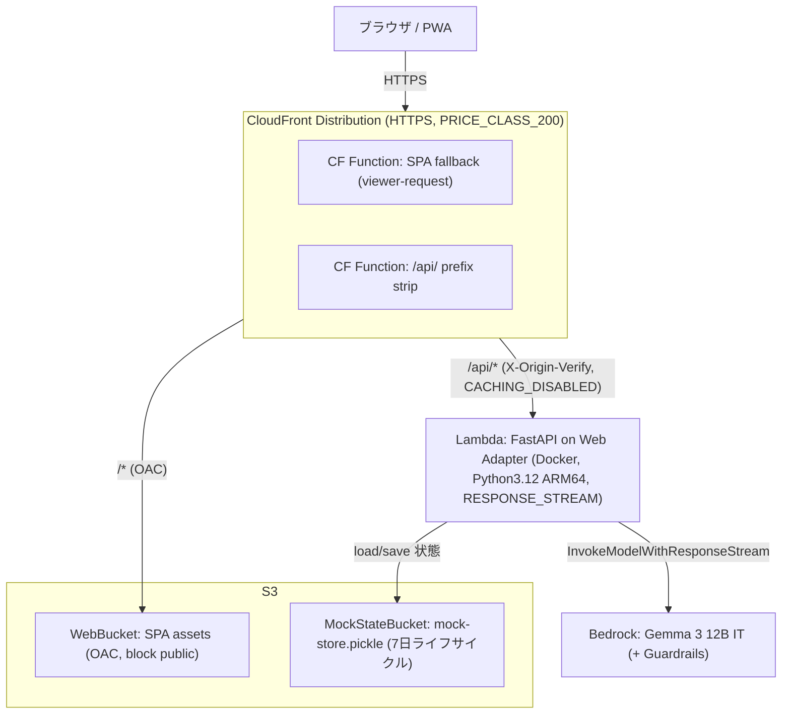
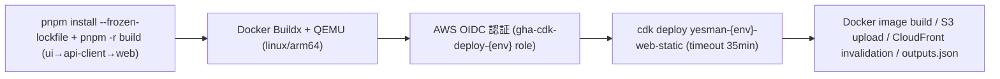
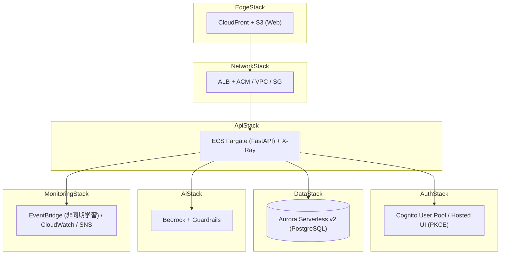

# 04. インフラ設計

対象: `infra/` (AWS CDK v2, TypeScript) / `.github/workflows/` / `apps/api/Dockerfile`

## 4.1 2 層のインフラ構成

| 層 | 状態 | 構成 |
|---|---|---|
| **実デプロイ構成 (MVP)** | ✅ 稼働中 | `WebStaticStack`: CloudFront + S3 + Lambda + Bedrock。認証/DB は mock |
| **フルスタック構成** | 設計のみ (未デプロイ) | 7-Stack: Network / Auth / Ai / Data / Api / Edge / Monitoring。ECS + Aurora + Cognito |

リージョン: `ap-northeast-1` (東京)。CDK 2.x、Node.js 20+。`infra/lib/stacks/` に実装があるのは `web-static-stack.ts` のみで、7-Stack 版は `bin/yesman.ts` から参照されるテスト/設計のみの状態です。

## 4.2 実デプロイ構成 — WebStaticStack

`infra/lib/stacks/web-static-stack.ts` (エントリ: `infra/bin/yesman-static.ts`)。現在 `d28x9vimvrhs5w.cloudfront.net` で稼働。



### 主要リソースと設定値

| リソース | 設定 |
|---|---|
| **S3 WebBucket** | `BLOCK_ALL` public、`S3_MANAGED` 暗号化、`enforceSSL`、`removalPolicy: DESTROY` + `autoDeleteObjects` |
| **S3 MockStateBucket** | 同上 + `lifecycleRules: expiration 7日` (古い state 自動削除) |
| **Lambda FastApiFn** | `DockerImageFunction` (apps/api/Dockerfile)、memory **2048 MiB**、timeout **60s**、arch **ARM_64**、log retention **1 週間** |
| **Lambda Function URL** | `authType: NONE`、`invokeMode: RESPONSE_STREAM` (SSE 対応) |
| **CloudFront** | default→S3 / `/api/*`→Lambda、`PRICE_CLASS_200`、`defaultRootObject: index.html` |

### Lambda 環境変数 (注入値)

```
PORT=8080   AWS_LWA_INVOKE_MODE=response_stream   FASTAPI_ROOT_PATH=/api
APP_ENV=dev   LOG_LEVEL=INFO   APP_VERSION=aws-prod
STORAGE_BACKEND=mock   AUTH_BACKEND=mock   LLM_PROVIDER=bedrock   VOICE_BACKEND=mock   EVENT_BACKEND=sync
LEARNING_CONSUMER_ENABLED=false
BEDROCK_REGION=ap-northeast-1   BEDROCK_MODEL_ID=google.gemma-3-12b-it
MOCK_AUTO_USER=true   MOCK_USER_SUB=11111111-...   MOCK_USER_EMAIL=demo@yesman.app   MOCK_SEED_DEMO_DECISIONS=true
MOCK_STORE_S3_BUCKET=<MockStateBucket>   MOCK_STORE_S3_KEY=mock-store.pickle
SILENCE_HASH_SALT=aws-prod-silence-salt-<env>   PERSONA_ANONYMIZER_SALT=aws-prod-persona-salt-<env>
SILENCE_GUARD_LLM_ENABLED=false   CORS_ALLOWED_ORIGINS=["*"]   ORIGIN_VERIFY_SECRET=yesman-<env>-origin-verify-...
```

> **モデル変遷**: 当初 `anthropic.claude-3-haiku` (RPM quota 50 で SSE がボトルネック) → `google.gemma-3-12b-it` (RPM 1000) に変更。`config.py` の default は Claude Haiku、デプロイ時に Gemma 3 で上書き。`SILENCE_GUARD_LLM_ENABLED=false` も RPM 節約のため (regex のみで沈黙判定)。

### CloudFront ビヘイビア

| 項目 | default (`/*`) | `/api/*` |
|---|---|---|
| Origin | S3 (OAC) | Lambda Function URL |
| ViewerProtocolPolicy | REDIRECT_TO_HTTPS | REDIRECT_TO_HTTPS |
| CachePolicy | CACHING_OPTIMIZED | **CACHING_DISABLED** |
| OriginRequestPolicy | — | ALL_VIEWER_EXCEPT_HOST_HEADER |
| AllowedMethods | GET/HEAD/OPTIONS | ALL (GET/HEAD/PUT/POST/DELETE/PATCH) |
| Compress | true | **false** (SSE chunk buffering 回避) |
| Function (viewer-request) | SPA Fallback | API Path Rewrite |

### CloudFront Functions (JS 2.0)

```javascript
// API Path Rewrite (/api/* ビヘイビア): /api/foo → /foo
//   FastAPI 側は /v1/* で route 定義、FASTAPI_ROOT_PATH=/api で OpenAPI を整合
function handler(event) {
  var r = event.request, uri = r.uri;
  if (uri.indexOf('/api/') === 0) r.uri = uri.substring(4) || '/';
  else if (uri === '/api') r.uri = '/';
  return r;
}

// SPA Fallback (default ビヘイビア): 拡張子なし path を /index.html に rewrite
function handler(event) {
  var r = event.request, uri = r.uri;
  if (uri === '/') return r;                         // defaultRootObject に委譲
  if (uri.charAt(uri.length - 1) === '/') { r.uri = '/index.html'; return r; }
  var seg = uri.substring(uri.lastIndexOf('/') + 1);
  if (seg.indexOf('.') === -1) r.uri = '/index.html'; // SPA ディープリンク
  return r;
}
```

> 404 errorResponses による SPA fallback は廃止し、viewer-request Function に一本化 (API パスを巻き込まないため)。

### IAM (Lambda 実行ロール)

| 種別 | 内容 |
|---|---|
| Bedrock | `bedrock:InvokeModel` / `InvokeModelWithResponseStream` / `Converse` / `ConverseStream`。resource: foundation-model + inference-profile ARN |
| S3 | MockStateBucket への `grantReadWrite` (GetObject / PutObject) |

### セキュリティ

| 経路 | 保護 |
|---|---|
| CloudFront → S3 | Origin Access Control (OAC) + public block |
| CloudFront → Lambda | カスタムヘッダ `X-Origin-Verify` (Function URL 直アクセスを 403 で拒否) |
| 認証 | mock (固定 demo user)。`mock-user:` トークンでマルチユーザーも可。本格認証は Cognito (未デプロイ) |
| HTTPS | CloudFront で `REDIRECT_TO_HTTPS` |

## 4.3 デプロイフロー (CI/CD)

`.github/workflows/web-static-deploy.yml` (手動トリガー `workflow_dispatch`、env: dev/staging/prod)



| Step | Action |
|---|---|
| Checkout / pnpm / Node | `actions/checkout@v6`, `pnpm/action-setup@v6`, `actions/setup-node@v6` (v20, pnpm cache) |
| Build workspace | `pnpm -r build` (`VITE_API_BASE_URL=/api`, Cognito ダミー, `VITE_AUTH_BYPASS=true`) |
| Docker | `docker/setup-buildx-action@v3` + `setup-qemu-action@v3` (ARM64 エミュレーション) |
| AWS 認証 | `aws-actions/configure-aws-credentials@v6` (OIDC, role `gha-cdk-deploy-{env}`) |
| Deploy | `npx cdk deploy yesman-{env}-web-static --app "npx tsx bin/yesman-static.ts" --require-approval never --outputs-file /tmp/web-static-outputs.json -c envName=... -c awsAccount=... -c awsRegion=...` |
| Summary | outputs.json を `GITHUB_STEP_SUMMARY` に整形出力 |

- CDK Docker bundling で Lambda コンテナをビルド (ARM64 エミュレーションのため所要 ~35 分)。
- スタック命名: `yesman-${envName}-web-static`。env 差異は CloudFormation context (account/region) のみ。
- 出力: CloudFront URL / WebBucket 名 / FastAPI Function URL / Bedrock Model ID。

### Dockerfile (`apps/api/Dockerfile`)

| 項目 | 値 |
|---|---|
| ベース | `python:3.12-slim` |
| Lambda Web Adapter | `aws-lambda-adapter` を `/opt/extensions/` に配置、`AWS_LWA_INVOKE_MODE=response_stream` |
| 依存 | `pip install --no-cache-dir .` (pyproject.toml) |
| 起動 | `./run.sh` (uvicorn を PID 1 で keep-alive) |
| exclude | `.venv` / `.pytest_cache` / `__pycache__` / `tests` / `alembic` 等 |

## 4.4 AWS サービス利用 (実デプロイ)

| サービス | 用途 |
|---|---|
| CloudFront | SPA + API のグローバル配信、SSE 対応、CF Functions |
| S3 | SPA assets / MockStore pickle |
| Lambda | FastAPI (Web Adapter, Function URL, ARM64) |
| Bedrock | LLM 推論 (Gemma 3 12B、`InvokeModelWithResponseStream`) |
| IAM | Lambda の Bedrock/S3 アクセス + OIDC デプロイロール |
| CloudWatch | ログ (保持 7 日) |

## 4.5 フルスタック構成 (設計上の完全版・未デプロイ)

`infra/README.md` に定義される 7-Stack 構想。本格運用時の目標形。



| Stack | 作るもの |
|---|---|
| Network | VPC / Subnet / ALB + ACM / SecurityGroup |
| Auth | Cognito User Pool / App Client / Hosted UI |
| Ai | Bedrock 接続 / Guardrails / IAM |
| Data | Aurora Serverless v2 (PostgreSQL) / KMS |
| Api | ECS Fargate (FastAPI) / ECR / EventBridge / X-Ray sidecar |
| Edge | CloudFront / S3 / OAC |
| Monitoring | CloudWatch Logs / Alarms / SNS |

実デプロイ構成との対応 (アプリは同一コード、`*_BACKEND` env だけ異なる):

| 関心事 | MVP (実デプロイ) | フルスタック |
|---|---|---|
| 配信/API | CloudFront + Lambda | CloudFront + ALB + ECS |
| DB | MockStore + S3 pickle | Aurora Serverless v2 |
| 認証 | mock 固定ユーザー | Cognito (PKCE) |
| 音声 | mock | Polly / Transcribe |
| イベント | sync | EventBridge (非同期学習) |

## 4.6 ハッカソン向け簡素化の意思決定

| 簡素化 | 理由 |
|---|---|
| Aurora → MockStore + S3 pickle | DB 不要・コスト削減・起動高速化。Lambda マルチインスタンスは S3 で一貫性確保 (last-write-wins) |
| Cognito → mock auth | ログイン不要の MVP。`mock-user:` トークンでマルチユーザーも可 |
| ECS/ALB → Lambda Function URL | 常時起動コスト回避。Web Adapter で FastAPI を Lambda 化 |
| Claude Haiku → Gemma 3 12B | RPM quota 50→1000。SSE のスループット確保 |
| Lambda 同時実行 quota 10 | `RESPONSE_STREAM` + S3 非同期 load/save で緩和 |
| SPA fallback を CF Function に一本化 | 404 errorResponses だと `/api/*` を巻き込むため |

## 4.7 運用メモ

- デプロイ手順: [infra/README.md](../../infra/README.md)
- デプロイ後チェックリスト (フルスタック時の LLM API キー投入 / Cognito コールバック URL 更新 / SNS 登録): [infra/RUNBOOK.md](../../infra/RUNBOOK.md)
- アーキ図 (drawio/png): [docs/architecture/](../architecture/) / [docs/presentation/specs/](../presentation/specs/)
- デモ: CloudFront URL で稼働。email に `morimatsu` を含むとデモモード発火 (再デプロイ不要、サインイン email のみで切替)。

---

← [README (索引)](./README.md) ・ [03. バックエンド設計](./03-backend-design.md) ・ [05. データモデル設計](./05-data-model.md) ・ [01. 概要設計](./01-overview.md)
