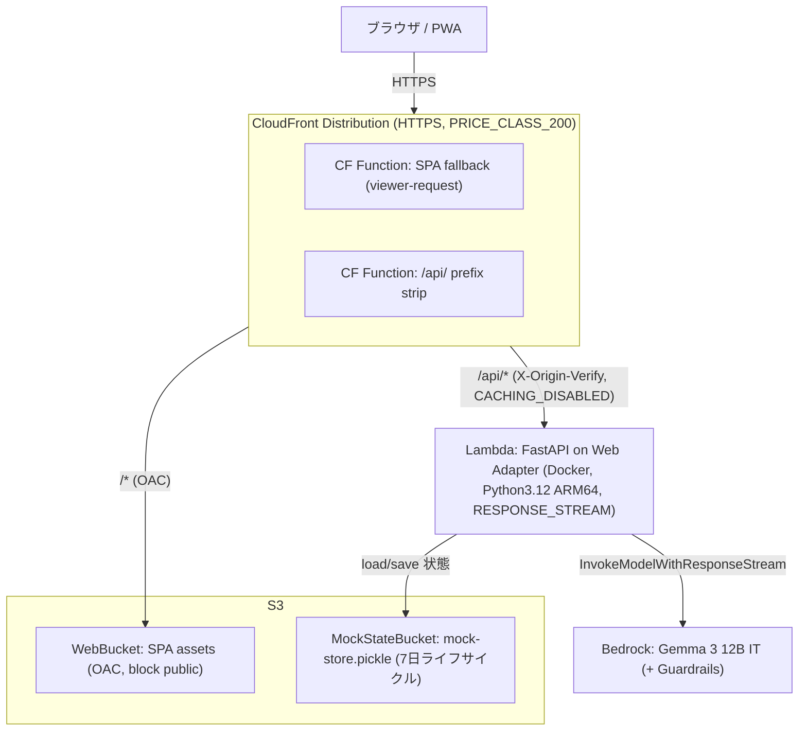
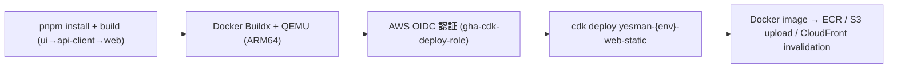
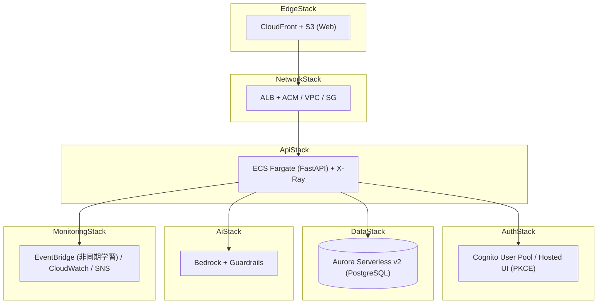

# 04. インフラ設計

対象: `infra/` (AWS CDK v2, TypeScript) / `.github/workflows/`

## 4.1 2 層のインフラ構成

| 層 | 状態 | 構成 |
|---|---|---|
| **実デプロイ構成 (MVP)** | ✅ 稼働中 | `WebStaticStack`: CloudFront + S3 + Lambda + Bedrock。認証/DB は mock |
| **フルスタック構成** | 設計のみ (未デプロイ) | 7-Stack: Network / Auth / Ai / Data / Api / Edge / Monitoring。ECS + Aurora + Cognito |

リージョン: `ap-northeast-1` (東京)。CDK 2.x、Node.js 20+。

## 4.2 実デプロイ構成 — WebStaticStack

`infra/lib/stacks/web-static-stack.ts` (エントリ: `infra/bin/yesman-static.ts`)。現在 `d28x9vimvrhs5w.cloudfront.net` で稼働。



### 主要リソース

| AWS | 論理名 | 説明 |
|---|---|---|
| S3 | WebBucket | SPA assets (`apps/web/dist`)。Origin Access Control、public block、SSL 強制 |
| S3 | MockStateBucket | MockStore の pickle 永続化。7 日自動削除 |
| Lambda | FastApiFn | DockerImageFunction (Python 3.12 / ARM64)、2048 MiB、timeout 60s |
| Lambda | Function URL | `RESPONSE_STREAM` モード (SSE 対応) |
| CloudFront | WebDistribution | `/*`→S3 / `/api/*`→Lambda。API ビヘイビアは圧縮無効・キャッシュ無効 (SSE chunk buffering 回避) |
| CloudFront Function | SpaFallback / ApiPathRewrite | SPA ディープリンク fallback / `/api/foo`→`/foo` |

### Lambda 環境変数 (注入値)

```
AWS_LWA_INVOKE_MODE=response_stream   PORT=8080   FASTAPI_ROOT_PATH=/api
STORAGE_BACKEND=mock   AUTH_BACKEND=mock   LLM_PROVIDER=bedrock   VOICE_BACKEND=mock   EVENT_BACKEND=sync
BEDROCK_REGION=ap-northeast-1   BEDROCK_MODEL_ID=google.gemma-3-12b-it
MOCK_AUTO_USER=true   MOCK_USER_SUB=1111...   MOCK_USER_EMAIL=demo@yesman.app   MOCK_SEED_DEMO_DECISIONS=true
MOCK_STORE_S3_BUCKET=<MockStateBucket>   MOCK_STORE_S3_KEY=mock-store.pickle
ORIGIN_VERIFY_SECRET=<secret>   CORS_ALLOWED_ORIGINS=["*"]
```

> **モデル変遷**: 当初 `anthropic.claude-3-haiku` (RPM quota 50 で SSE がボトルネック) → `google.gemma-3-12b-it` (RPM 1000) に変更。`config.py` の default は Claude Haiku、デプロイ時に Gemma 3 で上書き。

### セキュリティ

| 経路 | 保護 |
|---|---|
| CloudFront → S3 | Origin Access Control (OAC) + public block |
| CloudFront → Lambda | カスタムヘッダ `X-Origin-Verify` (CloudFront 経由のみ許可) |
| 認証 | mock (固定 demo user)。本格認証は Cognito (未デプロイ) |
| HTTPS | CloudFront で `REDIRECT_TO_HTTPS` |

## 4.3 デプロイフロー (CI/CD)

`.github/workflows/web-static-deploy.yml` (手動トリガー `workflow_dispatch`、env: dev/staging/prod)



- フロントは `VITE_API_BASE_URL=/api`、`VITE_AUTH_BYPASS=true` でビルド。
- CDK Docker bundling で Lambda コンテナをビルド (ARM64 エミュレーション)。所要 ~35 分 (timeout)。
- スタック命名: `yesman-${envName}-web-static`。env 差異は CloudFormation context (account/region) のみ。

## 4.4 AWS サービス利用 (実デプロイ)

| サービス | 用途 |
|---|---|
| CloudFront | SPA + API のグローバル配信、SSE 対応 |
| S3 | SPA assets / MockStore pickle |
| Lambda | FastAPI (Web Adapter, Function URL) |
| Bedrock | LLM 推論 (Gemma 3 12B、`InvokeModelWithResponseStream`) |
| IAM | Lambda の Bedrock/S3 アクセス (OIDC デプロイロール) |
| CloudWatch | ログ (保持 7 日) |

## 4.5 フルスタック構成 (設計上の完全版・未デプロイ)

`infra/README.md` / `docs/architecture/` に定義される 7-Stack 構想。本格運用時の目標形。



| Stack | 作るもの |
|---|---|
| Network | VPC / Subnet / ALB + ACM / SecurityGroup |
| Auth | Cognito User Pool / App Client / Hosted UI |
| Ai | Bedrock 接続 / Guardrails / IAM |
| Data | Aurora Serverless v2 (PostgreSQL) / KMS |
| Api | ECS Fargate (FastAPI) / ECR / EventBridge / X-Ray sidecar |
| Edge | CloudFront / S3 / OAC |
| Monitoring | CloudWatch Logs / Alarms / SNS |

実デプロイ構成との対応 (アプリは同一コード、`*_BACKEND` env だけ異なる):

| 関心事 | MVP (実デプロイ) | フルスタック |
|---|---|---|
| 配信/API | CloudFront + Lambda | CloudFront + ALB + ECS |
| DB | MockStore + S3 pickle | Aurora Serverless v2 |
| 認証 | mock 固定ユーザー | Cognito (PKCE) |
| 音声 | mock | Polly / Transcribe |
| イベント | sync | EventBridge (非同期学習) |

## 4.6 ハッカソン向け簡素化の意思決定

| 簡素化 | 理由 |
|---|---|
| Aurora → MockStore + S3 pickle | DB 不要・コスト削減・起動高速化。Lambda マルチインスタンスは S3 で一貫性確保 |
| Cognito → mock auth | ログイン不要の MVP。`mock-user:` トークンでマルチユーザーも可 |
| ECS/ALB → Lambda Function URL | 常時起動コスト回避。Web Adapter で FastAPI を Lambda 化 |
| Claude Haiku → Gemma 3 12B | RPM quota 50→1000。SSE のスループット確保 |
| Lambda 同時実行 quota 10 | `RESPONSE_STREAM` + S3 非同期 load/save で緩和 |

## 4.7 運用メモ

- デプロイ手順: [infra/README.md](../../infra/README.md)
- デプロイ後チェックリスト (LLM API キー投入 / Cognito コールバック URL 更新): [infra/RUNBOOK.md](../../infra/RUNBOOK.md)
- アーキ図 (drawio/png): [docs/architecture/](../architecture/) / [docs/presentation/specs/](../presentation/specs/)
- デモ: CloudFront URL で稼働。email に `morimatsu` を含むとデモモード発火。

---

← [README (索引)](./README.md) ・ [01. 概要設計](./01-overview.md)
