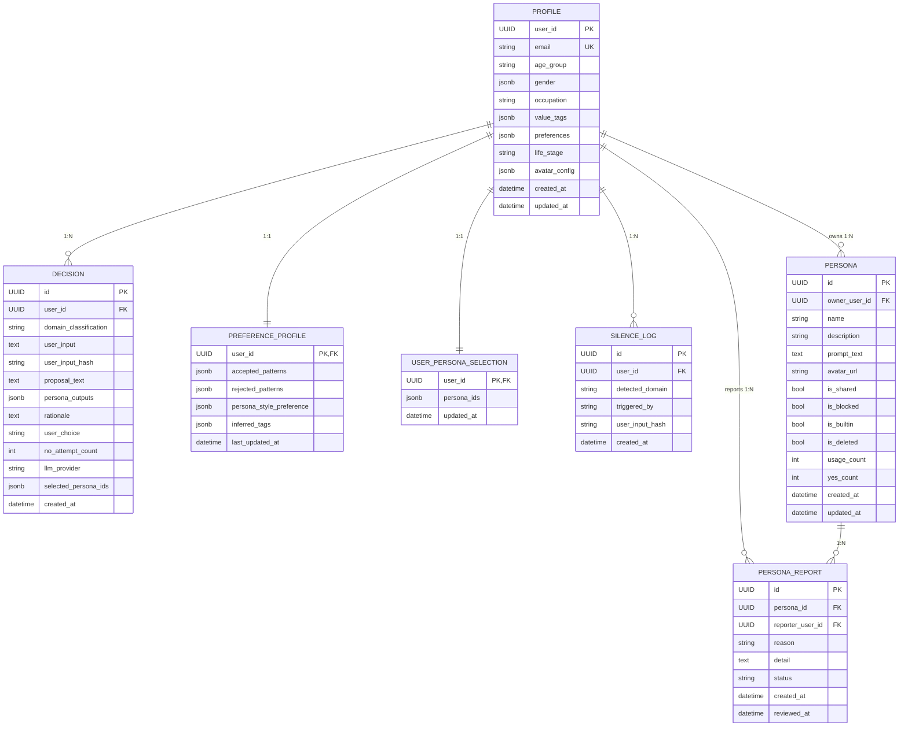

# 05. データモデル設計

対象: `apps/api/src/yesman_api/domain/persistence/models.py` / `domain/decision/models.py` / `domain/persona_pool/models.py` / `alembic/versions/`

永続化モデル (DB テーブル) と、合議処理中だけ存在する in-flight ドメインモデル (永続化前の dataclass) の双方を定義します。

## 5.1 ER 図 (永続化モデル)

`STORAGE_BACKEND=aurora` 時の PostgreSQL スキーマ。`mock` 時も同じ構造を in-memory dict で再現します。



### 外部キーとカーディナリティ

| FK | 参照先 | カーディナリティ | 意味 |
|---|---|---|---|
| `decisions.user_id` | `profiles.user_id` | 1:N | 1 ユーザーが複数の決定 |
| `preference_profiles.user_id` | `profiles.user_id` | 1:1 | ユーザーごと 1 嗜好プロファイル |
| `user_persona_selections.user_id` | `profiles.user_id` | 1:1 | ユーザーごと 1 選択セット (最大 3 人) |
| `silence_logs.user_id` | `profiles.user_id` | 1:N | 沈黙発火の監査ログ |
| `personas.owner_user_id` | `profiles.user_id` | 1:N | 所有ペルソナ (builtin は SYSTEM_USER 所有) |
| `persona_reports.persona_id` | `personas.id` | N:1 | ペルソナへの通報 |
| `persona_reports.reporter_user_id` | `profiles.user_id` | N:1 | 通報者 |

## 5.2 テーブル別フィールド定義

凡例: PK=主キー / FK=外部キー / UQ=ユニーク / IX=インデックス / NN=NOT NULL / J=JSONB

### profiles

| フィールド | 型 | 制約 | default | 説明 |
|---|---|---|---|---|
| `user_id` | UUID | PK | — | Cognito sub と一致 |
| `email` | varchar(255) | UQ, IX (`ix_profiles_email`), NN | — | ログイン email |
| `age_group` | varchar(20) | — | NULL | 年代 (任意) |
| `gender` | list[str] | J, NN | `[]` | FR-AUTH-02 で追加 |
| `occupation` | varchar(100) | — | NULL | 職業 |
| `value_tags` | list[str] | J, NN | `[]` | 価値観タグ (合議プロンプトに注入) |
| `preferences` | dict[str,str] | J, NN | `{}` | 通知頻度・テーマ等 |
| `life_stage` | varchar(50) | — | NULL | ライフステージ |
| `avatar_config` | dict[str,Any] | J | NULL | アバター符号化 (5.4 参照) |
| `created_at` / `updated_at` | datetime(tz) | NN | CURRENT_TIMESTAMP | — |

### decisions

| フィールド | 型 | 制約 | default | 説明 |
|---|---|---|---|---|
| `id` | UUID | PK | uuid4 | 決定 ID |
| `user_id` | UUID | FK, IX (`ix_decisions_user_id`), NN | — | 所有ユーザー |
| `domain_classification` | varchar(50) | NN | — | `daily`/`work`/`school`/`major`/`silenced` |
| `user_input` | text | NN | — | 相談本文 |
| `user_input_hash` | varchar(64) | IX (`ix_decisions_user_input_hash`), NN | — | SHA-256 (重複・統計用) |
| `proposal_text` | text | NN | — | 最終提案 (≤100字) |
| `persona_outputs` | dict[str,Any] | J, NN | `{}` | 各ペルソナ発言 (5.4 参照) |
| `rationale` | text | — | NULL | 根拠 (任意) |
| `user_choice` | varchar(10) | NN | — | `yes`/`no`/`pending` |
| `no_attempt_count` | int | NN | 0 | 連続 No (別案再生成) 回数 |
| `llm_provider` | varchar(50) | NN | — | 使用 LLM (`bedrock`/`mock` 等) |
| `selected_persona_ids` | list[str] | J, NN | `[]` | 合議参加ペルソナ (最大 3) |
| `created_at` | datetime(tz) | IX (`ix_decisions_created_at`, `ix_decisions_user_created`), NN | CURRENT_TIMESTAMP | スコア集計の基準 |

複合インデックス `ix_decisions_user_created (user_id, created_at)` はスコア/履歴クエリ (ユーザー単位の時系列走査) を高速化します。

### preference_profiles

| フィールド | 型 | 制約 | default | 説明 |
|---|---|---|---|---|
| `user_id` | UUID | PK, FK | — | — |
| `accepted_patterns` | list[dict] | J, NN | `[]` | Yes されたパターン (最大 100) |
| `rejected_patterns` | list[dict] | J, NN | `[]` | No されたパターン (最大 100) |
| `persona_style_preference` | dict[str,float] | J, NN | `{}` | スタイル親和度 [-1,1] clip, 最大 50 key |
| `inferred_tags` | list[str] | J, NN | `[]` | 推定タグ (最大 50) |
| `last_updated_at` | datetime(tz) | NN | CURRENT_TIMESTAMP | — |

### silence_logs (プライバシー配慮: 本文非保存)

| フィールド | 型 | 制約 | 説明 |
|---|---|---|---|
| `id` | UUID | PK | — |
| `user_id` | UUID | FK, IX | — |
| `detected_domain` | varchar(20) | IX, NN | `religion`/`election`/`violence`/`obscene` |
| `triggered_by` | varchar(30) | NN | `prompt-self-check`/`guardrails` |
| `user_input_hash` | varchar(64) | NN | SHA-256(`salt`+`user_id`+`user_input`)。**本文は保存しない** (NFR-PRIV-04) |
| `created_at` | datetime(tz) | IX, NN | — |

### personas

| フィールド | 型 | 制約 | default | 説明 |
|---|---|---|---|---|
| `id` | UUID | PK | uuid4 | — |
| `owner_user_id` | UUID | FK, IX | — | builtin は SYSTEM_USER |
| `name` | varchar(100) | NN | — | 1–50 字 (API バリデーション) |
| `description` | varchar(500) | NN | — | ≤200 字 |
| `prompt_text` | text | NN | — | 10–2000 字。PersonaModerator の沈黙チェック対象 |
| `avatar_url` | varchar(500) | — | NULL | `yesman-avatar:<base64>` 符号化 |
| `is_shared` | bool | IX (`ix_personas_is_shared`), NN | false | 共有プール公開 |
| `is_blocked` | bool | NN | false | 通報閾値超過で自動ブロック |
| `is_builtin` | bool | NN | false | プリセット (変更不可) |
| `is_deleted` | bool | NN | false | 論理削除 |
| `usage_count` / `yes_count` | int | NN | 0 | 共有ランキング用 (受容率算出) |
| `created_at` / `updated_at` | datetime(tz) | NN | CURRENT_TIMESTAMP | — |

### persona_reports

| フィールド | 型 | 制約 | 説明 |
|---|---|---|---|
| `id` | UUID | PK | — |
| `persona_id` | UUID | FK, IX | 通報対象 |
| `reporter_user_id` | UUID | FK | 通報者 |
| `reason` | varchar(30) | NN | `silence-domain`/`malicious`/`copyright`/`other` |
| `detail` | text | — | ≤500 字 (任意) |
| `status` | varchar(30) | IX, NN | `pending`/`reviewed-blocked`/`reviewed-dismissed` |
| `created_at` / `reviewed_at` | datetime(tz) | — | — |
| **UNIQUE** | `(persona_id, reporter_user_id)` | UQ (`uq_persona_report_user`) | 二重通報を 409 で拒否 |

`persona_report_auto_block_threshold = 5` 件で `personas.is_blocked = true` に自動遷移します。

### user_persona_selections

| フィールド | 型 | 制約 | 説明 |
|---|---|---|---|
| `user_id` | UUID | PK, FK | — |
| `persona_ids` | list[str] | J, NN | 合議に使うペルソナ ID (最大 3) |
| `updated_at` | datetime(tz) | NN | — |

## 5.3 Enum / Literal 定義一覧

| 名前 | 取りうる値 | 使用箇所 |
|---|---|---|
| `DomainClassification` | `daily` / `work` / `school` / `major` / `silenced` | `Decision.domain_classification` |
| `UserChoice` | `yes` / `no` / `pending` | `Decision.user_choice` |
| `SilenceDomain` | `religion` / `election` / `violence` / `obscene` | `SilenceLog.detected_domain` |
| `TriggeredBy` | `prompt-self-check` / `guardrails` | `SilenceLog.triggered_by` |
| `PersonaReportReason` | `silence-domain` / `malicious` / `copyright` / `other` | `PersonaReport.reason` |
| `PersonaReportStatus` | `pending` / `reviewed-blocked` / `reviewed-dismissed` | `PersonaReport.status` |
| `PersonaSource` | `builtin` / `anonymous` | `DecisionRequest.persona_source` (後方互換) |
| `SelectedPersonaSource` | `builtin` / `anonymous` / `my` | `SelectedPersonaRef.source` (v4 混在選択) |
| `PrimaryLanguage` | `ja` / `en` / `fr` / `ar` / `zh` | 匿名ペルソナ (MangaStage 表示用) |
| `Formality` | `polite` / `casual` / `blunt` | 匿名ペルソナ |
| `NudgeStatus` | `pending` / `ready` / `failed` | Nudge polling |

## 5.4 JSONB フィールドの内部構造

```jsonc
// profiles.avatar_config
{ "mode": "emoji" | "color" | "image" | "default", "color": "#ea580c", "emoji": "😊", "image_url": "https://..." }

// profiles.gender / value_tags (list[str])
["環境への責任", "創意工夫", "学習と成長"]

// profiles.preferences (dict[str,str])
{ "notification_frequency": "daily", "theme": "light", "language": "ja" }

// decisions.persona_outputs
{ "utterances": [ { "persona_name": "慎重派", "text": "リスクを..." }, { "persona_name": "楽観派", "text": "やってみよう..." } ] }

// preference_profiles.accepted_patterns / rejected_patterns (list[dict])
[ { "domain": "daily", "pattern_hash": "abc123", "weight": 0.8, "timestamp": "2026-05-28T10:00:00Z" } ]

// preference_profiles.persona_style_preference (dict[str,float], [-1,1] clip, 最大 50 key)
{ "慎重派": 0.72, "楽観派": 0.91, "効率派": 0.45 }

// preference_profiles.inferred_tags (list[str])
["daily領域での即決傾向", "楽観派スタイル親和性"]

// decisions.selected_persona_ids / user_persona_selections.persona_ids (list[str], UUID, 最大 3)
["00000000-0000-0000-0000-0000000000a1", "..."]
```

## 5.5 In-flight ドメインモデル (永続化前 dataclass)

合議処理の入出力に使う frozen dataclass (`domain/decision/models.py`)。DB には保存せず、確定後に `Decision` へ変換します。

| dataclass | フィールド | 用途 |
|---|---|---|
| `DecisionRequest` | `user_id`, `user_input`, `selected_persona_ids: list[UUID]=[]`, `llm_provider="mock"`, `chain_context: tuple[str,...]=()`, `persona_source="builtin"`, `selected_personas: tuple[SelectedPersonaRef,...]=()` | エンジン入力。`chain_context` が drill-down の文脈連鎖 |
| `SelectedPersonaRef` | `source: SelectedPersonaSource`, `id: UUID` | v4 の 3 系統混在選択 |
| `PersonaUtterance` | `persona_id: UUID`, `persona_name: str`, `text: str` (≤200字) | 各ペルソナの発言 |
| `ConsensusOutput` | `domain_classification`, `utterances: list[PersonaUtterance]`, `proposal_text` | 合議結果 |
| `SilenceVerdict` | `is_silenced: bool`, `domain: SilenceDomain\|None`, `response_text: str\|None` | 沈黙判定結果 |
| `StreamEvent` | `type: str`, `data: dict[str,Any]` | SSE イベント (種別は [03](./03-backend-design.md) §3.3 参照) |

匿名プール (`domain/persona_pool/models.py`):

| dataclass | フィールド |
|---|---|
| `AnonymousPersonaSpec` | `persona_id: UUID`, `value_tags: tuple[str,...]` (最大 5), `primary_language: PrimaryLanguage`, `formality: Formality`, `seed_at: datetime` |
| `PoolCitation` | `citing_user_sub: str`, `cited_persona_id: UUID`, `decision_id: UUID\|None`, `cited_at: datetime` |

## 5.6 MockStore (STORAGE_BACKEND=mock)

`infrastructure/persistence/mock_repositories.py` の `MockStore` は、上記 7 テーブルを in-memory dict で保持します。

| dict | Key | Value |
|---|---|---|
| `profiles` | `UUID` | `Profile` |
| `decisions` | `UUID` | `Decision` |
| `preference_profiles` | `UUID` | `PreferenceProfile` |
| `silence_logs` | `UUID` | `SilenceLog` |
| `personas` | `UUID` | `Persona` |
| `persona_reports` | `UUID` | `PersonaReport` |
| `user_persona_selections` | `UUID` | `UserPersonaSelection` |

### S3 pickle 永続化 (Lambda マルチインスタンス一貫性)

- `mock_store_s3_bucket` 設定時、リクエスト開始で `load_from_s3()`、終了で `save_to_s3()`。
- Key: `mock_store_s3_key` (default `mock-store.pickle`)。
- マージ戦略: S3 既存状態 ∪ ローカル状態 (ローカル優先) = **last-write-wins**。並行 write による完全消失を回避。
- 起動時、ビルトインペルソナ (慎重派/楽観派/効率派) を seed。`MOCK_SEED_DEMO_DECISIONS=true` のときデモ履歴も seed (詳細は [03](./03-backend-design.md) §3.11)。

## 5.7 マイグレーション (Alembic)

| Revision | 日付 | 内容 |
|---|---|---|
| `0001_initial` | 2026-05-10 | 7 テーブル + 12 インデックス + UNIQUE 制約 (`persona_id`,`reporter_user_id`) |
| `0002_builtin_personas` | 2026-05-10 | SYSTEM_USER profile + builtin ペルソナ 3 件 seed (`...a1`/`...a2`/`...a3`) |
| `0003_profile_gender_preferences` | 2026-05-15 | `profiles.gender` / `profiles.preferences` (JSONB) 追加 (FR-AUTH-02) |

> `avatar_config` は `models.py` に定義済みですが、専用マイグレーションは未作成 (mock 構成では即反映、Aurora 移行時に追加予定)。

### 固定 ID 規約

| ID | 用途 |
|---|---|
| `00000000-0000-0000-0000-000000000001` | SYSTEM_USER (builtin ペルソナ所有者) |
| `00000000-0000-0000-0000-0000000000a1/a2/a3` | builtin ペルソナ (慎重派 / 楽観派 / 効率派) |
| `00000000-0000-0000-0000-0000000000d1/d2/d3` | デモ用カスタムペルソナ (妻 / 娘 / ワンコ) |
| `11111111-1111-1111-1111-111111111111` | デフォルト mock ユーザー (`MOCK_USER_SUB`) |

フロント (`unifiedSelectionStorage`) とバック (alembic seed / demo_mode) で同じ固定 ID を共有することで、初回ロード時に選択状態を確定できます。

---

← [README (索引)](./README.md) ・ [03. バックエンド設計](./03-backend-design.md)
