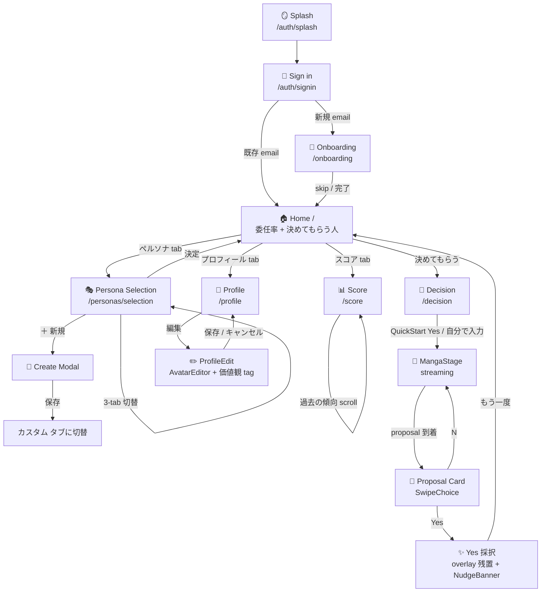
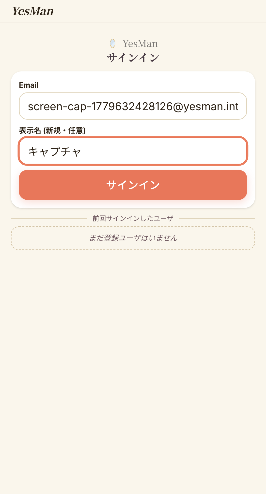
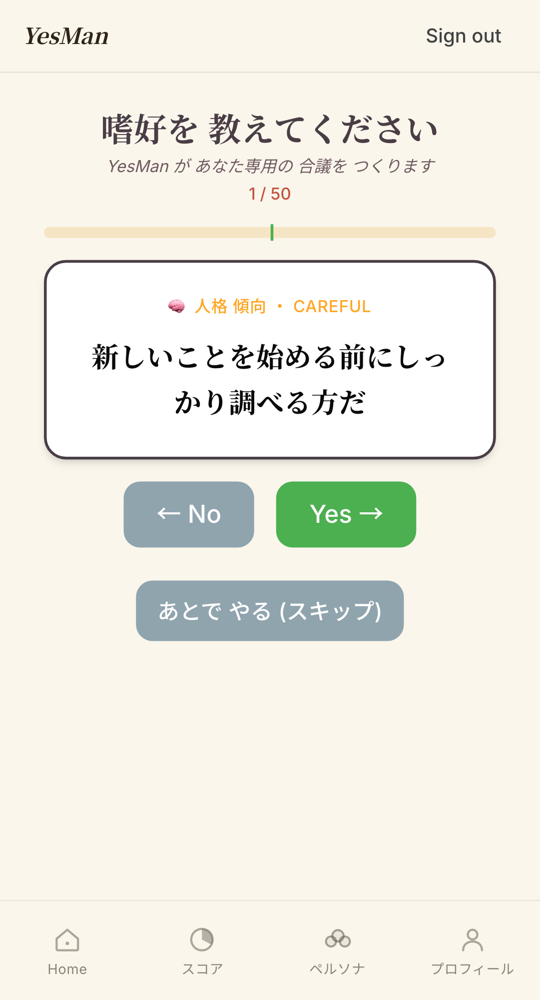
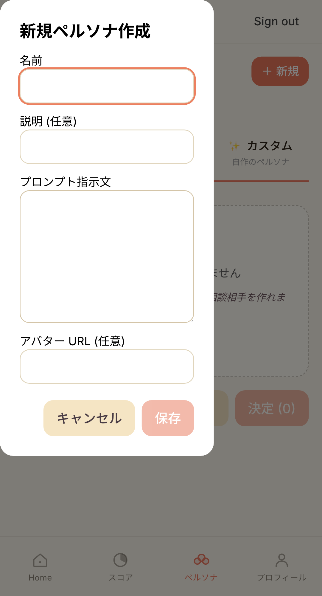
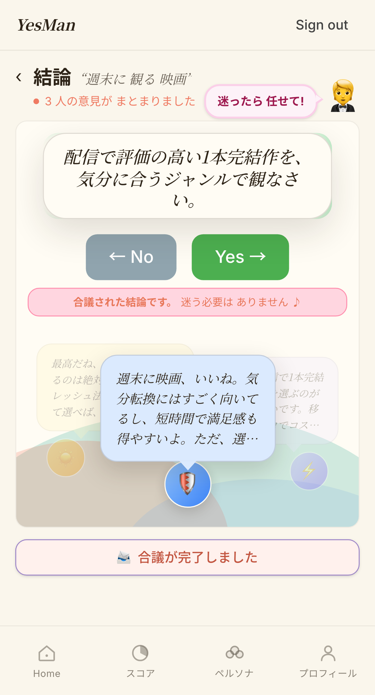
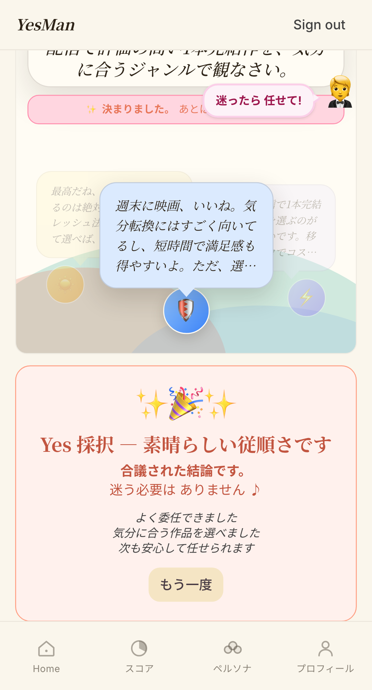
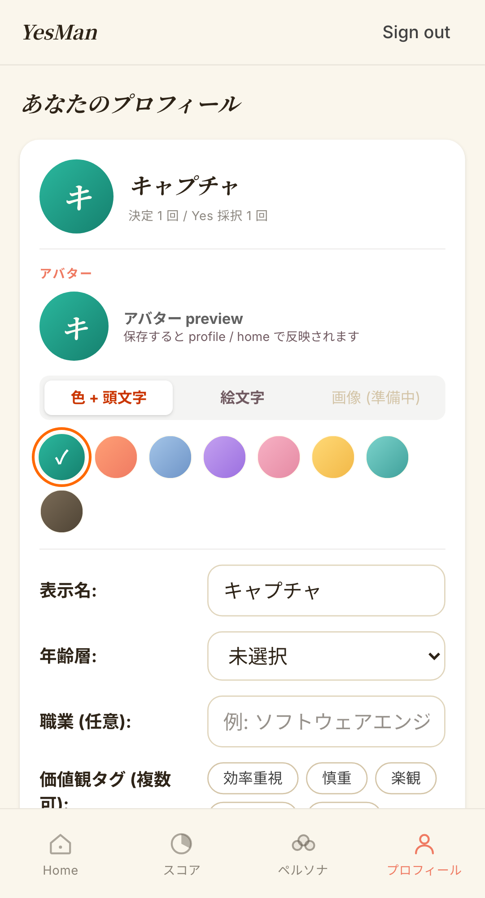
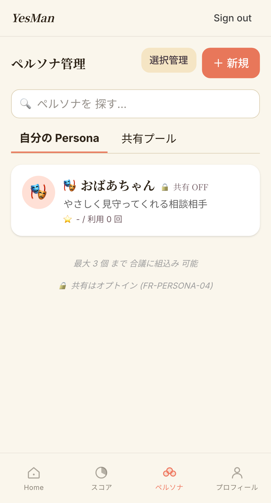

# Final UI Walkthrough — 2026-05-24

YesMan ハッカソン Final UI (anonymous-strangers + 漫画ステージ + multi-source persona + Avatar カスタマイズ) の **画面遷移仕様**。
drawio (XML diagram) は実装変動に追随しづらいため、ここでは **実機キャプチャ + Mermaid フロー + 各画面の data-testid 一覧** を Source of Truth とする。

- 関連 spec: [2026-05-24-anonymous-strangers-design.md](2026-05-24-anonymous-strangers-design.md)
- 旧 drawio (参考): [diagrams/2026-05-24-anonymous-strangers-screens.drawio](diagrams/2026-05-24-anonymous-strangers-screens.drawio)
- 画面キャプチャ: [../../screens/current/](../../screens/current/) (`tests/e2e/scripts/capture-current-screens.mjs` で再生成)
- ツアー動画: [../../demo/output/YesMan-tour-20260524-231509.mp4](../../demo/output/YesMan-tour-20260524-231509.mp4) (~3:50)

---

## 1. 画面遷移フロー (Mermaid)



---

## 2. 各画面の詳細仕様

### 2.1 🪞 Splash (`/auth/splash`)


| 要素 | data-testid / 説明 |
|---|---|
| 背景 | cream + earth horizon illustration (画面全体) |
| Title | "YesMan — 人間最後の仕事は、YESで承認すること。" |
| CTA | サインインボタン (`/auth/signin` へ) |

---

### 2.2 🔐 Sign in (`/auth/signin`)

| 状態 | キャプチャ |
|---|---|
| Empty |  |
| Filled |  |

| 入力 | 制約 |
|---|---|
| Email | required, format check |
| 表示名 (新規時) | required, ≤30 文字 |

Mock auth (`AUTH_BACKEND=mock`) で即時 redirect。新規 email は `/onboarding` へ、既存は `/` へ。

---

### 2.3 🎯 Onboarding (`/onboarding`)

| 状態 | キャプチャ |
|---|---|
| Q1 |  |
| Skip 可 |  |

- 性格 + 生活面の質問を SwipeChoice で順次回答 (最大 50 問)
- ~25 問で確信ライン到達 → 「ある程度 把握できました」 + 「もういい、 進む →」 CTA
- `onboarding-skip` testid で skip 可能
- progress bar が 25/50 で 100% 張り付くバグ修正済み ([cfb927d](https://github.com/_/commit/cfb927d))

---

### 2.4 🏠 Home (`/`)

 — full: [06-home-full.png](../../screens/current/06-home-full.png)

**2026-05-24 改修**:
- **委任率 strip を先頭に移動** (achievement を最初に visible)
- placeholder 入力 box (mic icon) を廃止 (UX 簡素化)
- 新規 user (total=0) は welcome strip「下の『決めてもらう』を押すと…」を表示

| 要素 | data-testid |
|---|---|
| ページ全体 | `home-page` |
| 委任率 strip | `home-score-strip` (既存 user) / `home-welcome-strip` (新規) |
| 決めてもらう人 card | `home-call-card` |
| Selected avatars | `home-selected-avatars` (max 3 アバター stack) / `home-avatar-empty-placeholder` (0 件時) |
| ペルソナ変更 button | `home-shuffle-members` (→ `/personas/selection`) |
| 決めてもらう button | `home-decide` (→ `/decision`) |
| 最近の決定 | `home-history` |

---

### 2.5 🎭 Persona Selection (`/personas/selection`)

3-tab UI に再設計 (2026-05-24)。**source 型 (`PersonaSource`)**: `"builtin" | "anonymous" | "my"`、localStorage key `yesman:persona-source` で永続化。

| Tab | キャプチャ | 説明 |
|---|---|---|
| ビルトイン | [07-persona-selection-builtin.png](../../screens/current/07-persona-selection-builtin.png) | 慎重派 / 楽観派 / 効率派 (sky / amber / violet) + 常時 💡 おすすめ |
| 世界の誰か | [08-persona-selection-anonymous.png](../../screens/current/08-persona-selection-anonymous.png) | opt-in 中の匿名 pool (caller 除外)、value tags + 言語 + formality |
| カスタム (empty) | [09-persona-selection-custom-empty.png](../../screens/current/09-persona-selection-custom-empty.png) | ダッシュ枠 + ✨ + 「右上の『＋ 新規』から…」案内 |
| カスタム (作成後) | [12-persona-selection-custom-with-item.png](../../screens/current/12-persona-selection-custom-with-item.png) | 「✨ あなたが作成したペルソナ (N 件)」 |

| 要素 | data-testid |
|---|---|
| 選択 count | `selection-count` |
| Tab | `persona-source-tab-{builtin|anonymous|my}` |
| My empty placeholder | `my-personas-empty` |
| My empty 中央 CTA | `my-personas-empty-create` |
| 新規作成 button | `selection-create-persona` |
| 決定 button | `selection-confirm` |

**選択制約**: max 3 across sources (ビルトイン + 世界 + 自作 合算)、超過時は info Toast。

---

### 2.6 📝 Persona Create Modal

| 状態 | キャプチャ |
|---|---|
| Empty |  |
| Filled |  |

| 入力 | 制約 |
|---|---|
| 名前 | required, ≤50 文字 |
| 説明 (任意) | ≤200 文字 |
| プロンプト指示文 | required, 30〜2000 文字 |
| アバター URL (任意) | URL 形式 |

**動作**:
- 保存成功時: Toast 「作成しました」 + `["persona", "list", "my"]` invalidate + Modal close + **my タブに自動切替** (`onCreated` callback)
- moderator reject 時: server `detail.message` を error Toast
- 失敗時は Modal 残置、再編集可

---

### 2.7 📡 Decision (`/decision`) — MangaStage

#### 2.7.1 QuickStart


- 「もしかして〜について?」候補を SwipeChoice 形式で表示
- Yes / No / 「✏️ 自分で入力する」切替可
- 候補は preference profile + builtin pool から動的選択 (Dynamic Persona Routing)

#### 2.7.2 Streaming
 → 

**MangaStage Layout (flex column)**:
1. Overlay slot (top, flex-shrink:0) — proposal card / SwipeChoice の Portal target
2. Spacer (flex:1) — 残り垂直空間
3. Bubble-Actor Cluster (bottom, 固定 220px) — 3 actor + bubble の絶対配置

**Actor 配色** (builtin theme):
- 慎重派 → sky gradient (`#93C5FD → #3B82F6`) + 🛡️
- 楽観派 → amber gradient (`#FCD34D → #F59E0B`) + ☀️
- 効率派 → violet gradient (`#C4B5FD → #8B5CF6`) + ⚡
- anonymous / my (theme なし) → BlobAvatar (color hash by persona_id)

**Bubble 配色**: builtin は同 theme の pastel (sky-100 / amber-100 / violet-100)、anonymous は pink。

| 要素 | data-testid |
|---|---|
| ステージ全体 | `manga-stage` |
| Actor (button) | `manga-actor-{0,1,2}` |
| Bubble | `manga-bubble-{0,1,2}` |
| Bubble content | `manga-bubble-{n}-content` |
| Typing dots | `manga-typing-{n}` |
| Cluster | `manga-cluster` |

#### 2.7.3 Bubble Click 前面化 (新機能)


- 過去 bubble / actor (icon|blob) tap で前面化 (`focusedPersonaId` state)
- 同じ要素を再 tap で解除 (auto speaker に戻る)
- placeholder (utterance 未到着) は `disabled`、クリック不可
- `aria-label`「〜の発言を前面化」、Enter / Space キー対応

#### 2.7.4 Yes 採択後 (overlay 残置)
 → 

**2026-05-24 改修**: SwipeChoice 押下後も同じ overlay 位置に **read-only な「決まったこと」 card** + 「✨ 決まりました」 nudge を残置 (旧実装の「ばーんと消える」体感を抑制)。

- StageHeader: 「決め中 / N 人で 考え中」 → **「結論 / N 人の意見が まとまりました」** に切替
- overlay residual card に `data-testid="proposal-result-card-chosen"`
- pink nudge: 「✨ 決まりました。あとは行動するだけ ♪」

下に scroll すると combo badge (`yes-combo-badge`) + NudgeBanner celebration (`nudge-banner-yes`) + 「もう一度」 button が見える。

---

### 2.8 📊 Score (`/score`)

 — full: [20-score-full.png](../../screens/current/20-score-full.png)

| section | 説明 |
|---|---|
| 円形チャート (`ScoreRadialChart`) | Yes 比率を 紫色 (`#9F88C8`) で表示 |
| AI コメント | LLM 動的生成、ピンクバブル (`#FFD6E0` / `#FF8FAE`) |
| 推移グラフ (`ScoreLineChart`) | 30 日折れ線、coral (`#E8775A`) |
| inline 統計 | 総決定 / Yes / No |
| footnote | スコアが高いほど… |
| **📊 過去の傾向** (新規 embed) | PreferenceTrends component (採択 / 棄却 / ペルソナ嗜好 / 推定タグ) |
| Yes 採択履歴 | DecisionHistoryList (最大 20 件) |

`PreferenceTrends` は `density="compact"` で見出しサイズを調整、`/preferences` (PreferencePage) と共有。

---

### 2.9 👤 Profile (`/profile`)

| 状態 | キャプチャ |
|---|---|
| View |  (full: [21-profile-full.png](../../screens/current/21-profile-full.png)) |
| Edit |  (full: [22-profile-edit-full.png](../../screens/current/22-profile-edit-full.png)) |

**ProfileCard 統合** (2026-05-24 案 A): ProfileSummaryCard + BasicAttributesCard を統合し、編集と表示を同じ component に。

| Mode | 表示 |
|---|---|
| View | Header (avatar + name + stat) + 価値観タグ + 基本属性 dl + 「編集」 button |
| Edit | 表示名 + 年代 + 職業 + 価値観 tag (chips) + 性別 + ライフステージ + **AvatarEditor** + キャンセル / 保存 button |

**AvatarEditor**:
- 8 color preset (green / orange / blue / purple / pink / yellow / teal / umber、各 gradient)
- 12 emoji preset (🎭 / 🌟 / 🍀 / etc.)
- custom emoji 入力 (1 文字 / emoji 限定)
- mode: `"default" | "color" | "emoji" | "image"` (image は将来枠)
- backend `profile.avatar_config` (JSONB) で persist

---

### 2.10 🎭 Personas 管理 (`/personas`)



- 自作 (`my`) + 共有プール (`shared`) の tab
- 検索 input (name / description 部分一致)
- 共有 sort: 人気 / 新着 / 採択率
- 各 card は PersonaCard component (selected ring、avatar、is_builtin badge、🔓/🔒 share toggle)

> 💡 普段は `/personas/selection` で十分。`/personas` は my persona の編集 / 共有 toggle / 削除など管理操作向け。

---

## 3. data-testid サマリ (E2E test 用)

| 画面 | 主要 testid |
|---|---|
| Splash | (なし、URL 検証のみ) |
| Sign in | label-based (`Email` / `表示名`) |
| Home | `home-page`, `home-call-card`, `home-decide`, `home-shuffle-members`, `home-selected-avatars`, `home-score-strip`, `home-welcome-strip`, `home-history` |
| Persona Selection | `selection-count`, `selection-confirm`, `selection-create-persona`, `persona-source-tab-{builtin\|anonymous\|my}`, `my-personas-empty`, `my-personas-empty-create` |
| Anonymous List | `anonymous-selection-list` |
| Decision | `stage-header`, `stage-header-back`, `stage-header-title`, `stage-header-subtitle`, `stage-header-topic-text`, `manga-stage`, `manga-cluster`, `manga-actor-{0,1,2}`, `manga-actor-icon-{n}`, `manga-bubble-{n}`, `manga-bubble-{n}-content`, `manga-typing-{n}`, `manga-bubble-text`, `proposal-result-card`, `proposal-result-card-chosen`, `proposal-pink-nudge`, `proposal-arrival-notification`, `nudge-banner-{yes\|no}`, `discussion-toggle`, `swipe-choice`, `swipe-card` |
| Score | `score-page` (implicit via h1), `decision-history-list` |
| Profile | `profile-card` (implicit) |

完全な testid 一覧は各 `*.tsx` 内の `data-testid={...}` で grep 可。

---

## 4. 旧 drawio との対応

旧 [2026-05-24-anonymous-strangers-screens.drawio](diagrams/2026-05-24-anonymous-strangers-screens.drawio) は **anonymous-strangers feature の初期構想 (2026-05-24 旧)** を保持。
本ドキュメントが現状実装の Source of Truth。drawio との差分:

| 項目 | 旧 drawio | 現状実装 |
|---|---|---|
| Persona Selection | 2-tab (builtin / anonymous) | 3-tab (builtin / anonymous / **my**) |
| Anonymous sampling | ランダム自動 sampling | user による explicit 選択 (caller 除外) |
| Self injection | builtin 経路で self_spec injection | 完全廃止、selected_personas のみ |
| MangaStage | 単一層 absolute positioning | flex column (overlay + spacer + cluster 220px) |
| Bubble interaction | (なし) | click で前面化 (focus state) |
| StageHeader | 単一「考え中」のみ | streaming / completed で切替 |
| Yes 採択後 | overlay 即消失 | read-only card 残置 |
| Profile | ProfileSummaryCard + BasicAttributesCard 分離 | ProfileCard 統合 + AvatarEditor |
| Avatar | default のみ | 8 color + 12 emoji preset + custom |

---

## 5. 再生成手順

```bash
# Web/API 起動 (mock LLM mode 推奨)
cd apps/api && AUTH_BACKEND=mock MOCK_AUTO_USER=true uv run uvicorn yesman_api.main:app --port 8000
cd apps/web && VITE_AUTH_BYPASS=true pnpm dev

# 画面 capture (26 枚)
cd tests/e2e && node scripts/capture-current-screens.mjs
# → docs/screens/current/*.png

# ツアー動画 (~3:50)
cd tests/e2e && node scripts/record-full-tour-v2.mjs
bash docs/demo/scripts/convert.sh
# → docs/demo/output/YesMan-tour-<TS>.{webm,mp4,gif}
```
